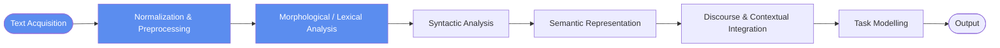

# Lecture 01 — Introduction

## Overview

Course-opening deck. Defines NLP as an interdisciplinary field at the intersection of computer science, linguistics, mathematics, and AI, whose goal is to design computational systems that **analyze, interpret, and generate** natural language. Establishes the central distinction the course returns to repeatedly: natural languages were not designed to be unambiguous or machine-readable, so NLP systems must cope with uncertainty, multiple interpretations, and incomplete information.

Updffate
## Key concepts

- [[nlp-definition]] — NLP as an interdisciplinary computational field for analyze/interpret/generate
- [[formal-vs-natural-language]] — formal languages have fixed syntax/semantics; natural languages don't
- [[language-ambiguity]] — ambiguity, implicit info, figurative language, domain sensitivity
- [[semantic-analysis]] — syntax ("is this well-formed?") vs semantics ("what does it mean?")
- [[nlp-pipeline]] — classical 8-stage pipeline from text acquisition to output
- [[nlp-understanding-vs-generation]] — task taxonomy: understanding (sentiment/NER/QA/IE) vs generation (MT/summarization/dialogue)

## Equations

None — purely conceptual deck.

## Diagrams

*Classical NLP pipeline (slide 13).*

## Open questions

- The slides claim modern NLP systems "can perform language tasks effectively without understanding" — what counts as "understanding" computationally? Returned to in Sessions 02 (ELIZA) and 24 (Challenges).
