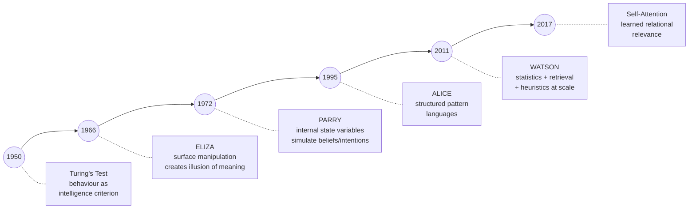
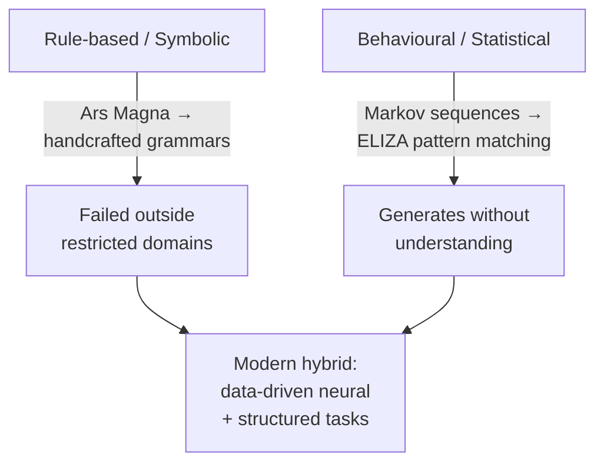

# Lecture 02 — The Dawn of Computational Linguistics

## Overview

History as **intellectual calibration**, not nostalgia. Early NLP researchers had to decide whether language could be reduced to a formal system of symbols and rules, or whether its essential properties resisted such formalization. Two paradigms emerged: **rule-based / symbolic** (Ars Magna lineage → handcrafted grammars) and **behavioural / statistical** (Markov-style observable sequences → ELIZA → modern transformers). The recurring lesson: **conversational behaviour can mask absent understanding** — fluency on the surface does not imply comprehension underneath.

## Key concepts

- [[early-symbolic-nlp]] — Ars Magna, Wilkins, Leibniz; assumption that meaning could be **fully formalized**; failed outside restricted domains
- [[eliza]] — 1966 Rogerian psychotherapist; pattern matching + substitution; the ELIZA effect; "behaviour can mask understanding"
- [[turing-test]] — imitation test; behaviour as the criterion for intelligence; limitation: rewards imitation over understanding
- [[language-ambiguity]] — extended: ambiguity is "unavoidable", which is *why* handcrafted rules don't scale
- [[nlp-understanding-vs-generation]] — extended: early systems focused on **generation** (linguistically plausible without grounded meaning)

## Equations

None — purely conceptual / historical.

## Diagrams

*Chatbot milestones (slide 32). None of these solve true understanding — they each reframe how language is modelled.*

*Two foundational paradigms, both inherited by modern NLP.*

## Open questions

- "No approach below solves the main issue of true understanding" (slide 32) — does scale change this, or does it amplify the ELIZA effect? Returns in Session 24.
- The Turing test rewards imitation over understanding (Quiz I Q22) — what evaluation criterion *would* test understanding?
