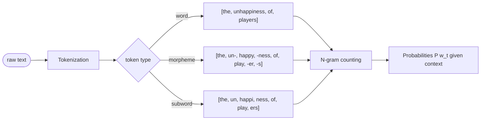
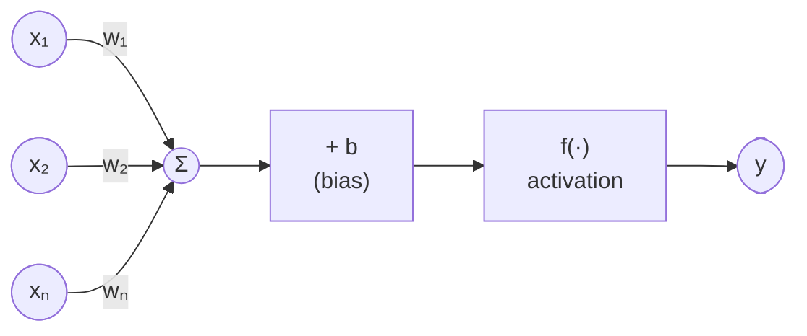

# Lecture 03 — Fundamental Concepts

## Overview

Shifts from "what NLP systems produce" to "what happens internally". Two threads:

1. **Language → data**: tokenization, words vs morphemes vs subwords, n-grams, preprocessing (stop-words, stemming, lemmatization). How language is converted into structures that can be counted and compared.
2. **Data → learning**: from frequency counts (n-grams, fixed) to **internal parameters** that adapt with experience. Introduces the McCulloh-Pitt neuron, the perceptron `y = f(wx + b)`, activation functions, and multi-layer perceptrons (universal approximators).

The conceptual move: tokenization is not a technical detail but a **representational commitment** that determines what regularities the model can observe.

## Key concepts

- [[tokenization]] — segmenting raw text into discrete units; first stage of most NLP pipelines
- [[morpheme-and-subword-tokenization]] — words vs morphemes vs subwords as a modelling decision
- [[n-gram-model]] — `P(w_t | w_{t-n+1},...,w_{t-1})`; predictive, not interpretive
- [[stemming-vs-lemmatization]] — both reduce variation; stemming = statistical simplicity, lemmatization = linguistic structure
- [[stop-words]] — frequent low-content tokens; removal trades specificity for noise reduction
- [[perceptron]] — McCulloh-Pitt → Rosenblatt; `y = f(wx + b)` = affine + non-linearity
- [[activation-function]] — Heaviside, sigmoid, tanh, ReLU / Leaky ReLU / PReLU
- [[multilayer-perceptron]] — stacked perceptrons; universal approximator

## Equations

**N-gram model:**
$$P(w_t \mid w_{t-n+1}, \ldots, w_{t-1})$$

**McCulloh-Pitt neuron** (Heaviside):
$$y = H\!\left(\sum_i x_i - U\right)$$

**Perceptron** (with weights and bias):
$$y = H\!\left(\sum_i w_i x_i - U\right) \;\longrightarrow\; y = f(\mathbf{w}\!\cdot\!\mathbf{x} + b)$$

The perceptron is the **composition of an affine transformation and a non-linear function**.

## Diagrams

*Tokenization choice determines the units that n-grams count over (slides 41–45).*

*Perceptron: weighted sum + bias → activation function. The unit is `y = f(wx + b)`.*

## Open questions

- N-gram models reinforce ELIZA's lesson: **fluent generation does not imply understanding**. What makes a model interpretive rather than purely predictive? Returns in Session 13 (embeddings) and Session 19 (attention).
