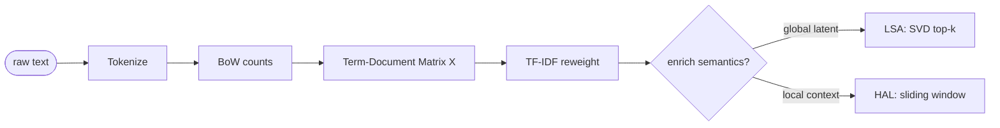
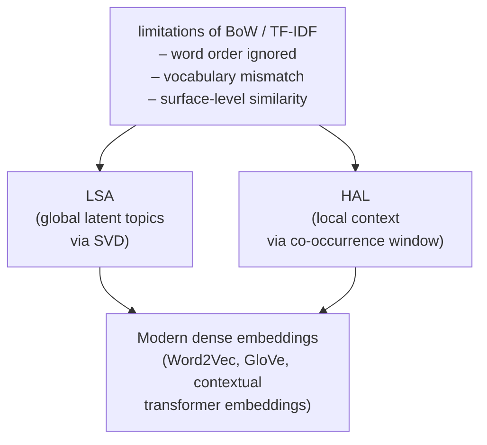

# Lecture 04 — Advanced Concepts: Vector Space Models

> Slide filename has a typo (`Adnvaced`). Title in PDF: "Vector Space Models and Semantic Representation".

## Overview

The conceptual move from **discrete symbols** to **continuous vector spaces**. Once language is embedded in a vector space, **geometry becomes the language of semantics**: similarity is expressed through angles or distances, not exact matches. Builds the staircase: one-hot → BoW → term-document matrix → TF-IDF → LSA → HAL — each step adds either better weighting (TF-IDF), latent global structure (LSA), or local context (HAL) on top of the BoW representation.

## Key concepts

- [[one-hot-encoding]] — orthonormal basis; sparse, no semantic similarity by construction
- [[bag-of-words]] — unordered word counts; ignores word order and syntax
- [[term-document-matrix]] — corpus as one matrix `X_{ij} = count(word_i, doc_j)`
- [[distributional-hypothesis]] — words in similar contexts have similar meanings
- [[cosine-similarity]] — angle-based similarity; normalizes for document length
- [[tf-idf]] — `w_{i,j} = tf_{i,j} · log(N/n_i)` reweights to highlight discriminative terms
- [[latent-semantic-analysis]] — SVD on term-document matrix → top-k singular values
- [[hyperspace-analogue-to-language]] (HAL) — co-occurrence in a sliding window; local context

## Equations

**One-hot encoding:** each word is a coordinate axis: $w_i = e_i \in \mathbb{R}^V$.

**BoW vector** for document $d$:
$$\mathbf{x}_d = (c(w_1, d), c(w_2, d), \ldots, c(w_{|V|}, d))$$

**Term-document matrix:** $X_{ij} = $ number of times word $i$ appears in document $j$.

**Geometric similarity coefficients** (slide 72):

| Coefficient | Formula |
|---|---|
| Dice | $\dfrac{2|X \cap Y|}{|X| + |Y|}$ |
| Jaccard | $\dfrac{|X \cap Y|}{|X \cup Y|}$ |
| Overlap | $\dfrac{|X \cap Y|}{\min(|X|, |Y|)}$ |
| Cosine | $\dfrac{\mathbf{x} \cdot \mathbf{y}}{\|\mathbf{x}\| \|\mathbf{y}\|}$ |

**TF-IDF weight** of term $i$ in document $j$:
$$w_{i,j} = \mathrm{tf}_{i,j} \cdot \log\!\left(\frac{N}{n_i}\right)$$

where $N$ is the number of documents in the corpus and $n_i$ is the number of documents containing term $i$.

**LSA (matrix factorization):** $X = U \Sigma V^T$ → keep top $k$ singular values → $X_k = U_k \Sigma_k V_k^T$ (low-rank semantic approximation).

## Diagrams

*Pipeline of vector-space representations: each step addresses a limitation of the previous.*

*Why LSA + HAL matter: they preview the move to dense, learned embeddings (Session 13).*

## Worked example: TF-IDF (slide 76)

Corpus:
- D1: "The students study language models"
- D2: "The students study models"
- D3: "Language models"

Vocabulary: `the, students, study, language, models`. $N=3$, $n_i = (2, 2, 2, 2, 3)$ — note "models" appears in all three documents, so its IDF is $\log(3/3) = 0$.

The TF-IDF rows (using $\log_{10}$):
- D1: `(0.176, 0.176, 0.176, 0.176, 0)`
- D2: `(0.176, 0.176, 0.176, 0, 0)`
- D3: `(0, 0, 0, 0.176, 0)`

Cosine: $\cos(D_1, D_2) = 0.866$, $\cos(D_1, D_3) = 0.5$, $\cos(D_2, D_3) = 0$.

## Open questions

- TF-IDF "improves representation but does not introduce structure into the space" — when does **vocabulary mismatch** make TF-IDF retrieval fail? See Session 07 (IR) and Session 13 (dense embeddings).
- Are LSA's "latent dimensions" interpretable, or just statistical artifacts of co-occurrence? Returns in LDA (Session 13).

## Notebooks

- [BoW with Counter (cells 28–31)](30-Sources/NLP/notebooks/03_BoW_modelling.ipynb) — the **canonical Code 1 idiom** (mock Q29). Build a sorted vocabulary from a set comprehension; per-document `Counter` produces the count vector; `Counter[w]` returns 0 for missing keys. Drill this verbatim — see [[bag-of-words]] for the exact skeleton.
