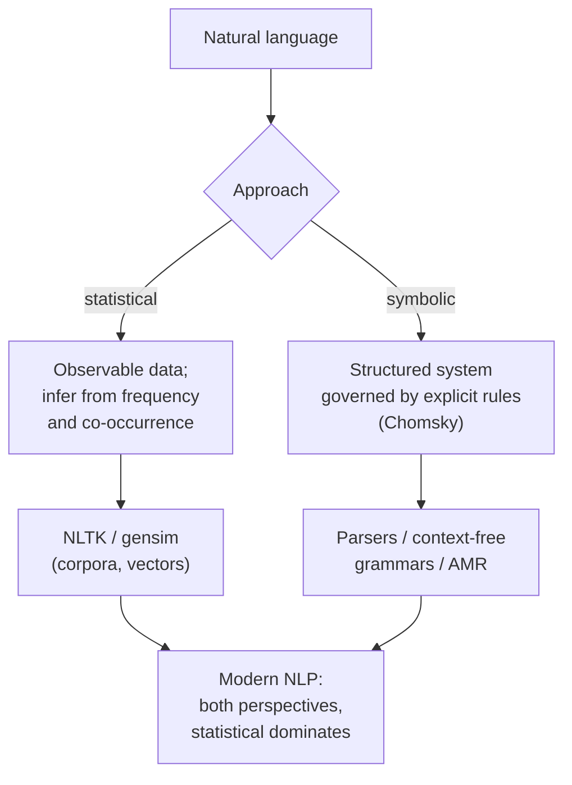
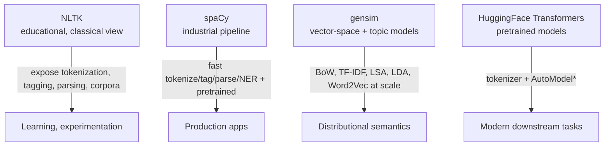

# Lecture 05 — Python Modules

## Overview

Bridges theory and practice. The first half is conceptual: Chomsky's symbolic perspective on language as a structured system governed by explicit rules, context-free grammars, the **semantic gap** between syntax and meaning, and Abstract Meaning Representation (AMR). The second half tours the four NLP libraries used throughout the course: **NLTK** (educational), **spaCy** (industrial pipeline), **gensim** (vector-space / topic models), **HuggingFace Transformers** (pretrained models).

Key conceptual contrast: **statistical vs symbolic** views of language — the same dichotomy from Session 02 (rules vs behaviour), now seen through the choice of library.

## Key concepts

- [[context-free-grammar]] — finite rules generate infinite sentences; parse trees; structural well-formedness
- [[semantic-gap]] — syntactic structure does not yield meaning; sentences with similar structure differ in meaning, and vice versa
- [[abstract-meaning-representation]] (AMR) — graph of concepts and relations; semantic equivalence even with different surface syntax
- [[nlp-libraries]] — NLTK / spaCy / gensim / HuggingFace; each encodes a different theoretical commitment

## Equations

None — this is a conceptual / tooling deck.

## Diagrams

*Two ways of thinking about language map to different libraries (slide 86).*

*Library map (slides 93–96).*

## Open questions

- The semantic gap motivated AMR. Modern transformers learn distributed semantic representations end-to-end without explicit AMR — but does that solve the gap or just hide it? Returns in Session 19 / 24.
