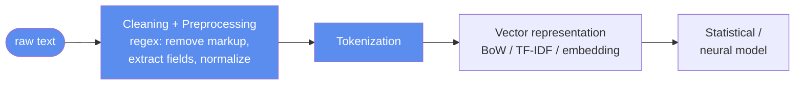

# Lecture 06 — Regular Expressions

## Overview

Regular expressions are a **formal language for specifying patterns in text** — algebraic notation for characterizing sets of strings (Stephen Kleene, automata theory). In an NLP pipeline, they appear **early**: data cleaning, preprocessing, feature preparation. They impose **structure** on text without modelling meaning, intention, or context — they tell us *whether* a string matches a format, *where* a pattern appears, and *which* substrings satisfy it. They define what can be solved **without uncertainty**; classifiers and transformers handle what remains.

This is the high-weight regex deck — heavily quizzed (mock Q4; Quiz II Q4, Q13, Q19; Quiz II.M2 Q4, Q12, Q13; Quiz II.M3 Q11). Memorize the basic-pattern table on the formula sheet; **memorize separately** the things the formula sheet does **not** include — lookarounds and lazy quantifiers.

## Key concepts

- [[regular-expressions]] — syntax: literals, wildcards, character classes, quantifiers, anchors, groups
- [[regex-lookarounds]] — `(?=...)`, `(?!...)`, `(?<=...)`, `(?<!...)`; **zero-width assertions** that test context without consuming characters
- [[regex-greedy-vs-lazy]] — greedy vs lazy quantifiers (`*` vs `*?`, `+` vs `+?`); the `<.+>` vs `<.+?>` HTML-tag trap

## Equations / formulas

Not equations — operator tables. The formula sheet provides the basics (`.`, `\d`, `\w`, `\s`, `^`, `$`, `*`, `+`, `?`, `n`, `n,m`, `[a-z]`, `()`, `|`).

## Diagrams


*Regex protect the pipeline at its boundaries — many failures attributed to models are failures of preprocessing.*

```mermaid
flowchart TD
    REG[Regular Expressions]
    REG --> CC[Character classes<br/>\d \w \s . [abc] [a-z]]
    REG --> QU[Quantifiers<br/>* + ? n n,m]
    REG --> AN[Anchors<br/>^ $ \b \B \A \Z]
    REG --> GR[Groups + alternation<br/>( ) |]
    REG --> LK["Lookarounds (NOT on sheet)<br/>(?=) (?!) (?&lt;=) (?&lt;!)"]
    REG --> LZ[Lazy quantifiers NOT on sheet<br/>*? +? ??]
```
*Map of regex constructs. The two right-hand boxes are the off-sheet additions that the exam targets.*

## Limits of regex

> Regular expressions cannot interpret meaning, resolve ambiguity, or capture long-range dependencies.

The word *bank* in "the bank approved the loan" and "the river bank overflowed" is identical to a regex. They are excellent for **detecting formats, enforcing constraints, and extracting explicitly defined patterns** — and inadequate when **variation itself becomes meaningful**.

The course-wide framing: regex define what can be done *without uncertainty*; statistical models address what remains.

## Open questions

- The formula sheet's regex symbol table covers the basics but **omits lookarounds and lazy quantifiers** — see [[regex-lookarounds]] and [[regex-greedy-vs-lazy]] for the exam-targeted gaps.
