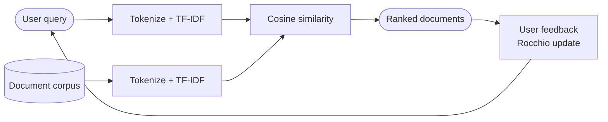
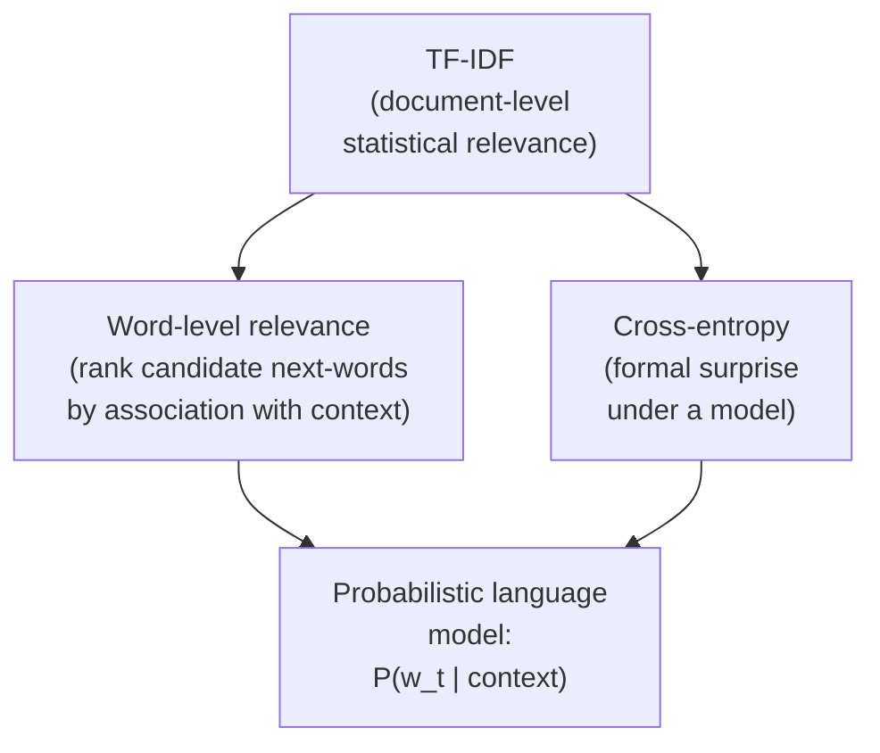

# Lecture 07 — Information Retrieval and Statistical Relevance

> Subtitle: "Relevance without Understanding."

## Overview

[[information-retrieval-ranking|Information Retrieval]] is fundamentally an **ordering problem**: given a query and a corpus, rank documents by relevance. **It is not a task about understanding language** in a human sense — relevance is operational and context-dependent, not semantic in the strong sense. Two ideas dominate:

1. **Statistical term weighting** ([[tf-idf|TF-IDF]] + [[cosine-similarity|cosine]]) ranks documents by surface overlap with the query
2. **Surprise / cross-entropy** as a deeper principle — informative events are statistically unexpected; this anticipates probabilistic language modelling

The session ends with the bridge from **document relevance** to **word relevance**: rank candidate next-words by association with context. This produces fluent text without understanding — an n-gram-style next-word predictor recast as IR. Same lesson as [[eliza]]: **effective behaviour does not imply semantic understanding**.

## Key concepts

- [[information-retrieval-ranking]] — query + corpus → ordered list; relevance is comparative, not intrinsic
- [[vocabulary-mismatch]] — main recall-limiter in classical IR; same idea + different words → missed
- [[relevance-feedback]] — Rocchio update equation; relevance is adaptive, not static
- [[cross-entropy]] — informative events = statistically unexpected; bridges TF-IDF and language modelling
- [[tf-idf]] — revisited: weighting that "improves discrimination" rather than modelling meaning

## Equations

**Rocchio relevance feedback** (slide 119):
$$\vec{q}_{i+1} = \vec{q}_i + \frac{\beta}{R}\sum_{j=1}^R \vec{r}_j - \frac{\gamma}{S}\sum_{j=1}^S \vec{s}_j$$
where $\vec{r}_j$ are relevant documents, $\vec{s}_j$ non-relevant, $\beta$ pushes toward relevant docs, $\gamma$ pushes away from non-relevant.

**Cross-entropy** (also on the formula sheet):
$$H(p, q) = -\sum_x p(x) \log q(x)$$
Measures how unexpected observed data are under a model.

**TF-IDF + cosine ranking** (combined from previous formula-sheet rules):
$$\text{score}(q, d) = \cos(\mathbf{tfidf}(q), \mathbf{tfidf}(d)) = \frac{\mathbf{tfidf}(q) \cdot \mathbf{tfidf}(d)}{\|\mathbf{tfidf}(q)\|\,\|\mathbf{tfidf}(d)\|}$$

## Diagrams

*Classical IR with relevance feedback (slides 117–119).*

*Same statistical principle at three levels (slides 120–123).*

## Information Retrieval vs Information Extraction

| Task | Output | Goal |
|---|---|---|
| **Information Retrieval** | Ordered list of documents | Rank documents by relevance to query |
| **Information Extraction** | Structured representation (entities, relations, events) | Transform unstructured text into structured data |

These are often confused; the course handles IE later via [[named-entity-recognition|NER]] and dependency parsing.

## Queries vs Documents

- **Queries** are short, ambiguous, underspecified — a few words relying on the user's implicit intentions.
- **Documents** are typically long, redundant, noisy.

Most retrieval techniques exist to **compensate for the asymmetry**: queries provide little information; documents contain more than is strictly necessary.

## What Relevance Means

> Relevance is not an intrinsic property of a document.

A document is relevant only **relative to a query, a corpus, and a task** — it can be relevant for one query and irrelevant for another. Relevance is **operational and context-dependent**, not semantic in the strong sense. The IR system declares a document relevant if it **shares informative terms with the query** AND those terms help **distinguish** it from other documents. This is exactly what TF-IDF measures.

## Limits of statistical relevance

- Does not capture **word order, compositional meaning, paraphrase equivalence, or world knowledge**
- Operates entirely on **surface-level patterns of usage**
- Effective language behaviour does **not imply semantic understanding** — direct echo of [[eliza|ELIZA]]'s lesson

These limits motivate dense [[word-embeddings]] (Session 13) and contextual transformer models (Session 19).

## Open questions

- Does scaling the same statistical principle (TF-IDF → cross-entropy → next-word prediction → transformers) ever cross the line into understanding, or does it just hide the gap better? Returns in Session 24.
