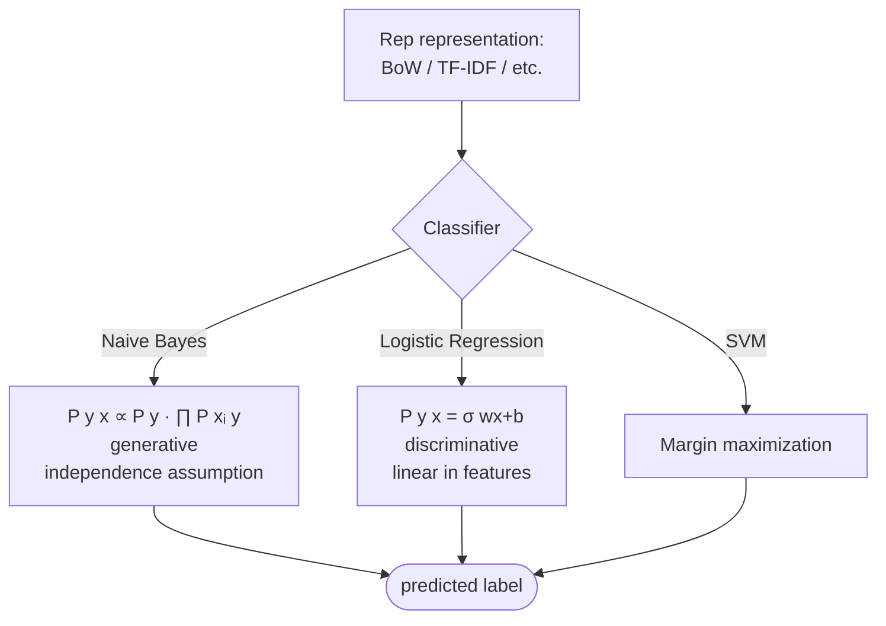
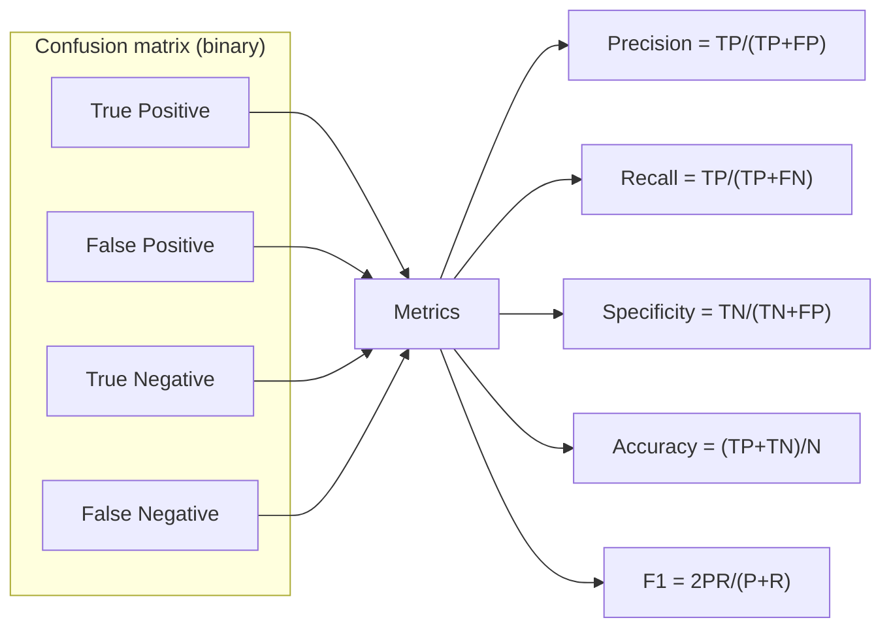

# Lecture 09 — Naïve Bayes

## Overview

The first **full text classifier** in the course. The shift from "represent text statistically" to "make a categorical decision under uncertainty using probabilistic reasoning". Bayes-rule machinery + the **naïve independence assumption** + bag-of-words representation = a fast, simple, surprisingly strong text classifier. This deck also introduces the **evaluation toolkit** (confusion matrix, precision/recall/F1, accuracy trap) used for the rest of the course.

## Key concepts

- [[text-classification]] — supervised assignment of categorical labels to documents
- [[confusion-matrix]] — TP / FP / TN / FN; the basis of every binary metric
- [[evaluation-metrics]] — precision, recall, specificity, NPV, F1, accuracy
- [[accuracy-trap]] — imbalanced data inflates accuracy by majority-class guessing
- [[generative-vs-discriminative]] — model `p(x|y)p(y)` (NB) vs `p(y|x)` (LR)
- [[bayes-formula]] — posterior ∝ likelihood × prior
- [[naive-bayes]] — Bayes classifier + conditional independence of features given label
- [[laplace-smoothing]] — add-one smoothing to handle zero counts; the only NB hyperparameter

## Equations

**Bayes' formula** (foundation):
$$P(A|B) = \frac{P(B|A)\,P(A)}{P(B)}$$

**Bayes classifier** (statistical decision theory): minimize expected prediction error
$$\hat{y}(x) = \arg\max_y P(y|x)$$

**Naïve Bayes** (with conditional independence — **on the formula sheet**):
$$P(y|x_1, \ldots, x_n) \propto P(y) \prod_i P(x_i|y)$$

**Log-form** (for numerical stability):
$$\log P(y|x_1,\ldots,x_n) = \log P(y) + \sum_i \log P(x_i|y) + \text{const}$$

**Evaluation metrics** (formula sheet):

| Metric | Formula |
|---|---|
| Accuracy | $(TP+TN)/(TP+TN+FP+FN)$ |
| Precision | $TP/(TP+FP)$ |
| Recall (Sensitivity) | $TP/(TP+FN)$ |
| Specificity | $TN/(TN+FP)$ |
| NPV | $TN/(TN+FN)$ |
| F1 | $2PR/(P+R)$ |

## Diagrams

*Three classifiers in this part of the course (slide 130).*

*All evaluation metrics derive from the four cells of the confusion matrix.*

## Strengths and limitations

**Strengths:** fast, simple, robust; performs well with small datasets; strong baseline for text classification.

**Limitations:** the independence assumption ignores word order and syntax; doesn't capture semantic meaning; saturates on complex tasks. Pushes the field toward [[logistic-regression]] (Session 10) and beyond.

## Open questions

- The independence assumption is "false in natural language but often works well for classification". Why? Returns implicitly when comparing NB to logistic regression in Session 10.

## Notebooks

- [SMS spam Naïve Bayes (cells 1–16)](30-Sources/NLP/notebooks/05_Naive_Bayes_Classifier.ipynb) — load SMS dataset, BoW representation via `Counter`, train/test split, `MultinomialNB().fit()`, evaluate. The full sklearn skeleton. See [[naive-bayes]] for the code.
