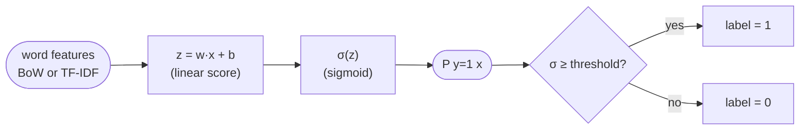
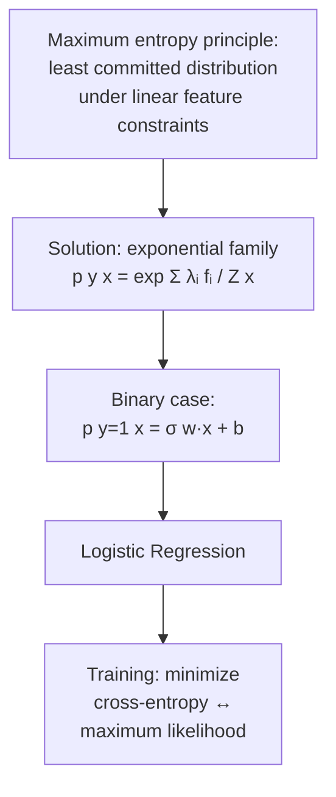

# Lecture 10 — Logistic Regression

> Subtitle: "A maximum entropy model."

## Overview

Reframes logistic regression as a **maximum-entropy classifier** — the probabilistic model that makes the **weakest possible assumptions** while remaining consistent with observed data. Connects logistic regression to entropy, [[cross-entropy]], and statistical relevance from previous sessions. Heaviest blueprint topic by quiz volume — Quiz II is dominated by LR questions (sigmoid evaluation, log-odds interpretation, coefficient meaning, training objective, decision threshold tuning).

The exam-relevant kernel:

- **Linear in features in log-odds space**, not in probabilities
- **Coefficient $w$ for a word** ⇒ odds multiplied by $e^w$ when the word is present
- Trained by **minimizing cross-entropy** (= maximum likelihood)
- The decision **threshold** is a knob that trades off precision vs recall
- LR is **discriminative** — directly models $p(y|x)$

## Key concepts

- [[logistic-regression]] — the model itself: $z = \mathbf{w}\!\cdot\!\mathbf{x} + b$, $p = \sigma(z)$
- [[maximum-entropy]] — derivation as the least-committed distribution under feature-expectation constraints
- [[log-odds]] — what's actually linear in the features
- [[sigmoid]] — link function mapping log-odds to probability
- [[decision-threshold]] — the knob; lower → more recall, higher → more precision
- [[cross-entropy]] (Session 07) — extended: training objective for LR

## Equations (formula sheet)

| Quantity | Formula |
|---|---|
| Linear score | $z = \mathbf{w}\!\cdot\!\mathbf{x} + b$ |
| Sigmoid | $\sigma(z) = \dfrac{1}{1+e^{-z}}$ |
| Prediction | $P(y=1|x) = \sigma(z)$ |
| Decision rule | $\hat{y} = 1 \text{ if } \sigma(z) \geq 0.5$ |

**Log-odds form** (off-sheet but central):
$$\log\!\frac{p(y=1|x)}{p(y=0|x)} = \mathbf{w}\!\cdot\!\mathbf{x} + b$$

**Maximum-entropy form** (multinomial / softmax solution):
$$p(y|x) = \frac{1}{Z(x)}\exp\!\left(\sum_i \lambda_i f_i(x, y)\right)$$

## Diagrams

*Logistic regression as a single perceptron with sigmoid output.*

*Derivation chain: maxent → exponential family → logistic regression (slides 147-152).*

## Worked exam shapes

| Question | Answer |
|---|---|
| $z = -2$, what is $p(y=1)$? | $\sigma(-2) \approx 0.12$ (Quiz II Q10) |
| $z = 2$, what is $p(y=1)$? | $\sigma(2) \approx 0.88$ (Quiz II.M2 Q5) |
| For what $z$ is $p(y=1)=0.5$? | $z = 0$ (Quiz II.M3 Q6) |
| As $z \to +\infty$, $p(y=1) \to ?$ | $\to 1$ (Quiz II.M2 Q8) |
| What's linear in the word feature vector? | **Log-odds** (Quiz II Q11) |
| Coefficient $+1.5$ for a word ⇒ odds × ? | $e^{1.5}$ (Quiz II Q15) |
| Coefficient $-2$ ⇒ odds × ? | $e^{-2}$ (Quiz II.M3 Q5) |
| Increase bias $b$ → effect | **Shifts decision boundary uniformly** toward positives (Quiz II Q7) |
| Negative coefficient for a word means | **Decreases the log-odds of the positive class** (Quiz II Q20, II.M3 Q20) |
| Near-zero coefficient means | **The word has little influence** (Quiz II.M2 Q20) |
| Large positive coefficient means | **Strong positive evidence** (Quiz II.M3 Q19) |
| Training LR by maximum likelihood minimizes | **Cross-entropy with observed labels** (Quiz II Q9, II.M2 Q9) |
| What distinguishes LR from linear regression? | **Non-linear link function** (sigmoid/softmax maps linear scores to probabilities) (Quiz II.M3 Q15) |
| Increasing absolute weight magnitude in MaxEnt | **Strengthens the influence of the word feature** (Quiz II Q16) |
| Lowering decision threshold typically | **Increases recall, decreases precision** (Quiz II.M2 Q6) |
| Raising decision threshold to 0.9 | **Increases precision** (Quiz II.M2 Q10) |
| Probabilities near 0.5 indicate | **High entropy** (Quiz II.M2 Q19) |

## Worked LR by hand (slide 153)

Vocabulary: `goal, team, match, election, vote, parliament` with coefficients `(1.8, 1.2, 0.9, -1.5, -1.1, -0.8)`, bias $-0.2$.

**"Team wins important match"** → present features: `team(1.2)`, `match(0.9)`, plus `goal` is *not* present so contributes 0. With BoW = (0,1,1,0,0,0):
$$z = 1.2 + 0.9 - 0.2 = 1.9 \implies p(\text{sports}) = \sigma(1.9) \approx 0.87$$

**"Parliament vote today"** → BoW = (0,0,0,0,1,1):
$$z = -1.1 - 0.8 - 0.2 = -2.1 \implies p(\text{sports}) = \sigma(-2.1) \approx 0.11$$

A confident "politics" prediction. Note: low entropy because the model is confident overall (regardless of class).

## Open questions

- The same form $z = wx + b$ followed by a non-linearity is the [[perceptron]] — LR is conceptually a one-neuron MLP with sigmoid activation. This continuity is what bridges classical statistical NLP to neural networks (Session 16).

## Notebooks

- [Sentiment via lexical scoring + LR (cells 6–10)](30-Sources/NLP/notebooks/06_Sentiment_Analysis.ipynb) — LR is the natural "learned" successor to lexical scoring of sentiment; the notebook walks the AFINN baseline first. See [[sentiment-analysis]] for the lexical skeleton; LR fitting follows the standard sklearn pattern (`LogisticRegression().fit(X, y)`).
