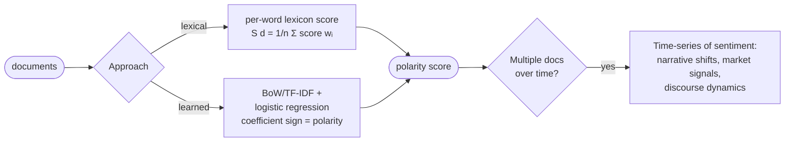

# Lecture 11 — Sentiment Analysis

## Overview

The first **applied classification task** in the course. Sentiment analysis assigns a polarity (positive / negative / neutral) or numeric score to a document, sentence, or aspect — using the classifiers from Sessions 09–10 ([[naive-bayes|Naïve Bayes]], [[logistic-regression]]) on top of [[bag-of-words|BoW]] / [[tf-idf|TF-IDF]] features. Two framings dominate:

1. **Document-level classification** — a single label per document (positive vs negative), straightforward [[text-classification]].
2. **Time-series / discourse signal** — sentiment values over a sequence of documents or time points are treated as a **dynamical signal evolving across observations** (Quiz III Q2). This framing is what the prof emphasizes for financial news, narrative analysis, and longitudinal corpora.

The simplest scoring approach is **lexical**: average the per-word sentiment scores in the document, $S(d) = \frac{1}{n} \sum_i \text{score}(w_i)$ (Quiz III header formula).

## Key concepts

- [[sentiment-analysis]] — task definition, lexical vs learned scoring, time-series framing
- [[text-classification]] (Session 09) — extended: sentiment as a binary or multi-class classification problem
- [[logistic-regression]] (Session 10) — typical learned-sentiment classifier; coefficient sign = polarity contribution

## Equations

**Lexical sentiment score** (Quiz III header — *not* on the exam formula sheet):
$$S(d) = \frac{1}{n} \sum_{i=1}^n \text{score}(w_i)$$

Per-word `score()` typically comes from a sentiment lexicon (e.g. AFINN, VADER, lexicons of polar adjectives). Average over document gives a coarse polarity estimate.

**Learned sentiment via logistic regression**: the standard classifier from Session 10 applied to BoW/TF-IDF features, with positive / negative coefficients revealing **which words push toward which polarity**.

## Diagrams

*Two scoring strategies; sentiment-over-time as a discourse / time-series signal (Quiz III).*

## Time-series interpretation

When sentiment is computed for a **sequence of documents** (news articles by date, tweets over a period, customer reviews per quarter), each $S(d_t)$ is treated as an observation of an underlying dynamical process:

- In **financial news**, sentiment-over-time correlates with market signals and is used as a feature for forecasting.
- In **discourse analysis**, sentiment trajectories reveal **narrative shifts** in the underlying texts.
- In **brand / product analytics**, sentiment trends track customer perception.

Quiz III Q2: "When sentiment values are analyzed across a sequence of documents or time points, sentiment is typically interpreted as **a dynamical signal evolving across observations**" (not as a static lexical property attached to tokens).

Quiz III Q16 (Model B): "In discourse analysis, sentiment signals over time can reveal **narrative shifts in discourse**."

## What to remember for the exam

- Sentiment is a **classification task** — uses NB / LR / SVM classifiers on BoW / TF-IDF features
- The lexical baseline averages per-word polarity scores across the document
- For time-series interpretation, treat sentiment as a **dynamical signal evolving across observations**, not as a static lexical property
- Coefficient sign in logistic regression = polarity contribution of each word

## Open questions

- Lexical scoring ignores word order, negation scope, sarcasm — same limitations as [[bag-of-words|BoW]]. When does a learned classifier substantially outperform the lexical baseline? Modern transformer-based sentiment classifiers (Session 19+) capture context implicitly.

## Notebooks

- [AFINN per-sentence scoring (cells 6–10)](30-Sources/NLP/notebooks/06_Sentiment_Analysis.ipynb) — the lexical baseline: spaCy sentence tokenizer + `Afinn().score()` per sentence, producing a **time series of sentiment values** (Quiz III Q2's "dynamical signal" framing). See [[sentiment-analysis]] for the canonical skeleton.
