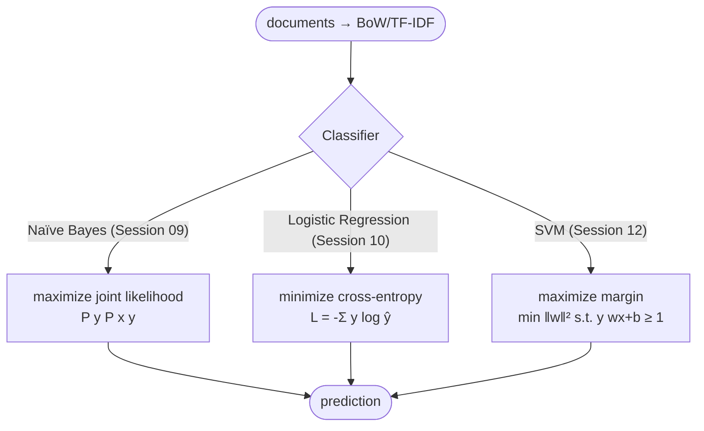

# Lecture 12 — Deep Dive into SVM

## Overview

Support Vector Machines (SVMs) — the third classifier in the NLP toolkit, alongside [[naive-bayes|Naïve Bayes]] (Session 09) and [[logistic-regression]] (Session 10). SVMs differ from both in their **objective**: instead of maximizing likelihood (NB) or minimizing cross-entropy (LR), they **maximize the margin** between the decision boundary and the closest training points (support vectors). Historically prominent in early-2000s NLP for text classification; largely displaced by LR and neural models for general use, but still strong on small, high-dimensional data with clear boundaries.

The blueprint flags this session as **low weight** for the exam — SVM is mentioned as a contrast in Quiz II Q9 (margin width = SVM, *not* what LR minimizes) and Quiz II.M3 Q15 (LR has non-linear link function distinguishing it from SVM). No exercises target SVM directly.

## Key concepts

- [[support-vector-machine]] — margin-maximizing linear classifier; kernels for non-linear boundaries

## Equations

**Linear SVM decision rule** (same form as the [[perceptron]] / [[logistic-regression]] linear score):
$$\hat{y} = \text{sign}(\mathbf{w}\!\cdot\!\mathbf{x} + b)$$

**Hinge loss** (margin-style training objective):
$$L = \max(0, 1 - y(\mathbf{w}\!\cdot\!\mathbf{x} + b))$$
plus an L2 regularizer $\frac{1}{2}\|\mathbf{w}\|^2$.

The **margin** is $2/\|\mathbf{w}\|$; SVM maximizes this margin (equivalently minimizes $\|\mathbf{w}\|^2$) subject to correct classification with a buffer.

## Diagrams

*Three text classifiers, three different training objectives.*

## Where to use SVM in NLP

- **Small, high-dimensional data** with clear class boundaries — historically strong for text classification with TF-IDF features
- **Spam detection, topic classification, sentiment** — the classical SVM territory before neural models took over

## Limitations

- No native probabilistic output — score is `w·x + b`, not a calibrated probability (Platt scaling can convert it post-hoc)
- Doesn't scale gracefully to very large corpora compared to LR
- Kernel SVMs can be expensive on large datasets; linear SVM is the practical NLP variant

## Exam framing (what the quizzes test)

> "Training logistic regression by maximum likelihood minimizes…" → **Cross-entropy** (Quiz II Q9). The wrong answer to flag is "margin width" — that's **SVM-style**.

> "What distinguishes logistic regression from linear regression in NLP tasks?" → **Non-linear link function** (Quiz II.M3 Q15). LR maps via sigmoid; SVM produces unbounded scores too, but uses a different decision-rule philosophy.

## Open questions

- For text classification, does maximizing margin matter when feature spaces are extremely high-dimensional (BoW vocabulary >100K)? In practice, LR and linear SVM perform comparably on text — the difference is the loss function, not the model class.
