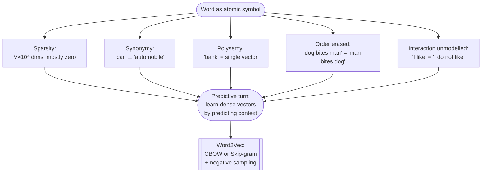
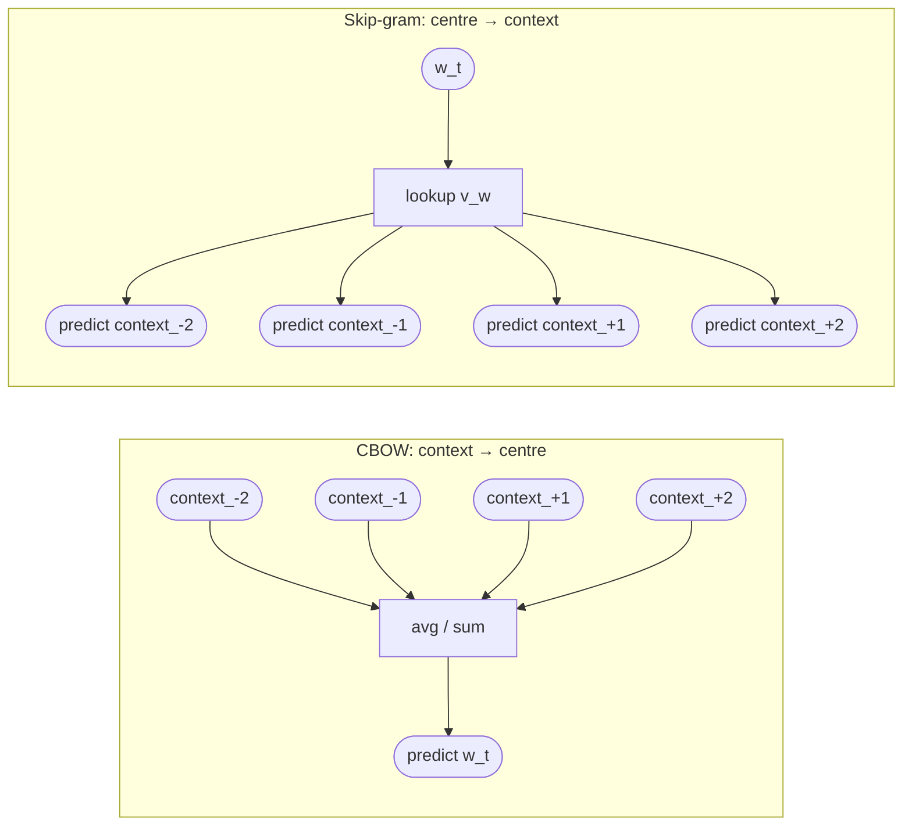
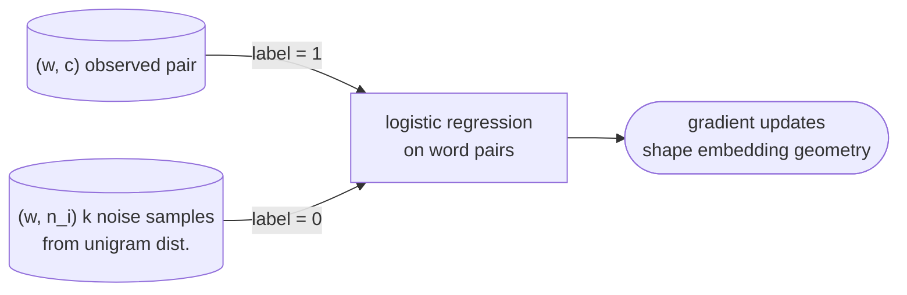
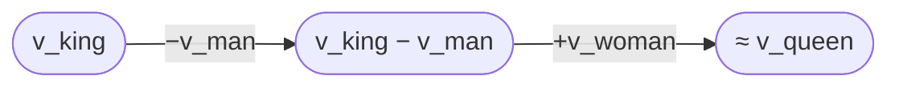

# Lecture 13 — Word Embeddings

## Overview

Where classical distribution collapses. Sessions 04–08 treated the word as an **atomic symbol**: each token is a unique coordinate in a high-dimensional space, and meaning is reconstructed indirectly through co-occurrence statistics ([[bag-of-words|BoW]], [[tf-idf|TF-IDF]], [[latent-semantic-analysis|LSA]], LDA). This session diagnoses four structural failures of that approach — sparsity, the synonymy/polysemy gap, lost word order, and unrepresented interaction (negation) — and introduces the **predictive turn**: words are dense vectors learned by gradient descent on a context-prediction task, not derived from counts.

The operational instantiation is **[[word2vec|Word2Vec]]** (Mikolov et al. 2013), with two symmetric formulations — [[skip-gram-and-cbow|CBOW and Skip-gram]] — trained efficiently via [[negative-sampling]]. The result is a continuous semantic geometry where similarity becomes proximity and analogies become vector arithmetic ($v_{king} - v_{man} + v_{woman} \approx v_{queen}$).

The blueprint flags this session as **high weight**: mock Q6 (Word2Vec context prediction), mock Q23/Q25 (sparse vs dense, one-hot vs dense), Quiz III Q6–Q9, Q18 ([[embedding-matrix|V × d]] sizing, CBOW/Skip-gram, negative sampling).

## Key concepts

- [[word-embeddings]] — dense vectors in $\mathbb{R}^d$ with $d \ll V$; semantic similarity = geometric proximity
- [[word2vec|Word2Vec]] — shallow neural model that learns embeddings via context prediction
- [[skip-gram-and-cbow|Skip-gram and CBOW]] — the two Word2Vec formulations (predict context vs predict centre)
- [[negative-sampling]] — binary-classification approximation that replaces full-vocabulary softmax
- [[embedding-matrix]] — the $W \in \mathbb{R}^{V \times d}$ table whose rows are word vectors
- [[distributional-hypothesis]] — the foundational claim embeddings operationalize (extended)
- [[one-hot-encoding]] — the degenerate $\mathbb{R}^V$ baseline embeddings replace
- [[latent-semantic-analysis|LSA]] — the count-based predecessor; SVD vs gradient descent

## Equations

**Embedding lookup (formula sheet).** Each row of $W \in \mathbb{R}^{V \times d}$ is the vector for one vocabulary word:
$$x_w = E[w], \quad E \in \mathbb{R}^{V \times d}$$

**Skip-gram conditional ([[30-Sources/NLP/pdf/Session 13 - Word Embeddings.pdf#page=14|slide 14]]).** The probability of a context word $c$ given a centre word $w$ is a softmax over inner products:
$$P(c \mid w) = \frac{\exp(v_c^\top v_w)}{\sum_{w' \in V} \exp(v_{w'}^\top v_w)}$$

**Skip-gram objective ([[30-Sources/NLP/pdf/Session 13 - Word Embeddings.pdf#page=15|slide 15]]).** Over a corpus $(w_1, \ldots, w_T)$ with context window $\mathcal{C}(w_t)$:
$$\max \prod_{t=1}^{T} \prod_{c \in \mathcal{C}(w_t)} P(c \mid w_t) \quad\Longleftrightarrow\quad \sum_{t=1}^{T} \sum_{c \in \mathcal{C}(w_t)} \log P(c \mid w_t)$$
trained by stochastic gradient descent.

**Negative-sampling loss ([[30-Sources/NLP/pdf/Session 13 - Word Embeddings.pdf#page=16|slide 16]]).** Replaces the $V$-way softmax with a binary discrimination per pair:
$$\log \sigma(v_c^\top v_w) + \sum_{i=1}^{k} \log \sigma(-v_{n_i}^\top v_w)$$
where $n_i$ are $k$ noise words sampled from a unigram distribution and $\sigma$ is the [[sigmoid]].

**Connection to PMI ([[30-Sources/NLP/pdf/Session 13 - Word Embeddings.pdf#page=17|slide 17]]).** Under regularity assumptions (large corpus, large $d$, unigram noise), the learned dot products approximate
$$v_w^\top v_c \approx \mathrm{PMI}(w, c) - \log k, \qquad \mathrm{PMI}(w, c) = \log\frac{P(w,c)}{P(w)P(c)}$$
so Word2Vec implicitly factorizes a shifted PMI matrix — the same family as LSA, but reached via gradient descent rather than SVD.

## Diagrams

**Why classical models collapse ([[30-Sources/NLP/pdf/Session 13 - Word Embeddings.pdf#page=3|slide 3]] — session contents):**

*Five structural failures of count-based models motivate the move to learned embeddings ([[30-Sources/NLP/pdf/Session 13 - Word Embeddings.pdf#page=4|slides 4–9]]).*

**Skip-gram vs CBOW ([[30-Sources/NLP/pdf/Session 13 - Word Embeddings.pdf#page=12|slide 12]]):**

*Two symmetric Word2Vec formulations. Both share the embedding matrix $W \in \mathbb{R}^{V \times d}$ and produce the same kind of vectors.*

**Negative sampling reframed as binary classification ([[30-Sources/NLP/pdf/Session 13 - Word Embeddings.pdf#page=16|slide 16]]):**

*Instead of normalizing the softmax over the full vocabulary $V$, contrast each true pair against $k$ noise samples — turns the prediction task into per-pair logistic regression.*

**Embedding geometry ([[30-Sources/NLP/pdf/Session 13 - Word Embeddings.pdf#page=18|slide 18]]):**

*Relations encode as approximately linear translations. Axes themselves have no semantic interpretation — meaning is distributed across dimensions.*

## What classical models cannot do ([[30-Sources/NLP/pdf/Session 13 - Word Embeddings.pdf#page=4|slides 4–8]])

| Failure | Symptom | Where it bites |
|---|---|---|
| **Sparsity** | $V \sim 10^4$ dims, mostly zero in any document | computational *and* representational problem |
| **Synonymy** | "car" and "automobile" occupy independent dimensions | similarity must be inferred indirectly through shared contexts |
| **Polysemy** | "bank" has a single static vector regardless of finance/river sense | meaning is averaged across contexts |
| **Order erased** | "dog bites man" = "man bites dog" under BoW | no compositional structure |
| **Interaction unmodelled** | "I like X" vs "I do not like X" — *not* and *like* add as separate counts | counts are additive, meaning is not |

LSA partially addresses synonymy via global matrix factorization but inherits the count-matrix origin and gives no predictive learning signal. LDA assigns topic distributions but the per-word vector remains static. **Geometry is imposed by variance decomposition, not by a task** ([[30-Sources/NLP/pdf/Session 13 - Word Embeddings.pdf#page=9|slide 9]]).

## What embeddings capture and what they miss ([[30-Sources/NLP/pdf/Session 13 - Word Embeddings.pdf#page=19|slide 19]])

**Captured:**
- **Semantic similarity = geometric proximity** — words appearing in similar contexts are pulled together by gradient descent
- **Linear relational structure** — $v_{king} - v_{man} + v_{woman} \approx v_{queen}$ analogies emerge empirically
- **Continuous, graded semantics** — replaces the all-or-nothing matching of one-hot vectors

**Missed:**
- **Polysemy** — each word type still gets one vector; "bank" averages finance and river senses
- **Context-dependent meaning** — static embeddings cannot disambiguate at inference time → **motivates the move to transformers** (Session 19)

## Open questions

- The PMI–Word2Vec equivalence ([[30-Sources/NLP/pdf/Session 13 - Word Embeddings.pdf#page=17|slide 17]]) holds under "large corpus, large $d$, existence of an optimum" regularity assumptions — what happens to the equivalence at small $d$? In practice Word2Vec at small $d$ gives qualitatively different (and often better) representations than truncated SVD-PMI, suggesting the gradient path matters [not in source].
- Negative sampling matches a unigram distribution as the noise distribution. The original Word2Vec paper actually uses unigram raised to the power 0.75 — the slides only mention "unigram distribution". [not in source]

## Notebooks

- [Skip-Gram NS from scratch (cells 8–11)](30-Sources/NLP/notebooks/08_Word_Embeddings.ipynb) — minimal PyTorch implementation: two `nn.Embedding` tables (`in_emb`, `out_emb`), `log σ(v_c·v_w) + Σ log σ(-v_n·v_w)` loss. See [[word-embeddings]] for the code.
- [Word2Vec via gensim (cells 6–11)](30-Sources/NLP/notebooks/09_Word2Vec_Embedding.ipynb) — production approach: `Word2Vec(sentences=tokens, vector_size=100, sg=1, negative=5)`. See [[word2vec]] for kwargs and the analogy lookup pattern (`king − man + woman ≈ queen`).
