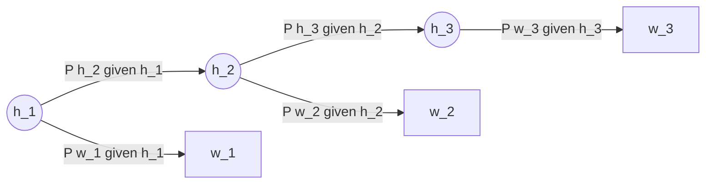
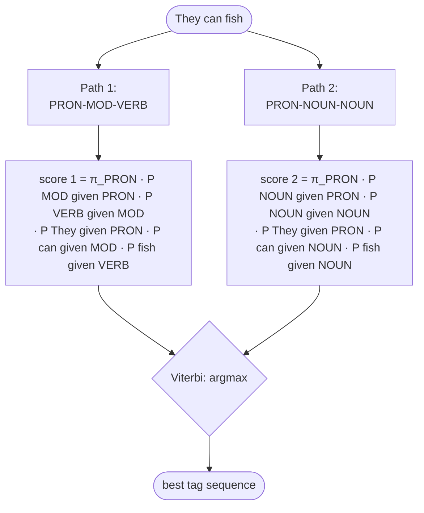

# Lecture 14 — Part-of-Speech Tagging

## Overview

Part-of-speech tagging is the task of assigning a **grammatical category** (Noun, Verb, Adjective, Determiner, …) to each word in a sentence. It sits in the NLP pipeline between **morphological/lexical analysis** and **syntactic parsing** — providing the grammatical layer on which parsing and semantic interpretation depend ([[30-Sources/NLP/pdf/Session 14 - POS tagging.pdf#page=6|slide 6]]).

The session traces a familiar arc: classical [[context-free-grammar|CFG]]-based syntactic analysis specifies *well-formedness* but not *probability*; natural language is **inherently ambiguous** ("They can fish" — `MOD VERB`, but "a can of fish" — `NOUN`); and so rule-based taggers built on lexicons + handcrafted disambiguation rules don't scale. This motivates the **statistical perspective**: model $P(t_1, \ldots, t_n \mid w_1, \ldots, w_n)$ and let learned probabilities resolve ambiguity.

The classical probabilistic solution is the [[hidden-markov-model|Hidden Markov Model]], formalized via two assumptions — **emission** (each word depends only on its tag) and **transition** (each tag depends only on the previous tag). Decoding the most probable tag sequence is done with the **[[hmm-viterbi|Viterbi algorithm]]**, a dynamic-programming routine that's the source of mock Exercise 3.

The blueprint flags this session as **very high weight**: mock Q9 (HMM/POS), Quiz III Q10–Q13 and Q19 (HMM mechanics, POS), and **Exercise 3 of the mock = 2-state Viterbi by hand** (10 points).

## Key concepts

- [[part-of-speech-tagging]] — the task itself; categories, ambiguity, sequence framing
- [[hidden-markov-model]] — the probabilistic model: hidden tag chain + observable words
- [[hmm-viterbi]] — dynamic-programming decoder for the most probable tag sequence
- [[dependency-parsing]] — adjacent task in the pipeline; produces a **tree of syntactic relations** (mock Q11)
- [[context-free-grammar|CFG]] — the symbolic predecessor that POS tagging makes probabilistic
- [[naive-bayes|Naïve Bayes]] — POS extends the conditional-probability framework with **sequential dependency**
- [[laplace-smoothing]] — applied to transition / emission counts to avoid zero probabilities

## Equations

**The structured prediction objective ([[30-Sources/NLP/pdf/Session 14 - POS tagging.pdf#page=10|slide 10]]):**
$$\hat{t}_{1:n} = \arg\max_{t_{1:n}} P(t_1, \ldots, t_n \mid w_1, \ldots, w_n)$$

**HMM joint-probability factorization ([[30-Sources/NLP/pdf/Session 14 - POS tagging.pdf#page=13|slide 13]] — formula sheet provides the Viterbi version):**
$$P(w_{1:n}, t_{1:n}) = \prod_{i=1}^{n} P(w_i \mid t_i) \, P(t_i \mid t_{i-1})$$

**Maximum-likelihood estimates from a labelled corpus ([[30-Sources/NLP/pdf/Session 14 - POS tagging.pdf#page=13|slide 13]]):**
- Transition: $P(t_i \mid t_{i-1}) = \dfrac{\text{count}(t_{i-1} \to t_i)}{\text{count}(t_{i-1})}$
- Emission: $P(w_i \mid t_i) = \dfrac{\text{count}(w_i \cap t_i)}{\text{count}(t_i)}$

Both estimates are **smoothed** (Laplace / add-$\alpha$) to avoid zero probabilities — exactly as in [[naive-bayes|Multinomial Naïve Bayes]].

**Viterbi recursion (formula sheet — [[30-Sources/NLP/pdf/Session 14 - POS tagging.pdf#page=14|slide 14]] describes Viterbi only in prose + a worked example, the formula itself is from the formula sheet):**
- Init: $\delta_1(j) = P(t_1 = j) \cdot P(w_1 \mid t_1 = j)$
- Recursion: $\delta_t(j) = \max_i \big[\delta_{t-1}(i) \cdot P(t_t = j \mid t_{t-1} = i)\big] \cdot P(w_t \mid t_t = j)$
- **Backpointer**: store $\arg\max_i$ at each step to reconstruct the path

The crucial swap: where forward-algorithm sums over predecessors, **Viterbi takes max** — that's how it picks the single best path.

## Diagrams

**POS tagging in the NLP pipeline ([[30-Sources/NLP/pdf/Session 14 - POS tagging.pdf#page=6|slide 6]]):**

*POS tagging is the grammatical layer on which parsing and semantic interpretation depend.*

**HMM as graphical model ([[30-Sources/NLP/pdf/Session 14 - POS tagging.pdf#page=12|slide 12]]):**

*Hidden states $h_i$ (the tags) form a Markov chain; observable outputs $w_i$ (the words) are emitted from each hidden state.*

**Why context resolves ambiguity ([[30-Sources/NLP/pdf/Session 14 - POS tagging.pdf#page=14|slide 14]] — "They can fish"):**

*Sequence modelling lets transition + emission probabilities pick the contextually-correct tag where local choices are ambiguous.*

## Why purely symbolic tagging fails ([[30-Sources/NLP/pdf/Session 14 - POS tagging.pdf#page=7|slides 7–9]])

Classical syntactic analysis used [[context-free-grammar|CFG]] rules like `S → NP VP`, `NP → Det N`, `VP → V NP` to derive grammatical categories by rule ([[30-Sources/NLP/pdf/Session 14 - POS tagging.pdf#page=7|slide 7]]). The fragility is structural:

- **Lexicons** with fixed categories miss novel words and morphology
- **Handcrafted disambiguation rules** explode in number with language coverage
- **"Complete and consistent grammars"** are unattainable — any exhaustive dictionary of categories fails as language variability and exceptions multiply ([[30-Sources/NLP/pdf/Session 14 - POS tagging.pdf#page=9|slide 9]])
- **Ambiguity is inherent** — "They *can* fish" (MOD) vs "a *can* of fish" (NOUN); the *word alone* doesn't determine its category, **context does**

Statistical models sidestep this by *estimating* probabilities from corpora rather than legislating them.

## Connection to Naïve Bayes ([[30-Sources/NLP/pdf/Session 14 - POS tagging.pdf#page=11|slide 11]])

POS tagging is conceptually *Naïve Bayes with sequential dependency*. The same machinery — conditional probabilities, parameter estimation from counts, smoothing — but predictions are now **interdependent across positions**: the tag at position $i$ depends on the tag at position $i-1$, so we can't classify each word in isolation.

| Naïve Bayes (e.g. spam) | POS tagging (HMM) |
|---|---|
| $P(\text{class} \mid \text{document})$ | $P(\text{tag sequence} \mid \text{word sequence})$ |
| Independent features | Sequential dependency between tags |
| Single label | Structured output (tag chain) |
| Maximize likelihood | Maximize likelihood (with Markov factorization) |

> "The only difference is that predictions are interdependent across positions" ([[30-Sources/NLP/pdf/Session 14 - POS tagging.pdf#page=11|slide 11]]).

## What HMM captures and what it misses ([[30-Sources/NLP/pdf/Session 14 - POS tagging.pdf#page=15|slide 15]])

**Captured:**
- Frequent **tag transitions** (e.g. DET often precedes NOUN)
- Typical **word–category associations** (e.g. "the" → DET)
- **Local grammatical regularities** (n-gram-style)

**Missed:**
- **Long-distance syntactic dependencies** — the Markov assumption only sees the previous tag
- **Hierarchical structure** — phrase-level grouping (NP, VP) is invisible
- **Semantic interpretation** — POS is purely grammatical annotation

These limitations motivate richer sequence models: **discriminative alternatives** like CRFs (briefly mentioned on [[30-Sources/NLP/pdf/Session 14 - POS tagging.pdf#page=3|slide 3]] as "Discriminative Alternatives") and ultimately **neural sequence models** — RNNs, transformers — that capture longer dependencies and learned representations.

## Open questions

- The deck mentions "Discriminative Alternatives" as a contents item but doesn't expand on them. CRFs (conditional random fields) are the canonical discriminative alternative — they model $P(t_{1:n} \mid w_{1:n})$ directly without the generative factorization, allowing richer features. [not in source — the deck only names "discriminative alternatives" without defining]
- HMM smoothing is described as "resembling Multinomial Naïve Bayes" but the specific $\alpha$ value is left open. In practice, add-1 (Laplace) is the default; the prof's exam exercises typically provide pre-computed transition/emission tables so smoothing isn't on the critical path.

## Notebooks

- [NLTK + spaCy POS tagging (cells 3–10)](30-Sources/NLP/notebooks/10_Part_of_Speech_tagging.ipynb) — pre-trained tagger usage: `nltk.pos_tag(word_tokenize(s))` returns Penn Treebank tags; spaCy's `token.pos_` is universal POS, `token.tag_` is the detailed tag. The notebook also walks an HMM-from-scratch implementation. See [[part-of-speech-tagging]] for the canonical code.
