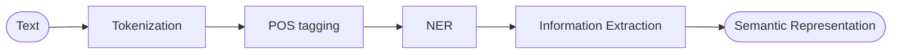
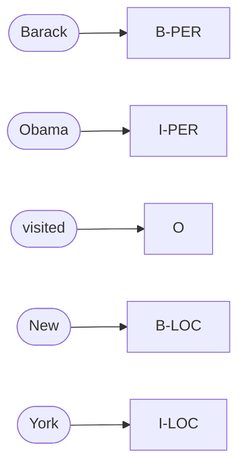
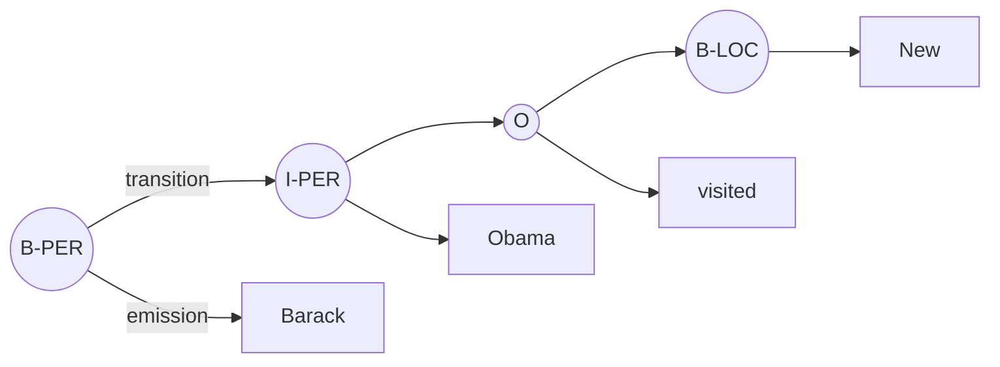

# Lecture 15 — Named Entity Recognition

## Overview

Named Entity Recognition (NER) is the task of identifying segments of text that refer to **specific entities** in the world (persons, organizations, locations, dates, monetary expressions, percentages, geopolitical entities) and assigning each segment a **semantic type** ([[30-Sources/NLP/pdf/Session 15 - NER.pdf#page=5|slide 5]]). Where [[part-of-speech-tagging|POS tagging]] gives every token a grammatical category, NER recovers **structured semantic elements** within the text — operating at the **interface between syntax and semantics** ([[30-Sources/NLP/pdf/Session 15 - NER.pdf#page=6|slide 6]]).

> "Apple hired John Smith in Paris in 2024" → Apple/ORG, John Smith/PERSON, Paris/LOC, 2024/DATE.

The session reformulates **span detection** as a **token-level sequence labelling problem** via the **IOB representation** (B-PER, I-PER, O), then applies the same [[hidden-markov-model|HMM]] + [[hmm-viterbi|Viterbi]] machinery from Session 14 — only the **interpretation of the hidden states** changes ([[30-Sources/NLP/pdf/Session 15 - NER.pdf#page=11|slide 11]]): tags are now semantic entity labels instead of grammatical categories. Evaluation differs sharply from POS: **strict span-based precision/recall** instead of token accuracy — partial matches do not count.

The blueprint flags this as **high weight**: mock Q10 (NER definition + sequence labelling), Quiz III Q14, Q15, Q20 (and Model B variants) — covering the two-conditions evaluation rule, span vs type errors, and POS-vs-NER contrasts.

## Key concepts

- [[named-entity-recognition]] — task definition, IOB encoding, span-based evaluation
- [[hidden-markov-model]] — same model as POS, reinterpreted with entity tags as hidden states
- [[hmm-viterbi]] — same decoding algorithm
- [[part-of-speech-tagging]] — adjacent task; NER sits *after* POS in the pipeline
- [[evaluation-metrics]] — extended for span-based strict matching

## Equations

**Structured prediction objective ([[30-Sources/NLP/pdf/Session 15 - NER.pdf#page=10|slide 10]]):**
$$\hat{y}_{1:n} = \arg\max_{y_{1:n}} P(y_1, \ldots, y_n \mid w_1, \ldots, w_n)$$
identical in form to POS, with $y_i$ now an IOB label like `B-PER`, `I-LOC`, `O`.

**HMM joint factorization for NER ([[30-Sources/NLP/pdf/Session 15 - NER.pdf#page=13|slide 13]]):**
$$\hat{t}_{1:n} = \arg\max_{t_{1:n}} \prod_{i=1}^{n} P(w_i \mid t_i) \cdot P(t_i \mid t_{i-1})$$
- Emission independence: $P(w_{1:n} \mid t_{1:n}) = \prod_i P(w_i \mid t_i)$
- First-order Markov: $P(t_{1:n}) = \prod_i P(t_i \mid t_{i-1})$

**Viterbi recursion ([[30-Sources/NLP/pdf/Session 15 - NER.pdf#page=16|slide 16]]):**
$$V_t(j) = \max_i \big[ V_{t-1}(i) \, a_{ij}\big] \cdot b_j(w_t), \qquad \psi_t(j) = \arg\max_i V_{t-1}(i) \, a_{ij}$$
where $a_{ij}$ are transitions and $b_j(w_t)$ emissions. Backpointers reconstruct the trajectory through the trellis ([[30-Sources/NLP/pdf/Session 15 - NER.pdf#page=16|slide 16]]'s ice-cream / Hot–Cold example).

## Diagrams

**NER in the NLP pipeline ([[30-Sources/NLP/pdf/Session 15 - NER.pdf#page=7|slide 7]]):**

*NER occupies the position **after POS tagging** and **before full information extraction**. POS gives grammatical categories; NER introduces referential structure.*

**The IOB encoding ([[30-Sources/NLP/pdf/Session 15 - NER.pdf#page=9|slide 9]]):**

*Each token gets exactly one label: B-X opens an entity of type X, I-X continues it, O is outside any entity. Span boundaries are recovered from the B/I transitions.*

**HMM for NER — same structure as POS, different interpretation ([[30-Sources/NLP/pdf/Session 15 - NER.pdf#page=11|slide 11]]):**

*Hidden states = entity tags; observable emissions = words. The math is identical to POS — only the meaning of the hidden chain changes.*

**The three changes from POS to NER ([[30-Sources/NLP/pdf/Session 15 - NER.pdf#page=18|slide 18]]):**

| Aspect | POS | NER |
|---|---|---|
| Label space | Grammatical categories | **Referential / semantic** entity types |
| Error type | Tag misclassification | **Boundary mistakes + type mistakes** |
| Evaluation | Per-token accuracy | **Strict span-based precision / recall** |

## Why NER is not POS ([[30-Sources/NLP/pdf/Session 15 - NER.pdf#page=5|slides 5–6]])

A named entity is **not simply a noun**. It's an *expression* referring to a particular object, group, place, or concept. The word "Washington" is grammatically a proper noun, but semantically it can refer to a person, a state, a city, or an institution — **classification depends on context** ([[30-Sources/NLP/pdf/Session 15 - NER.pdf#page=6|slide 6]]). NER thus operates at the **interface between syntax and semantics**: it requires grammatical awareness but ultimately aims at **referential interpretation**.

Three structural difficulties beyond POS ([[30-Sources/NLP/pdf/Session 15 - NER.pdf#page=8|slide 8]]):
1. **Entities span multiple tokens** — "New York" (2 tokens, 1 LOC), "Bank of America" (3 tokens, 1 ORG)
2. **Boundaries vary** — the system must detect where each span starts and ends
3. **Predictions are not independent** — the label at one position constrains the label at the next (B-PER cannot be followed by I-LOC)

This pushes the task into **structured sequence labelling**, just like POS — but with a richer label space and stricter evaluation.

## The IOB representation ([[30-Sources/NLP/pdf/Session 15 - NER.pdf#page=9|slide 9]])

To turn variable-length span detection into per-token labelling, each token gets one of:
- **B-X** — *Beginning* of an entity of type X
- **I-X** — *Inside* (continuation of) an entity of type X
- **O** — *Outside* any entity

> "Barack Obama visited New York" → `B-PER I-PER O B-LOC I-LOC`

This is what makes the HMM/Viterbi machinery from Session 14 immediately reusable: the decoder picks the most probable IOB sequence, and span boundaries fall out of the B/I transitions.

## Generative HMM for NER ([[30-Sources/NLP/pdf/Session 15 - NER.pdf#page=11|slides 11–13]])

Two assumptions, identical to the POS HMM:
- **Emission independence:** each word depends only on its entity tag — $P(w_i \mid t_i)$
- **First-order Markov property:** each tag depends only on the previous tag — $P(t_i \mid t_{i-1})$

The joint:
$$P(w_{1:n}, t_{1:n}) = \prod_{i=1}^{n} P(w_i \mid t_i) \cdot P(t_i \mid t_{i-1})$$

> "This generative structure is identical in mathematical form to the one used for part-of-speech tagging. Only the interpretation of the hidden states changes." ([[30-Sources/NLP/pdf/Session 15 - NER.pdf#page=11|slide 11]])

## Two HMM problems: decoding vs learning ([[30-Sources/NLP/pdf/Session 15 - NER.pdf#page=14|slide 14]])

| Problem | Question | Algorithm |
|---|---|---|
| **Decoding** | Given parameters, find the most likely hidden sequence | **Viterbi** |
| **Learning** | Given only observed sequences, estimate initial / emission / transition probabilities | **Baum–Welch / EM** |

For NER (and POS) on labelled corpora, learning is just MLE counting + smoothing. **Baum–Welch / EM** appears when only words are observed (no labelled tags). The deck mentions this as practical context — the exam exercises always provide pre-computed tables.

## Viterbi trellis worked example ([[30-Sources/NLP/pdf/Session 15 - NER.pdf#page=15|slides 15–16]], Eisner ice-cream)

The deck uses the classical 2-state HMM (Hot/Cold) with 3 days of ice-cream observations to walk through the trellis:
- Per cell: $V_t(j) = \max_i [V_{t-1}(i) \cdot a_{ij}] \cdot b_j(w_t)$
- Per cell: $\psi_t(j) = \arg\max_i V_{t-1}(i) \cdot a_{ij}$ (backpointer)
- Final: pick the state with the largest $V_n(j)$, then walk backpointers backward

This is **exactly** the structure of mock Exercise 3 — substitute (Hot/Cold) with two POS or NER tags and the table fills the same way.

## Span-based evaluation ([[30-Sources/NLP/pdf/Session 15 - NER.pdf#page=17|slide 17]])

Unlike document classification, NER evaluation is **span-based**:
- A prediction is correct **only if both the boundaries and the entity type match exactly** (Quiz III Q15)
- **Partial matches do not count** — predicting "New York" when the true span is "New York City" is **incorrect**, not partially correct

Metrics:
- **Precision** = correct predicted entities / total predicted entities
- **Recall** = correct predicted entities / total true entities
- **F1** = harmonic mean

Error sources in classical NER:
- **Boundary detection mistakes** (where an entity starts/ends)
- **Type confusion** between similar categories (PER vs ORG for "Apple" — the company vs a person named Apple)
- **Data sparsity** for rare names
- **Contextual ambiguity** ("Washington")
- **Nested entities** — "Bank of America Tower" where ORG sits inside a LOC

## Limits of classical NER ([[30-Sources/NLP/pdf/Session 15 - NER.pdf#page=17|slides 17–18]])

The HMM's first-order Markov + local emission assumptions limit the model to **local dependencies**. They struggle with:
- **Long-distance contextual cues** (a person's role mentioned earlier in the document)
- **Coreference** across sentences
- **Nested entities**

These limits motivate **discriminative alternatives** (CRFs, mentioned but not detailed) and ultimately **neural sequence models** (RNNs, transformers) that capture richer context.

## Open questions

- The deck mentions **Baum–Welch** for learning HMM parameters when tags are unobserved ([[30-Sources/NLP/pdf/Session 15 - NER.pdf#page=14|slide 14]]). For NER on labelled corpora, this isn't needed — MLE counting suffices. Baum–Welch is mentioned as background, not exam material.
- **Discriminative alternatives** are flagged as a contents item but not expanded. The natural successor is the CRF (Conditional Random Field), which models $P(y \mid x)$ directly with global feature scoring. [not in source — deck only names the category]

## Notebooks

- [spaCy and NLTK NER (cells 5–9)](30-Sources/NLP/notebooks/11_Named_Entity_Recognition.ipynb) — pre-trained NER: `spacy.load("en_core_web_sm")` then `[(ent.text, ent.label_) for ent in doc.ents]` returns labels like `ORG`, `PERSON`, `GPE`, `DATE`. NLTK uses `ne_chunk(pos_tag(word_tokenize(text)))`. See [[named-entity-recognition]] for the code.
