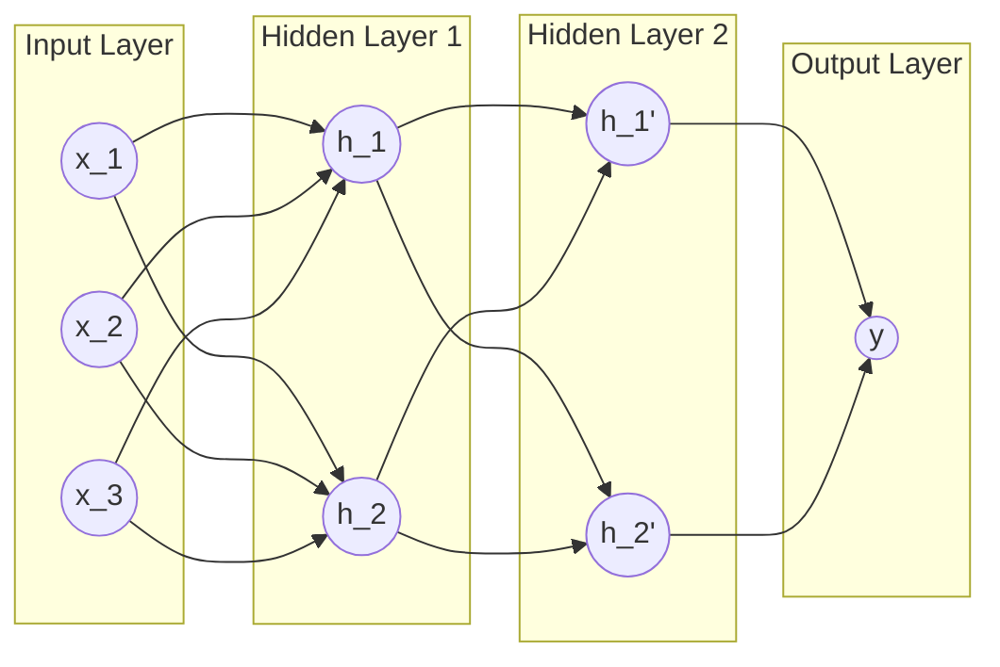
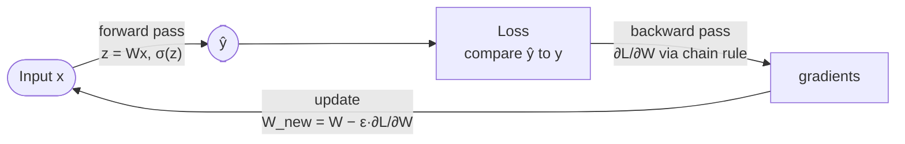
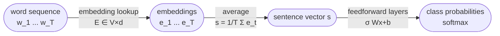

# Lecture 16 — Feedforward Neural Networks

## Overview

The transition session: from the classical statistical pipeline (BoW + TF-IDF + Naïve Bayes / Logistic Regression / SVM / HMM) to the **neural pipeline** where representation and prediction are no longer separated — the model itself learns a representation of the input that's useful for the prediction task ([[30-Sources/NLP/pdf/Session 16 - Neural Networks-1.pdf#page=4|slide 4]]).

The session builds the feedforward network from first principles: a single neuron $y = \sigma(w^\top x + b)$ as a parametric nonlinear transformation; vector computation $h = \sigma(Wx + b)$ stacking many neurons in a layer; deep networks composing such layers; the role of nonlinear activations (without them depth collapses to a single linear map); and the training loop — forward pass → loss → backpropagation → gradient descent → epoch repeat.

The session ends by tying neural models back to NLP: words must first be mapped into a vector space (one-hot or learned [[word-embeddings|dense embeddings]]), and a simple **average of word embeddings** gives a fixed-length sentence vector that can be fed into a feedforward classifier — the "BoW + MLP" baseline.

The blueprint flags this session as **medium weight**: it's foundational for everything that follows (Sessions 17–19). Quiz IV sits on top of these foundations (sigmoid / softmax computation, embedding-matrix sizing, cross-entropy, SGD).

## Key concepts

- [[multilayer-perceptron|Feedforward neural network]] — composition of parametric nonlinear layers
- [[activation-function]] — sigmoid / tanh / ReLU / Leaky ReLU / PReLU; without nonlinearity depth collapses
- [[softmax]] — output activation for multi-class classification
- [[cross-entropy]] — standard loss for neural classifiers
- [[backpropagation]] — gradient computation via chain rule, paired with SGD / Adam
- [[word-embeddings]] — learned dense vectors, the input layer for neural NLP
- [[embedding-matrix]] — $E \in \mathbb{R}^{V \times d}$ as a learnable lookup table
- [[one-hot-encoding]] — the discrete predecessor neural models replace
- [[perceptron]] — the elementary computational unit

## Equations

**Single neuron ([[30-Sources/NLP/pdf/Session 16 - Neural Networks-1.pdf#page=5|slide 5]]):**
$$y = \sigma(w^\top x + b), \qquad w \in \mathbb{R}^n, \; b \in \mathbb{R}$$

**Layer of $m$ neurons ([[30-Sources/NLP/pdf/Session 16 - Neural Networks-1.pdf#page=6|slide 6]]):**
$$h = \sigma(W x + b), \qquad W \in \mathbb{R}^{m \times n}, \; b \in \mathbb{R}^m$$

**One-hidden-layer feedforward ([[30-Sources/NLP/pdf/Session 16 - Neural Networks-1.pdf#page=7|slide 7]]):**
$$h = \sigma(W_1 x + b_1), \qquad y = W_2 h + b_2$$
$$\Longrightarrow \quad y = W_2 \,\sigma(W_1 x + b_1) + b_2$$

**Why nonlinearity matters ([[30-Sources/NLP/pdf/Session 16 - Neural Networks-1.pdf#page=9|slide 9]]):** Without $\sigma$, $h = W_1 x$ and $y = W_2 h$ collapse to $y = (W_2 W_1) x$ — a single linear map, no expressive gain from stacking.

**Cross-entropy loss for $K$ classes ([[30-Sources/NLP/pdf/Session 16 - Neural Networks-1.pdf#page=12|slide 12]], [[30-Sources/NLP/pdf/Session 16 - Neural Networks-1.pdf#page=13|slide 13]]):**
$$L(\theta) = -\sum_i \log P(y_i \mid x_i; \theta) \quad\text{or}\quad L = -\frac{1}{N} \sum_{i=1}^N \sum_{k=1}^K y_{ik} \log p_k$$

**Output-layer gradients for softmax + cross-entropy ([[30-Sources/NLP/pdf/Session 16 - Neural Networks-1.pdf#page=13|slide 13]]):**
$$\partial_b L = p - y, \qquad \partial_W L = (p - y)\, h^\top$$

**Gradient-descent update ([[30-Sources/NLP/pdf/Session 16 - Neural Networks-1.pdf#page=14|slide 14]]):**
$$b_{\text{new}} = b_{\text{old}} - \varepsilon \cdot \partial_b L, \qquad w_{\text{new}} = w_{\text{old}} - \varepsilon \cdot \partial_w L$$

**Embedding lookup ([[30-Sources/NLP/pdf/Session 16 - Neural Networks-1.pdf#page=18|slide 18]], formula sheet):**
$$e = E^\top x \quad \text{where } x \text{ is one-hot}, \; E \in \mathbb{R}^{V \times d}$$

**Average-of-embeddings sentence vector ([[30-Sources/NLP/pdf/Session 16 - Neural Networks-1.pdf#page=19|slide 19]]):**
$$s = \frac{1}{T} \sum_{t=1}^{T} e_t$$
fixed length regardless of $T$ — a fast neural baseline.

## Diagrams

**The feedforward network as a directed acyclic graph ([[30-Sources/NLP/pdf/Session 16 - Neural Networks-1.pdf#page=8|slide 8]]):**

*Each layer applies $\sigma(W \cdot + b)$ to the previous layer's output. The intermediate representations are learned, not specified.*

**The training loop ([[30-Sources/NLP/pdf/Session 16 - Neural Networks-1.pdf#page=11|slide 11]]):**

*One epoch = forward pass + loss evaluation + backpropagation + parameter update. Repeat until loss converges.*

**Neural model for text classification ([[30-Sources/NLP/pdf/Session 16 - Neural Networks-1.pdf#page=19|slide 19]]):**

*The minimal neural NLP pipeline: word sequence → embeddings → sentence representation → neural classifier.*

## The role of nonlinear activation ([[30-Sources/NLP/pdf/Session 16 - Neural Networks-1.pdf#page=9|slides 9–10]])

Without a nonlinearity, **stacking layers adds no expressive power** — the composition of linear maps is a linear map. Common activations:

| Function | Formula | Notes |
|---|---|---|
| **Heaviside (step)** | $H(z) = 1$ if $z \ge 0$ else $0$ | Original; non-differentiable |
| **Sigmoid** | $\sigma(z) = 1/(1+e^{-z})$ | Saturates at extremes; output $\in (0,1)$ |
| **ReLU** | $\max(0, z)$ | Modern default; gradient $= 1$ for $z > 0$ |
| **Leaky ReLU** | $z$ if $z > 0$ else $0.02z$ | Avoids dead-unit problem |
| **Parametric ReLU** | $z$ if $z > 0$ else $a z$ | Learned slope $a$ |

> "More recently the Rectified Linear Unit (ReLU), Leaky ReLU, or Parametric ReLU (PReLU) are being used to ensure that the derivatives remain large whenever the unit is active." ([[30-Sources/NLP/pdf/Session 16 - Neural Networks-1.pdf#page=10|slide 10]])

ReLU's flat-zero regime causes "dead units"; Leaky / Parametric ReLU patch this by giving a small nonzero slope on the negative side.

## Loss functions ([[30-Sources/NLP/pdf/Session 16 - Neural Networks-1.pdf#page=15|slide 15]])

| Loss | Formula | Task |
|---|---|---|
| **Mean Squared Error (MSE)** | $\frac{1}{N}\sum (y_i - \hat{y}_i)^2$ | Regression |
| **Cross-Entropy** | $-\sum_k y_k \log p_k$ | Multi-class classification |
| **Binary Cross-Entropy** | $-[y \log p + (1-y)\log(1-p)]$ | Binary classification |
| **Hinge** | $\max(0, 1 - y \hat{y})$ | SVMs (max-margin) |
| **KL Divergence** | $\sum p_i \log(p_i / q_i)$ | Distribution matching |

When-to-use: Regression → MSE, Binary → BCE, Multi-class → Cross-entropy.

## Optimization algorithms ([[30-Sources/NLP/pdf/Session 16 - Neural Networks-1.pdf#page=16|slide 16]])

| Optimizer | Update idea | When to use |
|---|---|---|
| SGD | Plain gradient descent | Large datasets |
| SGD + momentum | Adds velocity term | Deep networks |
| **Adam** | Adaptive learning rate + momentum | **Default in NLP** |
| RMSProp | Adaptive learning rate | RNN training |
| Adagrad | Per-parameter LR | Word embeddings (sparse data) |

## Words → vectors → neural models ([[30-Sources/NLP/pdf/Session 16 - Neural Networks-1.pdf#page=17|slides 17–19]])

Neural networks operate on numerical vectors, but language consists of discrete symbols. Two representations:

1. **One-hot** ($x \in \mathbb{R}^V$, exactly one entry = 1) — uniquely identifies each word but encodes no similarity, becomes very high-dimensional and sparse.
2. **Dense embeddings** ($e \in \mathbb{R}^d$, $d \ll V$) — learned mapping via the embedding matrix $E \in \mathbb{R}^{V \times d}$. Each row is a word's vector. Lookup is just selecting the row corresponding to the word's index. Words appearing in similar contexts acquire similar vectors.

The embedding matrix is a **trainable lookup table** that's optimized jointly with the rest of the network's parameters ([[30-Sources/NLP/pdf/Session 16 - Neural Networks-1.pdf#page=18|slide 18]]) — this is the neural-era version of [[word2vec|Word2Vec]]'s standalone embeddings.

For sentence-level classification, the simplest aggregator is the **average of word embeddings** ([[30-Sources/NLP/pdf/Session 16 - Neural Networks-1.pdf#page=19|slide 19]]):
$$s = \frac{1}{T} \sum_{t=1}^{T} e_t$$
which gives a fixed-length vector regardless of sentence length — usable directly as input to a feedforward classifier.

## Open questions

- The deck doesn't explicitly cover **softmax** as a standalone slide but uses it implicitly in $z = Wh + b$ being passed through softmax for classification ([[30-Sources/NLP/pdf/Session 16 - Neural Networks-1.pdf#page=13|slide 13]]). Quiz IV will test softmax computation directly — see [[softmax]] for the standalone treatment.
- The deck doesn't cover **regularization** (dropout, L2, early stopping), nor **initialization schemes** (Xavier, He). These are critical in practice but beyond Session 16 scope. [not in source]
- "Neural Networks-2" likely covers RNNs (Session 17) given the file's "-1" suffix and the topic flow.
