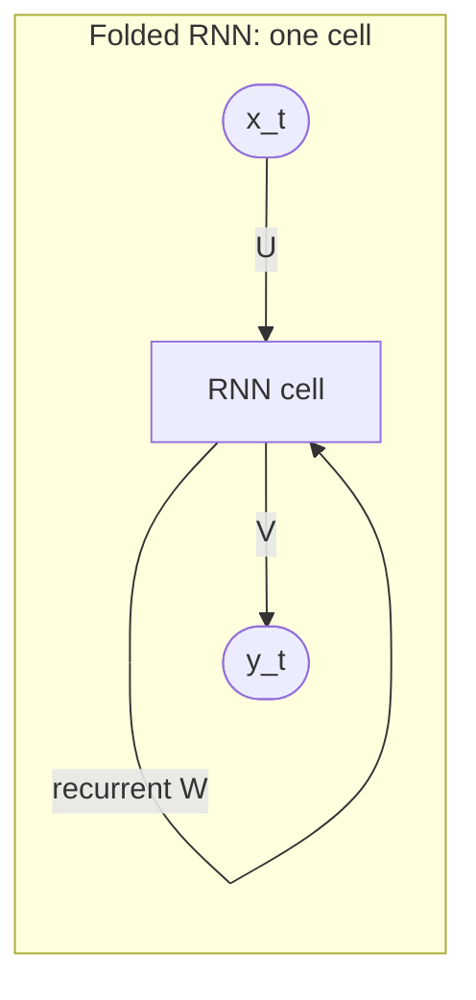
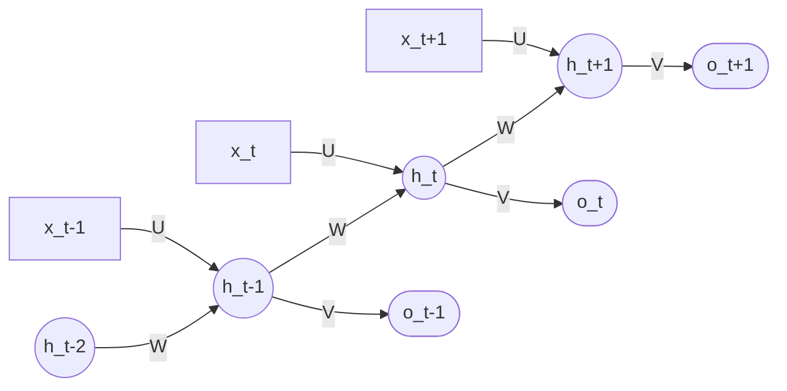
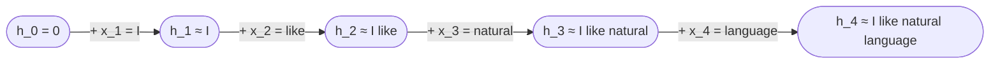
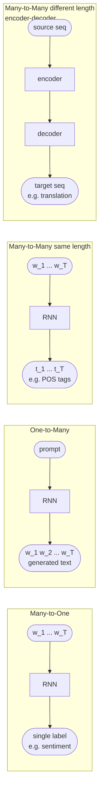

# Lecture 17 — Recurrent Neural Networks

## Overview

The first **sequence-aware** neural model in the course. Where the [[multilayer-perceptron|feedforward network]] of Session 16 treats inputs as fixed-size vectors (e.g. average of word embeddings — losing order), the **Recurrent Neural Network** is designed specifically to **model ordered data** ([[30-Sources/NLP/pdf/Session 17 - Recurrent NN.pdf#page=4|slide 4]]). The same parametric cell is applied at every time step, while a **hidden state** $h_t$ carries summarized information about the past forward through the sequence.

The session walks through the **Elman RNN** — the classical formulation with $h_t = \tanh(W h_{t-1} + U x_t + b)$ followed by an output map $o_t = V h_t + b_o$ and softmax. Trained as a **language model** by minimizing negative log-likelihood of the next token, the RNN encodes sequential context into a fixed-size vector.

The session ends on the limits: **vanishing / exploding gradients** during [[bptt|Backpropagation Through Time]] mean simple Elman RNNs can only model context of about 5–10 tokens in practice ([[30-Sources/NLP/pdf/Session 17 - Recurrent NN.pdf#page=14|slide 14]]), motivating LSTM / GRU (Session 18) and ultimately attention-based models (Session 19).

The blueprint flags this as **high weight**: mock Q13 (RNN hidden state role), Quiz IV Q1–Q2 (RNN, BPTT, vanishing gradients) and B variants. The formula sheet provides the RNN update $h_t = \tanh(W x_t + U h_{t-1})$ — exact form to reproduce.

## Key concepts

- [[recurrent-neural-network]] — Elman architecture, hidden state, language modelling
- [[vanishing-exploding-gradients]] — why simple RNNs lose long-range information
- [[bptt|Backpropagation Through Time]] — how RNNs are trained
- [[word-embeddings]] / [[embedding-matrix]] — the input layer for RNNs
- [[softmax]] / [[cross-entropy]] — output and loss for next-token prediction

## Equations

**Sequence model objective ([[30-Sources/NLP/pdf/Session 17 - Recurrent NN.pdf#page=5|slide 5]]):** given previous tokens, predict the next:
$$p(w_{t+1} \mid w_1, \ldots, w_t)$$

**Elman RNN forward pass ([[30-Sources/NLP/pdf/Session 17 - Recurrent NN.pdf#page=7|slide 7]]):**
$$a_t = b_h + W h_{t-1} + U x_t$$
$$h_t = \tanh(a_t)$$
$$o_t = b_o + V h_t$$
$$\hat{y}_t = \mathrm{softmax}(o_t)$$
where:
- $x_t$ — input embedding at step $t$ (looked up from the embedding matrix $E$)
- $h_t$ — hidden state at step $t$ (a learned summary of $x_1, \ldots, x_t$)
- $U$ — input-to-hidden weights
- $W$ — hidden-to-hidden (recurrent) weights
- $V$ — hidden-to-output weights
- $b_h, b_o$ — biases

**Formula sheet form (no bias):**
$$h_t = \tanh(W x_t + U h_{t-1})$$
(the prof's notation flips $W \leftrightarrow U$ between slide and formula sheet — both are the same model, just labelled differently. The slide's $U$ is the input-to-hidden, the formula sheet's $W$ is the input-to-hidden.)

**Loss — negative log-likelihood of the next token ([[30-Sources/NLP/pdf/Session 17 - Recurrent NN.pdf#page=11|slide 11]]):**
$$L = -\sum_t \log P(w_{t+1} \mid w_1, \ldots, w_t)$$
trained by [[backpropagation]] **through time** (BPTT, [[30-Sources/NLP/pdf/Session 17 - Recurrent NN.pdf#page=7|slide 7]]).

## Diagrams

**The folded vs unfolded RNN ([[30-Sources/NLP/pdf/Session 17 - Recurrent NN.pdf#page=7|slide 7]]):**

*Unfolded view: same cell, same parameters $U, W, V$, applied at every time step. The hidden state $h$ chains through time.*

> "Be careful with the unfolded graph: in an RNN there is **only one cell** with specific weights and biases, not many — each input is then transformed in exactly the same way at every step." ([[30-Sources/NLP/pdf/Session 17 - Recurrent NN.pdf#page=7|slide 7]])

**Hidden state as compressed memory ([[30-Sources/NLP/pdf/Session 17 - Recurrent NN.pdf#page=10|slide 10]]):**

*The hidden state is a learned, fixed-size summary of all tokens seen so far — a "compressed memory of the preceding context".*

**Types of RNN tasks ([[30-Sources/NLP/pdf/Session 17 - Recurrent NN.pdf#page=16|slide 16]]):**

*RNNs can be configured many ways: classification (many-to-one), generation (one-to-many), tagging (many-to-many same length), translation (encoder-decoder).*

## How the RNN learns a language model ([[30-Sources/NLP/pdf/Session 17 - Recurrent NN.pdf#page=8|slides 8–9]])

The objective: build a function $(w_1, \ldots, w_t) \mapsto p_\theta(w_{t+1} \mid w_{1\ldots t})$. Implemented by:
- **Embeddings $E$** — input layer, looked up from the embedding matrix
- **Recurrent dynamics $U, W, b_h$** — how the hidden state evolves
- **Output map $V, b_o$** — projects the hidden state to vocabulary logits, then softmax

For "I like natural language processing" (vocabulary size 6 including EOS), the network produces a per-step conditional distribution. **At step $t$, the supervised target is the next word $w_{t+1}$.** Loss is the negative log of the probability the model assigned to the actual next token; total loss is summed (or averaged) over the sequence and backpropagated.

> [[30-Sources/NLP/pdf/Session 17 - Recurrent NN.pdf#page=9|slide 9]] worked example: after step 1 ("I"), the model assigns $P(\text{like} \mid \text{I}) \approx 16.4\%$. After 100 epochs of training, that probability rises to $\approx 18.1\%$ — the model has shifted mass toward the right next token.

## Training vs using the model ([[30-Sources/NLP/pdf/Session 17 - Recurrent NN.pdf#page=11|slide 11]])

| Phase | Activity |
|---|---|
| **Training** | Estimate $E, U, W, V, b_h, b_o$ from data. Minimize $-\sum_t \log P(w_{t+1} \mid w_{1\ldots t})$ via BPTT + SGD/Adam. |
| **Inference** | Parameters are **fixed**. Given a new sequence, compute hidden states sequentially. Output a distribution over the next token. Hidden states are **recomputed per input sequence** — they are not stored parameters. |

## Text generation ([[30-Sources/NLP/pdf/Session 17 - Recurrent NN.pdf#page=12|slide 12]])

A trained RNN language model generates text by repeatedly:
1. Compute $P(w \mid \text{context so far})$
2. Pick a token (highest probability = greedy; sample from the distribution = stochastic)
3. Append, update hidden state, repeat — until **end-of-sequence (EOS)** token is produced

This is the autoregressive generation pattern that transformers (Session 19) inherit.

## Why RNNs are hard to scale ([[30-Sources/NLP/pdf/Session 17 - Recurrent NN.pdf#page=13|slides 13–14]])

**Computational cost** ([[30-Sources/NLP/pdf/Session 17 - Recurrent NN.pdf#page=13|slide 13]]):
- Training FLOPs $\approx 6 \cdot |\text{params}| \cdot |\text{tokens}|$
- For English (vocab 30K–100K) with $\sim 10^9$ tokens, training a small ($10^7$–$10^8$ params) model is $\sim 10^{23}$ FLOPs
- Single GPU: ~31 years; 10,000 GPUs: ~1 day
- RNNs cannot be **parallelized across the sequence** — token $t$ requires $h_{t-1}$ — this is the bottleneck transformers fix

**Vanishing / exploding gradients** ([[30-Sources/NLP/pdf/Session 17 - Recurrent NN.pdf#page=14|slide 14]]):
- BPTT multiplies gradients by the recurrent weight matrix $W$ at each step
- If the largest singular value of $W$ < 1: gradients **shrink exponentially** with sequence length → vanishing
- If > 1: gradients **grow exponentially** → exploding
- Vanishing is the more common failure: distant tokens contribute negligible gradient → updates depend mostly on the **last 5–10 tokens** ([[30-Sources/NLP/pdf/Session 17 - Recurrent NN.pdf#page=14|slide 14]])

**Each token treated identically:** the RNN cannot **selectively attend** — every input is multiplied by the same $U$ regardless of relevance. There's no mechanism to "choose which tokens are useful" ([[30-Sources/NLP/pdf/Session 17 - Recurrent NN.pdf#page=14|slide 14]]). This is the critique that motivates **attention** in Session 19.

## RNNs and long contexts ([[30-Sources/NLP/pdf/Session 17 - Recurrent NN.pdf#page=15|slide 15]])

Consider "The book that I bought yesterday because the reviews were excellent **was** expensive." To predict "was", the model needs to remember the subject "book" — but many tokens intervene. **Empirically, simple Elman RNNs rely mostly on the most recent words, with effective context length limited to ~5–10 tokens** ([[30-Sources/NLP/pdf/Session 17 - Recurrent NN.pdf#page=14|slide 14]]).

This motivates:
- **LSTM / GRU** (Session 18) — gating mechanisms that protect long-term memory
- **Attention** (Session 19) — direct token-to-token connections, no information bottleneck

## Open questions

- The slide notation uses $U$ for input-to-hidden and $W$ for hidden-to-hidden, but the formula sheet swaps them ($W$ for input-to-hidden, $U$ for hidden-to-hidden). Both express the same model. **On the exam, use whichever the formula sheet labels — the math is identical.**
- The deck doesn't explicitly cover **gradient clipping** as the standard remedy for exploding gradients. It's the practical fix, but mentioned only by name as a "challenge" without a specific intervention. [not in source]

## Notebooks

- [Elman RNN language model (cells 9–11)](30-Sources/NLP/notebooks/16_Elman_RNNs.ipynb) — minimal PyTorch implementation of $h_t = \tanh(W_{hh} h_{t-1} + W_{ih} e_t + b_h)$, with embeddings initialized from Word2Vec (gensim). The recurrence is **explicitly a Python `for` loop over time** — illustrating why RNNs cannot be parallelized across the sequence. See [[recurrent-neural-network]] for the code.
