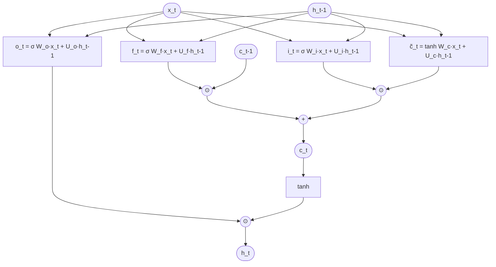
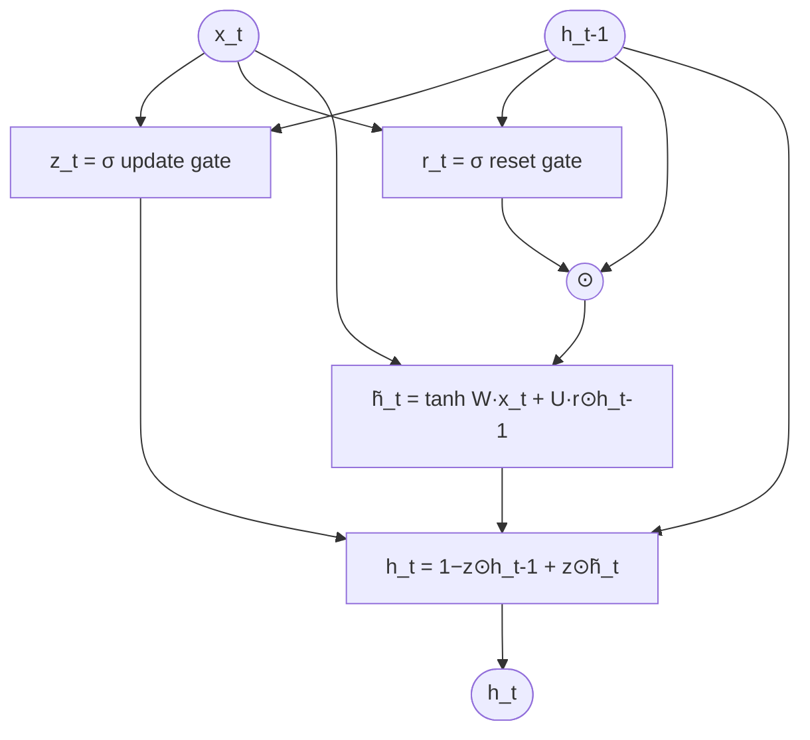
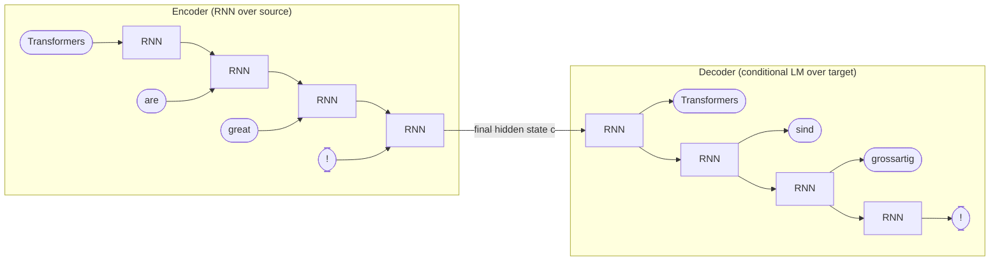

# Lecture 18 — Beyond Vanilla RNNs

## Overview

Three architectural extensions that fix two specific failures of the [[recurrent-neural-network|vanilla Elman RNN]]:

1. **[[lstm|Long Short-Term Memory (LSTM)]]** — adds a separate **cell state** $c_t$ and **three gates** (forget, input, output) that learn to selectively retain, write, and expose information across long sequences.
2. **[[gru|Gated Rectified Unit (GRU)]]** — a simpler, gateset-merged variant: only **reset** and **update** gates, no separate cell state. Faster than LSTM with usually slightly weaker long-range modelling.
3. **[[encoder-decoder]]** — a sequence-to-sequence architecture composed of two RNNs: an *encoder* that compresses a source sequence into a hidden-state representation, and a *decoder* that generates a target sequence conditioned on that representation. The basis for translation, summarization, and (early) question-answering — and the structural template attention later refines.

The blueprint flags this as **medium weight**: Quiz IV Q3, Q4 (LSTM/GRU gates), Quiz IV Q5 (encoder-decoder fixed-context bottleneck → motivates attention) and B variants. None of these formulas are on the formula sheet — concept-level recall only.

## Key concepts

- [[lstm|LSTM]] — three gates + cell state for long-range dependencies
- [[gru|GRU]] — two gates, simpler, no separate cell state
- [[encoder-decoder]] — sequence-to-sequence; fixed-context bottleneck motivates attention
- [[vanishing-exploding-gradients]] — the failure gating addresses
- [[recurrent-neural-network]] — the vanilla baseline being extended
- [[attention]] — what eventually replaces the encoder–decoder bottleneck (Session 19)

## Equations

**Vanilla RNN ([[30-Sources/NLP/pdf/Session 18 - Beyonf RNNs.pdf#page=4|slide 4]]):** $h_t = \tanh(W_{hh} h_{t-1} + W_{ih} x_t)$ — single recurrent path, gradient products dominated by singular values of $W_{hh}$.

**Why gradients explode/vanish ([[30-Sources/NLP/pdf/Session 18 - Beyonf RNNs.pdf#page=5|slide 5]]):** the BPTT gradient looks like
$$\prod_{k=t+1}^{T} W^\top \mathrm{diag}(1 - \tanh^2(a_k))$$
- Largest singular value $\sigma_1 < 1$ → gradients **decay** exponentially
- Largest singular value $\sigma_1 > 1$ → gradients **explode** exponentially

**Gating ([[30-Sources/NLP/pdf/Session 18 - Beyonf RNNs.pdf#page=6|slide 6]]../../30-Sources/NLP/pdf/Session 18 - Beyonf RNNs.pdf#page=6):** introduce learnable coefficients $g_t \in [0, 1]^d$ via sigmoid that act as element-wise switches: "what to forget", "what to retain".

**LSTM cell ([[30-Sources/NLP/pdf/Session 18 - Beyonf RNNs.pdf#page=7|slide 7]]):**
$$f_t = \sigma(W_f x_t + U_f h_{t-1}) \quad \text{(forget gate)}$$
$$i_t = \sigma(W_i x_t + U_i h_{t-1}) \quad \text{(input gate)}$$
$$\tilde{c}_t = \tanh(W_c x_t + U_c h_{t-1}) \quad \text{(candidate cell update)}$$
$$c_t = f_t \odot c_{t-1} + i_t \odot \tilde{c}_t \quad \text{(cell state — the long-term memory)}$$
$$o_t = \sigma(W_o x_t + U_o h_{t-1}) \quad \text{(output gate)}$$
$$h_t = o_t \odot \tanh(c_t) \quad \text{(hidden state — what to expose)}$$

**GRU cell ([[30-Sources/NLP/pdf/Session 18 - Beyonf RNNs.pdf#page=8|slide 8]]):**
$$z_t = \sigma(W_z x_t + U_z h_{t-1}) \quad \text{(update gate)}$$
$$r_t = \sigma(W_r x_t + U_r h_{t-1}) \quad \text{(reset gate)}$$
$$\tilde{h}_t = \tanh(W x_t + U(r_t \odot h_{t-1})) \quad \text{(candidate)}$$
$$h_t = (1 - z_t) \odot h_{t-1} + z_t \odot \tilde{h}_t$$

**Encoder–decoder ([[30-Sources/NLP/pdf/Session 18 - Beyonf RNNs.pdf#page=12|slide 12]]):** encoder maps input $x_{1:T}$ to a hidden representation $c$ (typically the **final encoder hidden state**); decoder generates $y_{1:U}$ as a conditional language model:
$$P(y_{1:U} \mid x_{1:T}) = \prod_{u=1}^{U} P(y_u \mid y_{<u}, c)$$

## Diagrams

**LSTM cell ([[30-Sources/NLP/pdf/Session 18 - Beyonf RNNs.pdf#page=7|slide 7]]):**

*Three gates (forget, input, output) regulate the cell state $c_t$. The cell state is the long-term memory; the hidden state $h_t$ is what gets exposed to the next step and the output.*

**GRU cell ([[30-Sources/NLP/pdf/Session 18 - Beyonf RNNs.pdf#page=8|slide 8]]):**

*Two gates: **update** ($z_t$) chooses how much to refresh; **reset** ($r_t$) controls how much past info enters the candidate. No separate cell state — $h_t$ alone carries the information.*

**Encoder–decoder for translation ([[30-Sources/NLP/pdf/Session 18 - Beyonf RNNs.pdf#page=12|slides 12–14]]):**

*The encoder compresses the source into a single fixed-length context vector $c$ (the **final hidden state**); the decoder generates the target sequence one token at a time, conditioned on $c$ (and previously generated tokens).*

## Why gating works ([[30-Sources/NLP/pdf/Session 18 - Beyonf RNNs.pdf#page=6|slide 6]], [[30-Sources/NLP/pdf/Session 18 - Beyonf RNNs.pdf#page=9|slide 9]])

The vanilla RNN applies the same multiplicative transformation $W_{hh}$ to the hidden state at every step, which is exactly what causes gradients to vanish/explode ([[30-Sources/NLP/pdf/Session 18 - Beyonf RNNs.pdf#page=5|slide 5]]).

Gating introduces **learnable $[0, 1]$ coefficients** that act as element-wise switches:
- A coefficient near 0 → "**forget** this dimension"
- A coefficient near 1 → "**retain** this dimension"

Crucially, the cell state update $c_t = f_t \odot c_{t-1} + i_t \odot \tilde{c}_t$ has an **additive path** through time (when $f_t \approx 1$, $c_t \approx c_{t-1} + \text{small term}$), which lets gradient flow back across many steps without exponential decay. This is the structural fix for vanishing gradients.

> **Pros ([[30-Sources/NLP/pdf/Session 18 - Beyonf RNNs.pdf#page=9|slide 9]]):** the gating mechanism allows the RNN to **learn what to retain, update, or discard**, directly addressing vanishing/exploding gradients. Models preserve relevant signals across longer sequences. LSTMs in particular have **structured memory** — different components correspond to stored, filtered, or exposed information.

> **Cons ([[30-Sources/NLP/pdf/Session 18 - Beyonf RNNs.pdf#page=9|slide 9]]):** still strictly **sequential** — $h_t$ depends on $h_{t-1}$, no parallelism across time. All past info must still be encoded into a single hidden state at each step — a **compressed representation** that introduces interference and limits flexibility. This compressed-bottleneck critique is what attention fixes.

## LSTM gates: what each one does

| Gate | Symbol | Role |
|---|---|---|
| **Forget** | $f_t$ | Element-wise multiplies $c_{t-1}$ — "what to erase" from long-term memory |
| **Input** | $i_t$ | Element-wise multiplies the candidate $\tilde{c}_t$ — "what new info to write" |
| **Output** | $o_t$ | Element-wise multiplies $\tanh(c_t)$ — "what to expose" as the next hidden state |

The **cell state $c_t$** is the long-term memory; **$h_t = o_t \odot \tanh(c_t)$** is the output exposed to the next step. The separation is what gives LSTM its long-range capability.

## GRU vs LSTM

| Property | LSTM | GRU |
|---|---|---|
| Number of gates | 3 (forget, input, output) | 2 (reset, update) |
| Separate cell state? | Yes ($c_t$) | No — hidden state carries info |
| Parameters per cell | More | Fewer (~75% of LSTM) |
| Speed | Slower | Faster |
| Long-range capacity | Stronger | Slightly weaker ([[30-Sources/NLP/pdf/Session 18 - Beyonf RNNs.pdf#page=8|slide 8]]) |
| When to use | Long sequences, complex dependencies | Smaller datasets, faster training |

## NLP architectures ([[30-Sources/NLP/pdf/Session 18 - Beyonf RNNs.pdf#page=10|slide 10]])

The session also re-frames the task taxonomy from a model-architecture perspective:

| Pattern | Description | Examples |
|---|---|---|
| **Sequence labelling** | Per-token output | POS, NER |
| **Sequence classification** | Whole-sequence → single label | Sentiment classification, topic classification |
| **Language modelling** | $P(w_t \mid w_{<t})$ | Next-token prediction, generation |
| **Encoder–decoder** | Sequence-to-sequence | Translation, summarization, QA |

## The encoder–decoder fixed-context bottleneck ([[30-Sources/NLP/pdf/Session 18 - Beyonf RNNs.pdf#page=11|slides 11–15]])

The encoder compresses the entire source sequence into a **single fixed-length vector** (typically the final encoder hidden state) — the "context" $c$. The decoder generates the target conditioned on this single vector.

> "We must think about all the RNN-cells as a unique cell on each side of the architecture." ([[30-Sources/NLP/pdf/Session 18 - Beyonf RNNs.pdf#page=14|slide 14]])

This is elegant but has a structural flaw: **everything the source said must fit into one fixed-size vector, no matter how long the source is**. For long inputs, the bottleneck loses information. *This is exactly the failure mode attention solves* — by letting the decoder *directly attend* to all encoder positions, instead of relying on a single compressed vector.

> Quiz IV Q5 / Q5.B target this directly: "the encoder–decoder fixed context vector forces compression of the entire input → motivated attention."

## Encoder vs decoder — what makes them different ([[30-Sources/NLP/pdf/Session 18 - Beyonf RNNs.pdf#page=12|slides 12–13]])

| | Encoder | Decoder |
|---|---|---|
| Architecture | Vanilla RNN / LSTM / GRU | Same architecture |
| Trained to do? | **Transform input** into a task-specific internal representation | **Conditional language model** — predicts next token given previous tokens AND encoder context |
| Loss function? | **No direct loss** — gradients come from the decoder's loss | **Cross-entropy** on next-token prediction ([[30-Sources/NLP/pdf/Session 18 - Beyonf RNNs.pdf#page=15|slide 15]]) |
| Output | A fixed-size representation | A sequence of next-token probabilities |

> "The encoder never estimates next-token probabilities, a softmax over a vocabulary, or a loss on source tokens. It acts essentially as a **parametric transformation** of the input sequence trained from the decoder's loss." ([[30-Sources/NLP/pdf/Session 18 - Beyonf RNNs.pdf#page=15|slide 15]])

The two networks are **trained jointly**. The encoder's hidden state has no predefined meaning — it emerges as a **shared communication space** optimized for the decoder's task.

## Open questions

- The deck doesn't cover **bidirectional RNNs** (forward + backward pass), which are critical in practice for sequence labelling. [not in source]
- The deck stops short of attention. The encoder-decoder bottleneck motivates it — Session 19 builds attention on top of this exact frame.
- The "Session Contents" slide (page 3) lists *Sentiment Analysis* topics, which is a copy-paste artifact from Session 11 — the actual deck content is RNN extensions and encoder-decoder. Treat the slide titles as authoritative, not the contents page.
