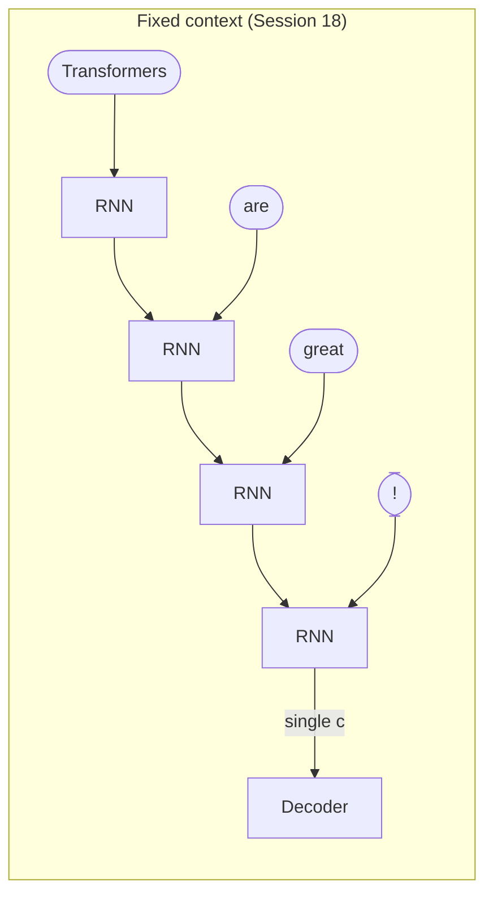
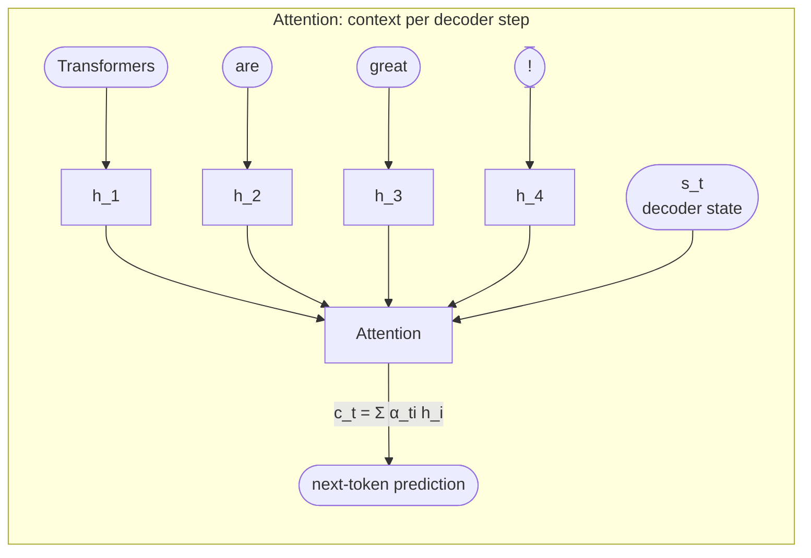
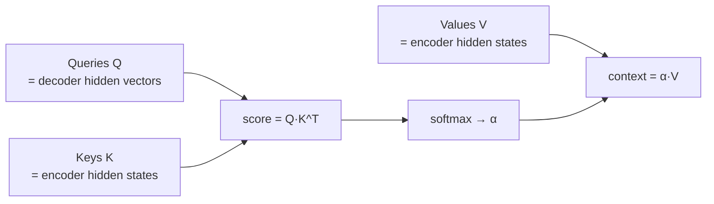
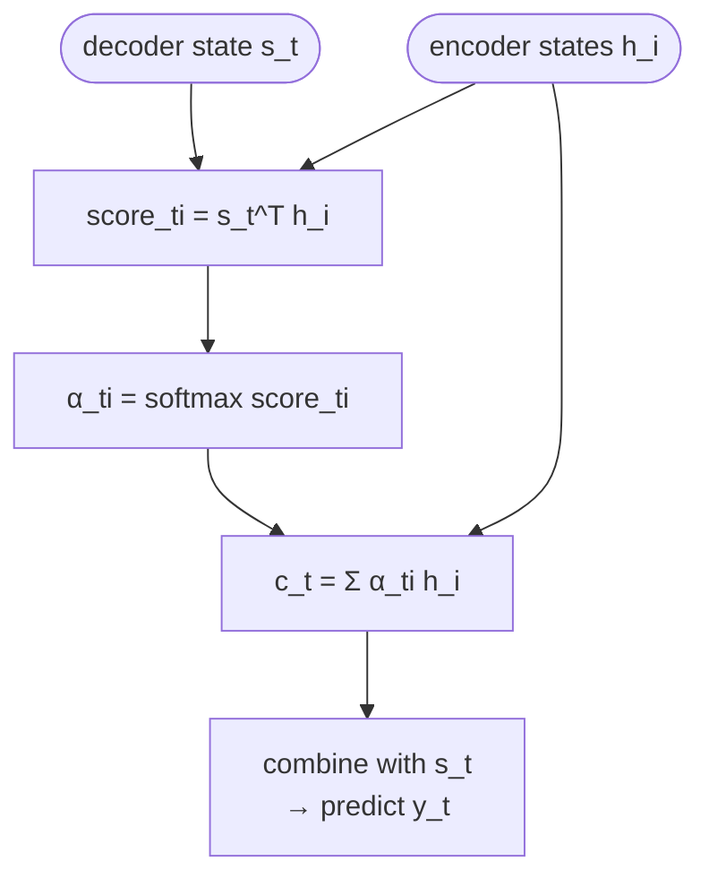
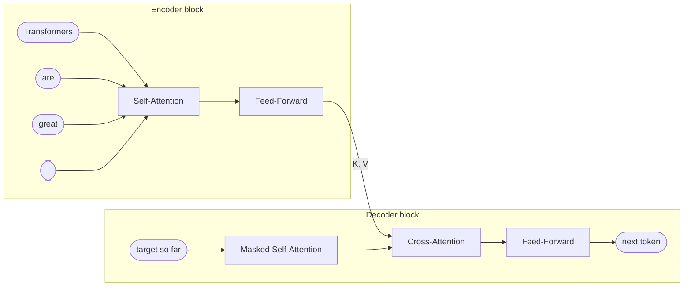
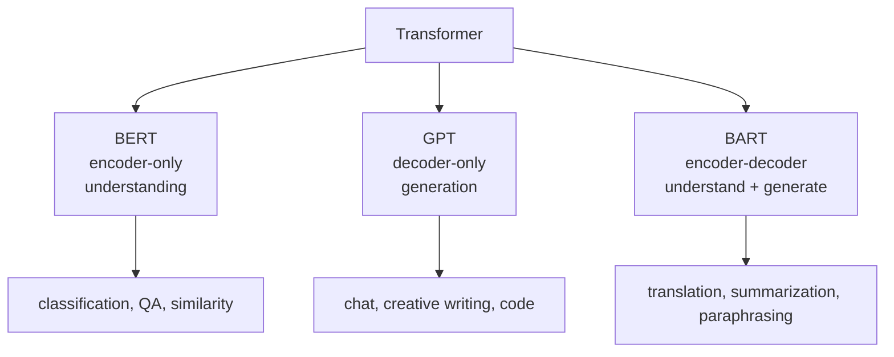

# Lecture 19 — Transformers

## Overview

The architectural revolution. The [[encoder-decoder|encoder-decoder]] of Session 18 had a structural flaw — a **fixed-length context vector** that compresses the entire source into one fixed-size summary, becoming inefficient as sequences grow longer ([[30-Sources/NLP/pdf/Session 19 - Transformers-1.pdf#page=4|slide 4]]). This session resolves that bottleneck in two stages:

1. **[[attention|Attention mechanism]]** ([[30-Sources/NLP/pdf/Session 19 - Transformers-1.pdf#page=4|slides 4–12]]) — replace the fixed context vector with a **dynamic context** $c_t = \sum_i \alpha_{ti} h_i$ computed anew at each decoder step from a weighted sum of all encoder hidden states. Attention scores $\alpha_{ti} = \mathrm{softmax}(s_t^\top h_i)$ reflect the relevance of each input position for the current output step. This still uses an RNN encoder.
2. **[[self-attention|Self-attention]] and [[transformer|transformers]]** ([[30-Sources/NLP/pdf/Session 19 - Transformers-1.pdf#page=13|slides 13–20]]) — remove the RNN entirely. Each token computes Query/Key/Value vectors via learned projections; attention is computed over the entire sequence in parallel. Stacks of self-attention + feed-forward layers form the encoder; masked self-attention + cross-attention + feed-forward form the decoder. The result: massively parallelizable, captures arbitrarily long-range dependencies.

The session ends with the **transformer family**: BERT (encoder-only, representation), GPT (decoder-only, generation), BART (encoder-decoder, both).

The blueprint flags this session as **very high weight** — in fact the highest. The exam tests:
- **Mock Q26 (Exercise 1, 10 pts)**: Attention with 2×2 matrices — compute $QK^\top$, softmax, $\alpha V$ by hand
- **Mock Q30 (Code 2, 10 pts)**: HuggingFace QA fill-in-blanks
- Mock Q14, Q15, Q16, Q17 + Quiz IV Q6–Q12, Q14, Q19 + B variants — attention mechanics, multi-head, positional encoding, causal masking, cross-attention, transformer parallelism

The formula sheet provides $Q = XW_Q$, $K = XW_K$, $V = XW_V$, scores $S = QK^\top$, scaled $QK^\top/\sqrt{d_k}$, weights $\alpha = \mathrm{softmax}(S)$, output $\mathrm{Attention}(Q, K, V) = \alpha V$, and the row-wise softmax $\alpha_i = e^{S_i} / \sum_j e^{S_j}$.

## Key concepts

- [[attention]] — dynamic context as weighted sum of encoder states
- [[self-attention]] — attention applied within a single sequence (no separate encoder/decoder)
- [[scaled-dot-product-attention]] — the standard attention formula with $\sqrt{d_k}$ rescaling
- [[multi-head-attention]] — parallel attention heads with separate $W_Q/W_K/W_V$
- [[positional-encoding]] — restore order information lost by parallel processing
- [[causal-masking]] — prevent decoder from attending to future tokens
- [[cross-attention]] — decoder attends to encoder output (queries from decoder, K/V from encoder)
- [[transformer]] — the full architecture; encoder + decoder stacks
- [[extractive-question-answering]] — predicting span start/end logits with BERT
- [[text-generation-sampling]] — greedy / beam / top-k / temperature

## Equations

**The fixed-context bottleneck (motivation, [[30-Sources/NLP/pdf/Session 19 - Transformers-1.pdf#page=4|slide 4]]):** the basic encoder-decoder uses one $c$ for all decoder steps. Long inputs lose information.

**Bahdanau-style attention ([[30-Sources/NLP/pdf/Session 19 - Transformers-1.pdf#page=7|slide 7]], [[30-Sources/NLP/pdf/Session 19 - Transformers-1.pdf#page=10|slide 10]]):**
$$\mathrm{score}_{ti} = s_t^\top h_i$$
$$\alpha_{ti} = \mathrm{softmax}_i(\mathrm{score}_{ti})$$
$$c_t = \sum_{i=1}^{T} \alpha_{ti}\, h_i$$
where $s_t$ is the decoder hidden state at step $t$ and $h_i$ are the encoder hidden states.

**Scaled dot-product attention (formula sheet + [[30-Sources/NLP/pdf/Session 19 - Transformers-1.pdf#page=14|slide 14]]):**
$$Q = XW_Q, \quad K = XW_K, \quad V = XW_V$$
$$\mathrm{score}_{ij} = q_i \cdot k_j$$
$$\alpha_{ij} = \mathrm{softmax}_j\!\left(\frac{q_i \cdot k_j}{\sqrt{d_k}}\right)$$
$$\mathrm{Attention}(Q, K, V) = \alpha V = \mathrm{softmax}\!\left(\frac{QK^\top}{\sqrt{d_k}}\right) V$$

**Self-attention with positional input ([[30-Sources/NLP/pdf/Session 19 - Transformers-1.pdf#page=14|slide 14]]):**
$$h_i^{(0)} = e_i + p_i$$
$$h_{\mathrm{out}} = \mathrm{LayerNorm}\!\left(\mathrm{LayerNorm}(h_i + c_i) + \mathrm{FFN}(\mathrm{LayerNorm}(h_i + c_i))\right)$$
A residual connection plus LayerNorm wraps the attention block; an FFN block then refines per-position.

**Decoder cross-attention ([[30-Sources/NLP/pdf/Session 19 - Transformers-1.pdf#page=15|slide 15]]):** queries from decoder, K/V from encoder:
$$h_i^{(0),\mathrm{dec}} = e_i(y_{i-1}) + p_i$$
masked self-attention scores $q_i \cdot k_j$ for $j \le i$ (causal mask); cross-attention $\beta_{ij}$ over encoder outputs.

**Output layer ([[30-Sources/NLP/pdf/Session 19 - Transformers-1.pdf#page=11|slide 11]]):**
$$o_t = W_o [s_t; c_t] + b_o$$
$$p_t = \mathrm{softmax}(o_t)$$
concatenate decoder state and context, project, softmax over vocabulary.

## Diagrams

**Why attention beats fixed-context ([[30-Sources/NLP/pdf/Session 19 - Transformers-1.pdf#page=4|slides 4–5]]):**

*Attention computes a fresh context $c_t$ at every decoder step by selecting which encoder positions are relevant — no global summary required.*

**Q, K, V as a key-value store ([[30-Sources/NLP/pdf/Session 19 - Transformers-1.pdf#page=12|slide 12]]):**

*Database analogy: queries look up keys, retrieve weighted values. Encoder is the key-value store; decoder issues queries.*

**Attention computation pipeline ([[30-Sources/NLP/pdf/Session 19 - Transformers-1.pdf#page=10|slide 10]]):**

**Self-attention removes the RNN entirely ([[30-Sources/NLP/pdf/Session 19 - Transformers-1.pdf#page=13|slide 13]]):**

*Encoder: self-attention + FFN. Decoder: masked self-attention + cross-attention + FFN. No recurrence — all positions computed in parallel.*

**Transformer family ([[30-Sources/NLP/pdf/Session 19 - Transformers-1.pdf#page=18|slides 18–19]]):**

## How attention works ([[30-Sources/NLP/pdf/Session 19 - Transformers-1.pdf#page=6|slides 6–10]])

**Intuition ([[30-Sources/NLP/pdf/Session 19 - Transformers-1.pdf#page=6|slide 6]]).** Translating "The transformers are great!" → "¡Los transformers son geniales!" — the choice of "los" vs "el/la/les" requires *context*, not just word identity. The "¡" is a Spanish-specific punctuation rule that must be inferred from grammar. **Word-by-word translation without context fails.** Attention lets the decoder *look back* at the relevant source positions to disambiguate.

**Computation ([[30-Sources/NLP/pdf/Session 19 - Transformers-1.pdf#page=10|slide 10]]):**
1. **Encoder produces** hidden states $h_1, \ldots, h_T$ for each source token (still an RNN at this point in the deck — [[30-Sources/NLP/pdf/Session 19 - Transformers-1.pdf#page=8|slide 8]] says attention initially sits *on top* of an RNN encoder, replacing only the fixed-context vector).
2. **Decoder produces** state $s_t = f(s_{t-1}, y_{t-1}, c_{t-1})$ at each step.
3. **Score** each encoder state against the current decoder state: $\mathrm{score}_{ti} = s_t^\top h_i$.
4. **Normalize** scores into attention weights: $\alpha_{ti} = \mathrm{softmax}_i(\mathrm{score}_{ti})$.
5. **Context** is the weighted sum: $c_t = \sum_i \alpha_{ti} h_i$.
6. **Predict** next token: $o_t = W_o [s_t; c_t] + b_o$, $p_t = \mathrm{softmax}(o_t)$.

The crucial property: a **fresh** context vector at every decoder step, taking all encoder states into account ([[30-Sources/NLP/pdf/Session 19 - Transformers-1.pdf#page=7|slide 7]]).

## Q, K, V ([[30-Sources/NLP/pdf/Session 19 - Transformers-1.pdf#page=12|slide 12]])

The database analogy:
- **Keys $K$** — the hidden states of the encoder used to compute attention scores
- **Values $V$** — the hidden states of the encoder used in the weighted sum (the actual content retrieved)
- **Queries $Q$** — the hidden vectors of the decoder issuing the lookup

> "Think of these names as if you were working with databases: the encoder works like a key-value store, and the attention mechanism looks the query up in its keys and then returns its own value." ([[30-Sources/NLP/pdf/Session 19 - Transformers-1.pdf#page=12|slide 12]])

In the original Bahdanau formulation $K = V$ (both come from encoder hidden states); transformer self-attention generalizes by introducing **separate learned projections** $W_Q, W_K, W_V$.

## Self-attention removes the RNN ([[30-Sources/NLP/pdf/Session 19 - Transformers-1.pdf#page=13|slides 13–15]])

The self-attention idea: **each token attends to all other tokens in the same sequence**, using its own learned $Q, K, V$ projections. There's no recurrence — the model processes all positions in parallel.

**Encoder layer ([[30-Sources/NLP/pdf/Session 19 - Transformers-1.pdf#page=14|slide 14]]):**
1. Input: $h_i^{(0)} = e_i + p_i$ (token embedding + positional encoding)
2. Project: $q_i = W_q h_i$, $k_i = W_k h_i$, $v_i = W_v h_i$
3. Score: $\mathrm{score}_{ij} = q_i \cdot k_j$, scaled by $\sqrt{d_k}$
4. Weights: $\alpha_{ij} = \mathrm{softmax}_j(\mathrm{score}_{ij})$
5. Context: $c_i = \sum_j \alpha_{ij} v_j$
6. Residual + LayerNorm + FFN + LayerNorm:
$$h_{\mathrm{out}} = \mathrm{LayerNorm}\left(\mathrm{LayerNorm}(h_i + c_i) + \mathrm{FFN}(\mathrm{LayerNorm}(h_i + c_i))\right)$$

**Decoder layer ([[30-Sources/NLP/pdf/Session 19 - Transformers-1.pdf#page=15|slide 15]]):** adds two extras to encoder structure:
- **Masked self-attention** — positions $j > i$ are forbidden in scoring (causal mask) so the decoder can't peek at future tokens during training
- **Cross-attention** — queries come from decoder, K/V come from encoder output. This is how the decoder accesses source information.

## Self-attention core properties ([[30-Sources/NLP/pdf/Session 19 - Transformers-1.pdf#page=16|slide 16]])

| Layer | Q, K, V source | Behavior |
|---|---|---|
| **Encoder self-attention** | All from encoder | Each token attends to all other tokens in the input. Output is a sequence of contextualized hidden states (not a single vector). |
| **Decoder masked self-attention** | All from decoder | Each position attends only to **previous** target tokens — enforces autoregressive generation |
| **Cross-attention** | Queries from decoder; K, V from encoder output | Decoder consults the encoder. **No global fixed-length summary** — the context is a sequence. |

## Multi-head attention ([[30-Sources/NLP/pdf/Session 19 - Transformers-1.pdf#page=17|slide 17]])

[[30-Sources/NLP/pdf/Session 19 - Transformers-1.pdf#page=17|slide 17]] lists "Multi-head self-attention" as one bullet inside the encoder/decoder block descriptions; the deck does not expand on the mechanics.

[not in source — supplementary, from Vaswani et al. and mock Q17] Instead of a single attention computation, **multiple heads** run in parallel, each with **separate $W_Q$, $W_K$, $W_V$ projections**. Each head captures a different relational subspace; outputs are **concatenated then projected**. Splits the $d_{\mathrm{model}}$ dimension across $h$ heads.

## Positional encoding ([[30-Sources/NLP/pdf/Session 19 - Transformers-1.pdf#page=14|slide 14]])

Self-attention is **permutation-invariant** — it sees a *set* of tokens, not a sequence. To restore order information, **positional encodings** $p_i$ are added to token embeddings: $h_i^{(0)} = e_i + p_i$ ([[30-Sources/NLP/pdf/Session 19 - Transformers-1.pdf#page=14|slide 14]]). Mock Q16: positional encoding is required because **transformers process tokens in parallel** — no inherent order.

## Transformer architecture ([[30-Sources/NLP/pdf/Session 19 - Transformers-1.pdf#page=17|slide 17]])

**Encoder block** (repeated):
- Multi-head self-attention
- Fully-connected feed-forward layer (per-position)
- Normalization + residual connections (LayerNorm)

**Decoder block** (repeated):
- Multi-head **masked** self-attention (causal mask)
- **Encoder-decoder (cross-)** attention — keys/values from encoder; queries from decoder
- Fully-connected feed-forward layer
- Normalization + residual connections

The **input pipeline** ([[30-Sources/NLP/pdf/Session 19 - Transformers-1.pdf#page=17|slide 17]]): Tokenized text → token embeddings → positional embeddings → encoder stack → key-value store → decoder stack → output token logits.

## Transformer family ([[30-Sources/NLP/pdf/Session 19 - Transformers-1.pdf#page=18|slides 18–19]])

| Model | Architecture | Year | Tasks |
|---|---|---|---|
| **BERT** (Google 2018) | Encoder-only | Bidirectional attention; understands text | Classification, sentence similarity, **extractive QA** |
| **GPT** (OpenAI 2018) | Decoder-only | Autoregressive (causal masked) | Chat, creative writing, code completion, generation |
| **BART** (Meta 2020) | Encoder-decoder | Combines BERT + GPT pretraining | Summarization, translation, paraphrasing |

> "GPT's understanding of the input is statistical, not semantic. Its text production is based on these probabilities, not on an internal understanding of meaning." ([[30-Sources/NLP/pdf/Session 19 - Transformers-1.pdf#page=18|slide 18]])

> "BERT does not define a natural left-to-right generation process, so it cannot be directly used to generate text without modifying its training objective or architecture." ([[30-Sources/NLP/pdf/Session 19 - Transformers-1.pdf#page=19|slide 19]])

## Architecture sizes ([[30-Sources/NLP/pdf/Session 19 - Transformers-1.pdf#page=20|slide 20]])

| Model | Stacks | Heads | Hidden size | Parameters |
|---|---|---|---|---|
| BERT base | 12 | 12 | 768 | 110M |
| GPT-3 | 96 | 96 | 12,288 | 175B |
| ViT-Huge | 32 | 16 | 1,280 | 632M |

## Why transformers replaced RNNs (synthesis)

| Aspect | RNN/LSTM | Transformer |
|---|---|---|
| Sequence dependency | Strictly sequential — $h_t$ requires $h_{t-1}$ | **Parallel** — all positions computed simultaneously |
| Long-range dependencies | Vanishing gradients limit ~5–10 token context | **Direct attention to all positions** — no decay |
| Order handling | Built into recurrence | Requires **positional encoding** |
| GPU utilization | Poor (serial) | Excellent (parallel matrix ops) |
| Mock Q16 false-statement trap | "transformers process strictly sequentially" — **FALSE** | Parallel processing is the whole point |

## Open questions

- **Beam search / temperature / top-k** are not in this deck but are tested in Quiz IV Q15–17 (and B variants). See [[text-generation-sampling]] for these — the prof likely covered them in lecture or supplementary materials. [not in this slide source — sourced from Quiz IV]
- The deck doesn't explicitly walk through a 2×2 attention computation; the formula sheet gives the formulas, and **mock Exercise 1 tests this end-to-end on small matrices** — pure formula-driven arithmetic. Drill this directly: $S = QK^\top$, $S/\sqrt{d_k}$, row-wise softmax, $\alpha V$.
- The deck doesn't cover **HuggingFace QA pipeline literals** — those come from notebook 22. See [[extractive-question-answering]] for the canonical fill-in-blanks skeleton (Mock Q30).

## Notebooks

- [Emotion text classification with `AutoModelForSequenceClassification` (cells 23–69)](30-Sources/NLP/notebooks/19_Text_Classification_and_Hugging_Face.ipynb) — the canonical fine-tuning pipeline for transformer classifiers: `AutoTokenizer` → `padding=True, truncation=True` → `AutoModelForSequenceClassification.from_pretrained(model_ckpt, num_labels=6)` → `Trainer.train()`. Mock Q18, Q20 source. See [[huggingface-text-classification]].
- [Generation strategies — greedy / beam / temperature / top-k / top-p (cells 6–37)](30-Sources/NLP/notebooks/20_Text_Generation.ipynb) — `model.generate()` kwargs: `do_sample`, `num_beams`, `temperature`, `top_k`, `top_p`. Quiz IV Q15–17 source. See [[text-generation-sampling]].
- [BART/T5/Pegasus summarization with `AutoModelForSeq2SeqLM` (cells 27–39)](30-Sources/NLP/notebooks/21_Text_Summarization.ipynb) — encoder-decoder generation with beam search; ROUGE evaluation. See [[huggingface-summarization]].
- [HuggingFace QA pipeline (cells 33–53)](30-Sources/NLP/notebooks/22_Question_Answering.ipynb) — the **mock Q30 source**: `AutoModelForQuestionAnswering.from_pretrained("deepset/minilm-uncased-squad2")`, `return_tensors="pt"`, `with torch.no_grad():`, `outputs.start_logits`, `outputs.end_logits`, `tokenizer.decode(...)`. See [[extractive-question-answering]] for the verbatim skeleton.
