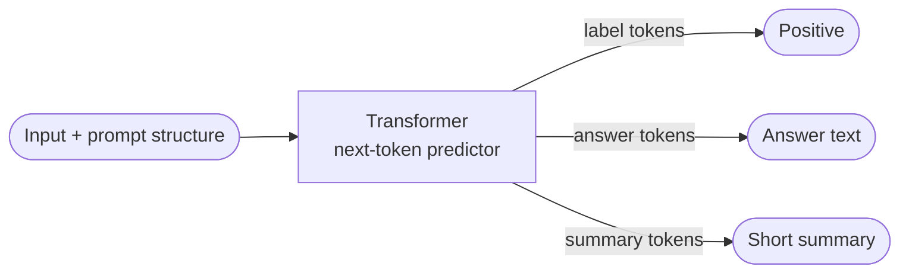
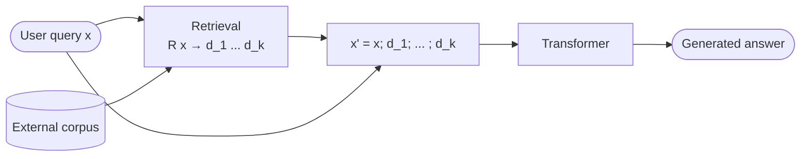
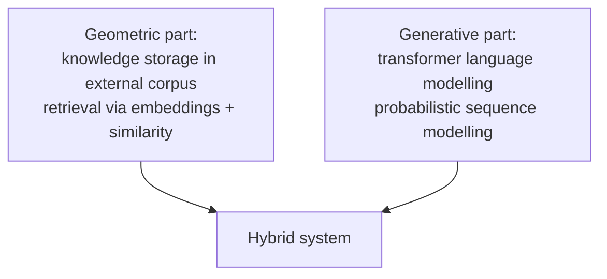

# Lecture 24 — Challenges and Trends

## Overview

The course's coda. Three threads:

1. **The unified view** ([[30-Sources/NLP/pdf/Session 24 - Challenges and futures.pdf#page=4|slides 4–9]]): a transformer is just a **next-token predictor** that defines $p_\theta(w_t \mid w_1, \ldots, w_{t-1})$ — and **classification, question-answering, summarization** are all the *same* task under different prompt patterns and output interpretations. The model never distinguishes between "tasks" in any structural sense; tasks live in **input format and output decoding**, not in the model.
2. **Limits of internal knowledge → RAG** ([[30-Sources/NLP/pdf/Session 24 - Challenges and futures.pdf#page=10|slides 10–13]]): a transformer's information is **frozen in its parameters**. It can't update facts without retraining, can't access external sources at inference, can't distinguish certain from uncertain. **Retrieval-Augmented Generation (RAG)** addresses this by pairing a retrieval step with the generative model — the model now conditions on $x$ **and** retrieved documents $d_1, \ldots, d_k$.
3. **Context-length frontier** ([[30-Sources/NLP/pdf/Session 24 - Challenges and futures.pdf#page=14|slides 14–16]]): self-attention is $O(T^2)$ and operates over a finite window. **Large Context Models (LCMs)** extend the window from $T$ to $T' \gg T$, but the problem becomes **allocation of attention** rather than access — relevance must still be selected within an ever-growing token soup.

Plus a brief look beyond probabilistic sequence modelling: **Reinforcement Learning, Kolmogorov-Arnold networks, Large Concept Models, agentic systems** — directions the course doesn't pursue but that point past the next-token paradigm ([[30-Sources/NLP/pdf/Session 24 - Challenges and futures.pdf#page=17|slide 17]]).

The blueprint flags this session as **low weight**: the only explicit exam target is **mock Q22 — retrieval-based / RAG-style systems**. Everything else is conceptual closure, not exam material per se.

## Key concepts

- [[retrieval-augmented-generation]] — retrieval step + generation; conditions on retrieved external documents (mock Q22)
- [[transformer]] — already the central architecture; here re-framed as a generic next-token predictor
- [[attention]] / [[self-attention]] — the underlying mechanism; quadratic context cost is the LCM constraint

## Equations

**Transformer as joint distribution over a sequence ([[30-Sources/NLP/pdf/Session 24 - Challenges and futures.pdf#page=5|slide 5]]):**
$$p_\theta(w_1, \ldots, w_T) = \prod_{t=1}^{T} p_\theta(w_t \mid w_1, \ldots, w_{t-1})$$
Each conditional is computed via attention-based transformations:
$$h_i = \mathrm{Attention}(x_1, \ldots, x_\tau)_i, \quad z_t = W h_t, \quad p_\theta(w_t \mid \cdot) = \mathrm{softmax}(z_t)$$

**Generation as the unified objective ([[30-Sources/NLP/pdf/Session 24 - Challenges and futures.pdf#page=6|slide 6]]):**
$$y = \arg\max_{w_1, \ldots, w_T} p_\theta(w_1, \ldots, w_T \mid x)$$
Different tasks differ only in **the constraint on the output structure**.

**Classification as generation ([[30-Sources/NLP/pdf/Session 24 - Challenges and futures.pdf#page=7|slide 7]]):** define a finite label set $\mathcal{Y} = \{y_1, \ldots, y_k\}$:
$$\hat{y} = \arg\max_{y_i \in \mathcal{Y}} p_\theta(y_i \mid x)$$

**Question answering as conditional generation ([[30-Sources/NLP/pdf/Session 24 - Challenges and futures.pdf#page=8|slide 8]]):** input is context $c$ + question $q$:
$$\hat{a} = \arg\max_a p_\theta(a \mid q, c)$$

**Summarization as sequence transformation ([[30-Sources/NLP/pdf/Session 24 - Challenges and futures.pdf#page=9|slide 9]]):**
$$\hat{s} = \arg\max_s p_\theta(s \mid x)$$
where $s$ is a shorter sequence. **Compression is not explicitly enforced** — it emerges from training data.

**Retrieval-Augmented Generation ([[30-Sources/NLP/pdf/Session 24 - Challenges and futures.pdf#page=12|slide 12]]):**
$$\hat{y} = \arg\max_y p_\theta(y \mid x, R(x)), \qquad R: x \mapsto \{d_1, \ldots, d_k\}$$
Retrieval $R$ is typically implemented via embeddings $\phi$ and similarity:
$$d_i = \arg\max_{d \in \mathcal{D}} \mathrm{sim}(\phi(x), \phi(d))$$

**Concatenated context ([[30-Sources/NLP/pdf/Session 24 - Challenges and futures.pdf#page=13|slide 13]]):**
$$x' = [x; d_1; \ldots; d_k]$$
The model processes $x'$ as a single sequence.

**Self-attention cost over context length $T$ ([[30-Sources/NLP/pdf/Session 24 - Challenges and futures.pdf#page=14|slide 14]]):**
$$\alpha_{ij} = \frac{\exp(q_i^\top k_j)}{\sum_{j'} \exp(q_i^\top k_{j'})}, \qquad \mathrm{cost} = O(T^2)$$

## Diagrams

**The unified view: one model, many tasks ([[30-Sources/NLP/pdf/Session 24 - Challenges and futures.pdf#page=6|slide 6]]):**

*Different tasks ≠ different models. They are the same model with different input prompts and different output-decoding rules.*

**RAG architecture ([[30-Sources/NLP/pdf/Session 24 - Challenges and futures.pdf#page=11|slide 11]], [[30-Sources/NLP/pdf/Session 24 - Challenges and futures.pdf#page=12|slide 12]]):**

*A retrieval step pulls relevant documents from an external corpus; the transformer generates conditioned on the query AND the retrieved context.*

**The two-component RAG split ([[30-Sources/NLP/pdf/Session 24 - Challenges and futures.pdf#page=12|slide 12]]):**

*Knowledge moves out of the model parameters and into an updatable corpus; the generative model becomes a "reader" rather than the source of truth.*

## Why "different tasks" are the same task ([[30-Sources/NLP/pdf/Session 24 - Challenges and futures.pdf#page=4|slides 4–9]])

> "When we observe current systems, we find that a single model appears to perform a wide variety of tasks. The question is not what new models have been introduced, but how the same underlying mechanism is being used in different ways." ([[30-Sources/NLP/pdf/Session 24 - Challenges and futures.pdf#page=4|slide 4]])

> "This mechanism is **invariant across tasks**: the model does not distinguish between classification, question answering, or summarization. It only produces the next token according to a learned distribution." ([[30-Sources/NLP/pdf/Session 24 - Challenges and futures.pdf#page=5|slide 5]])

The trick is in **interpretation of the output** ([[30-Sources/NLP/pdf/Session 24 - Challenges and futures.pdf#page=6|slide 6]]):
- **Classification** = generate a token, restrict the set of admissible outputs to a label set $\mathcal{Y}$, take argmax ([[30-Sources/NLP/pdf/Session 24 - Challenges and futures.pdf#page=7|slide 7]])
- **Question answering** = generate a sequence conditioned on `[context; question]` ([[30-Sources/NLP/pdf/Session 24 - Challenges and futures.pdf#page=8|slide 8]])
- **Summarization** = generate a shorter sequence conditioned on a longer one ([[30-Sources/NLP/pdf/Session 24 - Challenges and futures.pdf#page=9|slide 9]])

In all cases the model is doing the same thing: $\arg\max_{y_1, \ldots, y_T} p_\theta(y_1, \ldots, y_T \mid x)$. The task lives in the **prompt format and output decoding**, not in the model.

> "The notion of importance is **implicit** in the learned distribution." ([[30-Sources/NLP/pdf/Session 24 - Challenges and futures.pdf#page=9|slide 9]]) — even summarization's "compression" isn't explicit; it emerges from training data.

## Why RAG ([[30-Sources/NLP/pdf/Session 24 - Challenges and futures.pdf#page=10|slides 10–13]])

Internal-only models have **fundamental limitations** ([[30-Sources/NLP/pdf/Session 24 - Challenges and futures.pdf#page=10|slide 10]]):
- Knowledge is **frozen in parameters** — updates require retraining
- Cannot **access external sources** at inference
- Cannot distinguish updated/outdated, certain/uncertain, correct/incorrect
- Outputs only reflect patterns from training data — no structured or verifiable storage of facts

**RAG** is the standard fix:
1. **Retrieval** — embed the query, find the $k$ nearest documents in an external corpus by similarity ([[30-Sources/NLP/pdf/Session 24 - Challenges and futures.pdf#page=11|slide 11]])
2. **Augmentation** — concatenate retrieved docs with the query: $x' = [x; d_1; \ldots; d_k]$ ([[30-Sources/NLP/pdf/Session 24 - Challenges and futures.pdf#page=13|slide 13]])
3. **Generation** — transformer produces output conditioned on the augmented input ([[30-Sources/NLP/pdf/Session 24 - Challenges and futures.pdf#page=12|slide 12]])

Mock Q22: "Which approach combines a retrieval step with generation to incorporate external knowledge?" → **RAG** (Retrieval-Augmented Generation).

> "The model now generates an answer conditioned not only on its internal parameters, but also on retrieved information. This combination of retrieval and generation defines a new paradigm." ([[30-Sources/NLP/pdf/Session 24 - Challenges and futures.pdf#page=11|slide 11]])

## Context length and LCMs ([[30-Sources/NLP/pdf/Session 24 - Challenges and futures.pdf#page=14|slides 14–16]])

Self-attention is **$O(T^2)$** in sequence length ([[30-Sources/NLP/pdf/Session 24 - Challenges and futures.pdf#page=14|slide 14]]):
- Computational cost grows quadratically with context size
- Attention weights become diluted across more tokens — **relevance per token decreases**

**Large Context Models** push $T \to T' \gg T$ ([[30-Sources/NLP/pdf/Session 24 - Challenges and futures.pdf#page=16|slide 16]]):
- Common LCM context windows: 100K, 1M tokens (frontier models)
- The problem **shifts from access to allocation** — even with all tokens visible, the model must **distribute attention** intelligently across millions of positions

Enlarging context buys long-range dependencies but introduces a new constraint: **relevance selection** within a much larger pool.

## Beyond the current frameworks ([[30-Sources/NLP/pdf/Session 24 - Challenges and futures.pdf#page=17|slide 17]])

The transformer + RAG paradigm is "probabilistic sequence modelling". Several research directions extend or replace this view (out of scope):

- **Reinforcement Learning** — sequential decision processes; actions modify state over time
- **Kolmogorov-Arnold Networks** — alternative parameterizations not based on standard MLP/transformer building blocks
- **Large Concept Models (LCMs)** — modify the basic unit of representation away from tokens
- **Agentic systems** — iterative loops where the model is repeatedly applied while interacting with an evolving state, possibly with memory, tools, or intermediate reasoning. **Output emerges through successive transformations**, not a single forward pass.

> "In this setting, models are just components within a loop... The focus is no longer on estimating a single conditional distribution, but on composing multiple evaluations of the same model to solve tasks that cannot be reduced to a single input–output mapping." ([[30-Sources/NLP/pdf/Session 24 - Challenges and futures.pdf#page=17|slide 17]])

## Open questions

- The deck is conceptually rich but **light on exam material**. Mock Q22 (RAG) is the only confirmed test point. The rest of the session is closure and intellectual context.
- The blueprint flags this session as **low weight** — focus exam preparation on Sessions 13–19 and the three exercise patterns.
- The deck doesn't dive into the **practical details** of RAG (chunking strategies, vector databases, reranking, hybrid search). For exam, the key insight is the **two-component split**: retrieval (embeddings + similarity) + generation (transformer). [not in source]
