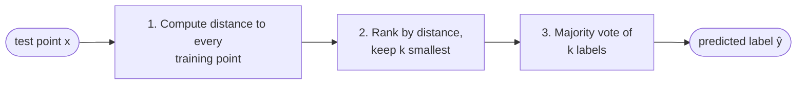
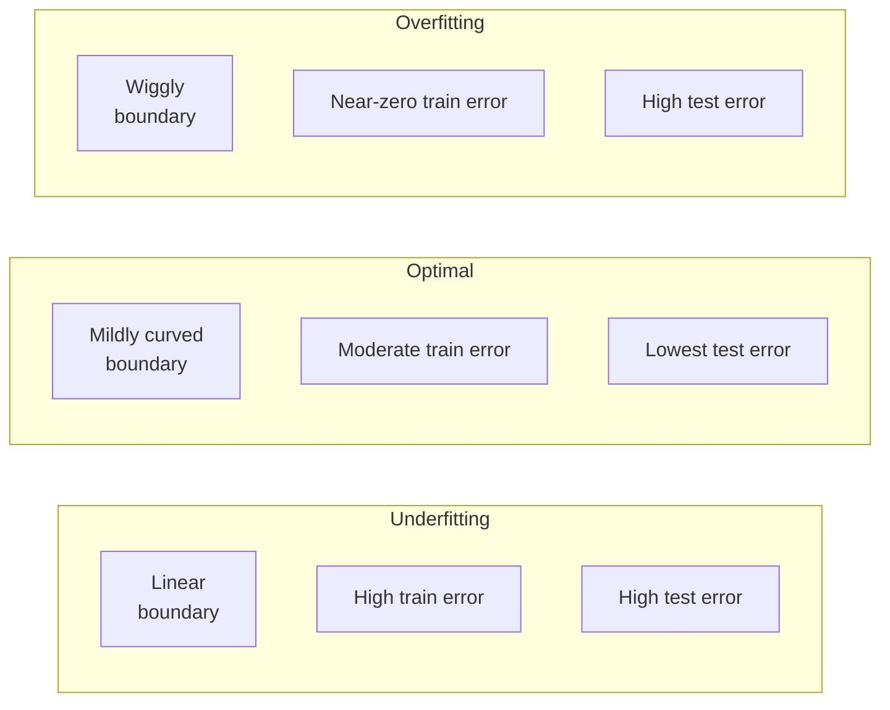
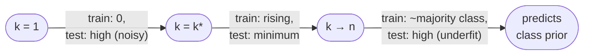
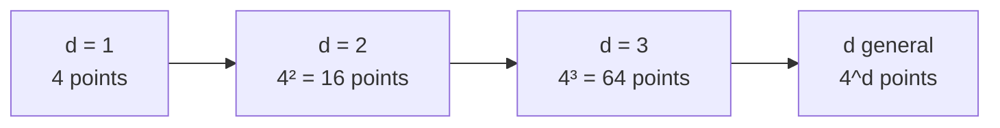

# Lecture 01 — Introduction & k-NN

## Overview

Two-part introduction. Part 1 sets up the **vocabulary of supervised learning** — features/attributes (columns), data points/instances (rows), the levels-of-measurement hierarchy (nominal/ordinal/interval/ratio → categorical vs. numerical), and the supervised-learning task as estimating $f: \mathbf{x} \to y$ from a labelled dataset $\{(\mathbf{x}^{(i)}, y^{(i)})\}_{i=1}^n$. It also previews **regression vs. classification**, **Occam's razor** as the bias for simpler models, and the **underfitting / optimal / overfitting** trichotomy on a 2D classification example.

Part 2 introduces **k-Nearest Neighbours** as the simplest possible learning algorithm and uses it to ground every conceptual hook the rest of the course will use: **distance metrics**, **decision boundaries** (Voronoi cells in the limit), **hyperparameter selection** via train/val/test splits and cross-validation, the bias-variance behaviour of $k$, and the **curse of dimensionality** (formalised in the extra slides).

The lecture's core slogan: *"Learning amounts to simply storing training data"* ([[30-Sources/Statistical-Learning/pdf/SLP-Lec1-knn(1).pdf#page=44|slide 44]]) — kNN is **lazy** / **instance-based**: training is free, all the work happens at query time.

## Key concepts

- [[k-nearest-neighbors]] — predict by majority vote over the $k$ closest training points.
- [[minkowski-distance]] — generic family $\bigl(\sum_r |x_r - z_r|^p\bigr)^{1/p}$; $p=1$ Manhattan, $p=2$ Euclidean.
- [[voronoi-diagram]] — visualises the 1-NN decision regions; each cell is the locus of points closest to one training example.
- [[curse-of-dimensionality]] — distances stop being informative as $d \to \infty$; the kNN assumption that "similar points share labels" breaks down.
- [[overfitting-underfitting]] — $k$ controls the trade-off; small $k$ overfits, large $k$ underfits.
- [[hyperparameter]] — $k$ and the distance metric are *set* not *learned*.
- [[train-validation-test-split]] — three-way split: train fits the model, val selects hyperparameters, test gives an unbiased generalization estimate.
- [[cross-validation]] — rotate the validation fold; average across folds for a more robust estimate.
- [[feature-normalization]] — kNN is scale-sensitive; normalize features before computing distances.

## Equations

**Minkowski distance** with parameter $p$:

$$
\mathrm{dist}(\mathbf{x}, \mathbf{z}) = \left( \sum_{r=1}^{d} |x_r - z_r|^p \right)^{1/p}
$$

- $p=1$: **Manhattan** $\sum_r |x_r - z_r|$.
- $p=2$: **Euclidean** $\sqrt{\sum_r (x_r - z_r)^2}$.

**1-NN classifier** ([[30-Sources/Statistical-Learning/pdf/SLP-Lec1-knn(1).pdf#page=49|slide 49]]):

$$
\mathbf{x}^{*} = \arg\min_{\mathbf{x}^{(i)} \in \text{train}} \mathrm{dist}\!\bigl(\mathbf{x}^{(i)}, \mathbf{x}\bigr), \qquad \hat{y} = t^{*}.
$$

For *ranking* nearest neighbours the $\sqrt{\cdot}$ in Euclidean distance can be skipped — argmin is invariant under monotonic transforms ([[30-Sources/Statistical-Learning/pdf/SLP-Lec1-knn(1).pdf#page=50|slide 50]]).

**z-score normalization** for feature scaling: $\tilde{x}_j = (x_j - \mu_j) / \sigma_j$ ([[30-Sources/Statistical-Learning/pdf/SLP-Lec1-knn(1).pdf#page=86|slide 86]]).

**Test-time complexity:** $O(kdN)$ for kNN — distance to all $N$ training points, each in $\mathbb{R}^d$, plus $k$ retrieval ([[30-Sources/Statistical-Learning/pdf/SLP-Lec1-knn(1).pdf#page=91|slide 91]]).

**Curse of dimensionality formalisation** (extra slides, [[30-Sources/Statistical-Learning/pdf/SLP-Lec1-knn(1).pdf#page=104|slide 104]]). Smallest hypercube in $[0,1]^d$ containing the $k$ nearest neighbours of a test point has edge length

$$
\ell \approx \left(\frac{k}{n}\right)^{1/d}
$$

For $n=1000$, $k=10$: $d=2 \Rightarrow \ell = 0.1$, $d=10 \Rightarrow 0.63$, $d=100 \Rightarrow 0.955$, $d=1000 \Rightarrow 0.9954$. Almost the entire feature space is required to find the 10-NN once $d$ is large.

**Cover-Hart 1967 (extra slides):** as $n \to \infty$, $\epsilon_{1\text{-NN}} \le 2\,\epsilon_{\text{Bayes}}$.

## Diagrams

### kNN algorithm in three steps

### Underfitting / Optimal / Overfitting on a 2D classification problem

Source: [[30-Sources/Statistical-Learning/pdf/SLP-Lec1-knn(1).pdf#page=26|slide 26]] names the three regimes explicitly.

### Train-error vs test-error against k

Pick $k$ at the **minimizer of validation error** ([[30-Sources/Statistical-Learning/pdf/SLP-Lec1-knn(1).pdf#page=85|slide 85]]).

### Voronoi decision regions for 1-NN

The 1-NN decision boundary is the union of perpendicular bisectors between pairs of opposite-class training points. The result is a **Voronoi tesselation** — each cell is the set of query points closest to one training example ([[30-Sources/Statistical-Learning/pdf/SLP-Lec1-knn(1).pdf#page=57|slide 57]]).

### Curse of dimensionality — points-needed-to-cover-a-grid

Same fixed resolution requires *exponentially* more points as $d$ grows ([[30-Sources/Statistical-Learning/pdf/SLP-Lec1-knn(1).pdf#page=95|slide 95]]).

## Practical issues with kNN

Summarised from [[30-Sources/Statistical-Learning/pdf/SLP-Lec1-knn(1).pdf#page=86|slides 86–94]]:

| Issue | Why it bites kNN | Fix |
| --- | --- | --- |
| Different feature scales | Larger-range features dominate the distance | Linearly scale to $[0,1]$, or z-score |
| Irrelevant attributes | Add noise to distances | Drop them, or learn per-feature weights |
| Redundant / correlated attributes | Same fix space gets double-counted | Drop or reweight |
| Class noise | 1-NN happily adopts a mislabelled neighbour | Use $k > 1$ (vote smooths) |
| Test cost | $O(kdN)$ — recomputed for every query | kd-trees (see later), LSH, condensing, dimension subset |
| Storage | All training data must be retained | Condensing, prototype selection |
| High dim | Distances become uninformative | Dimensionality reduction (later course) |

## Mock-exam connections

- **§1d** ("1-NN training error is 0") — true; comes directly from [[30-Sources/Statistical-Learning/pdf/SLP-Lec1-knn(1).pdf#page=75|slide 75]] ("K=1 always works perfectly on training data") and the construction: each training point is its own nearest neighbour.
- **§2c** (which classifiers achieve zero training error on a 2D layout) — k-NN with $k$ small fits any consistent layout exactly; **3-NN** can fail when the true labels look like XOR with one nearby contradicting point.
- See [[exam-blueprint#Topic coverage map]].

## Open questions

- The proof on the extra slides shows 1-NN ≤ 2× Bayes. Does the constant tighten for $k > 1$? The slide deck claims "similar guarantees" without specifying.
- The "we will see this later" comment about kd-trees ([[30-Sources/Statistical-Learning/pdf/SLP-Lec1-knn(1).pdf#page=92|slide 92]]) does not appear to surface in this course's syllabus — confirm whether kd-trees are tested.

## See also

- [[bias-variance-decomposition]] — L11 formalizes the overfitting/underfitting intuition introduced here (small $k$ → high variance; large $k$ → high bias).
- [[curse-of-dimensionality]] — the canonical k-NN failure mode, fully expanded as its own concept note.
- [[principal-component-analysis]] — the L18 method that partially mitigates the curse via dimensionality reduction.
