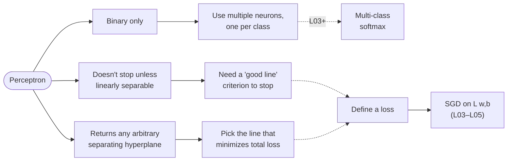
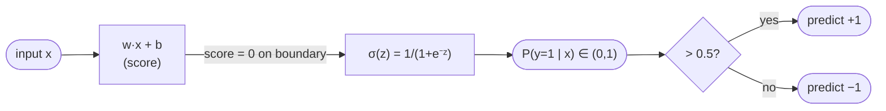
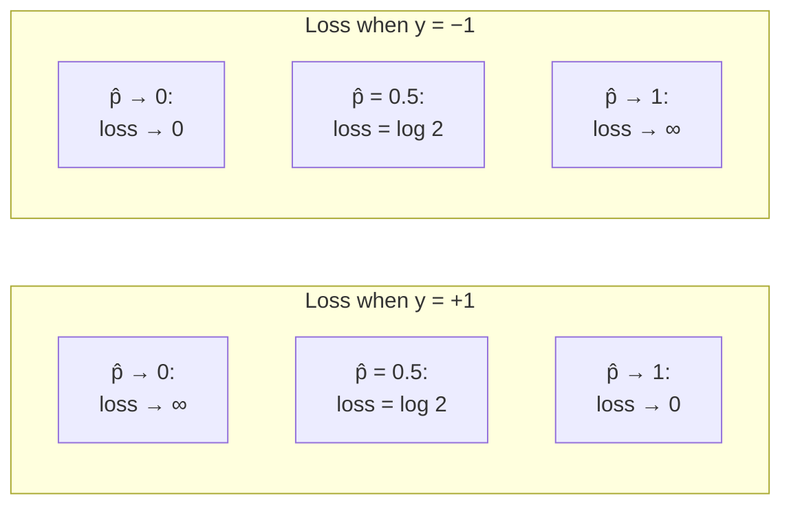
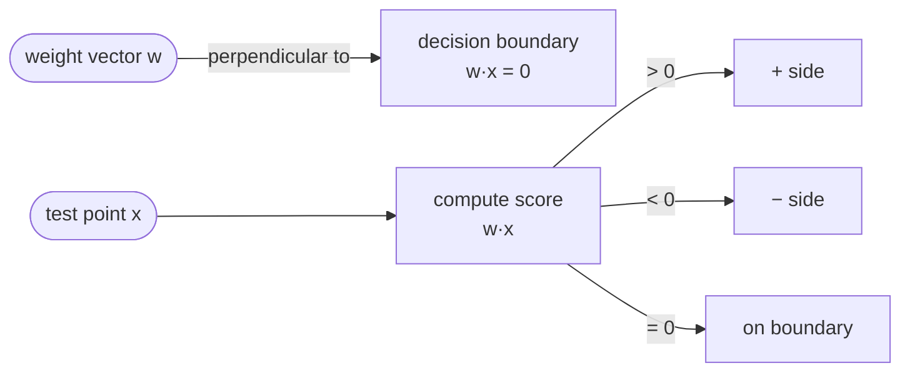

# Lecture 02 — Linear classifiers and the perceptron

## Overview

The lecture starts by listing three **issues with the perceptron** and uses them to motivate a smoother, probabilistic linear classifier. The diagnosis: the perceptron only works for binary classification, doesn't terminate unless the data is linearly separable, and — even when it does converge — returns *any* arbitrary separating hyperplane (some are clearly worse than others) ([[30-Sources/Statistical-Learning/pdf/SLP-lec2(1).pdf#page=2|slide 2]]).

The fix proceeds in two steps. First, replace the hard sign output with a **smooth, monotonic squashing function** so the model can express *confidence*: points far from the boundary should be near $0$ or $1$, points near the boundary near $0.5$. The dot product $w^T x + b$ already provides a "score" that is $0$ on the boundary, positive on one side, negative on the other ([[30-Sources/Statistical-Learning/pdf/SLP-lec2(1).pdf#page=42|slide 42]]); pushing this score through the **sigmoid** $\sigma(z) = 1/(1+e^{-z})$ produces a probability $\hat{y} = P(y=1 \mid x) \in (0, 1)$.

Second, define a **loss** that quantifies how wrong each prediction is and aggregate it across the training set. The lecture sketches the desired single-point loss curve (low when the predicted probability matches the true label, very high when it disagrees confidently), then identifies that curve as **negative log-likelihood = cross-entropy** for a Bernoulli model — equivalently the **logistic loss** when $y \in \{-1, +1\}$. Total loss $\mathcal{L} = \sum_i \ell_i$ measures overall fit; lower is better. *Learning* the best line means **minimizing $\mathcal{L}$ over $w, b$** — we just don't yet know how (that's the bridge to L03–L05).

The deck closes with a Stanford-style **"templates" view**: a linear classifier computes dot products between rows of $W$ ("templates" for each class) and the input $x$ ([[30-Sources/Statistical-Learning/pdf/SLP-lec2(1).pdf#page=72|final slide]]). This frames multi-class extension as the next lecture's hook.

## Key concepts

- [[perceptron]] — review of $y = \mathrm{sign}(w^T x + b)$; this lecture diagnoses its three failure modes.
- [[linear-classifier]] — the unifying object: classifier whose decision rule depends on $w^T x + b$ (with or without a non-linearity on top).
- [[sigmoid]] — squashes the score $z = w^T x + b$ into a probability $\hat{y} \in (0, 1)$.
- [[logistic-regression]] — the resulting model: $\hat{y} = \sigma(w^T x + b)$, decision threshold at $0.5$.
- [[cross-entropy]] — the loss that emerges from the negative-log-likelihood derivation for Bernoulli labels.
- [[logistic-loss]] — the same loss rewritten with $y \in \{-1, +1\}$ as $\log(1 + e^{-y_i (w^T x_i + b)})$.
- [[activation-function]] — sigmoid is one choice; ReLU/tanh come later.

## Equations

**Perceptron decision rule** (review, [[30-Sources/Statistical-Learning/pdf/SLP-lec2(1).pdf#page=30|slide 30]]):

$$
y = \begin{cases} +1 & \text{if } w \cdot x > 0 \\ -1 & \text{otherwise.} \end{cases}
$$

The decision boundary is the line $w \cdot x = 0$, i.e. all $x$ perpendicular to $w$ ($x_2 = -\frac{w_1}{w_2}x_1 - \frac{w_0}{w_2}$ in 2-D, same form as $y = mx + b$).

**Sigmoid** ([[30-Sources/Statistical-Learning/pdf/SLP-lec2(1).pdf#page=42|slide 42]]):

$$
\sigma(z) = \frac{1}{1 + e^{-z}}
$$

Maps $\mathbb{R} \to (0, 1)$; $\sigma(0) = 0.5$; $\sigma'(z) = \sigma(z)(1 - \sigma(z))$.

**Logistic-regression predictor** (formalization, ~slide 47):

$$
\hat{y} = P(y=1 \mid x) = \sigma(w^T x + b), \qquad w \in \mathbb{R}^d,\ b \in \mathbb{R}.
$$

Decision rule at test time: predict $+1$ if $\hat{y} > 0.5$, else $-1$ (or $0$).

**Single-point loss — three equivalent forms.**

Form A — explicit per-class branching (slide 60-ish), with $y \in \{0, 1\}$:

$$
\ell_k = -\big[\,y^{(k)} \log p_k + (1 - y^{(k)}) \log (1 - p_k)\,\big], \qquad p_k = \sigma(w^T x^{(k)} + b)
$$

Form B — compact, in terms of the correct class:

$$
\ell_k = -\log P(y^{(k)} \mid x^{(k)})
$$

Form C — **logistic loss**, with $y \in \{-1, +1\}$ (slide ~67):

$$
\ell_k = \log\!\big(1 + e^{-y^{(k)} (w^T x^{(k)} + b)}\big).
$$

The exponent's sign captures both directions: if $y^{(k)} \cdot \text{score} \gg 0$ (correctly and confidently classified), $\ell_k \to 0$; if $y^{(k)} \cdot \text{score} \ll 0$, $\ell_k$ grows roughly linearly in the score's magnitude.

**Total training loss** ([[30-Sources/Statistical-Learning/pdf/SLP-lec2(1).pdf#page=72|final slides]]):

$$
\mathcal{L}(w, b) = \sum_{i=1}^{N} \ell_i.
$$

Lower is better; usually $\geq 0$. Different lines $\Rightarrow$ different scores $\Rightarrow$ different per-point losses $\Rightarrow$ different $\mathcal{L}$ — so $\mathcal{L}$ defines the optimization surface over $(w, b)$.

## Diagrams

### Three issues with the perceptron and their fixes

The right column is the agenda for L03–L05.

### From score to probability (the sigmoid sandwich)

Source: [[30-Sources/Statistical-Learning/pdf/SLP-lec2(1).pdf#page=42|slide 42]] introduces the sigmoid; the formalization with $\sigma(w^T x + b)$ comes a few slides later (~slide 47).

### Single-point loss curves for $y = +1$ and $y = -1$

The two curves are reflections of each other through $\hat{y} = 0.5$ ([[30-Sources/Statistical-Learning/pdf/SLP-lec2(1).pdf#page=50|slides 50–62]] sketch this geometrically).

### Geometry of the decision rule

In 2-D the boundary $w_0 + w_1 x_1 + w_2 x_2 = 0$ can be rewritten $x_2 = -\frac{w_1}{w_2}x_1 - \frac{w_0}{w_2}$ — same form as $y = mx + b$ ([[30-Sources/Statistical-Learning/pdf/SLP-lec2(1).pdf#page=30|slide 30]]).

## Why the negative-log-likelihood loss is the "right" one

The lecture explicitly identifies the desired loss as **negative log-likelihood** — equivalently **cross-entropy** between the predicted distribution $q$ and the true distribution $p$ over $\{0, 1\}$. The reasoning chain on the slides is:

1. We want a loss whose curve is high when $\hat{y}$ disagrees confidently with the true label and ~$0$ when it agrees confidently.
2. The Bernoulli likelihood of the data given parameters is $L(w,b) = \prod_i p_i^{y_i}(1 - p_i)^{1 - y_i}$.
3. Taking $-\log L$ gives exactly the form A loss. So minimizing the loss = maximizing the likelihood = **MLE**.
4. From an information-theory angle, the same expression is the **cross-entropy** of the predicted distribution from the actual one, $-\sum y_i \log \hat{y}_i$.

The slides credit Bayes (likelihood framing) and Shannon (cross-entropy framing) side-by-side ([[30-Sources/Statistical-Learning/pdf/SLP-lec2(1).pdf#page=55|slides ~54–58]]).

## Templates view (cliffhanger to L03)

Linear classification can be reframed as: rows of $W$ are **per-class templates**, and the score for class $c$ is $\langle W_c, x\rangle + b_c$ — the dot product of the input with the class template. The class with the largest score wins. For binary, that's our $w^T x + b$ with sign. For multi-class, softmax over a $C \times d$ matrix $W$ gives a distribution.

The deck's final image (Stanford-credited) shows three templates for cat / dog / bird and the prediction picking the closest template. **L03 picks up here.**

## Mock-exam connections

- **§1b** ("the model learns ___ representations" — answer: *hierarchical*) — not directly tested by L02 alone, but L02 sets up the *single*-layer story whose limitation justifies depth (L03+).
- **§2c** ("which classifiers can achieve zero training error on the XOR-like point cloud") — *linear* SVM and *logistic regression* (which is what L02 builds) **cannot** achieve zero error on XOR, because the boundary they learn is linear. Memorize this — it's the L02 → L03 transition.
- **§1k** ("SGD updates *per example*, not per epoch") — the *training* loop that minimizes the $\mathcal{L}$ defined here lives in L03–L05; L02 just defines the objective.
- See [[exam-blueprint#Topic coverage map]].

## Open questions

- The deck does not derive *how* to optimize $\mathcal{L}(w, b)$ — that's L03–L05 (gradient descent / backprop). Worth noting in margin: there is no closed-form solution for logistic regression, unlike OLS regression.
- The "logistic loss" on slide ~67 with $y \in \{-1, +1\}$ is *the same* loss as cross-entropy with $y \in \{0, 1\}$, just rewritten — confirm the equivalence by hand by substituting $y_{\pm} = 2y_{01} - 1$ if exam asks to translate between them.

## See also

- [[hinge-loss]] — L09's choice for the SVM, used in §6 with the slack formulation.
- [[support-vector-machine]] — L09 picks the *max-margin* linear classifier from this lecture's hypothesis class; L15–L16 kernelize it.
- [[logistic-loss]] — the convex surrogate this lecture introduces alongside the perceptron loss.
