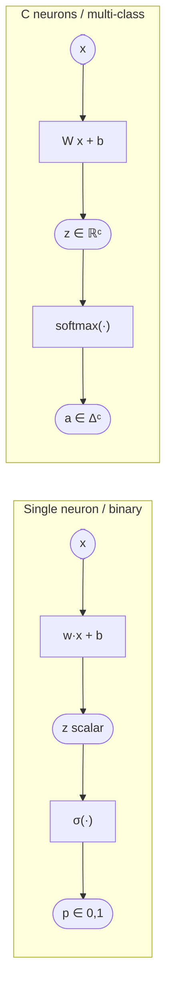
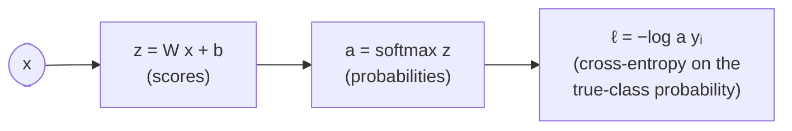
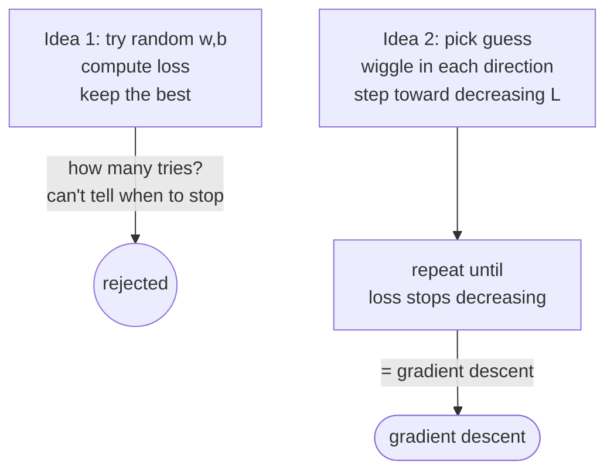
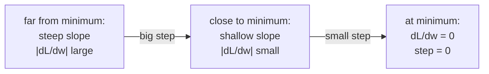
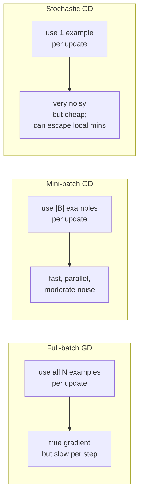
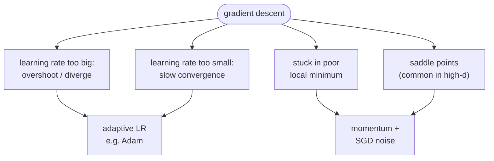
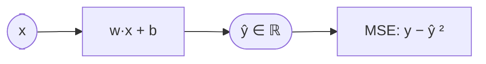

# Lecture 03 — Introduction to neural nets

## Overview

Three big steps that take L02's single sigmoid neuron and turn it into a trainable, multi-class, regression-or-classification machine.

**Step 1 — multi-class via stacking neurons.** Replace the weight *vector* $w \in \mathbb{R}^d$ with a weight *matrix* $W \in \mathbb{R}^{C \times d}$ where each row is a "neuron" / per-class **template**. The forward pass becomes $z = W x + b$, $z \in \mathbb{R}^C$. Each row specializes — geometrically, each row points toward "its" class and is normal to that class's separating hyperplane. Reshape a row back into image dimensions and you can literally *see* the class template. But raw scores $z$ aren't probabilities (they don't sum to 1, can be negative), so we apply the **softmax** to turn $z$ into a class distribution: $a_c = e^{z_c}/\sum_{c'} e^{z_{c'}}$. The pairing softmax + cross-entropy is identical in form to L02's binary log-loss; binary softmax with one logit set to zero *is* the sigmoid.

**Step 2 — optimization: how to actually find $W, b$.** L02 defined the loss but stopped short of telling us how to minimize it. L03 builds **gradient descent** from scratch. Reject random search ("Idea 1: try values, see which is lower") as wasteful; instead use the slope of the loss to know which direction lowers it locally ("Idea 2: pick a guess, wiggle, step toward decreasing loss, repeat"). In one parameter, that's the negative derivative; in multiple parameters, the negative gradient. The lecture shows that step size *automatically gets smaller* near the minimum because the gradient itself shrinks — gradient descent is "cleverer than it looks."

**Step 3 — practical optimization: SGD.** Full-batch GD is unusable on real datasets because each update requires a full pass over $N$ examples. **Mini-batch / stochastic gradient descent** uses a small random subset (or a single example) per update. Noisy updates can *help* — they zigzag out of shallow local minima. SGD comes with the per-example update semantics that mock §1k tests: updates happen *per example* (or per mini-batch), not per epoch. The lecture closes by foreshadowing momentum, second-order methods, and adaptive learning rates as fixes for plain SGD's failure modes (slow convergence, saddle points in high dim, poor local minima).

A final coda shows that **linear regression** drops out of the same neuron model: just remove the sigmoid (regression outputs real numbers, not probabilities) and swap cross-entropy for **mean squared error** $\ell_i = (y_i - \hat{y}_i)^2$.

## Key concepts

- [[softmax]] — the multi-class generalization of sigmoid; turns scores into a valid probability distribution.
- [[cross-entropy]] — the multi-class loss; equals $-\log p_{\text{true class}}$ when labels are one-hot.
- [[gradient-descent]] — minimize $\mathcal{L}(\theta)$ by stepping in the direction of $-\nabla \mathcal{L}$.
- [[stochastic-gradient-descent]] — gradient descent with mini-batch / single-example sampling; noisy but cheap and helps escape local minima.
- [[linear-regression]] — same neuron, no activation, MSE loss; predicts real-valued targets.
- [[mean-squared-error]] — $\ell_i = (y_i - \hat{y}_i)^2$; the regression loss.
- [[linear-classifier]] — extended to multi-class via the matrix-template view.
- [[activation-function]] — sigmoid here, but L04+ swaps to ReLU/tanh for hidden layers.

## Equations

**Binary recap (last lecture):** $z = w^T x + b$, $\hat{y} = \sigma(z)$.

**Multi-class scores.** With $C$ classes:

$$
z = W x + b, \quad W \in \mathbb{R}^{C \times d},\ b \in \mathbb{R}^C, \quad z \in \mathbb{R}^C.
$$

Equivalently $z_c = W_c \cdot x + b_c$ — score for class $c$ is the dot product of $x$ with $W$'s $c$-th row (the class template).

**Softmax.** For a score vector $z$:

$$
a_c = \mathrm{softmax}(z)_c = \frac{e^{z_c}}{\sum_{c'=1}^{C} e^{z_{c'}}}, \qquad a_c > 0,\ \sum_c a_c = 1.
$$

Reduces to the sigmoid for $C = 2$ (with one logit fixed at $0$).

**Multi-class cross-entropy loss.** With one-hot true label $y$ pointing at the correct class index $y_i$:

$$
\ell_i = -\log a_{y_i} \;=\; -\log\!\frac{e^{z_{y_i}}}{\sum_{c'} e^{z_{c'}}}.
$$

Only the correct-class term contributes — the softmax constraint $\sum a_c = 1$ ties up the rest. Total loss $\mathcal{L} = \sum_i \ell_i$.

**Gradient descent update** in 1D:

$$
w_1^{t+1} = w_1^{t} - \eta \, \frac{d\mathcal{L}}{dw_1}\bigg|_{w_1^t}, \qquad \eta > 0\ \text{(learning rate)}.
$$

Multi-dim:

$$
\theta^{t+1} = \theta^{t} - \eta \, \nabla_\theta \mathcal{L}(\theta^{t}).
$$

**SGD update.** Replace the true gradient with a stochastic estimate from a mini-batch $B \subset \{1, \dots, N\}$:

$$
\theta^{t+1} = \theta^{t} - \eta \, \frac{1}{|B|}\sum_{i \in B} \nabla_\theta \ell_i(\theta^{t}).
$$

For pure SGD, $|B| = 1$; for full-batch GD, $|B| = N$.

**Linear regression.** Drop the activation, predict a real number:

$$
\hat{y}_i = w^T x_i + b, \qquad \ell_i = (y_i - \hat{y}_i)^2, \qquad \mathcal{L} = \frac{1}{N}\sum_{i=1}^{N}(y_i - \hat{y}_i)^2.
$$

## Diagrams

### One neuron → many neurons (the matrix view)

Each row of $W$ is a separate "neuron" specializing in one class — equivalent to running $C$ binary perceptrons in parallel and then renormalizing their outputs ([[30-Sources/Statistical-Learning/pdf/SLP-lec3(1).pdf#page=20|slides ~15–35]]).

### Softmax + cross-entropy = single object

Source: [[30-Sources/Statistical-Learning/pdf/SLP-lec3(1).pdf#page=55|slides ~55–65]] — the lecture explicitly notes that the binary case (sigmoid + binary log-loss from L02) is exactly $C = 2$ of this pipeline.

### Idea 1 vs Idea 2: random search vs gradient descent

Source: [[30-Sources/Statistical-Learning/pdf/SLP-lec3(1).pdf#page=80|slides ~75–105]] develops this contrast over many build-up frames.

### Why step size shrinks automatically near the minimum

The factor of $|dL/dw|$ in the update rule means convergence naturally decelerates ([[30-Sources/Statistical-Learning/pdf/SLP-lec3(1).pdf#page=145|slides ~145–155]]).

### Batch vs mini-batch vs stochastic GD

Source: [[30-Sources/Statistical-Learning/pdf/SLP-lec3(1).pdf#page=160|slides ~160–175]].

### Failure modes of plain gradient descent

The lecture previews these fixes (momentum, 2nd-order methods, adaptive step size) without deriving them — those land in L05–L07.

### Linear regression as a neuron with the sigmoid removed

Source: [[30-Sources/Statistical-Learning/pdf/SLP-lec3(1).pdf#page=180|slides ~178–185]].

## Why softmax + cross-entropy is "the same loss function" as L02

The lecture explicitly notes that **binary classification with sigmoid + log-loss** from L02 is the **C = 2 special case** of softmax + cross-entropy ([[30-Sources/Statistical-Learning/pdf/SLP-lec3(1).pdf#page=70|slides ~65–75]]). Two ways to see it:

1. *Symbolic*: write softmax with two logits, normalize, simplify — you get $\sigma(z_1 - z_2)$. Setting $z_2 = 0$ gives back $\sigma(z_1)$.
2. *Practical*: a binary problem only needs *one* output (the other probability is $1 - p$), so a sigmoid uses fewer parameters than a redundant 2-class softmax. Either choice is mathematically the same model.

So the **whole story is one model**: linear scores → softmax → cross-entropy. Sigmoid is a bookkeeping shortcut for $C = 2$.

## Why noisy SGD can escape local minima

A pretty pictures argument from the lecture ([[30-Sources/Statistical-Learning/pdf/SLP-lec3(1).pdf#page=165|slides ~165–175]]): full-batch GD always steps in the direction of the *true* gradient. If that true gradient points into a local well, you're stuck. SGD's gradient is a *random sample* — its expectation is the true gradient, but each individual step has noise that can carry $\theta$ over the lip of a shallow well. So SGD is *both* an efficiency hack (cheap updates) *and* a regularizer (escapes shallow minima). It can also need more total iterations because each step is noisy.

## Mock-exam connections

- **§1b** ("the model learns *hierarchical* representations") — L03 builds *one* layer of neurons; the *hierarchy* needs depth (L04). But the matrix-template view here is the bedrock that L04 stacks.
- **§1k** ("SGD updates per example, not per epoch") — directly tested. The lecture's SGD slides establish that an "iteration" in SGD = one mini-batch (or one example) update, **not** one full sweep over the data.
- **§1j** ("the loss surface depends on the training data") — true; the lecture shows multiple times that different lines $\Rightarrow$ different losses, and the loss landscape is computed from the dataset.
- **§2a** (curves of train/test error vs. $N$) — L11 territory, but the GD machinery here is what makes the train-error curve actually descend.
- **§2c** (which classifiers achieve zero error on XOR) — softmax-over-linear-scores still produces a *linear* boundary. Cannot solve XOR. Multi-class extension doesn't fix non-linearity — that needs L04's hidden layer.
- See [[exam-blueprint#Topic coverage map]].

## Open questions

- The lecture says "we may look at [momentum / 2nd-order / Adam] in more detail later" — confirm whether Adam etc are actually tested or only mentioned. Mock blueprint suggests they're peripheral.
- Convexity of softmax + cross-entropy as a function of $W$ — the deck claims "convex loss functions are great" and credits Jensen's inequality without explicitly proving the claim. Worth confirming during exam prep.
- Saddle-point handling — slides hint that saddles are *more* common than local minima in high dimensions. The proof / intuition isn't covered; might appear in L07.

## See also

- [[backpropagation]] — L05 fills in the gradient computation only sketched here.
- [[weight-initialization]] — L06 explains why the symmetry-breaking choice matters and how Xavier / He scale it.
- [[gradient-descent]] — the optimizer this lecture introduces and L05–L07 elaborate.
