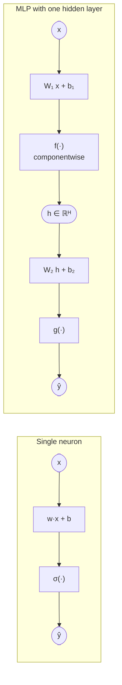
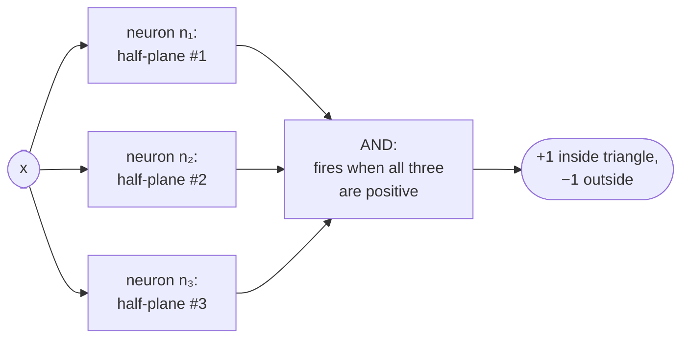
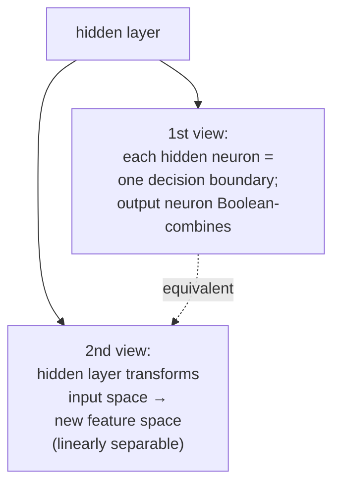
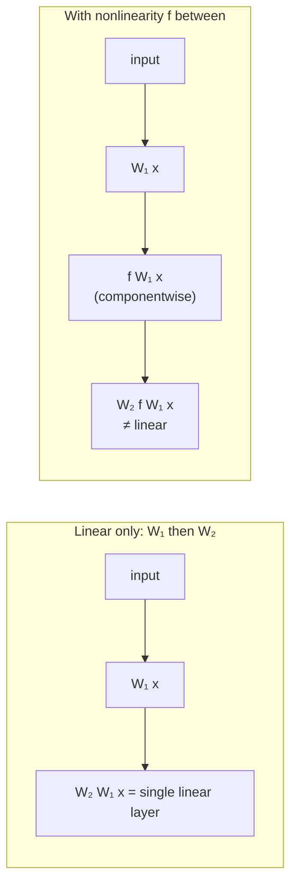
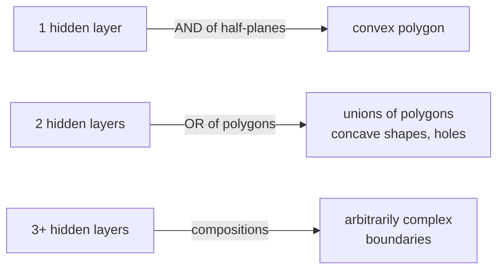
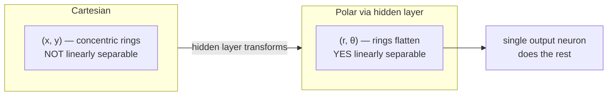

# Lecture 04 — Multi-layer perceptrons

## Overview

L04 fixes the linear-classifier problem L02–L03 left dangling: **a single neuron (or any single linear layer) can't solve simple problems whose decision boundary isn't a hyperplane** (XOR, donut-vs-disk, etc.). The fix: **stack neurons in layers**, with non-linear activations in between, and the resulting *multi-layer perceptron* (MLP) can express arbitrarily complex decision boundaries.

The lecture builds the intuition in three stages.

**Stage 1 — combining neurons by hand to fit non-separable data.** Three "bad" linear neurons, each a poor classifier on its own, can be combined via an AND output neuron to carve out a triangular positive region. Two neurons + an OR output can carve out a different shape. The pattern: *each hidden neuron defines a half-plane; the output neuron Boolean-combines those half-planes into the final decision.* This is the **first view** of a hidden layer — multiple decision boundaries combined logically.

**Stage 2 — the feature-transformation view.** Worked through with the bear-cub-on-a-disk and Cartesian → polar analogy. A non-separable problem in $(x_1, x_2)$ may become separable in some transformed feature space $(r, \theta)$ — and a *linear* classifier in the transformed space corresponds to a *non-linear* classifier in the original space. **The hidden layer learns this transformation.** This is the **second view** — points come in non-separable in input space and get pushed through the hidden layer into a new space where a single output neuron can carve them apart with a hyperplane.

**Stage 3 — why the activation must be non-linear.** Without an activation function, every hidden layer just computes a linear transform of its input. Linear transforms can only *rotate, reflect, scale, shear* — they preserve grid-line parallelism and even spacing. So composing many linear layers still gives a linear function: $W_2 W_1 x = (W_2 W_1) x$. The expressive power of depth comes entirely from the **non-linear activations between layers**. Sigmoid works; ReLU is cheaper to compute and has better gradient properties; the choice is L06's topic, but L04 establishes that *some* non-linearity is mandatory.

The lecture closes with **depth**: one hidden layer is theoretically sufficient (universal approximation), but in practice deeper networks are easier to train with SGD and require fewer total neurons because they decompose the problem into reusable parts. Visualization: 1 hidden layer can carve out *convex polygons*, 2 hidden layers can carve out *compositions of polygons* (concave shapes, holes), 3+ hidden layers compose those further. Depth is what unlocks "hierarchical representations" — the §1b mock-exam answer.

## Key concepts

- [[multilayer-perceptron]] — the model: stack of (linear → non-linear) layers.
- [[activation-function]] — the non-linearity *between* layers; without it, depth adds nothing.
- [[relu]] — the modern default activation for hidden layers; introduced briefly here, detailed in L06.
- [[hidden-layer]] — intermediate layer between input and output; learns the feature transformation.
- [[universal-approximation-theorem]] — single hidden layer is enough in theory; depth wins in practice.
- [[linear-classifier]] — what a single neuron is; what the *output* layer of an MLP still is, on top of the learned features.
- [[gradient-descent]] / [[stochastic-gradient-descent]] — how MLPs are trained (mechanics in L05).

## Equations

**One-hidden-layer MLP** (the canonical L04 form):

$$
h = f\big(W_1 x + b_1\big), \qquad \hat{y} = g\big(W_2 h + b_2\big),
$$

where $f$ is the **hidden activation** (sigmoid, $\tanh$, ReLU) applied **componentwise**, and $g$ is the **output activation** (sigmoid for binary, softmax for multi-class, identity for regression).

Shapes: $x \in \mathbb{R}^d$, $W_1 \in \mathbb{R}^{H \times d}$, $b_1 \in \mathbb{R}^H$, $h \in \mathbb{R}^H$, $W_2 \in \mathbb{R}^{C \times H}$, $b_2 \in \mathbb{R}^C$, $\hat{y} \in \mathbb{R}^C$.

$H$ = **width** of the hidden layer. More $H$ ⇒ more complex boundaries.

**Why activation is mandatory:** without $f$,

$$
W_2 (W_1 x + b_1) + b_2 = (W_2 W_1) x + (W_2 b_1 + b_2),
$$

which is a *single* linear layer with weight matrix $W_2 W_1$ — exactly the L02–L03 model. No expressivity gained.

**Multi-layer extension:**

$$
x^{(0)} = x, \qquad x^{(k+1)} = f\big(W^{(k)} x^{(k)} + b^{(k)}\big), \qquad \hat{y} = g\big(W^{(L)} x^{(L)} + b^{(L)}\big).
$$

Number of hidden layers = **depth** of the network.

## Diagrams

### Single neuron vs. hidden layer + output neuron

The hidden layer's $H$ neurons each compute their own affine score from the *raw* input; the output layer computes its score from the *transformed* representation $h$ ([[30-Sources/Statistical-Learning/pdf/SLP-04(1).pdf#page=20|slides ~15–25]]).

### Combining neurons by hand: 3 half-planes + AND → triangle

Each $n_i$'s decision boundary is one side of the triangle; the AND output is positive only inside the intersection of three positive half-planes ([[30-Sources/Statistical-Learning/pdf/SLP-04(1).pdf#page=10|slides ~10–17]]).

### Two views of the hidden layer

Source: [[30-Sources/Statistical-Learning/pdf/SLP-04(1).pdf#page=50|slides ~45–55]] explicitly draws both views side-by-side and notes they describe the *same* network.

### Why we need a non-linear activation

Linear transforms preserve grid-line parallelism and spacing — *only* rotation, reflection, scaling, shearing. Composing many linear maps still yields a linear map. **Non-linear activation is what makes depth expressive** ([[30-Sources/Statistical-Learning/pdf/SLP-04(1).pdf#page=70|slides ~65–80]]).

### Depth → boundary complexity

Source: [[30-Sources/Statistical-Learning/pdf/SLP-04(1).pdf#page=95|slides ~93–98]] (Touretzky / Johnson visualization).

### Polar-coordinate analogy: a hidden layer that does the work

Source: [[30-Sources/Statistical-Learning/pdf/SLP-04(1).pdf#page=35|slides ~30–45]]. The lecture uses this to argue the *second view*: the hidden layer's job is to find a feature space where the data *is* linearly separable; the output layer is then "just" a single linear classifier in that learned space.

## Why the hidden activation can't be softmax

L04 explicitly rules out softmax for hidden layers ([[30-Sources/Statistical-Learning/pdf/SLP-04(1).pdf#page=27|slides ~26–29]]):

> *"Softmax? Only makes sense for output layer (combining outputs into prob. distribution)."*

Softmax couples its outputs through the normalizing constant — the hidden representation should be a richer, possibly multi-modal, vector of features, not a one-hot-ish probability distribution. Sigmoid (component-wise, $(0,1)$) and $\tanh$ (component-wise, $(-1,1)$) and ReLU (component-wise, $[0,\infty)$) all preserve per-component independence, which is what hidden representations need.

## Choosing hidden-layer width

[[30-Sources/Statistical-Learning/pdf/SLP-04(1).pdf#page=89|Slides ~87–91]]: "More hidden units = more complex decision boundaries." The lecture doesn't give a closed formula — empirical choice via cross-validation. Trade-off: more units → more expressive power, more parameters, more risk of overfitting.

## Why depth helps even though one hidden layer suffices in theory

Universal approximation says **one hidden layer with arbitrarily many units can approximate any continuous function** — see [[universal-approximation-theorem]]. So why use more?

[[30-Sources/Statistical-Learning/pdf/SLP-04(1).pdf#page=92|Slides ~92–98]]:

1. **Easier to find with SGD.** The loss landscape of a deep, narrow network is empirically easier to optimize than a shallow, wide one — even though they're theoretically equivalent in expressive power.
2. **Fewer total neurons.** A shape that requires $\Omega(2^d)$ width-1-hidden-layer neurons can often be expressed with $O(d)$ neurons distributed across a few layers — depth gives **exponential parameter efficiency** for compositional problems.
3. **Hierarchical representations** (mock §1b answer). Each layer learns features built on the previous layer's features; matches the structure of natural data (edges → textures → object parts → objects).

## Mock-exam connections

- **§1b** (the model learns ___ representations → *hierarchical*) — directly answered by L04. Depth is what lets representations be hierarchical; a single hidden layer doesn't yet.
- **§2c** (which classifiers achieve zero training error on XOR) — answer for "single-hidden-layer MLP": **yes**, because XOR can be split into two linear half-planes that get OR-combined. This lecture's combining-neurons-by-hand worked example is essentially the manual XOR construction.
- See [[exam-blueprint#Topic coverage map]].

## Open questions

- The lecture mentions ReLU and "good gradient properties" but doesn't derive them — that's L06 territory. Worth confirming what *exactly* the gradient property is (vanishing-gradient resistance for $z > 0$).
- The "in practice, more layers are easier to find with SGD" claim is empirical, not proven. The mock blueprint may not test it directly, but the prof might phrase a §1 conceptual question around it.
- No mention of regularization specifically for MLPs (dropout, weight decay) — defer to L10.
