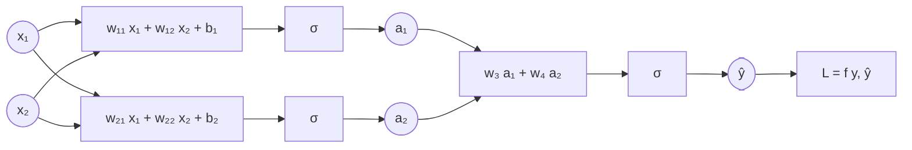
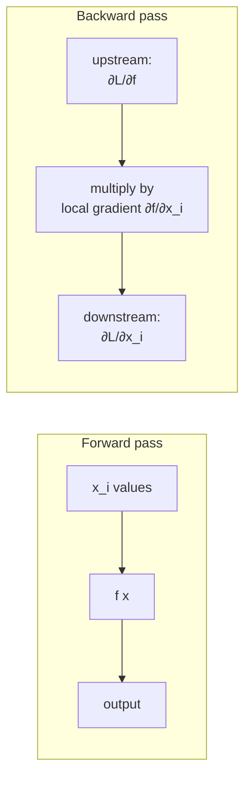
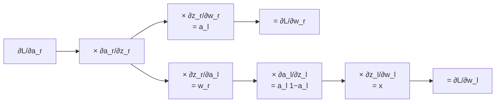
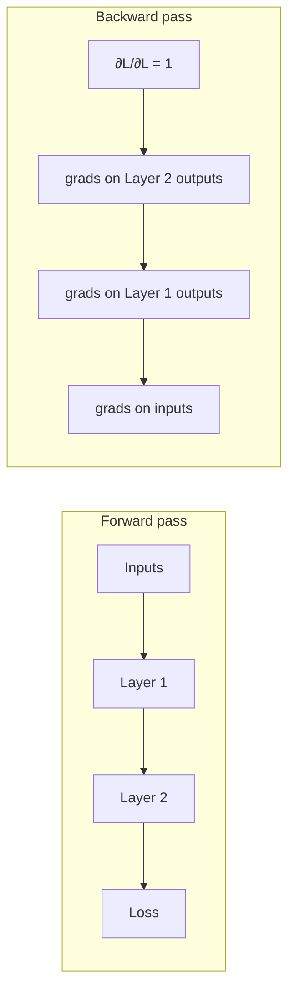
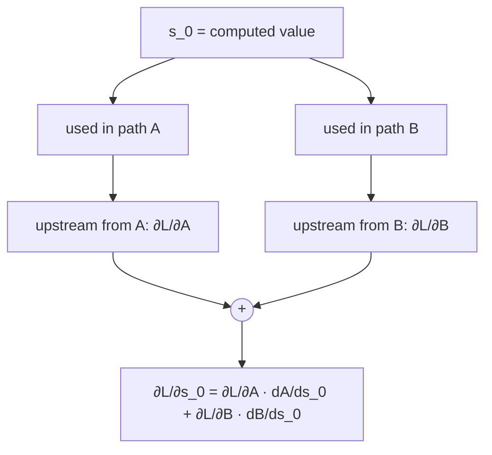

# Lecture 05 — Backpropagation

## Overview

L02 defined the loss. L03 said "minimize it with gradient descent." L04 stacked neurons into deep MLPs. **L05 explains how to actually compute the gradient through a deep network** — the missing engine that makes everything else trainable.

The lecture builds the algorithm in two stages.

**Stage 1 — chain rule on a toy two-neuron network.** The forward pass of a two-layer network with sigmoid activations and a single output is a deeply *nested* function — even with two neurons it expands to something like

$$
\hat{y} = \sigma\!\big(w_3\,\sigma(w_{11}x_1 + w_{12}x_2 + b_1) + w_4\,\sigma(w_{21}x_1 + w_{22}x_2 + b_2)\big).
$$

Naively writing $\partial \mathcal{L}/\partial w$ for each weight gives a different, ugly closed-form expression for each — and it gets worse as the network grows. The chain rule cleans this up. With named intermediates ($z_l, a_l, z_r, a_r$ left/right pre-activations and activations), each weight's gradient is a *product* of local derivatives along the path from that weight to the loss:

$$
\frac{\partial \mathcal{L}}{\partial w_r} = \frac{\partial \mathcal{L}}{\partial a_r} \cdot \frac{\partial a_r}{\partial z_r} \cdot \frac{\partial z_r}{\partial w_r}.
$$

For the deeper weight $w_l$ the chain extends further:

$$
\frac{\partial \mathcal{L}}{\partial w_l} = \frac{\partial \mathcal{L}}{\partial a_r} \cdot \frac{\partial a_r}{\partial z_r} \cdot \frac{\partial z_r}{\partial a_l} \cdot \frac{\partial a_l}{\partial z_l} \cdot \frac{\partial z_l}{\partial w_l}.
$$

Each individual factor is **simple**: for sigmoid, $\partial a / \partial z = a(1 - a)$; for the squared-error loss, $\partial \mathcal{L}/\partial a_r = a_r - y$; for the affine score, $\partial z / \partial w = a_{\text{prev}}$. The headline observation: the two gradients **share common prefix terms** — $\partial \mathcal{L}/\partial w_l$ is just $\partial \mathcal{L}/\partial w_r$ extended further. **Cache the shared work** as you sweep backward, and the cost of computing all gradients is comparable to one forward pass. That cache-and-sweep is the **"back"** in backpropagation.

**Stage 2 — computational graphs and automatic differentiation.** For arbitrary architectures (not just two sigmoid neurons in series), L05 reframes backprop in terms of a **computational graph**: nodes are operations, edges carry intermediate values. Each node needs only its **local gradient** (the gradient of its output w.r.t. its inputs); the chain rule glues local gradients into global ones. The backward pass:

1. **Receive** an upstream gradient on the node's output: $\partial \mathcal{L}/\partial f$.
2. **Multiply** by the local gradient: $\partial f/\partial x_i$.
3. **Send** $\partial \mathcal{L}/\partial x_i$ as the upstream gradient to each input.

Slogan from the lecture: *"local processing leads to global partial derivatives."* This is exactly what PyTorch / TensorFlow / JAX do under the hood — they're computational-graph engines that record forward operations and replay them in reverse.

Two crucial implementation rules from the lecture:
- **Forward pass:** topological order (left to right; a node fires only after its inputs are computed).
- **Backward pass:** reverse topological order (right to left; a node fires only after every consumer of its output has reported back).
- **Branching:** if one node's output feeds *multiple* downstream consumers, the backward pass *sums* the upstream gradients from each consumer.

The lecture closes by noting backprop's historical lag: applied to neural nets in the 1970s, roughly 30 years after the perceptron — and it's the algorithmic enabler of the entire modern deep-learning era.

## Key concepts

- [[backpropagation]] — the algorithm itself: chain-rule sweep through a computational graph.
- [[computational-graph]] — the data structure backprop operates on.
- [[gradient-descent]] / [[stochastic-gradient-descent]] — the consumer of the gradients backprop produces.
- [[sigmoid]] — its derivative $\sigma(z)(1 - \sigma(z))$ is the first non-trivial local gradient encountered in L05.
- [[mean-squared-error]] / [[cross-entropy]] — the loss layers; their derivatives w.r.t. the final activation feed into the chain.
- [[multilayer-perceptron]] — the architecture being trained.
- [[chain-rule]] — the calculus identity the whole algorithm rests on.

## Equations

**Two-layer toy network — explicit chain.** Let $a_l = \sigma(z_l)$, $z_l = w_l x$, $a_r = \sigma(z_r)$, $z_r = w_r a_l$, $\mathcal{L}$ a function of $a_r$ and the target $y$.

For the rightmost weight:

$$
\frac{\partial \mathcal{L}}{\partial w_r}
= \underbrace{\frac{\partial \mathcal{L}}{\partial a_r}}_{\text{loss}}
\cdot \underbrace{\frac{\partial a_r}{\partial z_r}}_{\text{activation}}
\cdot \underbrace{\frac{\partial z_r}{\partial w_r}}_{\text{linear}}.
$$

For squared-error loss + sigmoid output:

$$
\frac{\partial \mathcal{L}}{\partial w_r} = (a_r - y)\;\cdot\;a_r(1-a_r)\;\cdot\;a_l.
$$

For the leftmost weight:

$$
\frac{\partial \mathcal{L}}{\partial w_l}
= \underbrace{\frac{\partial \mathcal{L}}{\partial a_r} \cdot \frac{\partial a_r}{\partial z_r}}_{\text{shared with above}}
\cdot \underbrace{\frac{\partial z_r}{\partial a_l}}_{= w_r}
\cdot \underbrace{\frac{\partial a_l}{\partial z_l}}_{= a_l(1 - a_l)}
\cdot \underbrace{\frac{\partial z_l}{\partial w_l}}_{= x}.
$$

= $(a_r - y) \cdot a_r(1-a_r) \cdot w_r \cdot a_l(1-a_l) \cdot x$.

**Local-gradient catalog (L05's "very simple formulas").**

| Operation | Local gradient |
| --- | --- |
| Affine: $z = w x$ (w.r.t. $w$) | $x$ |
| Affine: $z = w x$ (w.r.t. $x$) | $w$ |
| Sigmoid: $a = \sigma(z)$ | $a(1 - a)$ |
| Squared error: $\mathcal{L} = \tfrac{1}{2}(y - a)^2$ | $\partial \mathcal{L}/\partial a = a - y$ |
| Binary cross-entropy, $y = +1$: $\mathcal{L} = -\log a$ | $\partial \mathcal{L}/\partial a = -1/a$ |
| Binary cross-entropy, $y = -1$: $\mathcal{L} = -\log(1 - a)$ | $\partial \mathcal{L}/\partial a = 1/(1 - a)$ |
| ReLU: $a = \max(0, z)$ | $1$ if $z > 0$, else $0$ |

**Single computational-graph node — the universal recipe.** For a node computing $f$ of inputs $x_1, \ldots, x_k$:

$$
\underbrace{\frac{\partial \mathcal{L}}{\partial x_i}}_{\text{downstream}}
= \underbrace{\frac{\partial \mathcal{L}}{\partial f}}_{\text{upstream}}
\cdot \underbrace{\frac{\partial f}{\partial x_i}}_{\text{local}}.
$$

If a node's output is used by multiple downstream consumers, the upstream gradient seen by *that* node is the **sum** of contributions from every consumer.

## Diagrams

### The forward pass as a deep nested function

A 2-hidden-neuron MLP. The whole pipeline is one giant nested function in $W$ — too messy to differentiate directly, easy to differentiate via the chain rule ([[30-Sources/Statistical-Learning/pdf/Lec-05-backprop(1).pdf#page=20|slides ~20–35]]).

### Forward and backward pass on a single node

Each node only needs its **local gradient**. The chain rule glues them into a global gradient ([[30-Sources/Statistical-Learning/pdf/Lec-05-backprop(1).pdf#page=85|slides ~85–100]]).

### Two-weight chain — sharing common prefix

The two computations share the prefix $\partial \mathcal{L}/\partial a_r \cdot \partial a_r/\partial z_r$. **Caching this** is the algorithmic insight that makes backprop $O(\text{forward-pass cost})$ rather than $O(\text{depth} \times \text{forward-pass cost})$ ([[30-Sources/Statistical-Learning/pdf/Lec-05-backprop(1).pdf#page=70|slides ~65–75]]).

### Forward-pass and backward-pass orderings

Forward = topological order (a node fires when all inputs are ready). Backward = **reverse** topological order (a node fires when every consumer of its output has reported back). The PyTorch implementation is exactly this — record the forward graph, replay in reverse ([[30-Sources/Statistical-Learning/pdf/Lec-05-backprop(1).pdf#page=120|slides ~115–130]]).

### Branching: sum gradients at a fan-out node

If one variable is used in two places in the forward pass, both backward paths contribute and we **add** them ([[30-Sources/Statistical-Learning/pdf/Lec-05-backprop(1).pdf#page=110|slides ~108–115]]).

## Why backprop is fundamentally cheap

A naive view: for each of $W$ weights in a network with $L$ layers, write down the closed-form derivative; cost is $O(W \cdot L)$ at minimum. **Backprop is $O(W)$ — same order of magnitude as one forward pass** — because the chain-rule terms shared between weight-derivatives are computed once and reused. This makes training arbitrarily deep networks computationally feasible. Without backprop, deep learning isn't a thing.

## Why automatic differentiation needs the graph view

The toy two-neuron derivation is fine because we knew the architecture. But real models — Transformers, ResNets, mixed graphs with skip connections — are too complex to hand-derive every weight's gradient. The computational-graph reformulation makes backprop **architecture-agnostic**:

- Define each operation's `forward(x)` and `backward(grad_out)` once.
- A graph engine (PyTorch, JAX, TF) builds the DAG dynamically from the user's forward code.
- The engine runs the forward pass, then traverses the DAG in reverse calling each operation's `backward`.

Lecture demo: a logistic classifier is built node-by-node in a computational graph; numerical values flow forward; gradients flow backward through identical mechanics regardless of how the graph was constructed ([[30-Sources/Statistical-Learning/pdf/Lec-05-backprop(1).pdf#page=100|slides ~100–115]]).

## Mock-exam connections

- **§1j** ("the loss surface depends on the training data" — **true**) — backprop computes $\nabla_W \mathcal{L}$ for the *current* batch, so the gradient (and thus the loss surface as parameterized by $W$) literally depends on the data fed in.
- **§1k** (SGD updates per example, not per epoch) — backprop computes the gradient for each example/mini-batch, then SGD applies that update. One iteration = one backprop sweep.
- The mock blueprint doesn't have a §3-style backprop-by-hand problem in the past exam, but per the prof's note about more MCQs, expect short questions on:
  - Sigmoid derivative formula $\sigma'(z) = a(1-a)$.
  - Whether backprop computes gradients in $O(\text{forward})$ or $O(\text{forward} \times \text{depth})$.
  - The role of caching in why backprop is "back" (and not forward).
- See [[exam-blueprint#Topic coverage map]].

## Open questions

- The lecture briefly mentions ReLU's local gradient ($1$ for $z > 0$, $0$ otherwise) but doesn't analyze the dead-unit problem here — that's L06.
- The graph-engine demo references PyTorch code but doesn't get into autograd's *tape*-based vs. *static-graph* distinction. Worth verifying whether this is tested.
- Practical: the textbook claim is $O(W)$ for backprop, but in practice memory cost is also $O(W)$ for storing forward activations needed by backward — this can blow up for very deep networks. (Solution: gradient checkpointing.) Not in this lecture; relevant to L06+ if tested.
