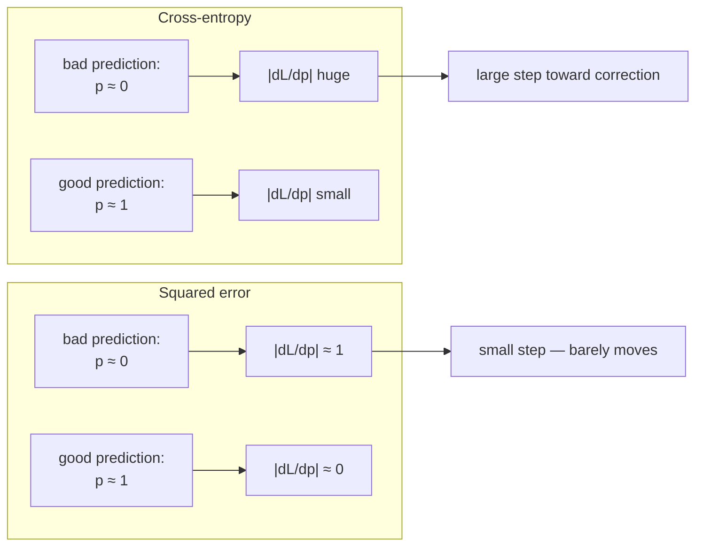
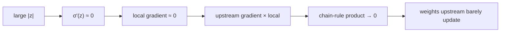
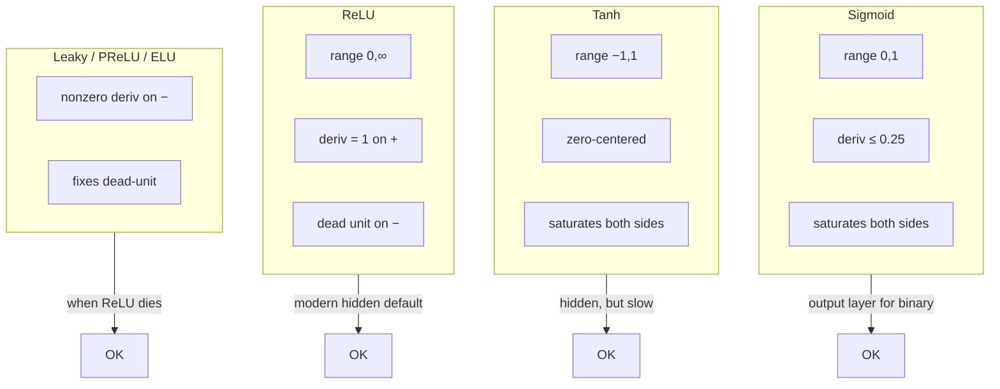
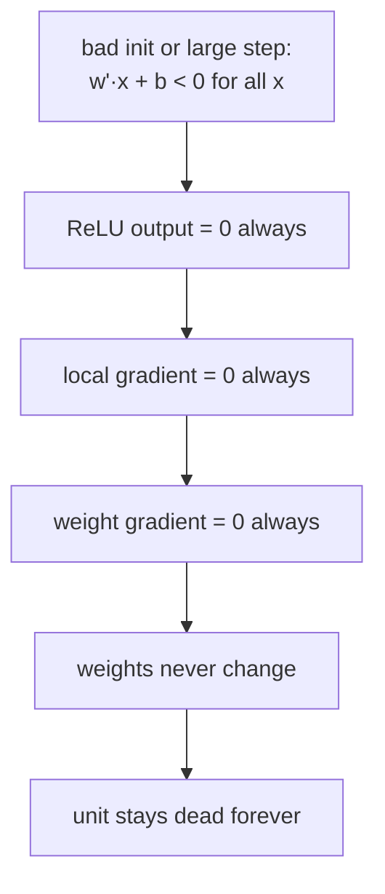
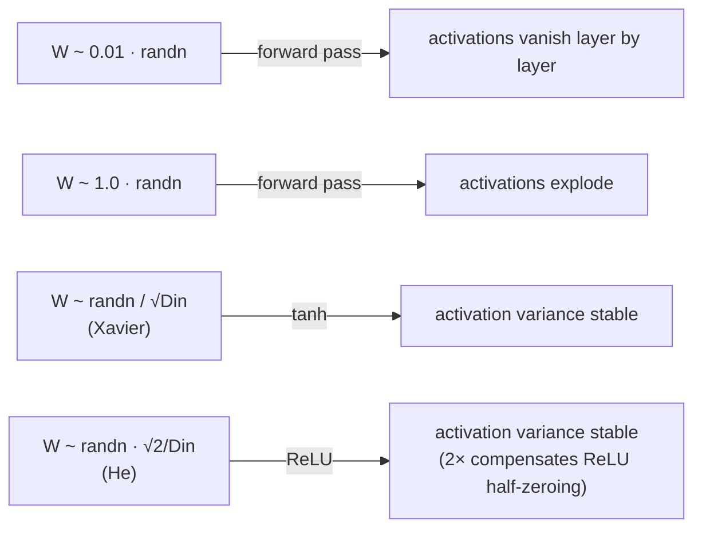
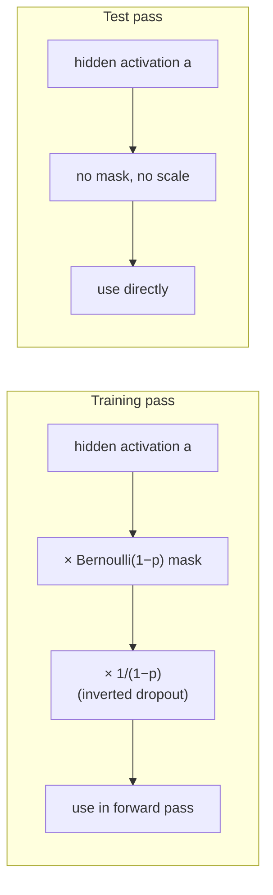

# Lecture 06 — Improving MLPs

## Overview

L05 gave us backprop. In principle, that's enough — we can train any MLP. **In practice, naive MLPs trained with backprop don't work** for anything deeper than a couple of layers. L06 catalogs the main failure modes that appear when you actually try to train a deep MLP and the engineering fixes that make modern deep learning work.

The lecture has four threads, in order:

**Thread 1 — finishing the cross-entropy story.** Why softmax + cross-entropy (not softmax + SSE) is the right output stack for classification. The argument is gradient-based: for a "terrible" prediction (true-class probability $p \to 0$), CE's loss explodes and so does its derivative — gradient descent gets a strong signal exactly when it needs one. Squared error on the same probability barely changes its derivative across the $[0,1]$ range, giving gradient descent a useless signal on confident-but-wrong predictions. The lecture closes the gradient calculation and lands on the clean form $\partial L_i / \partial b_k = a_k - y_k$ for the output bias (and the equivalent for output weights), where $y_k$ is the one-hot target.

**Thread 2 — activation functions and the saturation/dead-unit problems.** Sigmoid and $\tanh$ both **saturate** at the extremes — $\sigma'(z) = a(1-a) \le 0.25$, and it goes to zero whenever $|z|$ is large. Once a hidden pre-activation lives in the saturated region, its local gradient is near zero, the chain-rule product through the network is dominated by these tiny terms, and every weight upstream gets a tiny gradient. Stacked deep, this is **vanishing gradients**: the signal dies before it reaches the early layers. ReLU's positive-side derivative is exactly 1, so the active side doesn't saturate — but ReLU has its own pathology, the **dead-ReLU problem**: a neuron with negative pre-activation on every training example outputs zero, has local gradient zero on every example, never updates, and is dead forever. Variants (Leaky ReLU, Parametric ReLU, ELU, GELU) address this by giving the negative side a small but nonzero slope.

**Thread 3 — weight initialization.** Even with the right activation, the *initial* weights matter enormously in deep networks. Initialize too small and forward activations vanish layer-by-layer; too large and they explode. The fix is variance-controlled initialization: pick $W$'s entries from $\mathcal{N}(0, \sigma^2)$ with $\sigma^2 = 1/D_\text{in}$ (**Xavier/Glorot**, designed for $\tanh$) or $\sigma^2 = 2/D_\text{in}$ (**He**, designed for ReLU — the factor of 2 compensates for ReLU zero-ing out half of the inputs in expectation). The derivation (sketched as "optional, not on the exam") balances forward-activation variance and backward-gradient variance across layers.

**Thread 4 — regularization, especially dropout.** Adds a term $\lambda R(W)$ to the loss to discourage overfitting; $L_2$ is the standard. Then the headline regularizer of modern deep learning: **dropout**. During training, randomly zero out each hidden unit with probability $p$ on each forward pass. This forces the network to learn redundant representations (no unit can rely on a specific other unit being present) and is interpretable as training an exponential ensemble of subnetworks that share weights. At test time, dropout is **off** — so the layer's expected output magnitude doesn't match training — the standard fix is **inverted dropout** (scale activations by $1/(1-p)$ during training so test-time activations are unscaled).

## Key concepts

- [[softmax-cross-entropy-gradient]] — why $\partial L / \partial z_k = a_k - y_k$ at the output, and why it makes CE a better classification loss than SSE.
- [[activation-function]] — sigmoid, $\tanh$, ReLU, Leaky/Parametric ReLU; the L06 framing.
- [[relu]] — the modern hidden default; L06 deepens the L04 sketch with the dead-unit failure mode.
- [[vanishing-exploding-gradients]] — saturation in deep MLPs is the SLP-side framing of the same problem NLP saw in RNNs.
- [[weight-initialization]] — Xavier and He.
- [[dropout]] — random unit-masking during training as a regularizer + ensemble interpretation.
- [[regularization]] — L2 / weight decay; full treatment in [[lecture-10-loss-functions-regularization|L10]].

## Equations

**Output-layer gradient under softmax + CE** (from the L06 derivation).

For a softmax classifier with cross-entropy loss $L_i = -\log a_t$ where $t$ is the true class index:

$$
\frac{\partial L_i}{\partial b_k} = a_k - y_k, \qquad \frac{\partial L_i}{\partial w_{ki}} = (a_k - y_k)\, x_i,
$$

with $y_k = 1$ if $k = t$ and $0$ otherwise (one-hot target). This is the clean form: gradient = (predicted prob − target prob), scaled by the input. **For hidden layers**, replace $x_i$ with $a_i^{(L-1)}$, the previous layer's activation.

**Sigmoid derivative — recap.**

$$
\sigma'(z) = \sigma(z)\,(1 - \sigma(z)) \in (0, 0.25].
$$

The maximum is $0.25$ at $z = 0$. Far from zero on either side, $\sigma'(z) \to 0$ — *saturation*.

**Vanishing-gradient mechanism in a deep MLP** (L06 framing; same math as the [[vanishing-exploding-gradients|RNN/BPTT version]] from NLP).

For an $L$-layer network, the gradient w.r.t. an early-layer weight is a chain-rule product of $L$ factors, one per layer. With sigmoid activations every factor includes a $\sigma'(z) \le 0.25$ term, so

$$
\left| \frac{\partial L}{\partial w^{(1)}} \right| \;\le\; \prod_{\ell=1}^{L} 0.25 \cdot \|W^{(\ell)}\| \cdots \;\to\; 0 \text{ exponentially in } L.
$$

ReLU avoids this on the positive side ($\text{ReLU}'(z) = 1$ for $z > 0$), which is the *mechanical* reason ReLU + good init lets us train networks that sigmoid couldn't.

**ReLU + dead unit.**

$$
\text{ReLU}(z) = \max(0, z), \qquad \text{ReLU}'(z) = \begin{cases} 1 & z > 0 \\ 0 & z < 0 \end{cases}.
$$

If $z = w^\top x + b < 0$ for *every* training example, then for every example the upstream gradient is multiplied by $0$ — the unit's weights never receive a nonzero gradient — and it stays dead. Bad initialization or one too-large gradient step are the usual triggers.

**Leaky ReLU and Parametric ReLU.**

$$
\text{LeakyReLU}_\alpha(z) = \begin{cases} z & z > 0 \\ \alpha z & z \le 0 \end{cases},
$$

with $\alpha = 0.01$ (Leaky) or $\alpha$ a learned parameter (Parametric / PReLU). Negative-side derivative is now $\alpha > 0$, so a unit can recover from being temporarily off.

**Xavier / Glorot initialization** (designed for $\tanh$):

$$
W_{ij} \sim \mathcal{N}\!\left(0,\; \frac{1}{D_\text{in}}\right) \quad \text{or equivalently} \quad W = \frac{1}{\sqrt{D_\text{in}}}\,\mathcal{N}(0, 1).
$$

Goal: keep $\text{Var}(z^{(\ell+1)}) = \text{Var}(z^{(\ell)})$ in the forward pass.

**He / Kaiming initialization** (designed for ReLU):

$$
W_{ij} \sim \mathcal{N}\!\left(0,\; \frac{2}{D_\text{in}}\right).
$$

The factor of 2 compensates for ReLU outputting zero on half the inputs in expectation, so on average only half the variance is "passed through" — doubling the input variance restores balance.

**Dropout (training time).** For a hidden layer with mask probability $p$:

$$
a^{(\ell)}_i \;\leftarrow\; m_i \cdot a^{(\ell)}_i, \qquad m_i \sim \text{Bernoulli}(1 - p) \text{ i.i.d. per unit, per example, per forward pass}.
$$

**Inverted dropout (the standard implementation).** Scale by $1/(1-p)$ at *training* time so test-time activations need no rescaling:

$$
a^{(\ell)}_i \;\leftarrow\; \frac{m_i}{1 - p} \cdot a^{(\ell)}_i.
$$

Then at test time: dropout is off, no scaling needed, expected magnitude matches training.

**Loss with regularization.**

$$
\mathcal{L}(W) = \frac{1}{N} \sum_{i=1}^{N} -\log a^{(L)}_{y_i} + \lambda R(W),
$$

with $R(W) = \tfrac{1}{2}\|W\|_2^2$ for L2 weight decay. $\lambda$ trades off data fit vs. weight magnitude. Full treatment in [[lecture-10-loss-functions-regularization|L10]].

## Diagrams

### Why CE beats SSE on the output: derivative shape across the predicted-true-class probability

CE's derivative at a "terrible" prediction is *much larger* than SSE's at the same prediction — so gradient descent corrects faster. SSE's derivative is bounded ([[30-Sources/Statistical-Learning/pdf/Lec-06-improving-MLPs(1).pdf#page=14|slides ~10–22]]).

### The sigmoid saturation → vanishing-gradient chain

Saturation kills the local gradient; the chain-rule product through many such layers kills the global gradient ([[30-Sources/Statistical-Learning/pdf/Lec-06-improving-MLPs(1).pdf#page=58|slides ~55–62]]).

### Activation function comparison

ReLU is the default; Leaky/PReLU/ELU are the fallbacks when dead units become a problem ([[30-Sources/Statistical-Learning/pdf/Lec-06-improving-MLPs(1).pdf#page=65|slides ~60–75]]).

### Dead-ReLU mechanism

Once a ReLU is dead it cannot revive — the gradient that would update it is itself zero ([[30-Sources/Statistical-Learning/pdf/Lec-06-improving-MLPs(1).pdf#page=70|slides ~68–73]]).

### Weight-initialization regimes

The variance-balancing argument: forward-pass activation variance and backward-pass gradient variance should both be preserved across layers ([[30-Sources/Statistical-Learning/pdf/Lec-06-improving-MLPs(1).pdf#page=80|slides ~78–95]]).

### Dropout — train vs. test

Inverted dropout pushes the rescaling into training so the test-time path is plain forward propagation ([[30-Sources/Statistical-Learning/pdf/Lec-06-improving-MLPs(1).pdf#page=100|slides ~96–103]]).

## Why softmax + CE is "natural"

The lecture motivates CE-over-SSE through a numerical example: a classifier outputs $a_3 = 0.353$ for the true class. SSE gives loss $0.419$ — but the *derivative* of SSE w.r.t. $a_3$ at that point is just $a_3 - 1 \approx -0.65$, not very different from the derivative when $a_3 = 0.9$ ($\approx -0.1$). CE's derivative at $a_3 = 0.353$ is $-1/a_3 \approx -2.83$ — almost 30× larger than SSE's at $a_3 = 0.9$. **The gradient signal is sharper exactly when correction is needed most.**

The clean output-layer derivative $\partial L_i / \partial z_k = a_k - y_k$ comes from the cancellation between softmax's $a_k(1 - a_k)$ Jacobian and CE's $-1/a_k$ derivative: the $a_k$ terms cancel and you're left with $a_k - y_k$ for the true class index, and similarly $a_k$ for the wrong-class index (the off-diagonal softmax Jacobian is $-a_3 a_1$, which when multiplied by $-1/a_3$ gives $a_1$). One-hot encoding lets you write both cases as $a_k - y_k$ uniformly.

## Why depth makes saturation worse — and why ReLU + good init fix it

Sigmoid was fine in single-layer logistic regression. It became toxic in deep nets because the chain rule **multiplies** local gradients. Each layer contributes a factor $\le 0.25$; ten layers in, the gradient is already attenuated by $0.25^{10} \approx 10^{-6}$ even before any other shrinkage. Two engineering changes break the curse:

- **ReLU on the active side** has local derivative $1$, so it doesn't contribute a shrinkage factor at all on positive pre-activations.
- **He init** preserves activation variance across layers in expectation, so a typical pre-activation lives in the active region of ReLU — neither tiny enough to be in the dead region nor large enough to blow up downstream.

Together, these are why we can train 100-layer networks. The lecture credits this combination — not any single trick — for the modern deep-learning era.

## Why dropout works (two complementary stories)

**Robustness story.** Dropping units forces the network to spread its representation across many redundant paths — no single hidden unit can be a critical bottleneck. At test time the surviving network is more robust to noise / missing inputs / adversarial perturbations.

**Ensemble story.** Each dropout mask defines a *subnetwork* that shares weights with all other masks. Training with dropout is approximately training an exponentially large ensemble of subnetworks; test-time evaluation with dropout off and all weights present is approximately averaging this ensemble's predictions. *"Subsequent layers may combine the outputs of these parallel models to reach more robust predictions"* ([[30-Sources/Statistical-Learning/pdf/Lec-06-improving-MLPs(1).pdf#page=98|slide ~98]]).

The inverted-dropout scaling fixes the obvious mismatch: at training time only $1-p$ of the units fire, so the *expected* sum coming out of a layer is $1-p$ of the test-time sum. Multiplying training-time activations by $1/(1-p)$ matches them. *"Need to scale so the total output coming from the layer using dropout at test time keeps about the same magnitude as observed during training"* ([[30-Sources/Statistical-Learning/pdf/Lec-06-improving-MLPs(1).pdf#page=102|slide ~102]]).

## Mock-exam connections

- **§1b** (depth → "hierarchical representations") — L06's machinery (good activations + good init) is what makes hierarchical representations *trainable* in the first place. Without it, depth gives nothing.
- **§1k** (SGD per example, not per epoch) — orthogonal to L06 but the dropout discussion makes the per-example randomness concrete: each training example sees a *different* dropout mask.
- L06 is **not directly tested** in the past mock, but the prof flagged "more MCQs likely" for the actual final, and this lecture is exactly the kind of conceptual material that drops into MCQs:
  - "Why does cross-entropy work better than SSE for classification?" (gradient at bad predictions)
  - "What is the dead-ReLU problem?" (negative pre-activation on every example → zero gradient forever)
  - "Why do we use He init for ReLU and Xavier init for $\tanh$?" (variance-balancing; factor of 2 for ReLU's half-zero output)
  - "Why does dropout require inverted scaling?" (match expected activation magnitude at train and test)
- See [[exam-blueprint#Topic coverage map]].

## Open questions

- The "Optional derivation (won't be covered in the exam)" of Xavier/He shows the variance algebra. The prof flagged it as off the exam — we don't drill the derivation, just the formulas $\sigma^2 = 1/D_\text{in}$ (tanh) and $\sigma^2 = 2/D_\text{in}$ (ReLU) and the intuition.
- Batch normalization is a closely related fix that L06's slide deck doesn't seem to cover. May or may not appear later. If asked, we'd need to read further.
- **Carry-over from L05:** dead-ReLU now resolved (this lecture). "Deep nets easier with SGD" is partially resolved here: ReLU + good init explain *why* the optimization landscape becomes traversable; saddle-point geometry gives the rest, but the lecture doesn't redo it.
