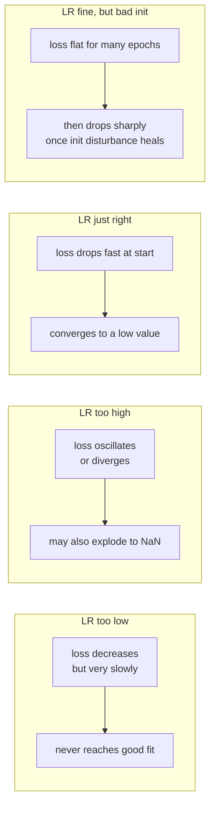
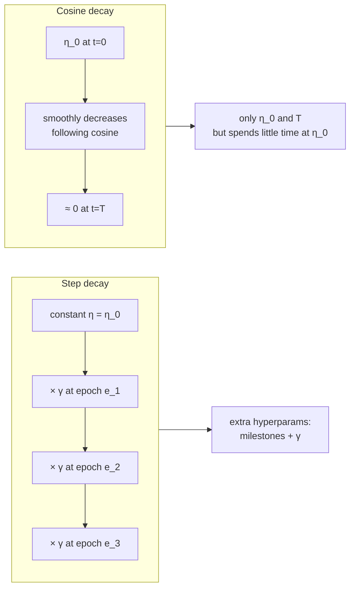
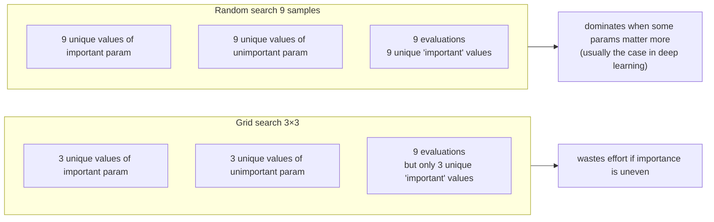
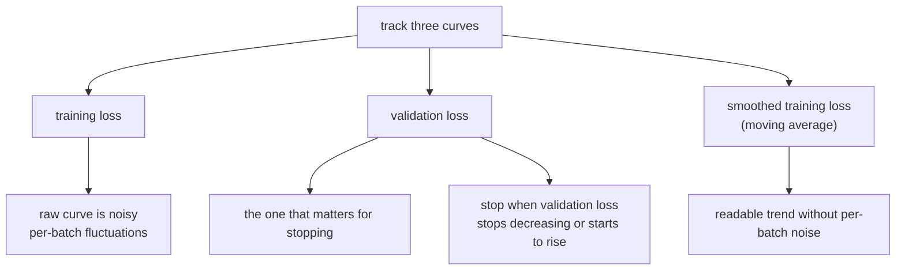

# Lecture 07 — Training deep nets: learning-rate schedules, early stopping, hyperparameter search

## Overview

L06 fixed the **structural** problems of deep networks — vanishing gradients, dead ReLUs, untrained activations. With those out of the way, the network *can* train. **L07 is about the procedural side: how to actually train it well.** Three threads:

**Thread 1 — learning-rate schedules.** A constant learning rate is almost never optimal. Too low → painfully slow convergence; too high → oscillation, divergence, or settling into a high-loss region. The "good" curve sits in a narrow window. The lecture's framing question: *"in practice, what learning rate should we use if we can't find a particular value that produces the 'good' curve?"* The answer: **all of them.** Start with a large learning rate and decay it over time — large to make quick progress at the start, small to converge to a low loss at the end. This is a **training schedule**. Concrete schedules covered: **step decay** (multiply LR by a factor at fixed epochs — e.g. ResNets: × 0.1 after epochs 30, 60, 90), **cosine decay** (LR follows a cosine curve from initial → 0 across the total epoch budget), **linear decay**, **inverse-square-root decay**. Step decay introduces hyperparameters (when to drop, by how much); cosine decay introduces only "initial LR" and "total epochs." The slide note: cosine is "most commonly used; may not be the best, but usually quite reasonable until you're far along."

**Thread 2 — when to stop training.** "How long to train?" doesn't have a fixed answer — it depends on the schedule, the data, and the model. Practical answer: track multiple curves and stop when validation loss starts rising (or stops dropping). Diagnostic curve shapes the lecture introduces:
- **Loss flat then drops** → bad initialization is the prime suspect.
- **Train loss drops, val loss rises** → overfitting; stop earlier or regularize harder.
- **Both flat for a while** → LR too low, or stuck near initialization.

**Thread 3 — hyperparameter search without infinite GPUs.** The two main strategies are **grid search** (evenly spaced points across each hyperparameter axis) and **random search** (uniformly sampled points in the hyperparameter cube). For high-dimensional spaces where some hyperparameters matter much more than others, **random beats grid** — grid wastes effort by re-exploring the same values of important parameters, while random's projections onto the important axis cover more values. The lecture flags one specific recipe: **search regularization strength $C$ on a log scale**, not linear. Loss is roughly invariant to a 2× change in $C$ but very sensitive to a 100× change — log spacing is what samples the *meaningful* range.

## Key concepts

- [[learning-rate-schedule]] — step / cosine / exponential / linear / 1/sqrt(t) / linear warmup.
- [[early-stopping]] — stop training when validation loss stops improving.
- [[hyperparameter]] — random vs. grid; log-scale axes for multiplicative parameters; L07 extension.
- [[gradient-descent]] / [[stochastic-gradient-descent]] — the optimizer the LR schedule modulates.

## Equations / schedule formulas

Let $\eta_0$ be the initial learning rate, $T$ the total training budget (epochs or iterations), and $t$ the current step.

**Step decay.** At fixed milestones $t_1 < t_2 < \dots$, multiply LR by a factor $\gamma < 1$:

$$
\eta(t) = \eta_0 \cdot \gamma^{(\text{number of milestones passed})}.
$$

Example (ResNet): $\gamma = 0.1$, milestones at 30, 60, 90 epochs.

**Cosine decay** (from $\eta_0$ to $\eta_T \approx 0$ over $T$ steps):

$$
\eta(t) = \frac{\eta_0}{2} \left(1 + \cos\!\left(\frac{\pi t}{T}\right)\right).
$$

**Exponential decay** (continuous — LR halves every $\tau$ steps):

$$
\eta(t) = \eta_0 \cdot \alpha^{t}, \quad \alpha \in (0, 1).
$$

**Inverse-square-root decay** (typical for Transformer training, with warmup):

$$
\eta(t) = \eta_0 / \sqrt{t}.
$$

**Linear warmup → cosine decay** (the modern default for large models):

$$
\eta(t) = \begin{cases}
\eta_0 \cdot t / T_{\text{warm}} & t \le T_{\text{warm}} \quad \text{(warmup)} \\
\frac{\eta_0}{2}\!\left(1 + \cos\!\frac{\pi (t - T_{\text{warm}})}{T - T_{\text{warm}}}\right) & t > T_{\text{warm}} \quad \text{(cosine)}
\end{cases}.
$$

## Diagrams

### "Bad LR" curve diagnostics

The diagnostic shape names the suspected cause ([[30-Sources/Statistical-Learning/pdf/Lec7-slides.pdf#page=4|slides ~3–6]]).

### Step decay vs. cosine decay

The trade-off is more about hyperparameter count than convergence quality — both work in practice ([[30-Sources/Statistical-Learning/pdf/Lec7-slides.pdf#page=8|slides ~7–13]]).

### Random vs. grid search — why random wins

Bergstra & Bengio (JMLR 2012) — random search dominates grid search whenever importance is uneven across hyperparameters ([[30-Sources/Statistical-Learning/pdf/Lec7-slides.pdf#page=23|slides ~21–27]]).

### When to stop training — three useful curves

The smoothed-training-loss curve is a moving average over several iterations — it filters per-batch noise so you can see the underlying trend ([[30-Sources/Statistical-Learning/pdf/Lec7-slides.pdf#page=18|slides ~16–20]]).

## Why "decay LR over time" is the right strategy

Early in training, the loss surface is mostly **dominated by gross errors** — gradients are large and consistent, and a big step is the right step. Late in training, the network is in a **valley near a minimum** — gradients are small and inconsistent (noisy across mini-batches), so a big step would overshoot or oscillate. A schedule that starts large and decays matches the geometry of the loss surface as the optimizer descends.

The "potential issue" the slide flags: with cosine, the model spends very little time at the high initial LR — most of training happens at progressively smaller LRs. This is generally fine; but if the schedule is too aggressive in decaying, you under-utilize the high-LR phase. Step decay lets you control that explicitly.

## Why log-scale search for $C$ (and learning rate)

The lecture's "Quiz: why log(C)?" The answer: regularization strength $C$ enters multiplicatively in the loss — doubling $C$ has roughly a constant effect (in log-loss) regardless of starting value. So the *meaningful* changes are *ratios*, not differences. Linear sampling between $C = 0.01$ and $C = 100$ would put 99% of points above $C = 1$ — but the *interesting* behavior often happens at $C \in (0.01, 0.1)$. Log-scale sampling covers $(0.01, 0.1, 1, 10, 100)$ with one decade per sample — meaningful coverage of the meaningful range.

Same logic applies to **learning rate** — search $\eta \in [10^{-5}, 10^{-1}]$ on a log scale, not linear.

## Mock-exam connections

- **§1k** ("SGD updates parameters in random order, but **per example** not per epoch") — this lecture's framing of one-iteration-per-batch backs up exactly what L05's backprop produces. Each iteration is one mini-batch; multiple iterations make up one epoch.
- L07 is **not directly tested in §3–§7 algorithmic compute** of the past mock — it's procedural. But MCQs on:
  - "Which curve shape suggests bad initialization?" (flat plateau then sharp drop)
  - "Why search learning rate on a log scale, not linear?" (multiplicative effect)
  - "What's the risk of training too long without early stopping?" (validation loss rises = overfit)
  - "What's the trade-off between step decay and cosine decay?" (step has more hyperparams, cosine has fewer but spends less time at high LR)
- See [[exam-blueprint#Topic coverage map]].

## Open questions

- **Adam, momentum, and adaptive LR methods** are referenced — *"especially true if we use advanced SGD techniques (e.g., Adam)"* — but the actual mechanics aren't derived in this deck. They were "previewed in L03 to be detailed in L06–L07," and neither lecture's slides go through the formulas. Practical takeaway: know the names (Momentum / RMSProp / Adam), know they adapt step size per parameter, but the prof has signaled this is **not exam material**.
- **Batch normalization** — still not introduced. Likely either skipped entirely or pushed to a later lecture.
- **Carry-over from L05/L06**: "deep nets easier with SGD" is now fully resolved across L05 (backprop makes gradients computable), L06 (ReLU + good init avoid the vanishing/dead failure modes), and L07 (LR schedules + monitoring let you actually train).
