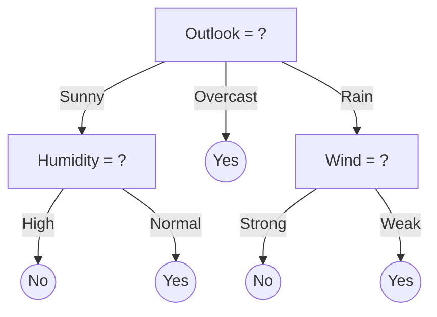
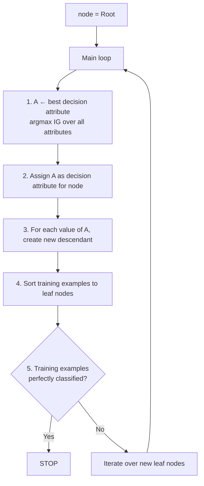
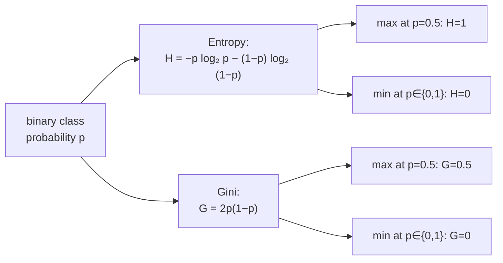
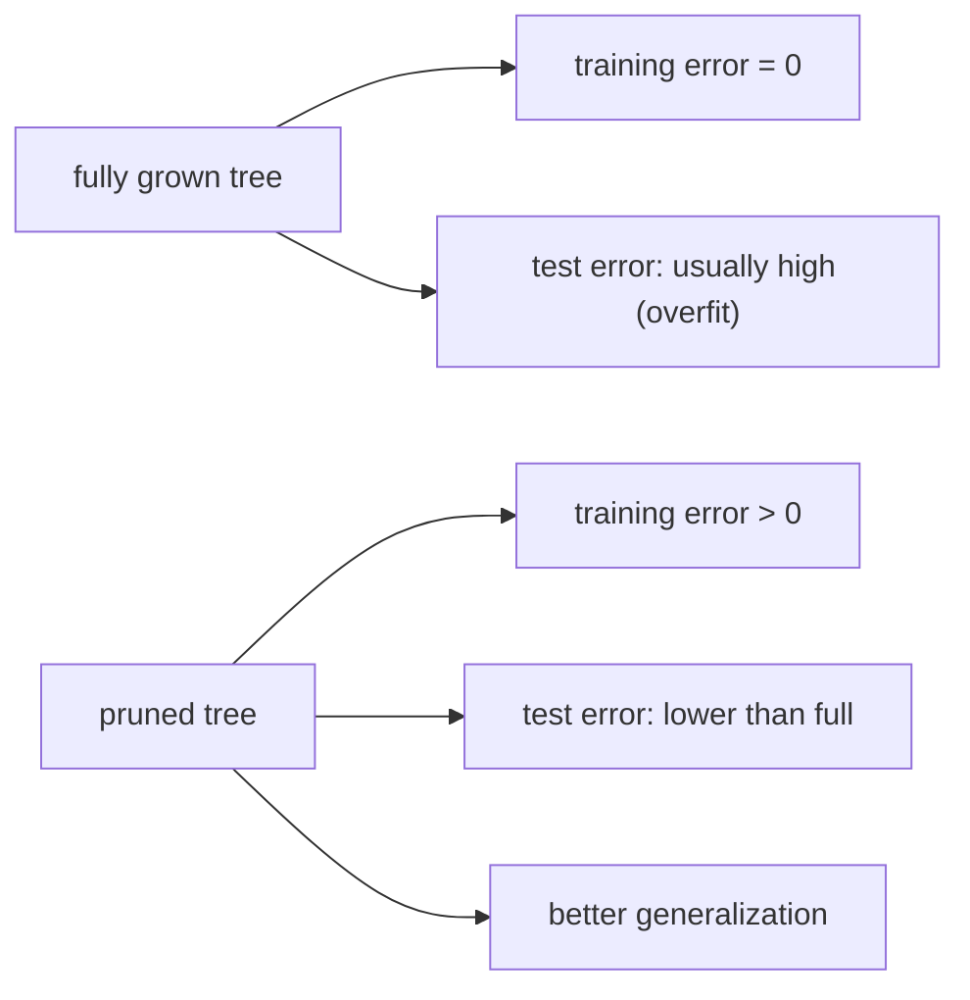
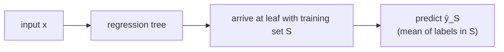

# Lecture 08 — Decision trees

## Overview

We leave neural networks behind for now and switch modality entirely. Phase A (L01–L07) built a single class of model — the deep MLP — and the machinery to train it: backprop, ReLU, weight initialization, learning-rate schedules. Phase B (L08–L09) returns to **classical supervised learning** and introduces two very different classifiers that solve the same problem with very different machinery: **decision trees** (this lecture) and **linear SVMs** (next lecture).

The connection back to neural nets is loose. What's tight is the connection *forward*: the entropy / Gini / information-gain machinery introduced here powers ensemble methods in Phase D (L12–L14), where AdaBoost (L14) uses depth-1 trees called **stumps** as its weak learners and gradient-boosted trees (L13) chain trees additively. By the time those lectures arrive, the student needs to know what a stump is, why one split is better than another, and how to compute a tree's training error by hand. **L08 is where that machinery is built.**

The lecture has four threads:

**Thread 1 — what a decision tree is.** Internal nodes test a discrete-valued attribute $X_i$; each branch from a node corresponds to one value of that attribute; each leaf predicts the class label $Y$ (or a class-probability distribution). A path from root to leaf is a conjunction of attribute tests; the whole tree is a disjunction of those paths. The classic running example: predicting `PlayTennis?` from `<Outlook, Temperature, Humidity, Wind>`. The Batman worked example (Mitchell-style) shows the same machinery on `<mask, cape, tie, ears, smokes, height>` predicting `class ∈ {good, evil}`.

**Thread 2 — top-down induction (ID3 / C4.5 / CART, Quinlan).** Greedy recursive algorithm: at the root, pick the **best splitting attribute** (highest information gain); create a child for each value; sort the training examples into those children; recurse on each child. Stop when the training examples at a node are perfectly classified (or some pre-pruning criterion fires).

The whole thing rests on quantifying "best splitting attribute," which is what the impurity measures do.

**Thread 3 — impurity measures and information gain.** The lecture introduces two interchangeable impurity measures (the prof flagged "(or Gini)" as earning full credit either way on the mock):

- **Entropy** $H(Y) = -\sum_c p_c \log_2 p_c$ — Shannon's information-theoretic measure. Maximum at the uniform distribution; zero at a one-hot distribution.
- **Gini impurity** $G(Y) = 1 - \sum_c p_c^2 = \sum_c p_c (1 - p_c)$ — the probability that a random example is misclassified by a label sampled from $p$. Same shape as entropy in the binary case (peaks at $p = 0.5$); cheaper to compute (no logarithm).

For a candidate split on attribute $X$ that partitions the data $S$ into branches $S_v$ (one per value $v$ of $X$):

- **Conditional entropy:** $H(Y \mid X) = \sum_v \frac{|S_v|}{|S|} H(Y \mid X = v)$ — weighted average of child entropies.
- **Information gain:** $\mathrm{IG}(X) = H(Y) - H(Y \mid X)$ — reduction in entropy from splitting on $X$.

The greedy algorithm picks the attribute with the **largest IG** at each node. With Gini, the same logic uses Gini-of-tree $G^T(S) = \frac{|S_L|}{|S|} G(S_L) + \frac{|S_R|}{|S|} G(S_R)$ — pick the split with the lowest weighted child Gini.

**Thread 4 — overfitting, pruning, missing attributes, regression trees.** A tree grown until every training example is perfectly classified will memorize the training set — classic overfitting. Two remedies:
- **Pre-pruning** — stop early (e.g., when fewer than $k$ examples reach a node, or when no split improves IG by a threshold).
- **Post-pruning** — grow the full tree, then collapse subtrees whose removal doesn't hurt validation error.

**Missing attributes.** Two strategies covered: **surrogate splits** (record alternative attributes that partition the data similarly so a missing value can be replaced with a backup test) and **fractional instances** (a missing value sends a fractional copy of the example down each branch, weighted by the branch's training-data proportion).

**Regression trees (CART).** Same algorithm, different impurity. With continuous labels $y \in \mathbb{R}$:

$$
L(S) = \frac{1}{|S|} \sum_{(x, y) \in S} (y - \bar{y}_S)^2, \qquad \bar{y}_S = \frac{1}{|S|} \sum_{(x,y) \in S} y.
$$

Each leaf predicts the mean label of the training examples that reached it. CART summary from the lecture: *"CART are very lightweight classifiers; very fast during testing; usually not competitive in accuracy but can become very strong through bagging (Random Forests) and boosting (Gradient Boosted Trees)."* — the bridge to L12–L14.

## Key concepts

- [[decision-tree]] — the model itself, structure, induction algorithm, pruning.
- [[entropy]] — the Shannon-entropy impurity measure.
- [[gini-impurity]] — the cheaper alternative impurity.
- [[information-gain]] — entropy reduction; the splitting criterion.
- [[overfitting-underfitting]] — trees overfit aggressively without pruning.

## Equations

**Entropy of a label distribution.** For class probabilities $p_1, \dots, p_C$ at a node:

$$
H(Y) = -\sum_{c=1}^{C} p_c \log_2 p_c.
$$

Pure node ($p_c = 1$ for one class, $0$ for the rest): $H = 0$. Uniform node: $H = \log_2 C$.

**Gini impurity.**

$$
G(Y) = 1 - \sum_{c=1}^{C} p_c^2 = \sum_{c=1}^{C} p_c (1 - p_c).
$$

Pure: $G = 0$. Uniform: $G = 1 - 1/C$. In the binary case $G = 2 p (1 - p)$, peaks at $G = 0.5$ when $p = 0.5$.

**Conditional entropy on a split.** Splitting on attribute $X$ with values $v$ partitions the data into subsets $S_v$:

$$
H(Y \mid X) = \sum_v \frac{|S_v|}{|S|} \, H(Y \mid X = v).
$$

**Information gain** (the criterion ID3/C4.5 maximize):

$$
\mathrm{IG}(X) = H(Y) - H(Y \mid X).
$$

**Gini of a tree** (the analogous Gini-based criterion for binary splits):

$$
G^T(S) = \frac{|S_L|}{|S|} G(S_L) + \frac{|S_R|}{|S|} G(S_R).
$$

Pick the split with the smallest $G^T(S)$.

**Squared-error loss for regression trees.**

$$
L(S) = \frac{1}{|S|} \sum_{(x, y) \in S} (y - \bar{y}_S)^2, \qquad \bar{y}_S = \tfrac{1}{|S|} \sum_y y.
$$

Each leaf predicts $\bar{y}_S$ (the mean of training labels reaching it). Best-split-finding for regression is $O(n \log n)$.

## Diagrams

### Tree structure

The classic `PlayTennis?` decision tree. Internal nodes test one attribute; branches by value; leaves are class predictions.

### Top-down induction (ID3 / C4.5)

The greedy induction algorithm — same skeleton in ID3, C4.5, and CART, differing in the impurity measure and how they handle continuous attributes ([[30-Sources/Statistical-Learning/pdf/dtrees_slides_SLP.pdf#page=8|slide ~8]]).

### Entropy vs. Gini in the binary case

Same shape, different scale. The prof flagged that either earns full credit on the mock; in practice they almost always pick the same split ([[30-Sources/Statistical-Learning/pdf/dtrees_slides_SLP.pdf#page=12|slides ~10–14]]).

### Pruning vs. overfitting

Pruning trades a worse training fit for a better validation/test fit — the tree-version of bias-variance ([[30-Sources/Statistical-Learning/pdf/dtrees_slides_SLP.pdf#page=18|slides ~18–20]]).

### CART regression: piecewise-constant approximation

A regression tree is a step function over the input space — piecewise-constant, with each constant being the mean of the training labels in that region.

## Worked examples

- [Batman / Penguin / Joker decision tree (cells 1–3)](30-Sources/Statistical-Learning/pdf/example-dtree.pdf) — the Mitchell-style worked example using `<mask, cape, tie, ears, smokes, height>` to classify characters as `good` or `evil`. Prompts the question "is this a good tree? would it misclassify anybody?" — useful for practicing the **predict-from-tree** task that's likely on the exam (mock §3 includes a tree-traversal subpart).

## Why information gain is the right criterion

Three intuitive properties make IG the natural splitting criterion:

1. **It rewards purity.** A split that produces children all-pure (entropy 0 in each child) is the maximum possible IG = $H(Y)$ at the parent.
2. **It penalizes uniform splits.** A split that just shuffles the original distribution into smaller copies of itself doesn't reduce entropy — IG = 0.
3. **It's invariant to label permutations.** $H$ depends only on the *distribution* of class labels, not on which specific class is "positive."

Pitfall: IG is **biased toward attributes with many values**. An attribute with one distinct value per training example trivially gets $H(Y \mid X) = 0$ (each child is a single example) — IG would be maximal. C4.5's fix is to normalize by the entropy of the partition itself (called **gain ratio**); ID3 doesn't bother. The lecture mentions this as the reason C4.5 supersedes ID3 for high-cardinality features.

## Why decision trees overfit so aggressively

Trees can carve out arbitrarily fine-grained regions of the input space — a fully grown tree can perfectly memorize the training set in $O(n)$ leaves (one leaf per example). Without regularization, this is exactly what happens. The variance is enormous: small perturbations to the training set produce wildly different trees.

This is why **trees alone are weak baselines**, but become very strong as **ensemble building blocks** (L12–L14):
- **Bagging / Random Forests (L12)** — average many trees trained on bootstrap samples → variance reduction.
- **Boosting / Gradient Boosting (L13)** — sequentially fit trees to the residuals of previous trees → bias reduction.
- **AdaBoost (L14)** — uses the simplest possible trees (depth-1 stumps) reweighted by training error.

## Mock-exam connections

L08 is **heavily tested** in the past mock — second only to AdaBoost (L14):

- **§1a** — pruning vs. overfit. Wrong direction would be "pruning makes the tree fit training data better"; the correct framing is "pruning sacrifices training fit for better generalization."
- **§1i** — handling missing attribute values: the answer is **surrogate splits** (or fractional instances), not "pretend the attribute doesn't exist."
- **§1l** — boosted trees grown fully without pruning? Read carefully: AdaBoost stumps are grown fully (depth 1) so the "no pruning" answer is right *for stumps*; deeper boosted trees can flip the answer.
- **§1h** — gradient-boosted = linear combination of stumps. **True**, and the linear combination's decision boundary is far more complex than any single stump.
- **§2c** — circle which classifiers achieve zero training error on a small XOR cloud. Decision trees **can** (they can shatter any finite set with enough depth). Linear SVM **cannot** without kernels. Single-hidden-layer MLP **can** with enough hidden units. 1-NN **can** trivially.
- **§3 — full algorithmic compute** (the big one). Initial entropy or Gini at the root. Conditional entropy on a single proposed split. Information gain. Pick the root attribute. Build the rest of the unpruned tree by recursion. Compute training-error fraction.

The prof's tells:
- *"Entropy or Gini interchangeably"* — either earns full credit on §3.
- §3-style tree compute is one of the longest scoring opportunities on the exam — practice it.

See [[exam-blueprint#Topic coverage map]] and the worked example linked above.

## Open questions

- **Continuous-attribute handling.** ID3 only handles discrete attributes; CART/C4.5 handle continuous ones by searching for an optimal threshold $t$ (e.g., `height > 175?`). The lecture sketches this in the Batman example but doesn't dwell on the threshold-search algorithm. Practical: sort the values, evaluate IG at each midpoint between adjacent values, take the best.
- **Multi-way vs. binary splits.** Some implementations always split binary (CART); some split into one branch per attribute value (ID3). Trade-off: binary trees are deeper, multi-way trees are fatter. For exam purposes, follow whatever style the question implies.
- The "non-trivial interaction between trees and bias-variance" demoed at r2d3.us (slide reference) is the right intuition pump for L11/L12 — the demo shows a fully-grown tree as high-variance and bagging as the variance fix.

## See also

- [[bagging]] — L12's variance-reduction wrapper that turns single high-variance trees into a stable ensemble (random forests).
- [[boosting]] — L13's bias-reduction wrapper using sequential weak learners (often stumps).
- [[adaboost]] — L14's exponential-loss boosting algorithm using stumps as base learners; the §5 mock-exam workhorse.
