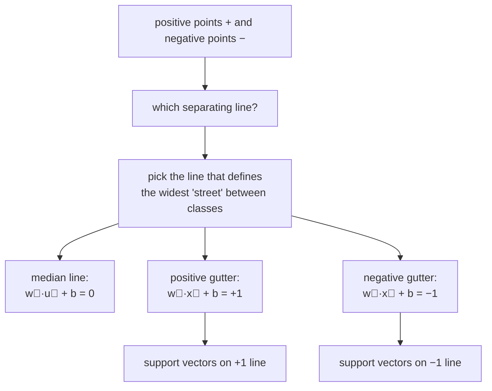
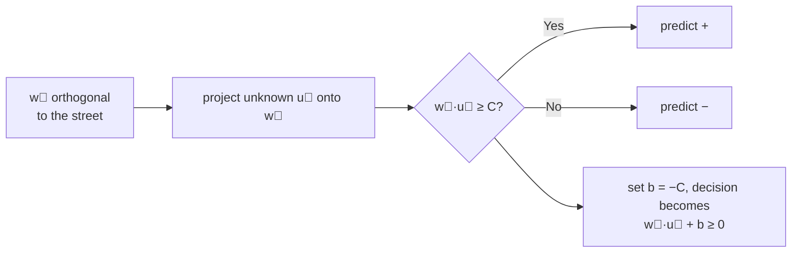
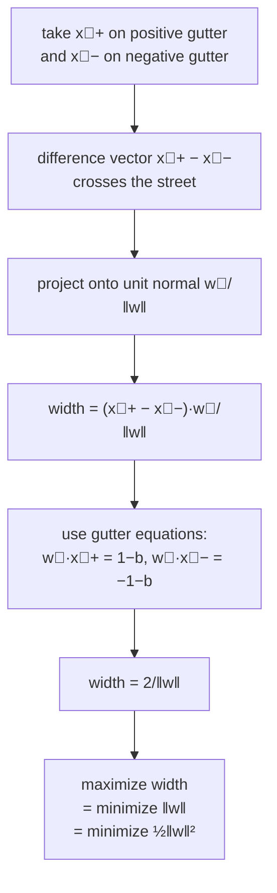
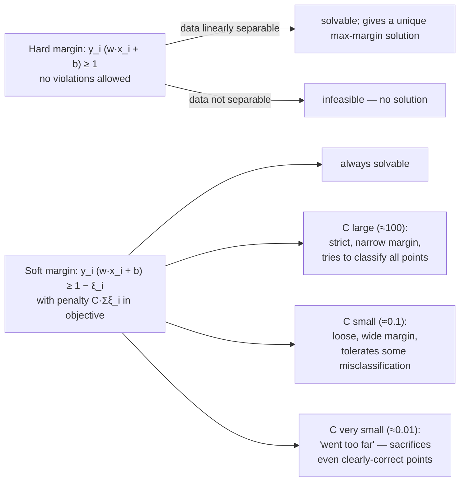
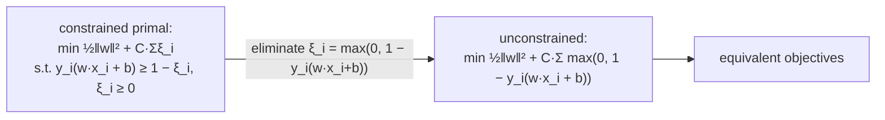

# Lecture 09 — Linear SVMs (hard and soft margin)

## Overview

L08 gave us trees — a non-parametric, axis-aligned, hierarchical classifier that splits the input space into rectangular regions. L09 swings to the opposite end of Phase B: **a parametric, linear, max-margin classifier that draws a single hyperplane between two classes.** Both solve binary classification, but the modelling assumptions and the geometry could not be more different.

The lecture's pivot question (Vapnik, 1990s): *"We still want to draw a straight line, but **which** straight line?"* The perceptron and logistic regression both find *some* separating line, but neither is unique and neither resists outliers gracefully. The SVM answer: pick the line that defines the **"widest street"** between the two classes — equivalently, the line whose closest points (the **support vectors**) are as far away as possible. This widest-margin classifier is empirically the most robust to outliers and has strong generalization guarantees from the theory of structural risk minimization.

The lecture has four threads, each building on the last:

**Thread 1 — the decision rule.** Imagine a vector $\vec{w}$ orthogonal to the "median line" of the street. For an unknown vector $\vec{u}$, project it onto $\vec{w}$: the larger the projection $\vec{w} \cdot \vec{u}$, the further onto the positive side. The decision rule is

$$
\text{If } \vec{w} \cdot \vec{u} + b \ge 0 \text{ then predict } +.
$$

This is the same linear classifier form as the [[perceptron]] and [[logistic-regression]] — what changes is **how** $\vec{w}$ and $b$ get chosen.

**Thread 2 — the margin constraints.** With $\vec{w}$ free in length, $b$ free in offset, the rule has too many degrees of freedom — any rescaling of $(\vec{w}, b)$ produces the same decision boundary. The SVM **fixes the scale** by requiring positives to lie at projection $\ge +1$ and negatives at $\le -1$:

$$
\text{(A): } \vec{w} \cdot \vec{x}^+ + b \ge 1, \qquad \text{(B): } \vec{w} \cdot \vec{x}^- + b \le -1.
$$

With targets $y_i \in \{+1, -1\}$, both constraints unify to the canonical form

$$
y_i (\vec{w} \cdot \vec{x}_i + b) \ge 1, \qquad \forall i.
$$

Equality holds **only at support vectors** — the points sitting exactly on the gutters of the street.

**Thread 3 — width = $2 / \|\vec{w}\|$, so maximize-margin = minimize-$\|\vec{w}\|$.** Take any positive support vector $\vec{x}^+$ and any negative support vector $\vec{x}^-$. The street's width is the projection of $\vec{x}^+ - \vec{x}^-$ onto the unit normal $\vec{w}/\|\vec{w}\|$:

$$
\text{width} = (\vec{x}^+ - \vec{x}^-) \cdot \frac{\vec{w}}{\|\vec{w}\|}.
$$

Plugging in the gutter equations $\vec{w} \cdot \vec{x}^+ = 1 - b$ and $-\vec{w} \cdot \vec{x}^- = 1 + b$ (since $y_i = +1$ at $\vec{x}^+$ and $y_i = -1$ at $\vec{x}^-$, and equality holds), the cross-products cancel beautifully:

$$
\text{width} = \frac{(1 - b) + (1 + b)}{\|\vec{w}\|} = \frac{2}{\|\vec{w}\|}.
$$

**Maximizing $2/\|\vec{w}\|$** is the same as **minimizing $\|\vec{w}\|$**, which is the same as **minimizing $\tfrac{1}{2}\|\vec{w}\|^2$** — the last form is differentiable everywhere and gives the standard primal:

$$
\min_{\vec{w}, b} \tfrac{1}{2} \|\vec{w}\|^2 \quad \text{s.t.} \quad y_i (\vec{w} \cdot \vec{x}_i + b) \ge 1, \; \forall i.
$$

**Geometric intuition for "why does small $\|\vec{w}\|$ make the margin big?"** If $\vec{w}$ is too big, its dot product with points near the boundary is already large — the level set $\vec{w} \cdot \vec{x} + b = 1$ is *close* to the median. Shrinking $\vec{w}$ pushes the $\pm 1$ level sets *outward* until they're held back by the closest support vectors.

**Thread 4 — soft margin / slack.** Real data isn't always linearly separable. The hard-margin constraints $y_i (\vec{w} \cdot \vec{x}_i + b) \ge 1$ may be infeasible. Introduce **slack variables** $\xi_i \ge 0$ that allow each constraint to be relaxed:

$$
y_i (\vec{w} \cdot \vec{x}_i + b) \ge 1 - \xi_i, \qquad \xi_i \ge 0.
$$

Subtract enough $\xi_i$ and any constraint can be satisfied — but we want to subtract as *little* as possible. Add a penalty term $C \sum_i \xi_i$ to the objective:

$$
\min_{\vec{w}, b, \xi} \tfrac{1}{2} \|\vec{w}\|^2 + C \sum_i \xi_i \quad \text{s.t.} \quad y_i (\vec{w} \cdot \vec{x}_i + b) \ge 1 - \xi_i, \; \xi_i \ge 0.
$$

This is the **soft-margin / slack-form SVM** — exactly the formulation given on the past mock §6 (with the SVM-side constraint restated inline; see [[exam-blueprint#What the formula sheet provides]]).

**The C trade-off.** $C$ controls the cost of violating margin constraints:
- **$C$ large** (e.g., $C = 100$): SVM is **strict** — tries hard to get every point correctly classified with margin $\ge 1$. Narrow margin if there are outliers; effectively hard-margin in the limit $C \to \infty$.
- **$C$ small** (e.g., $C = 0.1$): SVM is **loose** — willing to misclassify outliers in exchange for a wider margin and simpler $\vec{w}$. *"Notice how $w$ becomes small as the margin increases."*
- **$C$ very small** (e.g., $C = 0.01$): margin too wide; SVM may sacrifice clearly-correct points. *"Went too far here."*

The sweet spot is somewhere in the middle; cross-validation chooses $C$ on a log scale.

## Key concepts

- [[support-vector-machine]] — the model itself; this lecture is the SLP-side geometric treatment.
- [[support-vector]] — the points on the gutter; the only points that determine the boundary.
- [[margin]] — the width of the "street."
- [[hinge-loss]] — the loss function the soft-margin objective implicitly minimizes.
- [[slack-variables]] — the per-example margin-violation budget.
- [[linear-classifier]] — the broader family SVM belongs to.

## Equations

**Decision rule.**

$$
\hat{y}(\vec{u}) = \text{sign}(\vec{w} \cdot \vec{u} + b).
$$

**Hard-margin constraint** (separable case):

$$
y_i (\vec{w} \cdot \vec{x}_i + b) \ge 1, \qquad \forall i.
$$

**Margin width.** $\text{width} = 2 / \|\vec{w}\|$.

**Hard-margin primal:**

$$
\min_{\vec{w}, b} \tfrac{1}{2} \|\vec{w}\|^2 \quad \text{s.t.} \quad y_i (\vec{w} \cdot \vec{x}_i + b) \ge 1, \; \forall i.
$$

**Soft-margin / slack primal** (this lecture's main result, repeated on the mock):

$$
\arg\min_{\vec{w}, b, \xi} \;\tfrac{1}{2} \|\vec{w}\|^2 + C \sum_{i=1}^{n} \xi_i \quad \text{s.t.} \quad y_i (\vec{w} \cdot \vec{x}_i + b) \ge 1 - \xi_i, \; \xi_i \ge 0.
$$

**Hinge-loss equivalent form** (eliminate $\xi$ analytically — $\xi_i = \max(0, 1 - y_i(\vec{w}\cdot\vec{x}_i + b))$):

$$
\min_{\vec{w}, b} \tfrac{1}{2} \|\vec{w}\|^2 + C \sum_i \max\!\big(0,\; 1 - y_i (\vec{w} \cdot \vec{x}_i + b)\big).
$$

The $\max$ term is the **hinge loss**: zero when the example is correctly classified with margin $\ge 1$, linear in the margin violation otherwise.

## Diagrams

### The widest-street idea

The "widest street" framing: the median line is the decision boundary; the $\pm 1$ level sets are the gutters; the support vectors sit exactly on the gutters ([[30-Sources/Statistical-Learning/pdf/SLP-SVMs-I.pdf#page=10|slides ~7–14]]).

### Decision rule construction

The signed projection onto $\vec{w}$ tells us which side; setting $b = -C$ moves the threshold to zero ([[30-Sources/Statistical-Learning/pdf/SLP-SVMs-I.pdf#page=20|slides ~14–22]]).

### Width = 2/‖w‖ derivation

The cross-products with $b$ cancel; the result is the famous $2/\|\vec{w}\|$ ([[30-Sources/Statistical-Learning/pdf/SLP-SVMs-I.pdf#page=35|slides ~32–38]]).

### Hard margin vs. soft margin (the C trade-off)

$C \to \infty$ recovers hard margin; $C \to 0$ ignores the data and just minimizes $\|\vec{w}\|$ ([[30-Sources/Statistical-Learning/pdf/SLP-SVMs-I.pdf#page=70|slides ~68–82]]).

### Hinge loss vs. slack — they're the same objective

The slack-and-penalty formulation and the hinge-loss formulation are algebraically identical — picking $\xi_i$ optimally given the margin always gives $\max(0, 1 - y_i(\vec{w}\cdot\vec{x}_i + b))$.

## Why the support vectors are everything

A point $\vec{x}_i$ is a **support vector** if it satisfies its constraint with equality: $y_i (\vec{w} \cdot \vec{x}_i + b) = 1$ in hard-margin, or sits on the gutter / inside the margin in soft-margin. **All other points have no effect on the optimum.** Move them around freely — as long as they remain outside the margin, the boundary doesn't change.

This is the structural fact behind mock §1c: *"the decision boundary depends only on the support vectors."* It's also why SVMs scale with the *number of support vectors*, not the total dataset size — once trained, prediction only requires the SV subset.

## Why minimize ‖w‖² (and not something else)

Three reasons line up:

1. **Geometric:** width $= 2/\|\vec{w}\|$, so minimizing $\|\vec{w}\|$ maximizes margin.
2. **Differentiability:** $\|\vec{w}\|$ has a kink at zero; $\frac{1}{2}\|\vec{w}\|^2$ is smooth and convex everywhere — the gradient is just $\vec{w}$.
3. **Generalization:** small $\|\vec{w}\|$ means smaller Lipschitz constant of the decision function, which translates (via Vapnik's structural-risk-minimization theory) to better generalization bounds. Large-margin classifiers are **provably less sensitive** to small input perturbations.

## Comparison with logistic regression and the perceptron

All three are linear classifiers with decision rule $\hat{y} = \text{sign}(\vec{w} \cdot \vec{x} + b)$. They differ in the *training objective*:

| Classifier | Training objective | Loss |
| --- | --- | --- |
| Perceptron | minimize misclassifications via gradient updates | 0/1 loss (proxy: linear-in-margin on misclassified) |
| Logistic regression | maximum likelihood | logistic loss (smooth, calibrated probabilities) |
| **SVM** | **maximize margin (minimize ‖w‖²) + hinge loss** | hinge loss (sparse, only SVs matter) |

Logistic regression cares about *every* training point (the logistic loss is positive everywhere). SVM only cares about points near the boundary (hinge loss is zero for points with margin $\ge 1$). This is why a far-from-the-boundary outlier can move the LR boundary a lot but doesn't move the SVM boundary at all.

## Mock-exam connections

- **§1c** — the decision boundary depends only on the support vectors. **True.** Move non-support-vector points anywhere outside the margin and the SVM doesn't change.
- **§2c** — circle which classifiers achieve zero training error on a small XOR cloud. **Linear SVM cannot** (the data isn't linearly separable in the original space; you need a kernel or transformation, see L15–L16). Decision trees and 1-NN can; single-hidden-layer MLP can.
- **§6 — full SVM problem with quadratic kernel and slack.** The slack primal *is restated inline on the past exam* (see [[exam-blueprint#What the formula sheet provides]]) — but you still need to know the geometry: large $C$ → narrow margin, low slack tolerance; small $C$ → wide margin, more slack tolerated. *"Justify your answer here"* prompts demand written reasoning, not just a sketch.
- The "non-trivial interaction between learning rate and regularization strength" L07 caveat applies indirectly: $C$ is the SVM's regularization parameter (technically $1/\lambda$), and tuning it interacts with kernel-choice and feature scaling.
- See [[exam-blueprint#Topic coverage map]].

## Open questions

- **The dual formulation and KKT conditions.** This lecture stays in the primal. The dual (Lagrange multipliers $\alpha_i$, with $\alpha_i > 0$ ⟺ support vector) is what enables the kernel trick — replace inner products $\langle \vec{x}_i, \vec{x}_j \rangle$ with $K(\vec{x}_i, \vec{x}_j)$ in the dual. **L15 covers it.**
- **Multi-class SVM.** Native binary-only; multi-class via one-vs-rest, one-vs-one, or Crammer-Singer. Not in scope here.
- **Probabilistic outputs.** SVM gives uncalibrated margin scores, not probabilities. Platt scaling fits a sigmoid post hoc — out of scope.
- The "structural risk minimization" theory underlying why max-margin generalizes well is mentioned in the lecture but not derived. Vapnik-Chervonenkis dimension and margin-based bounds are the technical machinery — **not exam material** but the conceptual claim ("max margin = better generalization") is.

## See also

- [[kernel-trick]] — L15's machinery that lifts the SVM dual into implicit feature spaces.
- [[gaussian-kernel]] — L16's infinite-dimensional kernel; the canonical non-linear SVM.
- [[polynomial-kernel]] — the quadratic kernel used in mock §6.
