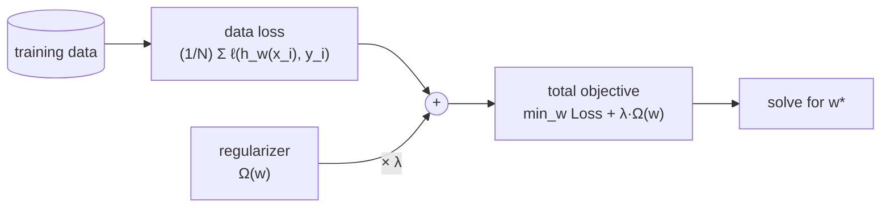
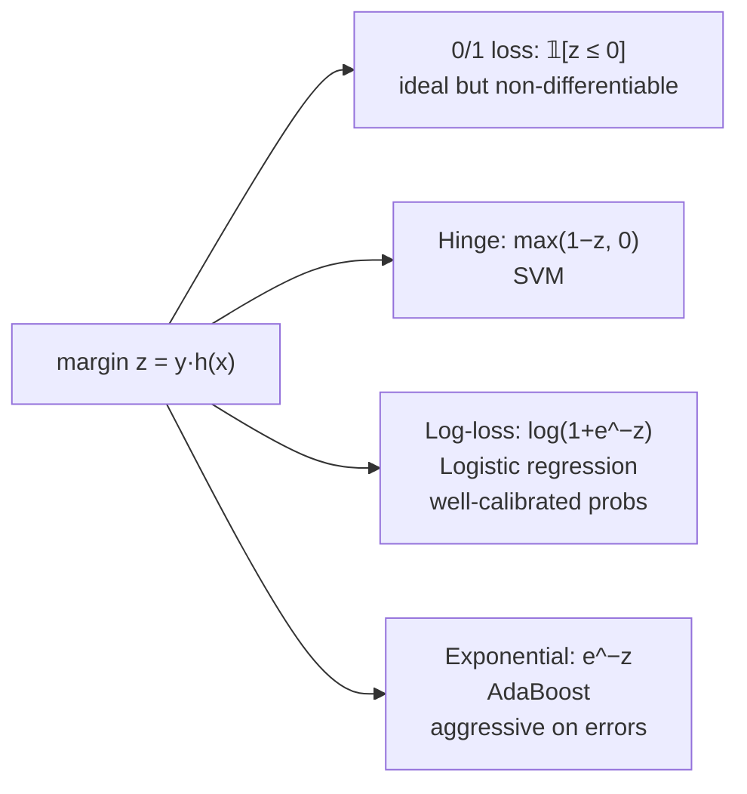
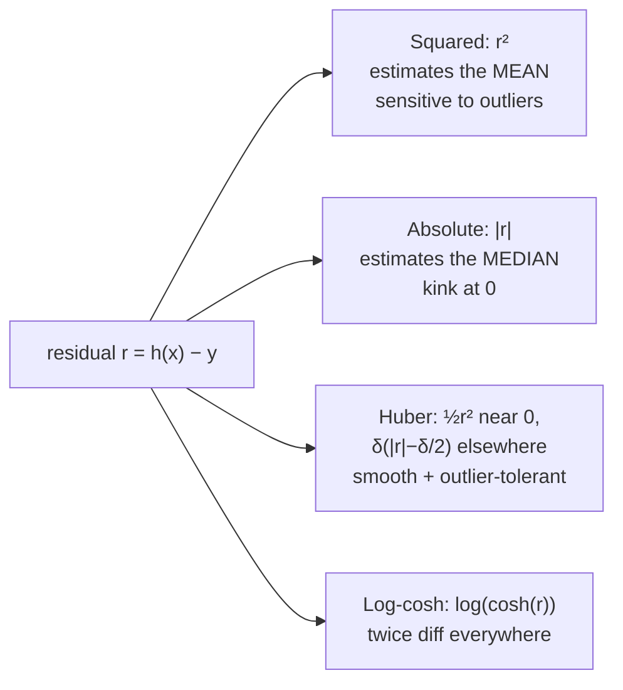
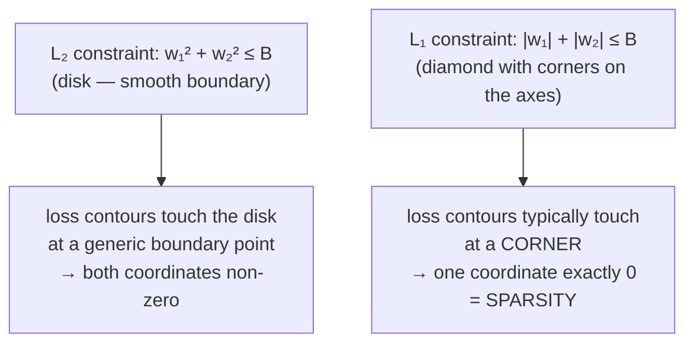
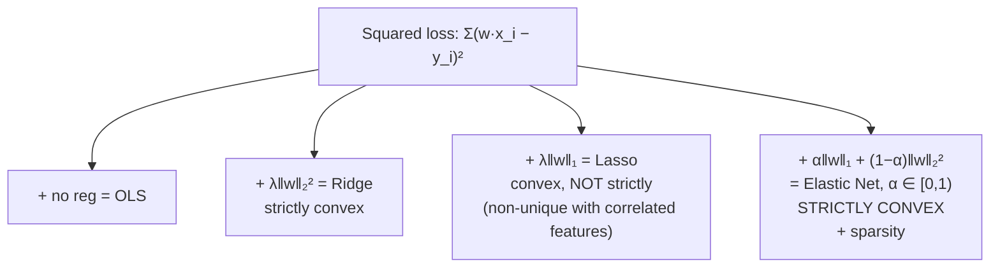
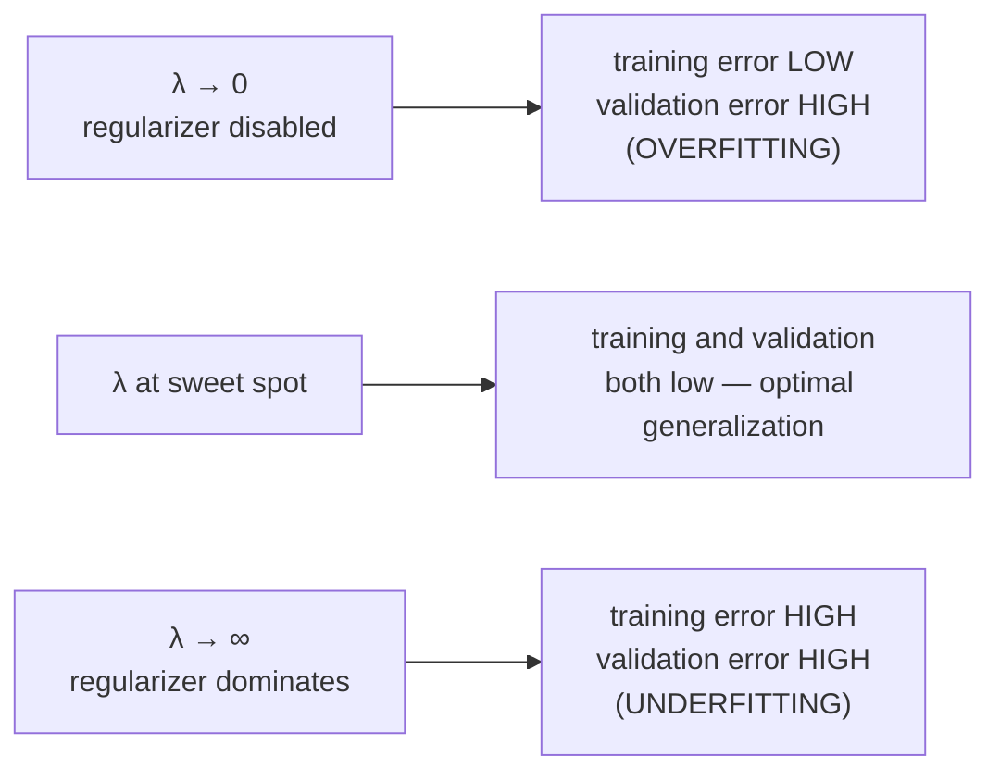
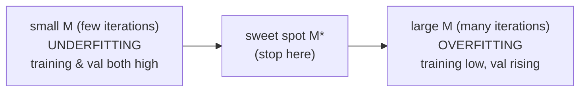

# Lecture 10 — Loss functions and regularizers

## Overview

**Phase B → Phase C bridge.** Both trees (L08) and SVMs (L09) raised the same question without naming it: *how do we control model complexity?* Trees did it through pruning and depth limits; SVMs did it implicitly through the soft-margin parameter $C$ — the SVM's $C$ was, in fact, the **first concrete regularizer** the course introduced. L10 generalizes this. It separates the two pieces every supervised learner has — a **data-fit term** (loss) and a **complexity-control term** (regularizer) — and gives a menu of choices for each.

The lecture has three threads, all bolted onto the same total objective:

$$
\min_w \; \underbrace{\tfrac{1}{N}\sum_{i=1}^{N} \ell\big(h_w(x_i), y_i\big)}_{\text{data loss}} \;+\; \lambda \cdot \underbrace{\Omega(w)}_{\text{regularizer}}.
$$

**Thread 1 — loss functions.** What does "wrong" mean for one example? The lecture's loss menu splits by task:

For **classification** with $y \in \{-1, +1\}$, all losses are functions of the **margin** $z = y\,h(x)$ ([[30-Sources/Statistical-Learning/pdf/SLP-Loss-functions-regs.pdf#page=4|slide 4]]):

| Loss | Formula | Used by | Comment |
| --- | --- | --- | --- |
| **0/1** | $\delta(\text{sign}(h(x_i)) \ne y_i)$ | the actual classification error | non-continuous, **impractical to optimize directly** |
| **Hinge** | $\max(1 - z, 0)^p$ | standard SVM ($p=1$), squared-hinge SVM ($p=2$) | only differentiable everywhere when $p=2$ |
| **Log-loss** (logistic) | $\log(1 + e^{-z})$ | logistic regression | most popular in ML; outputs **well-calibrated probabilities** |
| **Exponential** | $e^{-z}$ | AdaBoost | very aggressive — exponential growth in mis-prediction; nice convergence (e.g., AdaBoost), but **bad with noisy data** |

Hinge / log / exponential are all **convex surrogates** for the (non-convex) 0/1 loss — the thing we'd actually like to minimize but cannot, because it's discontinuous and gives no gradient.

For **regression** with $y \in \mathbb{R}$, losses are functions of the **residual** $z = h(x_i) - y_i$ ([[30-Sources/Statistical-Learning/pdf/SLP-Loss-functions-regs.pdf#page=22|slide 22]]):

| Loss | Formula | Estimates | Trade-off |
| --- | --- | --- | --- |
| **Squared** ($L_2$ / OLS) | $(h(x_i) - y_i)^2$ | the **mean** label | differentiable everywhere; **sensitive to outliers** |
| **Absolute** ($L_1$ / MAE) | $|h(x_i) - y_i|$ | the **median** label | less sensitive to noise; not differentiable at $0$ |
| **Huber** | $\tfrac{1}{2}z^2$ if $|z| < \delta$; otherwise $\delta(|z| - \delta/2)$ | "best of both worlds" | smooth absolute loss — quadratic near zero, linear when large |
| **Log-cosh** | $\log(\cosh(z))$ | similar to Huber | **twice differentiable everywhere** |

The **mean vs. median** framing is the key intuition: squared loss pushes the predictor toward the conditional mean of $y\mid x$ (because the constant minimizing $\sum(y_i - c)^2$ is the mean), while absolute loss pushes toward the conditional median (the constant minimizing $\sum|y_i - c|$ is the median). Pick squared if your data is well-behaved; pick absolute / Huber if you expect heavy-tailed noise or outliers.

**Thread 2 — regularizers.** What does "simple" mean for a model? A regularizer $\Omega(w)$ is a penalty on the parameter vector that **breaks ties** when multiple paths through parameter space minimize the loss equally well — it pushes toward a *particular kind* of solution. The lecture's recap framing:

- **Loss** computes, on average, how far each point is from a "good" solution.
- **Regularizer** picks, when multiple solutions are equivalent on the data, a particular kind of $w$.
- $\lambda$ sets the trade-off — how much to weigh the regularizer against the data loss.

The two most common are the same $L_1$ and $L_2$ norms we just saw as regression losses, but now **applied to $w$, not the residuals**:

- **$L_2$** ($\|w\|_2^2 = \sum_j w_j^2$): smooth, **strongly convex** → very nice optimization behavior. Shrinks coefficients toward zero **without zeroing them out**.
- **$L_1$** ($\|w\|_1 = \sum_j |w_j|$): **convex but non-smooth** (kink at $w_j = 0$) → slightly more complex convergence theory. Produces **sparse** solutions (many $w_j$ exactly $0$).

In modern solvers, the difference in optimization difficulty rarely matters in practice; the choice between $L_1$ and $L_2$ is driven by what kind of solution you want, not by what's faster to compute.

**Thread 3 — geometry.** The penalty form $\min \mathcal{L} + \lambda \Omega(w)$ and the **constraint form** $\min \mathcal{L} \text{ s.t. } \Omega(w) \le B$ are equivalent. For every $\lambda \ge 0$ there is a $B \ge 0$ that gives the same optimum, and vice versa — they're related by an **inverse** correspondence (large $\lambda$ ↔ small $B$). The constraint form is the easy way to see *why* $L_1$ creates sparsity:

- **$L_2$ constraint** ($w_1^2 + w_2^2 \le B$): the feasible set is a **disk**. Loss contours touch the disk at a generic boundary point, no axis-alignment.
- **$L_1$ constraint** ($|w_1| + |w_2| \le B$): the feasible set is a **diamond** with corners on the axes. Loss contours typically touch the diamond at a **corner** — exactly where some coordinate is zero. Hence sparsity.

If $B$ is set very large, the constraint is non-binding and the regularizer effectively does nothing — equivalent to $\lambda$ very small ([[30-Sources/Statistical-Learning/pdf/SLP-Loss-functions-regs.pdf#page=65|slide 65]]).

**The famous loss + regularizer pairings** ([[30-Sources/Statistical-Learning/pdf/SLP-Loss-functions-regs.pdf#page=70|slide 70]]):

| Method | Objective | Properties |
| --- | --- | --- |
| **OLS** (Ordinary Least Squares) | $\min_w \tfrac{1}{n}\sum (w^\top x_i - y_i)^2$ | squared loss, no regularization. Closed form: $w = (XX^\top)^{-1}Xy^\top$. |
| **Ridge** | $\min_w \tfrac{1}{n}\sum (w^\top x_i - y_i)^2 + \lambda \|w\|_2^2$ | squared loss + $L_2$. Closed form: $w = (XX^\top + \lambda I)^{-1}Xy^\top$. **Strictly convex.** |
| **Lasso** | $\min_w \tfrac{1}{n}\sum (w^\top x_i - y_i)^2 + \lambda \|w\|_1$ | squared loss + $L_1$. **Sparsity-inducing** (good for feature selection). **Convex but NOT strictly convex** — no unique solution if features are correlated/duplicated. Not differentiable at $w_j=0$. |
| **Elastic Net** | $\min_w \tfrac{1}{n}\sum (w^\top x_i - y_i)^2 + \alpha\|w\|_1 + (1-\alpha)\|w\|_2^2$, $\alpha \in [0, 1)$ | combines both. **Strictly convex** (i.e., unique solution) **even with correlated features**. + sparsity. − non-differentiable. |

The **strict convexity** point is the §1f exam answer. Pure $L_1$ is convex but not strictly so — if two features are identical, either can absorb the weight, so the optimum is a flat ridge. Adding any nonzero $L_2$ component (Elastic Net with $\alpha < 1$) breaks the tie because $L_2$ is strictly convex everywhere; the combined objective inherits strict convexity from the $L_2$ part.

## Key concepts

- [[loss-function|loss function]] (general framing) — though no dedicated note; covered through the family below.
- [[regularization]] — the general technique; this lecture is its first systematic treatment.
- [[l1-regularization]] / Lasso — sparse, corner-loving.
- [[l2-regularization]] / Ridge — smooth, shrinking.
- [[elastic-net]] — strictly convex combination.
- [[hinge-loss]] — SVM's classification loss, revisited.
- [[logistic-loss]] — logistic regression's loss; calibrated probabilities.
- [[exponential-loss]] — AdaBoost's loss; aggressive.
- [[mean-squared-error|squared loss]] — regression default; estimates the mean.
- [[huber-loss]] — quadratic near zero, linear far; outlier-resistant.
- [[early-stopping]] — implicit regularizer via iteration count $M$ instead of penalty $\lambda$.
- [[overfitting-underfitting]] — the failure modes the validation curves expose.

## Equations

**Total objective (the master form):**

$$
\min_w \; \frac{1}{N}\sum_{i=1}^{N} \ell\big(h_w(x_i), y_i\big) + \lambda \, \Omega(w).
$$

**Penalty ↔ constraint duality.** For every $\lambda \ge 0$ there exists $B \ge 0$ such that

$$
\min_w \; \mathcal{L}(w) + \lambda\, \Omega(w) \quad \Longleftrightarrow \quad \min_w \; \mathcal{L}(w) \;\text{s.t.}\; \Omega(w) \le B.
$$

Larger $\lambda$ corresponds to smaller $B$ (tighter constraint).

**Classification losses** in $z = y_i\, h(x_i)$:

$$
\ell_{0/1}(z) = \mathbb{1}[z \le 0], \quad \ell_{\text{hinge}}(z) = \max(1-z, 0), \quad \ell_{\log}(z) = \log(1 + e^{-z}), \quad \ell_{\exp}(z) = e^{-z}.
$$

**Regression losses** in $r = h(x_i) - y_i$:

$$
\ell_{\text{sq}}(r) = r^2, \quad \ell_{\text{abs}}(r) = |r|, \quad \ell_{\text{Huber},\delta}(r) = \begin{cases} \tfrac{1}{2}r^2 & |r| < \delta \\ \delta\bigl(|r| - \delta/2\bigr) & |r| \ge \delta. \end{cases}
$$

**Famous regularized regressions:**

$$
\text{Ridge:}\;\; \min_w \tfrac{1}{n}\sum_i (w^\top x_i - y_i)^2 + \lambda \|w\|_2^2
$$

$$
\text{Lasso:}\;\; \min_w \tfrac{1}{n}\sum_i (w^\top x_i - y_i)^2 + \lambda \|w\|_1
$$

$$
\text{Elastic Net:}\;\; \min_w \tfrac{1}{n}\sum_i (w^\top x_i - y_i)^2 + \alpha\|w\|_1 + (1-\alpha)\|w\|_2^2, \quad \alpha \in [0, 1).
$$

## Diagrams

### The total objective: two terms with a knob

The two terms compete: small loss wants to fit the data exactly; small $\Omega$ wants $w$ to be "simple." $\lambda$ is the dial.

### Classification loss menu (in margin $z = y\,h(x)$)

Hinge / log / exp are all **convex surrogates** for the 0/1 loss ([[30-Sources/Statistical-Learning/pdf/SLP-Loss-functions-regs.pdf#page=4|slide 4]]).

### Regression loss menu (in residual $r = h(x) - y$)

Choose mean (squared) vs median (absolute) by your noise model ([[30-Sources/Statistical-Learning/pdf/SLP-Loss-functions-regs.pdf#page=22|slide 22]]).

### Why $L_1$ creates sparsity (geometry of the constraint set)

The corners of the $L_1$ ball lie on the axes; the disk has no corners. That structural difference is what makes $L_1$ sparse and $L_2$ not ([[30-Sources/Statistical-Learning/pdf/SLP-Loss-functions-regs.pdf#page=65|slide 65]] et seq.).

### Famous loss + regularizer pairings

Elastic Net is the "have your cake and eat it" choice — the $L_2$ component restores strict convexity that pure $L_1$ loses ([[30-Sources/Statistical-Learning/pdf/SLP-Loss-functions-regs.pdf#page=70|slide 70]]).

### Validation curve vs. $\lambda$ — the U-shape

§2b on the past mock asks for exactly this curve: train error monotonically increasing in $\lambda$, validation error U-shaped with minimum at the sweet spot. Choose $\lambda$ on a log scale via cross-validation.

### Iteration count as an implicit regularizer (early stopping)

The iteration count $M$ in iterative training plays the same role as $\lambda$ — small $M$ underfits, large $M$ overfits, sweet spot in the middle. **Early stopping** picks $M^*$ by halting when validation error starts to rise, without an explicit penalty term ([[early-stopping]]).

## Why $L_2$ does NOT induce sparsity (the §1e trap)

A statement that sounds true but ends wrong: *"L2 regularization adds a penalty proportional to the squared magnitude of weights, which discourages large weights and **leads to sparse models**."* The first half is true; the conclusion is wrong. $L_2$ **shrinks coefficients toward zero** but does not zero them out exactly. Here's why, geometrically: the gradient of $\|w\|_2^2$ at $w_j = 0$ is exactly zero, so when a small data signal pushes $w_j$ slightly off zero, the $L_2$ penalty offers no resistance at exactly $0$ — it only fights *large* magnitudes. Whereas $\|w\|_1$ has a discontinuous gradient at zero (sub-gradient $\in [-1, +1]$), so any data signal smaller than $\lambda$ in magnitude gets crushed to exactly zero.

Memorize: **$L_1$ → sparse. $L_2$ → small but nonzero everywhere. Elastic Net → both effects, strictly convex.**

## Why Elastic Net is strictly convex (the §1f answer)

A function is **strictly convex** if its Hessian is positive definite — it has positive curvature in every direction. Strict convexity guarantees a **unique** minimizer.

- $\|w\|_1$ is convex but the Hessian is zero almost everywhere (it's piecewise linear) — flat directions exist when features are correlated or duplicated. Not strictly convex; the optimum can be a flat ridge.
- $\|w\|_2^2$ has Hessian $2I$, which is positive definite — strictly convex everywhere.
- Elastic Net = $\alpha \|w\|_1 + (1-\alpha)\|w\|_2^2$ with $\alpha < 1$. The $L_2$ piece contributes positive curvature in every direction; adding the (weakly) convex $L_1$ piece can't undo that. Hence strictly convex.

This is why Elastic Net is preferred over Lasso when features are correlated: Lasso arbitrarily picks one of the correlated features and zeros the rest; Elastic Net spreads weight smoothly across them while still inducing sparsity overall.

## Mock-exam connections

- **§1e — "L2 leads to sparse models"** → **false**. The trap is the *conclusion* — read sentences to the end. $L_2$ shrinks but doesn't zero out.
- **§1f — Elastic Net & strict convexity** → Elastic Net is **strictly convex** with $\alpha < 1$ even when features are correlated; pure $L_1$ is only convex (not strictly), so it can have non-unique solutions.
- **§2b — train/test curves vs $\lambda$** → train error rises monotonically with $\lambda$; validation error is **U-shaped**, minimum at the sweet spot. Small $\lambda$ → overfit, large $\lambda$ → underfit.
- See [[exam-blueprint#Topic coverage map]].

## Open questions

- The **closed-form Ridge solution** $w = (XX^\top + \lambda I)^{-1}Xy^\top$ is given but not derived in this lecture. The derivation is straightforward calculus: differentiate, set to zero, observe that adding $\lambda I$ to $XX^\top$ is the only change from the OLS normal equations.
- **Group Lasso, fused Lasso, and other structured sparsity penalties** are not in this lecture's scope but are natural follow-ups.
- **Bayesian interpretation** of regularization (Gaussian prior on $w$ ↔ $L_2$; Laplace prior ↔ $L_1$) is not in this deck — out of scope.
- The **bias-variance** language for *why* regularization helps is the next lecture (L11).

## See also

- [[bias-variance-decomposition]] — L11 explains *why* regularization helps (variance-reduction at the cost of bias).
- [[elastic-net]] — combined L1+L2 penalty mentioned in §1f as strictly convex even with correlated features.
