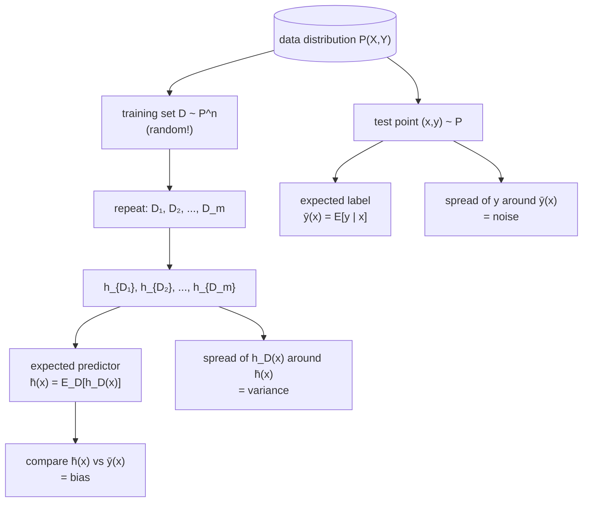
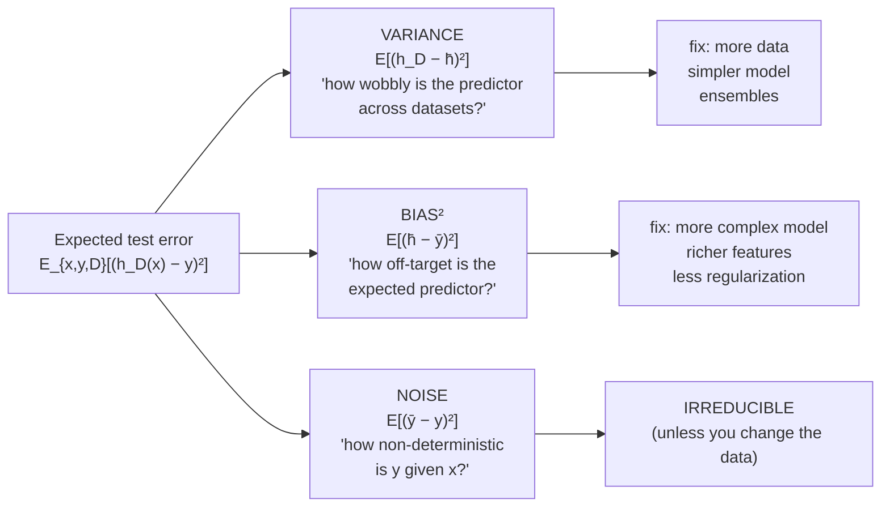
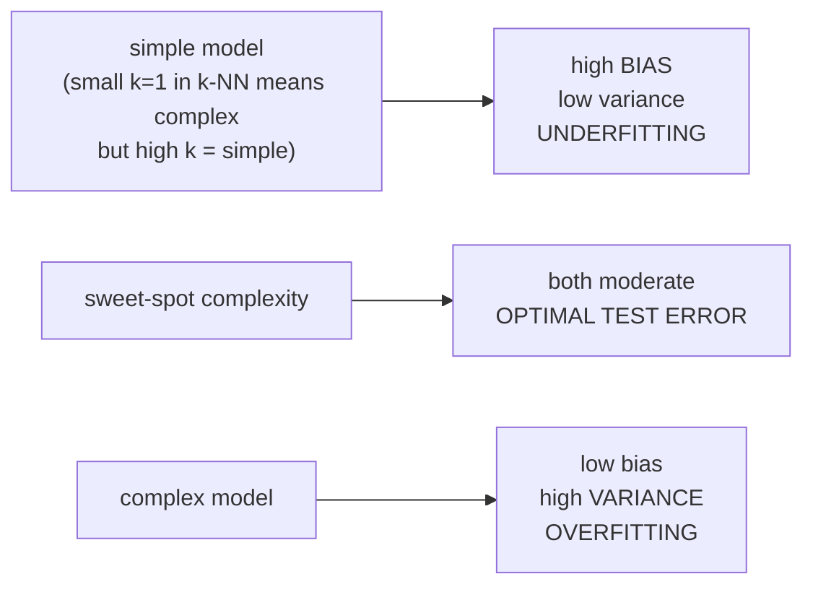
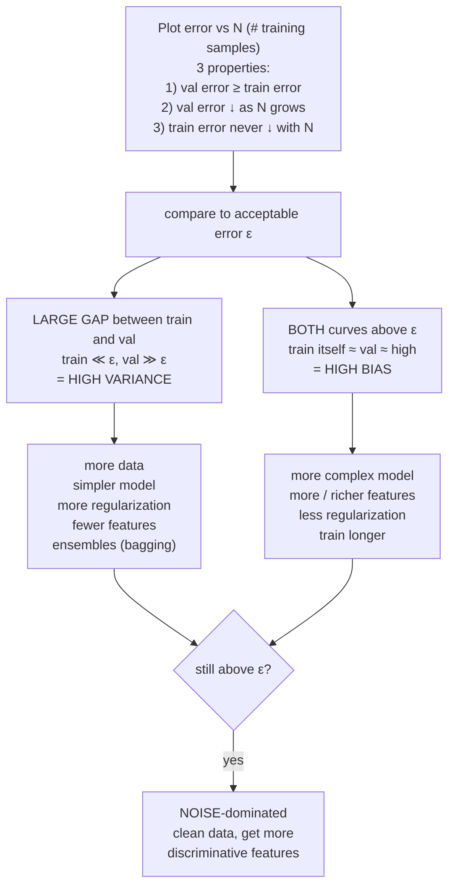
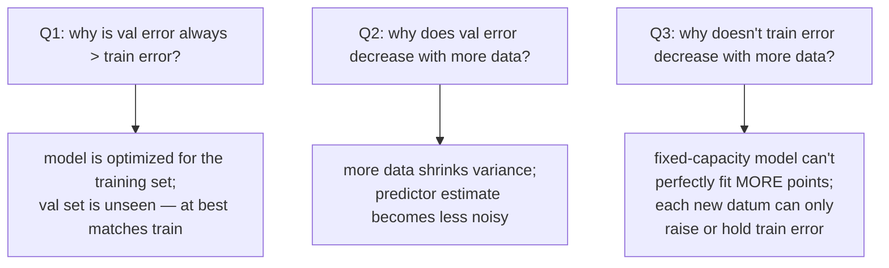

# Lecture 11 — Generalization and the bias–variance tradeoff

## Overview

L10 gave us the **dial** — regularization strength $\lambda$ — that controls model complexity. L11 explains *why* it works. The lecture decomposes a learner's expected test error into **three** terms — **bias², variance, noise** — that together explain everything we've informally called "underfitting" and "overfitting." Once you can name them, you can also tell which one is hurting you and what to do about it.

The lecture's three threads:

**Thread 1 — what we actually care about is generalization, not training error.** The "naive" ML setup minimizes the training loss $\frac{1}{N}\sum_i \mathcal{L}(h_\theta(x_i), y_i)$ and *hopes* this also minimizes the **generalization loss** $\mathbb{E}_{(x,y)\sim P}[\mathcal{L}(h_\theta(x), y)]$ — the expected loss on a fresh sample drawn from the population. The whole course up to L10 has been an implicit study of when this hope is justified.

**Thread 2 — randomness comes from two places, and we need names for both.** For a fixed input $x$:

- **Expected label** $\bar{y}(x) = \mathbb{E}_{y \mid x}[y]$ is the conditional mean of $y$ given $x$. It exists because $y$ is not always uniquely determined by $x$ — same house features, different prices ([[30-Sources/Statistical-Learning/pdf/SLP-Bias-variance(1).pdf#page=8|slide 8]]); same sex feature, different heights. The remaining variation $y - \bar{y}(x)$ is the **noise / data-intrinsic randomness**.
- **Expected predictor** $\bar{h}(x) = \mathbb{E}_D[h_D(x)]$ is the average prediction the algorithm would make at $x$ if you re-trained it on many independently drawn datasets $D \sim P^n$. The training set $D$ is itself random, so the trained predictor $h_D = A(D)$ is a random function. Estimate $\bar{h}(x)$ in practice by training many models on different bootstraps and averaging their predictions at $x$.

**Thread 3 — the decomposition.** With these two averages, the expected test error of a regression algorithm under squared loss decomposes into three independent, non-negative terms:

$$
\underbrace{\mathbb{E}_{x,y,D}\big[(h_D(x) - y)^2\big]}_{\text{Expected test error}} \;=\; \underbrace{\mathbb{E}_{x,D}\big[(h_D(x) - \bar{h}(x))^2\big]}_{\text{Variance}} \;+\; \underbrace{\mathbb{E}_x\big[(\bar{h}(x) - \bar{y}(x))^2\big]}_{\text{Bias}^2} \;+\; \underbrace{\mathbb{E}_{x,y}\big[(\bar{y}(x) - y)^2\big]}_{\text{Noise}}.
$$

Each term has a concrete meaning:

- **Variance** — *"how much does my predictor wobble across training sets?"* Reducible by training on more data, simpler models, ensembles ([[bagging]] in L12).
- **Bias²** — *"even with infinite data, would my expected predictor match the truth?"* Reducible by using more complex models, richer features, less regularization.
- **Noise** — *"how much variation in $y$ does $x$ fundamentally fail to explain?"* **Irreducible** — set by the data itself. The only fix is to collect *more informative features* or clean the labels.

The technical proof in the deck uses two add-and-subtracts ($+\bar{h}(x) - \bar{h}(x)$, then $+\bar{y}(x) - \bar{y}(x)$) and observes that the cross-terms vanish in expectation because $D$ is independent of $(x, y)$ and $\bar{h}, \bar{y}$ are the centers of the relevant distributions ([[30-Sources/Statistical-Learning/pdf/SLP-Bias-variance(1).pdf#page=44|slides ~40–55]]). The slide states the result holds for squared loss "to simplify the derivation" but generalizes to other losses and to classification.

**Thread 4 — the U-shape.** As model complexity grows:

- **Bias decreases** — a richer hypothesis class can match $\bar{y}$ more closely.
- **Variance increases** — a richer hypothesis class fits more of the noise in any one dataset, so re-training on a different $D$ produces a different fit.
- **Noise stays constant** — it doesn't depend on the model.

Total test error has the **U-shape** familiar from L10's $\lambda$ curve: high at simple end (high bias / underfitting), high at complex end (high variance / overfitting), minimum at the sweet spot. Regularization, early stopping, and dataset size all *move you along* this curve.

**Thread 5 — diagnosing bias vs. variance from learning curves.** Plot training error and validation error as functions of $N$, the number of training samples ([[30-Sources/Statistical-Learning/pdf/SLP-Bias-variance(1).pdf#page=88|slides ~83–98]]). Three properties hold:

1. **Validation error ≥ training error** — the model is optimized for the training set.
2. **Validation error decreases monotonically in $N$** — more data shrinks variance.
3. **Training error never decreases with $N$** (it stays flat or rises). More examples = more diversity to fit, and a fixed-capacity model can't memorize all of them.

Now compare the curves to your **acceptable test error** $\varepsilon$:

- **High variance**: training error is well below $\varepsilon$, but validation error is far above it — large gap. Fixes: more data, simpler model, more regularization, fewer features, ensembling.
- **High bias**: training error itself is above $\varepsilon$ (the model can't even fit the training set). Fixes: more complex model, more features, less regularization, train longer.
- **Both still failing after fixes**: the data has too much intrinsic noise — clean it, or collect more discriminative features.

This is the §2a sketch question on the past mock — the train-rises-with-$N$ / validation-falls-with-$N$ pair, and the gap between them tells you which bucket you're in.

## Key concepts

- [[bias-variance-decomposition]] — the central formula.
- [[learning-curve]] — error vs $N$, the diagnostic tool.
- [[generalization-error]] — the quantity being decomposed (= expected test error on $P$).
- [[expected-predictor]] — $\bar{h}$, the algorithm's average behavior.
- [[regularization]] — the bias-variance lens explains *why* it helps.
- [[overfitting-underfitting]] — the qualitative names for high-variance / high-bias regimes.
- [[bagging]] — the L12 trick targeted at variance.

## Equations

**Generalization (test) loss for predictor $h$:**

$$
\mathbb{E}_{(x,y)\sim P}[\mathcal{L}(h(x), y)].
$$

**Expected predictor (over training sets):**

$$
\bar{h}(x) = \mathbb{E}_{D \sim P^n}[h_D(x)].
$$

**Expected label (the regression-only quantity):**

$$
\bar{y}(x) = \mathbb{E}_{y \mid x}[y].
$$

**Bias–variance decomposition** under squared loss:

$$
\mathbb{E}_{x,y,D}\big[(h_D(x) - y)^2\big] = \underbrace{\mathbb{E}_{x,D}\big[(h_D(x) - \bar{h}(x))^2\big]}_{\text{Variance}} + \underbrace{\mathbb{E}_x\big[(\bar{h}(x) - \bar{y}(x))^2\big]}_{\text{Bias}^2} + \underbrace{\mathbb{E}_{x,y}\big[(\bar{y}(x) - y)^2\big]}_{\text{Noise}}.
$$

## Diagrams

### Two sources of randomness

The training set $D$ is the random variable that creates variance. The conditional distribution $y \mid x$ is the random variable that creates noise. Bias is what's left over after removing both ([[30-Sources/Statistical-Learning/pdf/SLP-Bias-variance(1).pdf#page=20|slides ~18–28]]).

### The decomposition, term by term

### Bias and variance vs model complexity

What controls model complexity, by algorithm:

| Algorithm | Complexity knob |
| --- | --- |
| **k-NN** | $k$ — small $k$ is complex (overfits to nearest noise), large $k$ is simple (smooths everything) |
| **MLPs** | depth, width, # parameters |
| **Decision trees** | tree depth, # leaves, min samples per leaf |
| **Linear SVM** | $C$ (large $C$ = complex, low slack tolerance; small $C$ = simple, wide margin) — i.e., $1/\lambda$ |

### Learning curves: diagnosing high bias vs high variance

This is the §2a question's logic — sketch the curves and identify which regime you're in ([[30-Sources/Statistical-Learning/pdf/SLP-Bias-variance(1).pdf#page=92|slides ~88–98]]).

### Why the three properties of learning curves hold

## How regularization moves you along the bias-variance curve

L10 introduced the dial; L11 names what it does:

- **More regularization** ($\lambda$ ↑) → simpler effective hypothesis → **lower variance, higher bias.**
- **Less regularization** ($\lambda$ ↓) → richer effective hypothesis → **higher variance, lower bias.**

The validation U-curve in L10's plots is exactly the bias² + variance + noise sum traced out as $\lambda$ moves. Cross-validating $\lambda$ is, mechanically, finding the bias-variance sweet spot for your data and architecture.

## Mock-exam connections

- **§2a — sketch train/test error vs $N$** → train error rises (or stays flat), test/validation error decreases, both converge to a floor of (bias² + irreducible noise). The closing gap between them = closing variance. This is what the past exam wants drawn.
- **§1 short questions** that touch on bias/variance vocabulary will lean on the lens here — e.g., 1g (boosting iterations control complexity → trade bias for variance), 1l (boosted unpruned stumps).
- See [[exam-blueprint#Topic coverage map]].

## Beyond the exam

The lecture's last third covers **generalization beyond the same distribution** — distribution shift, transfer learning, class imbalance ([[30-Sources/Statistical-Learning/pdf/SLP-Bias-variance(1).pdf#page=110|slides ~108–116]]). It mentions:

- **Distribution shifts** — deployment data differs from training data (e.g., wildlife camera traps in different locations).
- **Naive solution**: collect more data covering all deployment conditions.
- **SMOTE** — Synthetic Minority Over-sampling Technique: interpolate between existing minority-class examples to balance the training set.
- **Masking** — referenced briefly as another data-augmentation tool.

None of this is in the blueprint's L11 row (which lists only §2a). Treat as background context, not memorize-cold material.

## Open questions

- The decomposition is stated for **squared loss**. The slide claims it generalizes to other losses and classification, but doesn't redo the algebra. For 0/1 loss, an analogous decomposition exists (Domingos 2000; Kohavi & Wolpert 1996) but is more delicate and not on this exam.
- The **noise term** is irreducible *under the current feature set*. Adding more discriminative features can move "noise" into "signal" — the slide flags this as the fix when both bias and variance fixes have been exhausted.
- **Connection to L12 — bagging.** The variance term $\mathbb{E}_D[(h_D - \bar{h})^2]$ is exactly what bagging targets: averaging many bootstrap-trained predictors approximates $\bar{h}$ and reduces variance toward zero, leaving bias unchanged. This is the formal reason the slogan *"bagging reduces variance"* is true.

## See also

- [[bagging]] — L12's variance-reduction technique; the formal target of bagging is the variance term in this decomposition.
- [[boosting]] — L13's bias-reduction technique; reduces bias by sequential refinement, often increasing variance.
- [[expected-predictor]] — the idealized $\bar{h}$ that bagging approximates.
