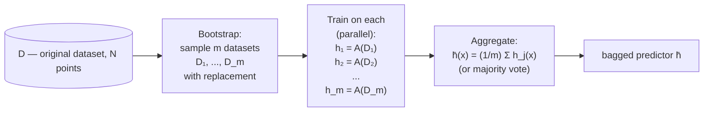
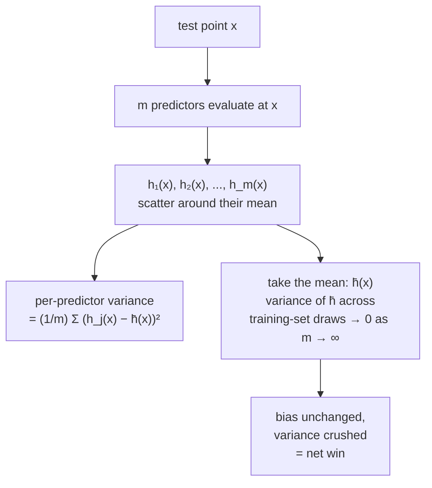
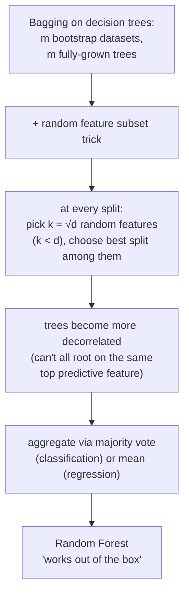
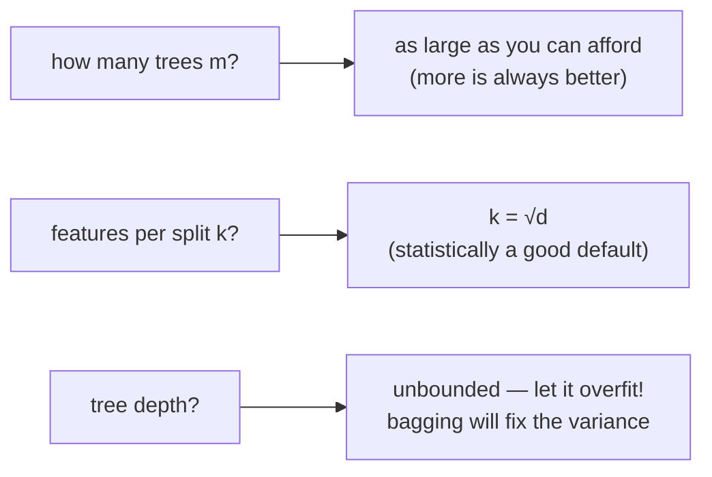
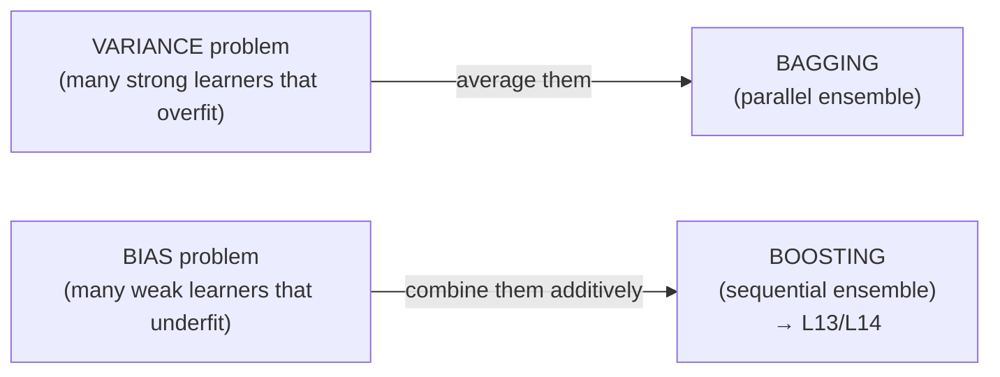

# Lecture 12 — Bagging and Random Forests

## Overview

**Phase C → Phase D bridge.** Bias–variance (L11) gave us the **lens** for diagnosing what's wrong with a learner. L12 introduces the first piece of practical machinery for **moving along** that curve: **bagging**, an ensemble method that targets the *variance* term specifically. Trees (L08) were the natural pairing — they are the canonical example of a **high-variance, low-bias** learner: deep trees memorize their training set easily, so changing the data even slightly produces a wildly different tree. Averaging many such trees, each trained on a slightly different sample, smooths out the disagreements and leaves a model that's still close to $\bar{h}$ (low bias) but no longer wobbly (low variance). The combination is called a **Random Forest**, and the lecture frames it as a one-line application of bagging to decision trees with one extra trick (random feature subsets at each split).

The lecture also previews **boosting** at the end — its mirror image. Where bagging combines many *strong* learners that each overfit (low bias, high variance), boosting will combine many *weak* learners that each underfit (high bias, low variance). The opening question of L13 is the closing question of L12: *can we combine weak learners to make a strong one?* (Kearns, 1988 → Schapire, 1990 → AdaBoost.)

The lecture has three threads:

**Thread 1 — the variance problem.** *"Changing the dataset slightly produces a different predictor."* This is variance, the L11 term. A model with this property is **too specific** — it's overfitting. We have two tools so far: more data (decreases variance directly), simpler model (decreases variance by reducing capacity, at the cost of more bias). L12 adds a third: **average many high-variance models** trained on slightly-perturbed datasets.

**Thread 2 — bagging = bootstrap + aggregate.** Given a single dataset $D$ of $N$ points:

1. **Bootstrap.** Sample $m$ new datasets $D_1, \ldots, D_m$ from $D$ **with replacement** — each $D_j$ contains $N$ points, but with repeats. This is the **bootstrap procedure**: standard statistical resampling that simulates having multiple draws from $P$ without actually collecting more data.
2. **Train.** Apply a chosen algorithm $A$ to each $D_j$, producing predictors $h_1, \ldots, h_m$. Each can run in parallel — embarrassingly parallel.
3. **Aggregate.** Define the final predictor as the average of the individual outputs:

$$
\bar{h}(x) = \frac{1}{m}\sum_{j=1}^{m} h_j(x).
$$

For classification, "average" means **majority vote** (or averaging probability outputs). For regression it's the literal mean.

**B** + **Ag**(gregate) = **BAgging**.

**Why does the mean make sense?** At any test point $x$, the individual $h_j(x)$ values disagree — they're scattered around their mean $\bar{h}(x)$. The **variance term** in the bias-variance decomposition is

$$
\text{Var}(h_j) = \frac{1}{m}\sum_{j=1}^m (h_j(x) - \bar{h}(x))^2.
$$

Picking *any single* $h_j$ inherits this variance. Picking the **mean** $\bar{h}(x)$ has variance zero with respect to the same set of training-set draws — by construction, $\bar{h}$ is the center the others are scattered around. In the limit $m \to \infty$, $\bar{h}$ approximates the true expected predictor from L11, and the variance term in the bias-variance decomposition shrinks to zero. **Bias is unaffected** — averaging biased predictors gives a biased average — so bagging is the right tool when variance is what's hurting you, not bias.

**Thread 3 — Random Forest = bagging applied to decision trees.** The recipe ([[30-Sources/Statistical-Learning/pdf/SLP-Bagging.pdf#page=37|slide 37]]):

1. Sample $m$ bootstrap datasets of up to $N$ points each (with replacement) from $D$.
2. For each $D_j$, train a decision tree **all the way to the end** — *let it overfit!* Don't prune. The whole point is that each tree is high-variance / low-bias; bagging fixes the variance for free.
3. **Extra trick — random feature subsets at each split.** Instead of considering all $d$ features when finding the best split for a given node, consider a **random subset of $k$ features** with $k < d$. **Statistically, $k = \sqrt{d}$** is a good default. Different trees will now disagree even more — they're not just trained on different data, they're built using different feature subsets. This **increases variety** among trees in the forest, decorrelating them and making the average even more powerful.
4. Aggregate as in standard bagging — majority vote (classification) or mean (regression).

Hyperparameters and their defaults:

- $k$ (features per split): **about $\sqrt{d}$**.
- $m$ (number of trees): **as large as you can afford** — more is always better (diminishing returns, no overfitting risk from $m$).
- Tree depth: **don't limit** — let each tree grow fully.

The slide deck calls Random Forest *"works out of the box"* — minimal hyperparameter tuning, very strong baseline on most tabular problems.

**Why the random-feature trick matters beyond plain bagging.** Bootstrap resampling produces correlated trees because they're trained on overlapping data. If two features are very predictive, *every* bootstrap tree will split on them at the root — so the trees are similar at the top, hence correlated, hence their average doesn't reduce variance as much as the i.i.d. assumption would suggest. Forcing each split to choose from a random subset of features breaks this lock-in and **decorrelates the trees**, making the average more effective.

**Closing — preview of boosting (L13).** The deck ends with the question:

> *"What if instead of many classifiers that overfit, we had many weak classifiers that underfit?"*

The mirror image of bagging — combining **weak learners** (high bias) instead of strong ones (high variance). The historical line:

- **1988 — M. Kearns (UPenn)**: can we combine many weak learners to make a strong learner? (Open theoretical question.)
- **1990 — R. Schapire (Princeton)**: yes — AdaBoost.

L13 picks up here.

## Key concepts

- [[bagging]] — the technique itself.
- [[bootstrap-sampling]] — the resampling-with-replacement step.
- [[random-forest]] — bagging + random feature subsets, applied to fully grown trees.
- [[decision-tree]] — the canonical high-variance / low-bias base learner; gets bagged here.
- [[bias-variance-decomposition]] — the lens that names *what bagging fixes*.
- [[expected-predictor]] — what bagging empirically approximates.
- [[overfitting-underfitting]] — bagging mitigates overfitting (variance) without making bias worse.

## Equations

**Bootstrap sample.** Draw $N$ examples from $D$ with replacement. Each $D_j$ has the same size as $D$ but contains repeats. About $63.2\%$ of the unique points in $D$ appear in any given bootstrap (the rest are out-of-bag).

**Bagged predictor.**

$$
\bar{h}(x) = \frac{1}{m}\sum_{j=1}^{m} h_j(x), \qquad h_j = A(D_j).
$$

For classification: $\bar{h}(x) = \text{mode}_j h_j(x)$ (majority vote).

**Variance among individual predictors at point $x$:**

$$
\text{Var}(h_j(x)) = \frac{1}{m}\sum_{j=1}^{m} (h_j(x) - \bar{h}(x))^2.
$$

**Random Forest hyperparameters:**

- Trees per forest: $m$ (as large as feasible).
- Features per split: $k = \sqrt{d}$ (statistically a good default).
- Tree depth: unbounded (grow fully).

## Diagrams

### Bagging — bootstrap + aggregate

The pipeline is two named pieces — **B**ootstrap then **Ag**gregate — and that's the etymology ([[30-Sources/Statistical-Learning/pdf/SLP-Bagging.pdf#page=15|slides ~12–17]]).

### Why averaging reduces variance

The mean is the center the predictions scatter around; using it absorbs all the inter-predictor disagreement into zero ([[30-Sources/Statistical-Learning/pdf/SLP-Bagging.pdf#page=22|slides ~20–28]]).

### Random Forest = Bagging + random feature subsets

The random-feature subset is what separates Random Forest from "just bagged trees" — and is responsible for its decorrelation and the strong empirical performance.

### Hyperparameter cheat sheet

### Bagging vs boosting (L12 closing slide → L13 opening)

The two ensemble paradigms are mirror images: bagging treats variance, boosting treats bias.

## Why bagging works (the bias-variance argument made precise)

Recall the L11 decomposition: $\text{Test error} = \text{Var} + \text{Bias}^2 + \text{Noise}$. Imagine the bagged predictor:

$$
\bar{h}(x) = \frac{1}{m}\sum_{j=1}^{m} h_j(x).
$$

If the $h_j$'s were truly i.i.d. draws from the algorithm-applied-to-$P^n$ distribution, the variance of $\bar{h}$ would be $\sigma^2 / m$ where $\sigma^2$ is the variance of one $h_j$. So in the i.i.d. limit, variance $\to 0$ as $m \to \infty$.

In practice the bootstrap samples overlap (they're drawn from the same $D$, not from $P$), so the trees are **correlated**. With correlation $\rho$ between any pair, the variance of the mean is:

$$
\text{Var}(\bar{h}) = \rho \sigma^2 + \frac{1 - \rho}{m}\sigma^2.
$$

The first term doesn't shrink with $m$ — it's the floor set by correlation. The reason Random Forest's random-feature trick matters is that it **reduces $\rho$**: trees split differently because they consider different features at each node, so they disagree more, and the floor drops.

The bias term is unchanged because $\mathbb{E}[\bar{h}(x)] = \mathbb{E}[h_j(x)] = \bar{h}_\text{algo}(x)$ — averaging unbiased estimators preserves unbiasedness; averaging biased estimators preserves the same bias.

## Mock-exam connections

- **§1 short questions** that lean on bagging vocabulary (e.g., 1g on "iterations as complexity control" — that's boosting, not bagging) will test the bagging-vs-boosting distinction.
- **The blueprint marks L12 as "not tested in this past mock"** — but the prof's caveat about more MCQs this year means bagging vocabulary (variance reduction, bootstrap, OOB, random feature subsets) is fair game.
- The bias-variance language from L11 is the only place L12 *quantitatively* connects to the past exam (§2a): bagging is the practical answer to "high variance" diagnosed from a learning curve.
- See [[exam-blueprint#Topic coverage map]].

## Open questions

- **Out-of-bag (OOB) error.** Each bootstrap leaves about $1/e \approx 36.8\%$ of the original points out — those can be used as a built-in held-out set per tree, giving a free validation estimate. The slide deck doesn't introduce this, but it's a standard Random Forest feature in practice.
- **Variable importance** from Random Forests (mean decrease in impurity, permutation importance) — practical interpretability tool, not in this lecture's scope.
- **Bagged regression vs majority-vote classification.** The deck shows the formula for the regression case ($\bar{h}$ as the literal mean). For classification, "average" usually means majority vote on hard labels or mean of class probabilities; the deck doesn't dwell on the distinction.
- The empirical win on tabular data is enormous — Random Forests are often the strongest baseline for tabular problems even today, only outperformed by gradient-boosted trees (L13). The reason is the combination of bagging + feature subsampling + fully-grown trees creating an ensemble of diverse strong learners.
