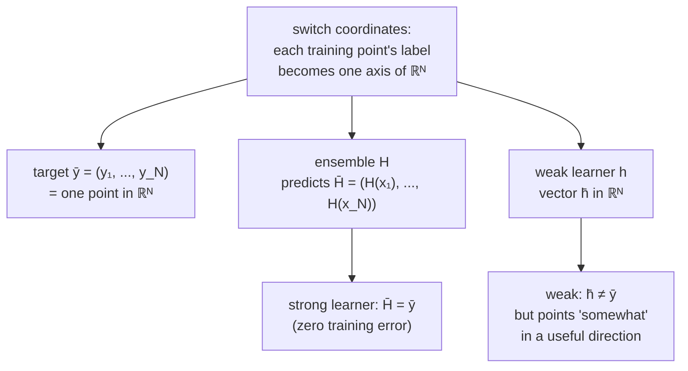
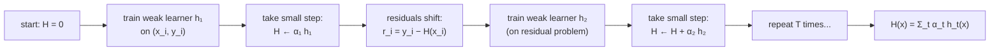
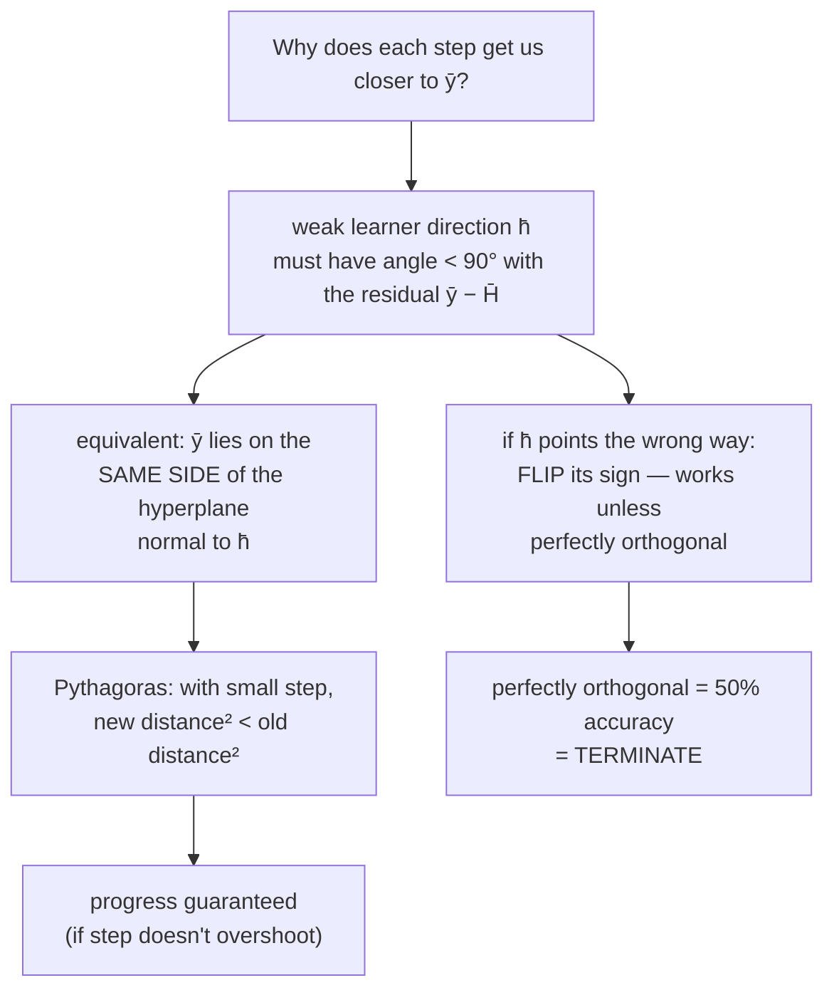
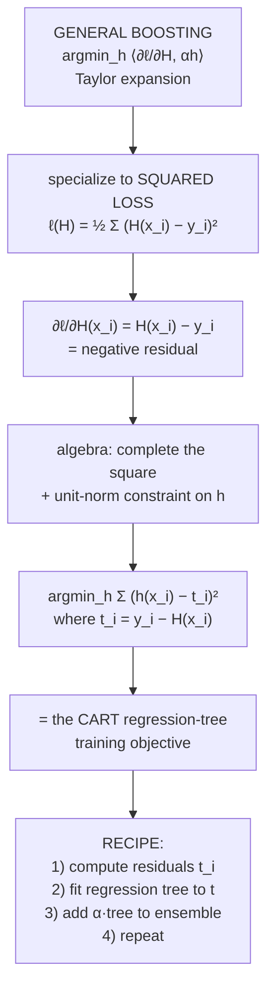
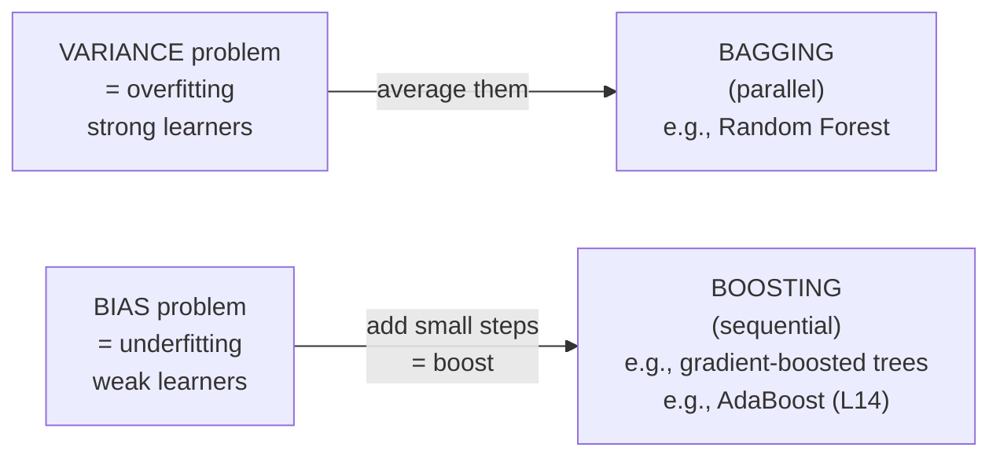

# Lecture 13 — Boosting (and gradient-boosted trees)

## Overview

L12 closed with the question: *what if instead of many strong classifiers that overfit, we had many weak classifiers that underfit?* L13 answers it. **Boosting** is the mirror image of bagging: a sequential ensemble that combines many **weak learners** (high-bias / low-variance) to produce a strong predictor by reducing **bias**.

The lecture sits inside Phase D and continues from L12 normally — no phase-boundary bridge needed. The thread is "ensembles for moving along the bias-variance curve": bagging targets variance (L12); boosting targets bias (this lecture).

**One framing note.** This lecture covers two things in sequence: (a) the **general boosting framework** — "boosting is gradient descent in function space" — and (b) the **specific algorithm gradient-boosted trees** for squared loss, derived as a worked example of the framework. AdaBoost (L14) is a *different* specific algorithm in the same framework, derived from exponential loss instead of squared loss. So L14 is a **sibling** of gradient boosting, not its child — both descend from the general framework introduced in the first half of L13.

The lecture has four threads:

**Thread 1 — the geometric setup.** A switch of coordinate systems makes the boosting argument transparent ([[30-Sources/Statistical-Learning/pdf/SLP-Boosting.pdf#page=4|slides ~4–10]]):

- Until now, points are vectors in **feature space** $\mathbb{R}^d$.
- For boosting, jump to **label space** $\mathbb{R}^N$ — each axis corresponds to one training point's label. A "point" in this space is a complete label assignment to all training data.

In this view:

- The **target** is $\vec{y} = (y_1, \ldots, y_N) \in \mathbb{R}^N$.
- A **strong learner** $H$ produces a vector $\vec{H} = (H(x_1), \ldots, H(x_N))$ that can match $\vec{y}$ exactly (zero training error: $\vec{H} = \vec{y}$).
- A **weak learner** $h$ produces a vector $\vec{h}$ that *doesn't* match $\vec{y}$ — it just points "somewhat in the right direction."

**Thread 2 — boosting is gradient descent in function space.** Imagine starting at the origin (no predictor yet). Train a weak learner; it points to some direction $\vec{h}$. Take a small step from $\vec{0}$ in that direction. We're now at a slightly different problem — closer to $\vec{y}$ but not there yet. Train a *new* weak learner on this updated problem; take another step. Repeat. *"Boosting is gradient descent in function space — our function is $h(x)$."*

The final ensemble is a weighted sum of all the weak learners traversed:

$$
H(x) = \sum_{t=1}^{T} \alpha_t\, h_t(x).
$$

The step size $\alpha_t$ acts like a learning rate — smaller steps take longer but give more accurate final predictions.

**Thread 3 — what makes this work?** For boosting to converge, each step must move us **somehow closer** to $\vec{y}$. Geometrically, this requires the angle between $\vec{h}_t$ and the residual direction $\vec{y} - \vec{H}_{t-1}$ to be **less than 90°** — equivalently, $\vec{y}$ lies on the same side of the hyperplane normal to $\vec{h}_t$ as the step we're about to take.

A **weak learner** is one with **error rate $< 50\%$** (better than random). The lecture's geometric proof:

- If $\vec{h}$ accidentally points the *wrong way*, **flip its sign** (multiply by $-1$). This always switches to the correct side **except** in the case of perfect orthogonality.
- Perfect orthogonality (50% accuracy on a binary task) means we can't make progress — the algorithm terminates.
- Otherwise, with a small enough step, we **must** decrease distance to $\vec{y}$. This follows from Pythagoras: if the residual is $\vec{a}$ and we move by $\vec{b}$ in a direction within 90° of $\vec{a}$, the new residual $\vec{d}$ satisfies $d^2 < a^2$ as long as we don't overshoot.

The takeaway: a weak learner with *any* edge over chance ($> 50\%$ on binary classification, or "non-orthogonal" gradient on regression) is enough to make boosting work. The framework is famously forgiving.

**Thread 4 — formalization with squared loss → gradient-boosted trees.** Initialize the ensemble at $H = 0$. At step $t$, we want to find the next weak learner $h_t$ that minimizes the loss after adding it:

$$
h_t = \arg\min_{h \in \mathcal{H}} \ell(H + \alpha h),
$$

where $\mathcal{H}$ is the hypothesis class (the set of weak learners). Use a Taylor expansion around the current $H$:

$$
\ell(H + \alpha h) \approx \ell(H) + \left\langle \frac{\partial \ell}{\partial H},\, \alpha h \right\rangle.
$$

The first term doesn't depend on $h$, so the argmin is

$$
h_t = \arg\min_{h \in \mathcal{H}} \left\langle \frac{\partial \ell}{\partial H},\, \alpha h \right\rangle = \arg\min_{h \in \mathcal{H}} \sum_{i=1}^{N} \frac{\partial \ell}{\partial H(x_i)} \cdot h(x_i).
$$

**For squared loss** $\ell(H) = \tfrac{1}{2}\sum_i (H(x_i) - y_i)^2$, the partial derivative is the **residual**:

$$
\frac{\partial \ell}{\partial H(x_i)} = H(x_i) - y_i.
$$

The full gradient vector is $\partial \ell / \partial H = \vec{H} - \vec{y}$, pointing **away** from the target. So the next $h_t$ should point toward $\vec{y} - \vec{H} = -(\partial \ell / \partial H)$ — the **negative gradient**.

**The trick.** Define the per-point negative gradient $t_i = -(H(x_i) - y_i) = y_i - H(x_i)$ — i.e., the **current residual**. Then

$$
\arg\min_h - \sum_i t_i h(x_i)
$$

isn't yet in a familiar form. Three algebraic moves convert it to squared-loss regression:

1. Multiply by 2 (doesn't change argmin): $\arg\min_h - 2 \sum_i t_i h(x_i)$.
2. Impose the constraint $\sum_i h(x_i)^2 = 1$ (normalize $\vec{h}$ to a unit-radius circle — otherwise $h$ could be made arbitrarily large to drive the inner product to $-\infty$). With this constraint, $\sum_i h(x_i)^2$ is a constant we can add for free.
3. Add the constant $\sum_i t_i^2$ (also doesn't change argmin) and complete the square:
$$
\arg\min_h \sum_i \big(h(x_i)^2 - 2 t_i h(x_i) + t_i^2\big) = \arg\min_h \sum_i (h(x_i) - t_i)^2.
$$

**That's squared loss with $t_i$ as the new target.** Exactly what a regression tree (CART) minimizes — no new algorithm needed.

**The complete recipe — gradient boosted trees:**

> At every iteration: take the labels and subtract from them what the ensemble has already predicted (= the residuals $t_i = y_i - H(x_i)$). Fit a CART regression tree that minimizes squared loss against $t$. Add the tree's predictions, scaled by $\alpha$, to the running ensemble.

In one line: **fit successive trees to the residuals.**

This generalizes: replace squared loss with another differentiable loss (logistic, Huber, exponential), and the same machinery still produces a working algorithm — fit each tree to the *negative gradient* of the loss. The exponential-loss instance is **AdaBoost** (L14).

## Key concepts

- [[boosting]] — the general framework.
- [[gradient-boosting]] — the specific algorithm for fitting trees to residuals.
- [[weak-learner]] — the > 50% accuracy primitive boosting builds on.
- [[decision-tree]] — the canonical boosting base learner (regression tree for gradient boosting; stumps for AdaBoost).
- [[bias-variance-decomposition]] — the lens for *why* boosting reduces bias.
- [[bagging]] — the variance-targeting counterpart from L12.
- [[exponential-loss]] — the loss whose gradient-boosting instance is AdaBoost.
- [[mean-squared-error]] — the loss for the worked-example derivation.

## Equations

**The boosting ensemble:**

$$
H(x) = \sum_{t=1}^{T} \alpha_t\, h_t(x), \qquad H_0 = 0.
$$

**The functional-gradient view.** At step $t$, choose

$$
h_t = \arg\min_{h \in \mathcal{H}} \sum_{i=1}^{N} \frac{\partial \ell}{\partial H(x_i)} \cdot h(x_i).
$$

**Squared-loss gradient (the residual):**

$$
\frac{\partial \ell}{\partial H(x_i)} = H(x_i) - y_i, \qquad t_i = y_i - H(x_i) = -\frac{\partial \ell}{\partial H(x_i)}.
$$

**Gradient-boosted regression tree subproblem at step $t$:**

$$
h_t = \arg\min_{h} \sum_{i=1}^{N} \big(h(x_i) - t_i\big)^2 — \text{a CART regression tree fit to the residuals.}
$$

## Diagrams

### The N-dimensional label-vector picture

The geometric insight that makes the rest of the lecture work ([[30-Sources/Statistical-Learning/pdf/SLP-Boosting.pdf#page=8|slides ~8–14]]).

### Boosting iteration as gradient descent in function space

Each iteration moves the running ensemble $\vec{H}$ a small distance toward $\vec{y}$ in label space.

### Convergence condition (angle < 90° = same side of hyperplane)

Any weak learner with $> 50\%$ accuracy is "non-orthogonal" and useful ([[30-Sources/Statistical-Learning/pdf/SLP-Boosting.pdf#page=46|slides ~42–55]]).

### From general boosting to gradient-boosted trees

The key algebraic move: **the "best weak learner" subproblem becomes squared-loss regression on the residuals**, which CART already solves.

### Bagging vs boosting (extended from L12)

Same shape, opposite orientation. Bagging averages parallel strong learners; boosting accumulates sequential weak ones.

## What makes a weak learner "good enough"?

A learner is **weak** if its accuracy on the training distribution is **strictly greater than 50%** (for binary classification). That's the *only* requirement — even 50.1% is enough. The geometric reason:

- 50% = perfectly orthogonal weak-learner vector $\vec{h}$ to the residual direction → no progress.
- 50.1% = small but nonzero angle within 90° → some progress per step.

The algorithm makes up for individual weakness through *iteration count*: $T$ small steps, each moving slightly forward, sum to a strong predictor. The smaller each step is, the more iterations you need but the more accurate the final ensemble.

## Why boosting reduces bias (and not variance)

Each weak learner has **high bias** (it underfits — by design) and **low variance** (a stump or shallow tree is robust to small data perturbations). The ensemble is a *weighted sum* of many such learners. Composing many low-bias-individually pieces in this additive fashion reduces the *aggregate* bias because each iteration corrects what the previous ones missed (the residuals).

Variance, however, can grow with $T$ — too many iterations and the ensemble starts fitting noise in the residuals, the same way a deep tree fits noise in the original data. So **boosting can overfit** — the iteration count $T$ is the regularization knob, and validation curves are U-shaped in $T$. This is the §1g answer: boosting iterations control complexity analogously to early stopping, $\lambda$, or any other regularizer.

## Mock-exam connections

- **§1g — "boosting iterations as complexity control"** → **true.** $T$ plays the same role as $\lambda$ in [[regularization]]: small $T$ underfits, large $T$ overfits, sweet spot in between. Validation error is U-shaped in $T$.
- **§1h — "gradient-boosted = linear combination of stumps"** → **true.** The final ensemble $H(x) = \sum_t \alpha_t h_t(x)$ is literally a linear (additive) combination. With shallow trees / stumps as base learners, the ensemble's decision boundary is far more complex than any single stump.
- **§1l — "boosted trees grown fully?"** → depends on the question's framing. The L12/L13 distinction matters: bagging wants fully-grown trees (high variance OK); boosting wants **shallow** trees / stumps (high bias OK).
- **§5 — full AdaBoost run** → derived from this framework via *exponential* loss. The general algorithm is L13; the specific weights $\alpha_t = \tfrac{1}{2}\ln\tfrac{1-\epsilon_t}{\epsilon_t}$ and the per-round example reweighting come from L14.
- See [[exam-blueprint#Topic coverage map]].

## Open questions

- **The relationship to AdaBoost.** L13 derives gradient boosting (squared loss). L14 derives AdaBoost (exponential loss). Both are siblings, descending from the general functional-gradient framework introduced in the first half of L13. Neither is more general than the other — they differ in which loss they target.
- **Stochastic gradient boosting / column subsampling** (XGBoost, LightGBM): combine boosting with bootstrap-style row sampling and Random-Forest-style column sampling per tree. Standard in production gradient boosting today, not derived in this lecture.
- **Regularization within boosting**: shrinkage (multiply $\alpha_t$ by a small constant $\eta < 1$ per round), tree-depth limits, minimum samples per leaf — all standard knobs not detailed in the SLP deck.
- **Why gradient boosting is currently the strongest tabular-data baseline**: same reasons as Random Forest (no scaling needed, handles mixed features, robust) plus bias reduction lets it climb past Random Forest's ceiling. XGBoost / LightGBM / CatBoost are the dominant implementations.
