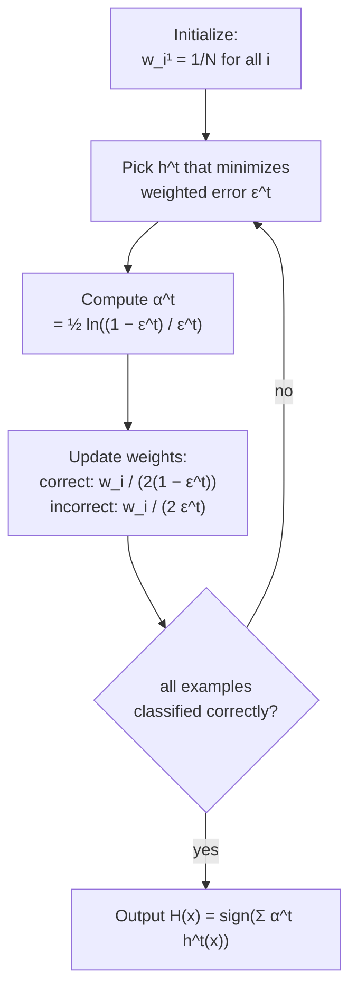
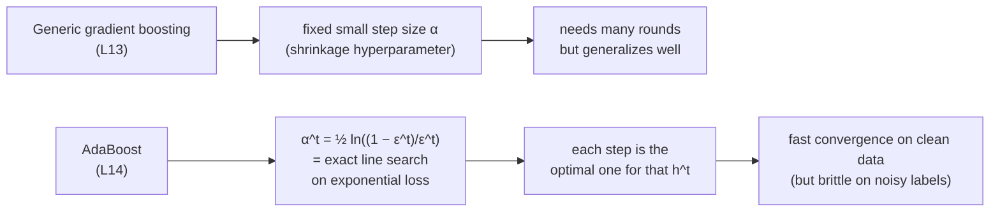
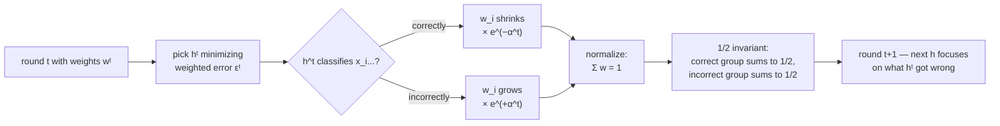
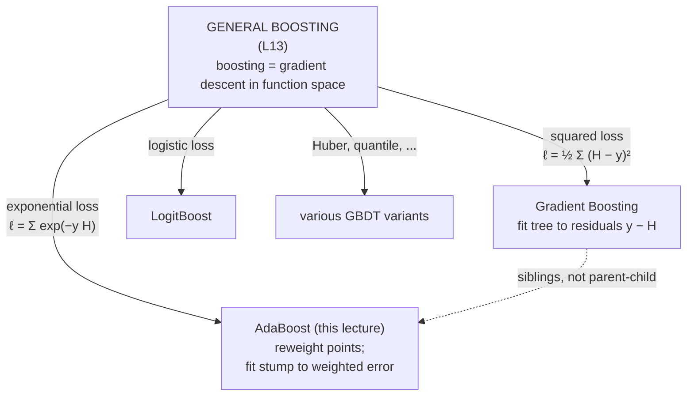

# Lecture 14 — AdaBoost

## Overview

L13 introduced the **general boosting framework** ("gradient descent in function space") and derived **gradient boosting** as the squared-loss instance. L14 derives **AdaBoost** — the same framework instantiated with **exponential loss** instead. AdaBoost and gradient boosting are **siblings** under the functional-gradient view, not parent-child: neither is more general than the other; they target different losses.

The lecture stays inside Phase D (ensembles) — no phase boundary. The thread continues: bagging targets variance, gradient boosting targets bias via squared-loss residuals, and AdaBoost targets bias via exponential-loss reweighting.

**Three things make AdaBoost distinctive among gradient-boosting variants:**

1. **Adaptive learning rate.** Each round picks $\alpha_t$ by **closed-form line search** rather than using a fixed step size. The exponential-loss algebra collapses to a one-line solution: $\alpha_t = \tfrac{1}{2}\ln\tfrac{1-\epsilon_t}{\epsilon_t}$.
2. **Weighted reweighting of training points.** Instead of fitting each new weak learner to a *different target* (residuals, as in gradient boosting), AdaBoost keeps the original $y_i$ but assigns **per-point weights** $w_i$ that grow on misclassified examples and shrink on correct ones. The next weak learner minimizes the **weighted error rate** rather than squared loss against a residual.
3. **Binary by construction.** The whole derivation assumes $y_i \in \{-1, +1\}$ and weak-learner output $h(x) \in \{-1, +1\}$. There is no native multi-class or regression form (extensions exist — SAMME for multi-class — but they're not in this lecture).

History: Freund & Schapire, 1995. Won the 2003 Gödel prize.

This lecture is **the most heavily tested in the course**: mock §5 is a full 3-round AdaBoost run from memory, with a fixed list of stumps, uniform initial weights, and the tie-break rule "prefer low-numbered stumps."

## The setup

- **Binary classification**: $y_i \in \{-1, +1\}$.
- **Weak learners**: $h(x) \in \{-1, +1\}$ for all $x$ — typically [[decision-tree|decision stumps]] (depth-1 trees, one feature test, two leaves).
- **Per-point weights** $w_i^t$ on the training set, summing to 1: $\sum_i w_i^t = 1$ (a probability distribution over training points).
- **Initial weights** are uniform: $w_i^1 = 1/N$ for all $i$.
- **Final ensemble**:
$$
H(x) = \mathrm{sign}\!\Big(\sum_{t=1}^{T} \alpha_t\, h_t(x)\Big).
$$

## The algorithm (memorize verbatim)

> **Initialize:** $w_i^1 = 1/N$ for $i = 1, \ldots, N$.
>
> **For** $t = 1, 2, \ldots, T$ (or until all examples are classified correctly):
>
> 1. Find the weak learner $h_t \in \mathcal{H}$ that **minimizes the weighted error**:
> $$
>     \epsilon_t = \sum_{i: h_t(x_i) \ne y_i} w_i^t.
> $$
>     **Tie-break:** prefer the lowest-numbered stump.
>
> 2. Compute the stump weight:
> $$
>     \alpha_t = \tfrac{1}{2} \ln\!\frac{1 - \epsilon_t}{\epsilon_t}.
> $$
>
> 3. Update weights — exponential reweighting:
> $$
>     w_i^{t+1} \propto w_i^t \exp\!\big(-\alpha_t\, y_i\, h_t(x_i)\big),
> $$
>     then renormalize so $\sum_i w_i^{t+1} = 1$.
>
>     Equivalently, in normalized closed form:
> $$
>     w_i^{t+1} =
>     \begin{cases}
>     \dfrac{w_i^t}{2(1 - \epsilon_t)} & \text{if } h_t(x_i) = y_i \quad (\text{correct})\\[6pt]
>     \dfrac{w_i^t}{2\,\epsilon_t} & \text{if } h_t(x_i) \ne y_i \quad (\text{incorrect})
>     \end{cases}
> $$
>
> **Output:** $H(x) = \mathrm{sign}\!\big(\sum_{t=1}^{T} \alpha_t\, h_t(x)\big)$.

The slide-87 algorithm box has a beautiful invariant — see "The 1/2 invariant" below.

## Where the formulas come from

### Setup: re-derive boosting against exponential loss

The exponential loss for binary classification with $y_i \in \{-1, +1\}$ is:
$$
\ell(H) = \sum_{i=1}^{N} e^{-y_i H(x_i)}.
$$

Apply the L13 functional-gradient view. The next weak learner $h_t$ should minimize $\ell(H + \alpha h)$. The partial derivative at the current $H$:
$$
\frac{\partial \ell}{\partial H(x_i)} = -y_i\, e^{-y_i H(x_i)}.
$$

Define the per-point weight $\hat{w}_i = e^{-y_i H(x_i)}$ (the unnormalized weight, $> 0$ for every point) and normalize: $w_i = \hat{w}_i / Z$, where $Z = \sum_i \hat{w}_i = \ell(H)$. So $\sum_i w_i = 1$ — a distribution over points.

### Step 1 — finding the best $h_t$

The argmin of the linear approximation becomes:
$$
h_t = \arg\min_h \Big(- \sum_i w_i\, h(x_i)\, y_i\Big).
$$

Split into correct vs incorrect:
- $h(x_i) y_i = +1$ if correct, $-1$ if incorrect.
- $-\sum_i w_i h(x_i) y_i = -\Big(\sum_{\text{correct}} w_i - \sum_{\text{wrong}} w_i\Big) = -((1 - \epsilon) - \epsilon) = 2\epsilon - 1$.

So minimizing this is equivalent to **minimizing $\epsilon$** — the weighted error:
$$
h_t = \arg\min_{h \in \mathcal{H}} \sum_{i: h(x_i) \ne y_i} w_i^t = \arg\min_{h} \epsilon_t.
$$

That justifies step 1 of the algorithm.

### Step 2 — closed-form $\alpha_t$ via line search

Once $h_t$ is fixed, find the optimal step size by exact line search on exponential loss:
$$
\alpha_t = \arg\min_\alpha \ell(H + \alpha h_t).
$$

Substitute $\ell$, split correct vs incorrect, multiply through by $Z$ (constant in $\alpha$):
$$
\arg\min_\alpha \Big[(1 - \epsilon_t)\, e^{-\alpha} + \epsilon_t\, e^{+\alpha}\Big].
$$

Differentiate, set to zero, solve:
$$
-(1 - \epsilon_t)\, e^{-\alpha} + \epsilon_t\, e^{+\alpha} = 0
\;\Longrightarrow\;
e^{2\alpha} = \frac{1 - \epsilon_t}{\epsilon_t}
\;\Longrightarrow\;
\boxed{\alpha_t = \tfrac{1}{2} \ln \frac{1 - \epsilon_t}{\epsilon_t}}.
$$

This is the **adaptive learning rate**: weak learners with low error ($\epsilon_t$ near 0) get **large** $\alpha_t$ (high vote); learners barely above chance ($\epsilon_t$ near 0.5) get $\alpha_t$ near 0 (low vote). At $\epsilon_t = 0.5$, $\alpha_t = 0$ and the algorithm terminates (no useful direction).

Because exponential loss admits a closed-form minimizer along $\alpha$, AdaBoost gets free **line search** — no separate optimization, no fixed shrinkage hyperparameter. This is why the convergence is so fast on clean data.

### Step 3 — weight update

The new weights $w_i^{t+1}$ correspond to evaluating $\hat{w}_i = e^{-y_i (H_t)(x_i)} = e^{-y_i (H_{t-1} + \alpha_t h_t)(x_i)}$. Factoring:
$$
\hat{w}_i^{t+1} = \hat{w}_i^t \cdot e^{-\alpha_t y_i h_t(x_i)} \quad\Longrightarrow\quad w_i^{t+1} \propto w_i^t\, e^{-\alpha_t y_i h_t(x_i)}.
$$

For **correct** points ($y_i h_t(x_i) = +1$): multiplier is $e^{-\alpha_t} < 1$ → weights **shrink**.
For **incorrect** points ($y_i h_t(x_i) = -1$): multiplier is $e^{+\alpha_t} > 1$ → weights **grow**.

Plug $\alpha_t = \tfrac{1}{2}\ln\tfrac{1-\epsilon_t}{\epsilon_t}$ into the multipliers:
- $e^{-\alpha_t} = \sqrt{\epsilon_t / (1 - \epsilon_t)}$ — for correct points.
- $e^{+\alpha_t} = \sqrt{(1 - \epsilon_t) / \epsilon_t}$ — for incorrect points.

After computing the normalization $Z_t$ and dividing through, the closed form simplifies to the version on slide 87:
$$
w_i^{t+1} =
\begin{cases}
\dfrac{w_i^t}{2(1 - \epsilon_t)} & \text{(correct)}\\[6pt]
\dfrac{w_i^t}{2\,\epsilon_t} & \text{(incorrect)}
\end{cases}
$$

### The 1/2 invariant (memorize as a sanity check)

After every weight update, the **sum of weights on correctly-classified points equals the sum of weights on misclassified points equals exactly 1/2.**

Proof:
- After update, $\sum_{\text{correct}} w_i^{t+1} = (1 - \epsilon_t) \cdot \tfrac{1}{2(1 - \epsilon_t)} \cdot \tfrac{1}{?}$...

Cleaner: sum the closed form over all $i$:
$$
\sum_i w_i^{t+1} = \underbrace{\sum_{\text{correct}} \frac{w_i^t}{2(1 - \epsilon_t)}}_{(1-\epsilon_t) / [2(1-\epsilon_t)] = 1/2} + \underbrace{\sum_{\text{wrong}} \frac{w_i^t}{2\epsilon_t}}_{\epsilon_t / (2\epsilon_t) = 1/2} = 1.
$$

Both halves are exactly $1/2$ — the algorithm bisects the next round's "attention" between what the previous stump got right and what it got wrong. This is **the** quick check during a by-hand exam run: after each round, the correct group's total weight should sum to 0.5, and the incorrect group's total weight should sum to 0.5. If not, you have an arithmetic error.

## Worked example — 3 rounds (mock §5 dress rehearsal)

Setup (from slides ~155–168, Larsen credit): 10 training points, binary labels.

### Round 1

Initial weights: $w_i^1 = 1/10 = 0.1$ for all 10 points.

Pick $h_1$ = the stump with the lowest weighted error from the candidate list. Suppose it misclassifies 2 of the 10 points:
$$
\epsilon_1 = 2 \cdot 0.1 = 0.2.
$$

Compute stump weight:
$$
\alpha_1 = \tfrac{1}{2}\ln\frac{1 - 0.2}{0.2} = \tfrac{1}{2}\ln 4 \approx 0.69.
$$

Update weights:
- Correct (8 points): $w^2 = 0.1 / (2 \cdot 0.8) = 0.1 / 1.6 = 0.0625$.
- Incorrect (2 points): $w^2 = 0.1 / (2 \cdot 0.2) = 0.1 / 0.4 = 0.25$.

**Sanity check** (the 1/2 invariant): $8 \cdot 0.0625 = 0.5$, $2 \cdot 0.25 = 0.5$. Total $= 1$. ✓

### Round 2

Pick $h_2$ — must minimize the **weighted** error using the new $w^2$. Now the 2 points $h_1$ missed each carry weight 0.25, so a stump that nails them is heavily incentivized.

In the slide example, $h_2$ is a vertical-split stump with the 2 high-weight points now on the correct side. Its weighted error works out to $\epsilon_2 \approx 0.19$ (one or two of the 0.06-weight points are now misclassified). Compute:
$$
\alpha_2 = \tfrac{1}{2}\ln\frac{1 - 0.19}{0.19} = \tfrac{1}{2}\ln(0.81/0.19) \approx \tfrac{1}{2}\ln 4.26 \approx 0.73.
$$

Note $\alpha_2 > \alpha_1$ — the second stump scored lower weighted error so gets a higher vote.

Update weights with $\epsilon_2 \approx 0.19$:
- Correct points: $w^3 = w^2 / (2 \cdot 0.81) \approx w^2 / 1.62$.
- Incorrect points: $w^3 = w^2 / (2 \cdot 0.19) \approx w^2 / 0.38$.

The 1/2 invariant should hold again — verify by summing.

### Round 3

Same procedure: with $w^3$, find $h_3$ minimizing weighted error, compute $\alpha_3 = \tfrac{1}{2}\ln\tfrac{1-\epsilon_3}{\epsilon_3}$, update weights via the closed form.

### Final ensemble & training error

Final ensemble: $H(x) = \mathrm{sign}(\alpha_1 h_1(x) + \alpha_2 h_2(x) + \alpha_3 h_3(x))$.

To get training error: for each of the 10 points, compute $\sum_t \alpha_t h_t(x_i)$ (a real number in $[-\sum_t \alpha_t, +\sum_t \alpha_t]$), take its sign, compare to $y_i$. The fraction misclassified is the **(unweighted) training error rate**.

### The exam mechanics in three checks

1. **Initial weights** $1/n$ uniform.
2. **Pick the lowest-numbered stump** that achieves the minimum weighted error (tie-break rule).
3. **After each update**, the correct group should sum to 0.5 and the incorrect group should sum to 0.5 — if not, recheck arithmetic.

## Equations (formula sheet does NOT provide)

**Final ensemble:**
$$
H(x) = \mathrm{sign}\!\Big(\sum_{t=1}^{T} \alpha_t\, h_t(x)\Big).
$$

**Initial weights:**
$$
w_i^1 = \frac{1}{N}, \qquad i = 1, \ldots, N.
$$

**Per-round weighted error:**
$$
\epsilon_t = \sum_{i: h_t(x_i) \ne y_i} w_i^t = \sum_{i=1}^{N} w_i^t\, \mathbb{1}[h_t(x_i) \ne y_i].
$$

**Stump weight (closed-form line search on exponential loss):**
$$
\alpha_t = \tfrac{1}{2} \ln \frac{1 - \epsilon_t}{\epsilon_t}.
$$

**Weight update (proportional form):**
$$
w_i^{t+1} \propto w_i^t \exp\!\big(-\alpha_t\, y_i\, h_t(x_i)\big),
\quad\text{then renormalize}.
$$

**Weight update (post-normalization closed form):**
$$
w_i^{t+1} =
\begin{cases}
\dfrac{w_i^t}{2(1 - \epsilon_t)} & \text{(correct)}\\[6pt]
\dfrac{w_i^t}{2\,\epsilon_t} & \text{(incorrect)}
\end{cases}
$$

**Loss minimized (implicitly):**
$$
\ell_{\exp}(H) = \sum_{i=1}^N e^{-y_i H(x_i)}.
$$

## Diagrams

### The AdaBoost loop (from slide 87)

### Adaptive vs fixed step size — the line-search payoff

### Reweighting picture

### Where AdaBoost sits in the boosting family

## Worked-example trajectory (visual)

![[30-Sources/Statistical-Learning/slides-png/SLP-Adaboost(1)/slide-158.png]]
*Figure: Round 1 — uniform weights $1/10$; first stump misclassifies 2 of 10 points, so $\epsilon_1 = 2/10 = 0.2$ and $\alpha_1 = \tfrac{1}{2}\ln(8/2) \approx 0.69$ (slide 158).*

![[30-Sources/Statistical-Learning/slides-png/SLP-Adaboost(1)/slide-160.png]]
*Figure: After Round 1 — the 2 misclassified points jump from $0.1$ to $0.25$; the 8 correct points shrink to $0.0625$. Note $8 \cdot 0.0625 + 2 \cdot 0.25 = 1$ and the two halves each sum to $1/2$ (slide 160).*

![[30-Sources/Statistical-Learning/slides-png/SLP-Adaboost(1)/slide-165.png]]
*Figure: Round 2 — second stump (vertical split) achieves $\epsilon_2 \approx 0.19$ on the new weights, giving $\alpha_2 \approx 0.73$. The previous round's high-weight points are now on the correct side (slide 165).*

## Mock-exam connections

- **§5 (full AdaBoost run)** — this lecture's entire raison d'être. Memorize: tie-break rule, $w_i^1 = 1/N$, $\epsilon_t$ formula, $\alpha_t$ formula, weight update closed form, the 1/2 invariant, final ensemble form. Practice the 3-round trajectory above until you can do it cold.
- **§1l (boosted trees grown fully?)** — for AdaBoost, base learners are **stumps** (depth-1 trees) — no pruning needed, no concept of "growing fully." For deeper boosted trees, the answer can flip. Read the question wording carefully.
- **§1g (boosting iterations control complexity)** — same answer as L13: $T$ is the regularization knob; validation error U-shaped in $T$.
- **§1h (gradient-boosted = linear combo of stumps)** — true; AdaBoost is also a linear combo of stumps, weighted by $\alpha_t$. Both gradient boosting (with stumps) and AdaBoost produce ensembles of the form $\mathrm{sign}(\sum_t \alpha_t h_t(x))$ — a linear combination whose decision boundary can be far more complex than any individual stump.
- See [[exam-blueprint#Topic coverage map]].

## Open questions

- **Robustness to noisy labels.** Exponential loss is unbounded — a single mislabeled point can dominate the next round's reweighting. Real-world AdaBoost variants (LogitBoost) replace exponential with logistic loss to bound per-point influence. See [[exponential-loss]] for the trade-off.
- **Multi-class extension.** Standard AdaBoost is binary by construction. Variants like SAMME and AdaBoost.M2 handle multi-class — not in this deck.
- **Termination.** The algorithm terminates when no $h \in \mathcal{H}$ achieves $\epsilon_t < 0.5$ — i.e., the hypothesis class is exhausted relative to the current weights. With finite candidate stumps this can happen; in practice you stop when training error hits zero or a max-iteration cap.
- **Connection to forward-stagewise additive modeling.** Hastie et al. (2009) showed AdaBoost is provably equivalent to forward-stagewise additive modeling under exponential loss — the L13 functional-gradient view is one way to see it; the FSAM derivation is another.
- **Stacking** (mentioned briefly in the deck's last few slides): a different ensemble paradigm — train multiple base models in parallel, then train a **meta-classifier** on their predictions. Not derived in detail; just flagged as "another ensemble idea."
