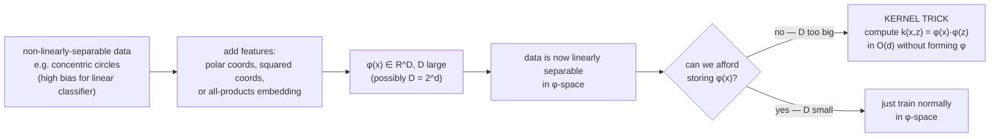
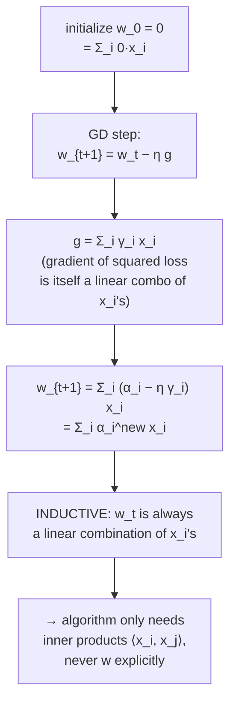
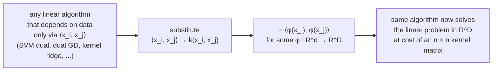
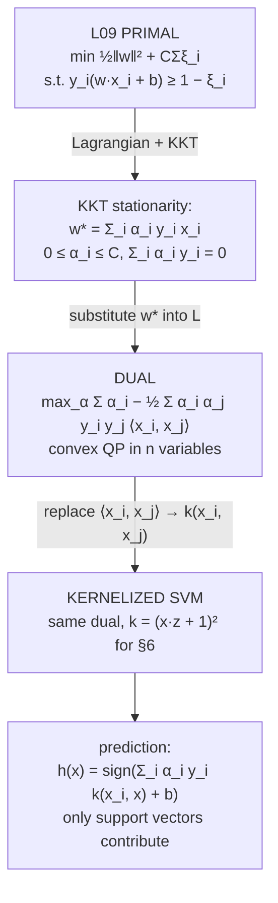

# Lecture 15 — Kernels I (Inner products in higher dimensions)

## Overview

L09 derived the linear SVM and left a promise: *the dual formulation and the kernel trick — L15 covers it*. L13–L14 took a detour through ensembles. This lecture comes back and **finishes the SVM story** — but reaches the kernel trick through a more general gateway than just SVMs.

The core idea: many linear algorithms can be **reformulated to depend only on inner products** $\langle x_i, x_j \rangle$ between training points, never on the raw feature vectors. Once that's true, you can replace those inner products with a **kernel function** $k(x_i, x_j)$ that secretly computes an inner product in a much higher-dimensional **feature space** $\phi(x)$ — without ever materializing $\phi(x)$ itself. The non-linear power of the high-dim space, with the cost of a low-dim algorithm.

The lecture stays inside Phase E (kernels) — no phase boundary. The thread to L09: SVM's primal in the original feature space → SVM's dual depending only on inner products → kernelized SVM solving a non-linear problem in the original space at the cost of an $n \times n$ kernel matrix.

**Three threads:**

1. **The motivation problem** — non-linearly-separable data needs feature engineering; enumerating every polynomial combination explodes to $2^d$ dimensions. Untenable directly.
2. **The representer-style claim** — for a linear classifier trained by gradient descent, the optimal weights $w$ are always expressible as a linear combination of training points: $w = \sum_i \alpha_i x_i$. So the algorithm only ever needs $\langle x_i, x_j \rangle$, never $w$ explicitly.
3. **The kernel trick** — substitute $\langle x_i, x_j \rangle \to k(x_i, x_j)$ everywhere, where $k$ secretly computes $\langle \phi(x_i), \phi(x_j) \rangle$ in a high-dim feature space. The example: $k(x, z) = \prod_{k=1}^d (1 + x_k z_k)$ is the inner product of all-subsets-products embeddings ($O(2^d)$-dimensional) but computable in $O(d)$.

## Thread 1 — the motivation: linear classifiers can underfit

L11 framed bias and variance. A pure linear classifier on data that lives on, say, **concentric circles** (positive class inside, negative class outside) is the canonical **high-bias** failure: no straight line separates the two classes ([[30-Sources/Statistical-Learning/pdf/SLP-Kernels(1).pdf#page=4|slide ~4]]).

Fix: **add features** that make the data linearly separable.

For concentric circles, several transformations work:
- Polar coordinates: $(x_1, x_2) \to (r, \theta)$. The radius $r$ alone separates the classes by a threshold.
- Squared coordinates: $(x_1, x_2) \to (x_1^2, x_2^2)$. The sum $x_1^2 + x_2^2$ (squared distance to origin) separates.

The general recipe: **construct new features as products / non-linear combinations of existing ones**. But:

> *"Usually we can't just look at the data and find the optimal transform — we don't know what new features to add."*

So instead, **add all possible non-linear feature combinations**. For features $(x_1, \ldots, x_d)$, the all-subsets product embedding is:
$$
\phi(x) = (1,\, x_1,\, x_2,\, \ldots,\, x_d,\, x_1 x_2,\, x_1 x_3,\, \ldots,\, x_1 x_2 \cdots x_d).
$$
**Dimension:** $2^d$ (each variable is either present or absent — the size of a power set).

For $d = 1000$ (text classification, image patches), $\phi(x) \in \mathbb{R}^{2^{1000}}$ — more than the number of atoms in the universe. **Storing $\phi(x)$ is impossible.** Computing dot products in that space directly is impossible. We need a different route.

## Thread 2 — the representer-style insight

Train a linear classifier $w$ by gradient descent on squared loss:
$$
\ell(w) = \sum_{i=1}^n (w^\top x_i - y_i)^2,
\qquad
\nabla_w \ell = g = \sum_{i=1}^n 2(w^\top x_i - y_i)\, x_i.
$$

The gradient $g$ is itself a **linear combination of the training points** $x_i$, with scalar coefficients $\gamma_i = 2(w^\top x_i - y_i)$.

**Claim** (the lecture's central insight): the trained weights can be written
$$
w = \sum_{i=1}^n \alpha_i x_i \qquad \text{for some scalars } \alpha_i.
$$

This isn't a guess; it's provable by induction on GD iterations.

### Proof by induction on GD iterations

**Base case.** Initialize $w_0 = \vec{0}$. Then $\alpha_i = 0$ for all $i$ trivially gives $w_0 = \sum_i 0 \cdot x_i$. ✓

**Inductive step.** Assume $w_t = \sum_i \alpha_i^{(t)} x_i$. The GD update is $w_{t+1} = w_t - \eta g$. The gradient $g = \sum_i \gamma_i x_i$ is a linear combo of $x_i$'s. So:
$$
w_{t+1} = \sum_i \alpha_i^{(t)} x_i - \eta \sum_i \gamma_i x_i = \sum_i (\alpha_i^{(t)} - \eta \gamma_i)\, x_i = \sum_i \alpha_i^{(t+1)} x_i. \qquad \blacksquare
$$

The new $\alpha_i^{(t+1)} = \alpha_i^{(t)} - \eta \gamma_i$. Since the loss is **convex**, GD converges to the global optimum from any starting point — so the optimal $w^*$ admits this same representation.

The same argument works for many other convex losses (logistic, hinge, exponential) — only the gradient-coefficient formula changes.

### The dual algorithm

Instead of tracking $w \in \mathbb{R}^d$, track $\alpha \in \mathbb{R}^n$. Inner products $k_{ij} = x_i^\top x_j$ get **precomputed** into an $n \times n$ kernel (Gram) matrix.

```text
initialize α_i = 0 for all i

repeat until convergence:
    γ_i = (Σ_j α_j k_{ij}) − y_i        for each i           # weighted residual
    α_i ← α_i − η γ_i                    for each i           # GD update
```

**Test-time prediction:**
$$
h(x_{\text{new}}) = w^\top x_{\text{new}} = \sum_i \alpha_i\, x_i^\top x_{\text{new}}.
$$
We never store $w$. We store the $\alpha_i$'s and the training set, plus the kernel matrix.

This is the **dual form** of GD. It's slower if $d \ll n$ (you went from $O(d)$ per gradient step to $O(n)$), but it sets up the next move:

## Thread 3 — the kernel trick

Pick a feature map $\phi: \mathbb{R}^d \to \mathbb{R}^D$ (with potentially $D = 2^d$). Apply the dual algorithm in $\phi$-space: replace every $x_i^\top x_j$ with $\phi(x_i)^\top \phi(x_j)$. Define the **kernel function**:
$$
k(x, z) = \phi(x)^\top \phi(z).
$$

**The trick:** for many useful $\phi$'s, $k(x, z)$ has a **closed-form expression** that's computable in $O(d)$ time *without ever forming $\phi(x)$ explicitly*.

### The motivating example: all-subsets products

Take $\phi(x) = (1, x_1, x_2, \ldots, x_d, x_1 x_2, x_1 x_3, \ldots, x_1 x_2 \cdots x_d)$ — all $2^d$ products of subsets of features (including the empty product $1$). Then:
$$
k(x, z) = \phi(x)^\top \phi(z) = \prod_{k=1}^{d} (1 + x_k z_k).
$$

**Verify by expanding the product** for small $d$:
- $d = 2$: $(1 + x_1 z_1)(1 + x_2 z_2) = 1 + x_1 z_1 + x_2 z_2 + x_1 x_2 z_1 z_2$. ✓ (matches the four-term inner product of $\phi(x), \phi(z)$ in $\mathbb{R}^4$).
- $d = 3$: extends to 8 terms — every subset product appears once.

The expanded sum has $2^d$ terms but the **product form has only $d$ factors** — computable in $O(d)$ time and $O(d)$ memory. We just **silently embedded** into $\mathbb{R}^{2^d}$ at the cost of $\mathbb{R}^d$ arithmetic.

### General kernel functions (preview of L16)

Other useful kernels — same idea, different $\phi$:

| Kernel | Formula | Implicit feature space |
| --- | --- | --- |
| **Linear** | $k(x, z) = x^\top z$ | $\phi(x) = x$ — no transformation |
| **Polynomial degree $p$** | $k(x, z) = (x^\top z + c)^p$ | All monomials of degree $\le p$ — $O(d^p)$-dimensional |
| **Quadratic** (mock §6) | $k(x, z) = (x^\top z + 1)^2$ | All monomials of degree $\le 2$ |
| **Gaussian / RBF** | $k(x, z) = \exp(-\|x - z\|^2 / 2\sigma^2)$ | **Infinite-dimensional** — uncountably many features |
| **All-subsets** (this deck) | $\prod_{k=1}^d (1 + x_k z_k)$ | $\mathbb{R}^{2^d}$ — every subset product |

L16 will cover construction rules (when is $k$ a valid kernel?) and the Mercer condition.

### What "kernel trick" means precisely

> *"We can take our data, map it onto an exponentially high-dimensional space, and run our algorithm in this high-dimensional space. **Except we never once compute any inner products in that space!** In many cases it wouldn't even be possible. But because we only need inner products between data points, we can compute those relatively cheaply — and get the exact same solution we would have obtained."*

The trick is purely algorithmic: **whenever an algorithm depends on $x$ only through inner products $\langle x_i, x_j \rangle$, you can substitute $k(x_i, x_j)$ and get the same algorithm running in $\phi$-space**. This works for SVMs, ridge regression, PCA (kernel PCA), perceptron, k-NN (with appropriate distance kernel) — anything that "factorizes through inner products."

## Connection to SVM — the dual via Lagrangian/KKT

The L15 deck reaches the kernel trick via squared-loss GD. **The same property holds for the SVM via a different derivation** (Lagrangian/KKT), and that's the canonical route for the mock §6 problem. Sketch:

### Step 1: SVM primal (L09)

Soft-margin SVM:
$$
\min_{w, b, \xi}\ \tfrac{1}{2} \|w\|^2 + C \sum_i \xi_i \quad
\text{s.t.}\quad y_i(w^\top x_i + b) \ge 1 - \xi_i,\ \ \xi_i \ge 0.
$$

### Step 2: Lagrangian

Introduce dual variables $\alpha_i \ge 0$ for the margin constraints and $\mu_i \ge 0$ for the slack constraints:
$$
\mathcal{L}(w, b, \xi, \alpha, \mu) = \tfrac{1}{2} \|w\|^2 + C \sum_i \xi_i - \sum_i \alpha_i [y_i(w^\top x_i + b) - 1 + \xi_i] - \sum_i \mu_i \xi_i.
$$

### Step 3: KKT stationarity gives the representer form

Setting $\partial \mathcal{L}/\partial w = 0$:
$$
\boxed{\,w^* = \sum_i \alpha_i\, y_i\, x_i\,}.
$$

This is **exactly the L15 representer-style insight** — the optimal $w$ is a linear combination of training points (here weighted by $\alpha_i y_i$). Setting $\partial \mathcal{L}/\partial b = 0$ gives the constraint $\sum_i \alpha_i y_i = 0$. Setting $\partial \mathcal{L}/\partial \xi_i = 0$ gives $\alpha_i + \mu_i = C$, hence $0 \le \alpha_i \le C$.

### Step 4: the SVM dual problem

Substitute $w^* = \sum_i \alpha_i y_i x_i$ back into the Lagrangian. After algebra:
$$
\boxed{\ \max_{\alpha} \ \sum_i \alpha_i - \tfrac{1}{2} \sum_{i,j} \alpha_i \alpha_j y_i y_j\, \langle x_i, x_j\rangle \quad
\text{s.t.}\quad 0 \le \alpha_i \le C,\ \ \sum_i \alpha_i y_i = 0\ }.
$$

The objective depends on the data **only through inner products** $\langle x_i, x_j \rangle$. Apply the kernel trick — replace with $k(x_i, x_j)$:
$$
\max_{\alpha}\ \sum_i \alpha_i - \tfrac{1}{2} \sum_{i,j} \alpha_i \alpha_j y_i y_j\, k(x_i, x_j).
$$

Same convex-quadratic problem (a QP) in $n$ variables, now solved in feature-space-defined-by-$k$.

### Step 5: kernelized prediction

$$
h(x_{\text{new}}) = \mathrm{sign}\!\Big(\sum_i \alpha_i y_i\, k(x_i, x_{\text{new}}) + b\Big).
$$

Only data points with $\alpha_i > 0$ contribute — the **support vectors**. KKT complementary slackness gives: $\alpha_i > 0 \iff y_i (w^\top x_i + b) = 1 - \xi_i$, i.e., the point lies on the margin or inside it. **The decision boundary depends only on support vectors** (mock §1c).

### Mock §6 — quadratic kernel SVM with slack

$\phi(x)$ is defined so that $\phi(x) \cdot \phi(x') = (x \cdot x' + 1)^2$ — the quadratic kernel. The full slack primal is restated inline on the exam (formula sheet provides nothing else).

For a **large $C$**, the SVM strives for low slack — narrow margin, decision boundary tries to nail every training point in $\phi$-space. For **small $C$**, wider margin, more tolerance for slack — boundary smoother in $\phi$-space, may misclassify some training points. Same trade-off as in the linear primal, just embedded in the quadratic feature space. **Justify-your-answer prompts** demand explicit reasoning about this trade-off, not just a sketched curve.

## Equations

**Primal (L09 recap):**
$$
\min_{w, b, \xi}\ \tfrac{1}{2} \|w\|^2 + C \sum_i \xi_i \quad \text{s.t.}\quad y_i(w^\top x_i + b) \ge 1 - \xi_i,\ \ \xi_i \ge 0.
$$

**Representer form** (true for any GD-trained linear classifier on convex loss; true for SVMs via KKT):
$$
w^* = \sum_i \alpha_i x_i \qquad \text{(general)} \qquad w^* = \sum_i \alpha_i y_i x_i \qquad \text{(SVM)}.
$$

**SVM dual:**
$$
\max_{\alpha}\ \sum_i \alpha_i - \tfrac{1}{2} \sum_{i,j} \alpha_i \alpha_j y_i y_j\, k(x_i, x_j) \quad \text{s.t.}\quad 0 \le \alpha_i \le C,\ \ \sum_i \alpha_i y_i = 0.
$$

**Kernelized prediction:**
$$
h(x_{\text{new}}) = \mathrm{sign}\!\Big(\sum_i \alpha_i y_i\, k(x_i, x_{\text{new}}) + b\Big).
$$

**Quadratic kernel** (mock §6):
$$
k(x, z) = (x^\top z + 1)^2.
$$

**All-subsets-products kernel** (this deck's worked example):
$$
k(x, z) = \prod_{k=1}^d (1 + x_k z_k) = \phi(x)^\top \phi(z),
\quad \phi: \mathbb{R}^d \to \mathbb{R}^{2^d}.
$$

## Diagrams

### The feature-engineering motivation



### The representer-form insight



### The kernel substitution



### From linear SVM (L09) to kernel SVM (L15)



## Mock-exam connections

- **§6 (full SVM with quadratic kernel and slack)** — the closed-form $\phi(x) \cdot \phi(x') = (x \cdot x' + 1)^2$ is the quadratic kernel. The slack primal is restated inline on the exam (formula sheet provides nothing else). Memorize the **$C$ trade-off geometry**: large $C$ → narrow margin in $\phi$-space; small $C$ → wide margin, more slack tolerated.
- **§1c — decision boundary determined by support vectors** — KKT complementary slackness: $\alpha_i > 0 \iff$ point is on / inside margin. All other points have $\alpha_i = 0$ and contribute nothing to $w$ or to predictions.
- **§2c — linear SVM cannot achieve zero training error on XOR** — true, because XOR isn't linearly separable in the original space. Apply a kernel (e.g., quadratic) and it becomes solvable in $\phi$-space.
- **Justify-your-answer prompts** (§6a, §6b) — partial credit on the written reasoning, not the sketch alone. Verbalize the $C$ trade-off, the role of support vectors, what the kernel does.
- See [[exam-blueprint#Topic coverage map]].

## Open questions

- **When is a function $k(x, z)$ a valid kernel?** I.e., when does there exist some $\phi$ such that $k(x, z) = \langle \phi(x), \phi(z) \rangle$? The **Mercer condition**: $k$ must be symmetric and positive semi-definite (every Gram matrix $K_{ij} = k(x_i, x_j)$ has non-negative eigenvalues). L16 covers this.
- **Construction rules for kernels.** Sums of kernels are kernels; products are kernels; $k_1 \cdot k_2$, $\alpha k_1 + \beta k_2$ for $\alpha, \beta \ge 0$, etc. L16 details these.
- **The Gaussian / RBF kernel.** $k(x, z) = \exp(-\|x - z\|^2 / 2\sigma^2)$ corresponds to an **infinite-dimensional** feature space. The bandwidth $\sigma$ controls smoothness — small $\sigma$ → narrow influence around each support vector → flexible decision boundary, risk of overfit. L16 covers RBF.
- **Cost trade-off.** Dual algorithms cost $O(n)$ per step in $n$, vs $O(d)$ for primal GD. When $n \gg d$, primal is faster. The dual / kernel approach pays off when $d$ is huge or implicitly infinite.
- **Representer theorem (formal).** The L15 deck shows the representer property by GD induction; a more general result (the **representer theorem**) shows that any minimizer of an L2-regularized loss in a reproducing kernel Hilbert space (RKHS) admits the form $w^* = \sum_i \alpha_i \phi(x_i)$, with no GD needed. May be referenced in L16.
