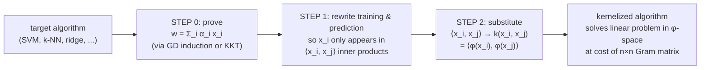
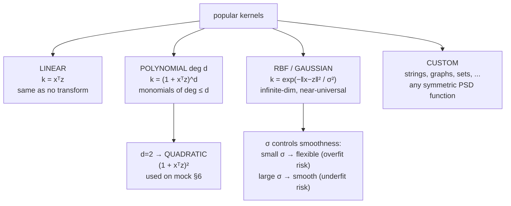
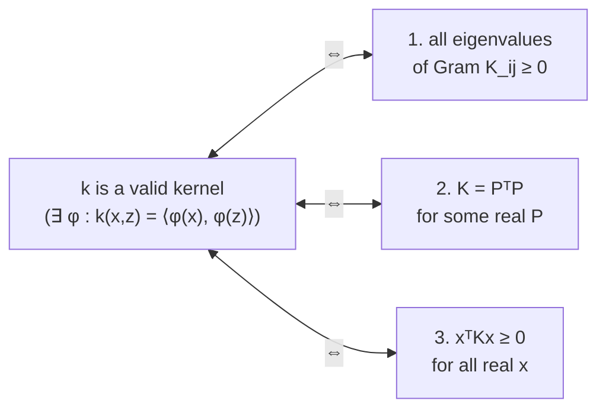
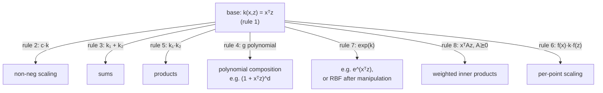
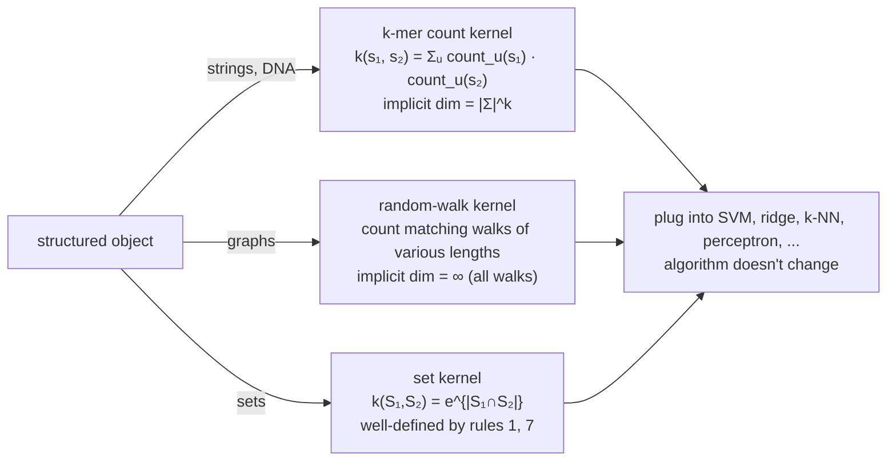

# Lecture 16 — Kernels II (Kernel machines)

## Overview

L15 derived the **kernel trick**: for any algorithm that depends on its data only through inner products $\langle x_i, x_j \rangle$, replace those inner products with a kernel function $k(x_i, x_j) = \langle \phi(x_i), \phi(x_j)\rangle$ to lift the algorithm into a high-dimensional feature space at no asymptotic cost. L16 fills in the **practical machinery**:

- A short list of **popular kernels** (linear, polynomial, RBF / Gaussian).
- **What makes a function a valid kernel** — the positive-semi-definite condition (informally, "Mercer's condition").
- **8 construction rules** for combining valid kernels into more valid kernels.
- **Kernels for non-vector data** — strings, DNA, graphs, sets — letting kernel methods operate on objects that don't have a natural vector representation.
- The 2-step **kernelization recipe** (the "kernel machine" framing): prove the algorithm depends only on inner products, then substitute.

Stays inside Phase E (kernels). Continuity from L15: same dual-form algorithm, now with a wider menu of kernels and some theory about which $k$'s are legit.

## Recap of L15 (one paragraph)

For a linear classifier trained by GD on a convex loss, $w^* = \sum_i \alpha_i x_i$ — a **linear combination of training points**. So both training and prediction depend on the data only through inner products $\langle x_i, x_j \rangle$. The dual algorithm tracks the $\alpha_i$'s and the precomputed Gram matrix $K_{ij} = \langle x_i, x_j \rangle$. Substitute $K_{ij} \to k(x_i, x_j)$ and you've kernelized — the same algorithm now solves a non-linear problem in the implicit feature space $\phi$.

## Why the kernel matrix is a "big deal" (computational angle)

For squared loss in dual form:
$$
\ell(w) = \sum_{i=1}^n (w^\top x_i - y_i)^2 \;\longrightarrow\; \sum_{i=1}^n \Big(\sum_{j=1}^n \alpha_j k(x_i, x_j) - y_i\Big)^2.
$$
The kernel values $k(x_i, x_j)$ are computed **once** at the start of training and stored in an $n \times n$ matrix. Every gradient step then just touches matrix entries — no recomputation, no high-dim feature evaluation. Training rips through iterations.

The cost: $O(n^2)$ memory for the Gram matrix and $O(n^2 d)$ to populate it (cheap for moderate $n$). The payoff: solve in $\phi$-space at the cost of a vector-of-$\alpha_i$'s — independent of how huge $\phi$ is.

## Popular kernel functions

| Kernel | $k(x, z)$ | Implicit feature space | Typical use |
| --- | --- | --- | --- |
| **Linear** | $x^\top z$ | original $\mathbb{R}^d$ | when $d$ is huge but data is roughly linear (text, sparse features) |
| **Polynomial** | $(1 + x^\top z)^d$ (slide convention) | monomials of degree $\le d$ — $O(d^p)$-dim | when feature interactions matter; $d$ controls flexibility |
| **Quadratic** (mock §6) | $(x^\top z + 1)^2$ | monomials of degree $\le 2$ | the canonical SVM example for the exam |
| **Radial Basis Function (RBF) / Gaussian** | $\exp\!\big(-\|x - z\|^2 / \sigma^2\big)$ | **infinite-dimensional** | the workhorse kernel; near-universal |

> *"The most popular kernel is RBF: a universal approximator! Its feature vector is infinite-dimensional and cannot even be computed. It can make almost any dataset linearly separable (provided no two identical points have different labels)."* — Dyballa, L16.

The **bandwidth** $\sigma$ in the RBF kernel controls how quickly similarity decays with distance:

- **Small $\sigma$** → narrow Gaussian → only nearby points have non-trivial kernel value → flexible (jagged) decision boundary, **risk of overfit**.
- **Large $\sigma$** → wide Gaussian → distant points still influence each other → smoother boundary, **risk of underfit**.

The deck uses a single $\sigma^2$ in the denominator (no factor of 2). Other texts write $1/(2\sigma^2)$ — same shape, different convention.

> The **linear kernel** is "equivalent to just using a linear classifier — but it can be faster to use a kernel matrix if the dimensionality $d$ of the data is high." Useful when $d \gg n$ (text classification with TF-IDF).

## What makes a function a valid kernel? ([[mercer-condition|Mercer's condition]], informally)

A function $k: \mathcal{X} \times \mathcal{X} \to \mathbb{R}$ is a **valid kernel** (i.e., there exists some $\phi$ such that $k(x, z) = \langle \phi(x), \phi(z)\rangle$) **iff** its Gram matrix on any finite set of inputs is **symmetric positive semi-definite (PSD)**.

Three equivalent characterizations of PSD for a matrix $K$ (from the L16 deck):

1. **All eigenvalues of $K$ are non-negative.**
2. **$\exists$ a real matrix $P$ s.t. $K = P^\top P$.** (Then each column of $P$ is a $\phi(x_i)$.)
3. **$\forall$ real vector $\mathbf{x}$: $\mathbf{x}^\top K \mathbf{x} \ge 0$.**

This is **Mercer's condition** (the deck doesn't use that name explicitly — calls it "well-defined kernel" — but it's the standard term in textbooks). It's why kernels factor through "valid inner products in *some* implicit space."

Two practical relaxations:
- For **symmetric, real $k$ that isn't quite PSD**, there are techniques to approximate it as PSD — outside the L16 scope but standard in kernel-method libraries.
- The PSD requirement is checked **on the training data's Gram matrix**, not as an abstract function property. So you can write down a kernel-shaped function and verify validity numerically.

## The 8 rules for constructing well-defined kernels

A **well-defined kernel** is one built by recursively combining the following rules. All produce valid kernels.

Let $k_1, k_2$ be already well-defined kernels, $c \ge 0$, $g$ a polynomial with non-negative coefficients, $f$ any real-valued function, and $A \succeq 0$ a PSD matrix:

1. $k(x, z) = x^\top z$ — the **base case** (linear kernel).
2. $k(x, z) = c \cdot k_1(x, z)$ — non-negative scaling.
3. $k(x, z) = k_1(x, z) + k_2(x, z)$ — sums.
4. $k(x, z) = g(k_1(x, z))$ — polynomial composition with non-negative coefficients.
5. $k(x, z) = k_1(x, z) \cdot k_2(x, z)$ — products.
6. $k(x, z) = f(x)\, k_1(x, z)\, f(z)$ — outer multiplicative scaling by an arbitrary $f$.
7. $k(x, z) = e^{k_1(x, z)}$ — exponential composition.
8. $k(x, z) = x^\top A x$ where $A \succeq 0$ — PSD-quadratic forms.

These rules let you **prove a candidate kernel is valid by derivation**, instead of checking PSD on every Gram matrix.

### Worked: prove the polynomial kernel $k(x, z) = (1 + x^\top z)^d$ is well-defined

- $x^\top z$ is well-defined by rule 1.
- $1 + x^\top z$ is well-defined by rule 3 (constant 1 = a degenerate case of rule 1+2).
- $(1 + x^\top z)^d$ is well-defined by rule 4 ($g(t) = t^d$ has positive coefficients). ✓

### Worked: the set kernel $K(S_1, S_2) = e^{|S_1 \cap S_2|}$ is well-defined

- Represent each set $S_i$ as a binary vector $\vec{x}_i$ (one entry per possible element, 1 if in the set, 0 otherwise).
- Then $|S_1 \cap S_2| = \vec{x}_1^\top \vec{x}_2$ — the count of shared elements is a dot product on indicator vectors.
- $\vec{x}_1^\top \vec{x}_2$ is well-defined by rule 1.
- $e^{\vec{x}_1^\top \vec{x}_2}$ is well-defined by rule 7. ✓

This kernel scores set similarity by their intersection size, exponentially. The implicit $\phi$ embeds each set into an infinite-dim space — no need to materialize.

## Kernels for non-vector data

The most powerful consequence of the kernel framework: **you don't need vectors at all** — just a similarity function $k$ that is symmetric and PSD. This unlocks ML on objects that resist vectorization:

> *"If you tried to force [structured objects] into vectors, you'd often get extremely high-dimensional feature spaces, loss of structural information, or features that are impossible to enumerate explicitly. Kernels solve this by computing similarity implicitly."*

### String / DNA sequence kernel (k-mer count)

$$
k(s_1, s_2) = \sum_{u \in \Sigma^k} \mathrm{count}_u(s_1) \cdot \mathrm{count}_u(s_2),
$$
where $u$ ranges over all length-$k$ substrings ("$k$-mers") and $\mathrm{count}_u(s)$ is how many times $u$ appears in $s$. The implicit feature space has dimension $|\Sigma|^k$ — for DNA with $|\Sigma| = 4$ and $k = 10$, that's $4^{10} = 1{,}048{,}576$ features, but the kernel is computable by:

1. Scan each sequence once, accumulating $k$-mer counts in a hash map.
2. Inner-product the two count vectors.

Cost: $O(\text{length}(s_1) + \text{length}(s_2))$ per kernel evaluation, regardless of the implicit feature dimension.

### Graph kernel (random walk)

For two graphs $G_1, G_2$, the **random walk kernel** counts pairs of matching random walks of various lengths between them — implicit feature space is the (infinite) set of all possible walks. In practice: sample many random walks from each graph, compare their labels.

Other graph kernels: shortest-path kernel, Weisfeiler-Lehman kernel, etc.

### Why this matters

Kernel methods can plug straight into any of: SVMs, ridge regression, k-NN, perceptron, kernel PCA. **Switch the kernel, switch the structured object** — the algorithm doesn't change. This is how you do SVM classification on **molecules** (graph kernels), **proteins** (string kernels), **time series** (dynamic time warping kernels), or **images** (RBF on pixel embeddings).

## The 2-step "kernel machines" recipe (slide 56)

To kernelize an algorithm:

> **0.** Prove the solution lies in the span of training points — i.e., $w = \sum_i \alpha_i x_i$ for some $\alpha_i$.
> **1.** Rewrite the algorithm and the classifier so all training/test inputs $x_i$ appear **only in inner products** with other inputs (e.g. $x_i^\top x_j$).
> **2.** Define a kernel function $k(x_i, x_j)$ and substitute it for $x_i^\top x_j$ everywhere.

That's the entire blueprint. Steps 0 and 1 are derivations; step 2 is a syntactic substitution. SVMs were the canonical example in L15; the L16 deck adds k-NN as a quiz exercise (just substitute kernel-induced distances $d(x, z)^2 = k(x, x) + k(z, z) - 2 k(x, z)$).

## Apply to SVMs (recap from L15)

The L16 deck restates the SVM bridge as a worked example of the 2-step recipe:

**Primal** (L09):
$$
\min_{w, b}\ w^\top w + C \sum_i \xi_i \quad \text{s.t.}\quad y_i(w^\top x_i + b) \ge 1 - \xi_i,\ \ \xi_i \ge 0.
$$

**Dual** (KKT — see [[support-vector-machine#The dual formulation + kernel trick (L15)]]):
$$
\max_\alpha\ \sum_i \alpha_i - \tfrac{1}{2}\sum_{i,j}\alpha_i\alpha_j y_i y_j\, \langle x_i, x_j\rangle \quad
\text{s.t.}\quad 0 \le \alpha_i \le C,\ \sum_i \alpha_i y_i = 0.
$$

**Kernelized:** swap $\langle x_i, x_j \rangle \to k(x_i, x_j)$. Same QP, now in feature space.

**Prediction:** $h(x_{\text{new}}) = \mathrm{sign}\!\big(\sum_i \alpha_i y_i\, k(x_i, x_{\text{new}}) + b\big)$.

L15 derived this in detail; L16 mainly reframes it as one instance of the kernel-machines recipe.

## Equations

**Linear kernel:** $k(x, z) = x^\top z$.

**Polynomial kernel (slide convention):** $k(x, z) = (1 + x^\top z)^d$. Quadratic = $d=2$.

**RBF / Gaussian:** $k(x, z) = \exp(-\|x - z\|^2 / \sigma^2)$. Other texts use $\exp(-\|x-z\|^2 / 2\sigma^2)$.

**PSD condition (Mercer):** $K_{ij} = k(x_i, x_j)$ is symmetric and $\mathbf{x}^\top K \mathbf{x} \ge 0$ for all $\mathbf{x}$.

**Kernel-induced distance** (used to kernelize k-NN, k-means, etc.):
$$
\|\phi(x) - \phi(z)\|^2 = k(x, x) + k(z, z) - 2\,k(x, z).
$$

## Diagrams

### The 2-step kernel-machine recipe

### Kernel families (popular kernels)

### Mercer's PSD condition (3 equivalent forms)

### Constructing valid kernels (the 8 rules in action)

### Non-vector kernels in action

## Mock-exam connections

- **§6 (quadratic-kernel SVM with slack)** — same as L15. The polynomial-kernel formula $(1 + x^\top z)^2$ is well-defined by rules 1 + 3 + 4, so substituting it into the dual is mathematically legit. Bandwidth-style trade-offs don't apply here (polynomial has degree, not bandwidth — but L16 establishes the analogous trade-off for RBF).
- **§1c (decision boundary depends on support vectors)** — true regardless of kernel, because the dual form $w^* = \sum_i \alpha_i y_i \phi(x_i)$ has $\alpha_i = 0$ for all non-support-vectors.
- **§1f (Elastic Net & convexity)** — separate topic, but the kernelization recipe relies on convexity (so the GD induction works). Worth noting in passing: kernel-SVM stays convex because the dual is a convex QP regardless of which valid kernel you choose.
- See [[exam-blueprint#Topic coverage map]].

## Open questions

- **Choosing a kernel.** Cross-validation across {linear, RBF, polynomial degree-2/3} is the standard workflow. RBF is the default first choice — most flexible, fewest assumptions, only one bandwidth hyperparameter to tune.
- **Tuning the RBF bandwidth $\sigma$.** Standard heuristic: try $\sigma$ values around the median pairwise distance in the data ("median heuristic"). Then cross-validate.
- **Beyond Mercer.** Some practical "kernels" (e.g., the **sigmoid kernel** $\tanh(a x^\top z + b)$) aren't always PSD — they only work for some hyperparameters. Modern kernel libraries warn about this.
- **Kernel methods vs deep learning.** RBF SVM was *the* default for non-text classification problems through ~2010. Deep nets eventually displaced kernel methods on most large-scale tasks because: (i) representation learning beats fixed kernels when data is plentiful; (ii) kernel methods are $O(n^2)$ in dataset size, which doesn't scale. Kernel methods remain strong for small-to-medium datasets where representation learning would overfit.
- **The representer theorem (formal).** The L15/L16 derivations show $w^* = \sum_i \alpha_i x_i$ via GD induction (and via KKT for SVM). The general result — for any L2-regularized empirical risk in a reproducing kernel Hilbert space (RKHS), the minimizer has this form — is the **representer theorem** of Kimeldorf-Wahba (1971). Outside this lecture's formal scope but the underlying justification.
