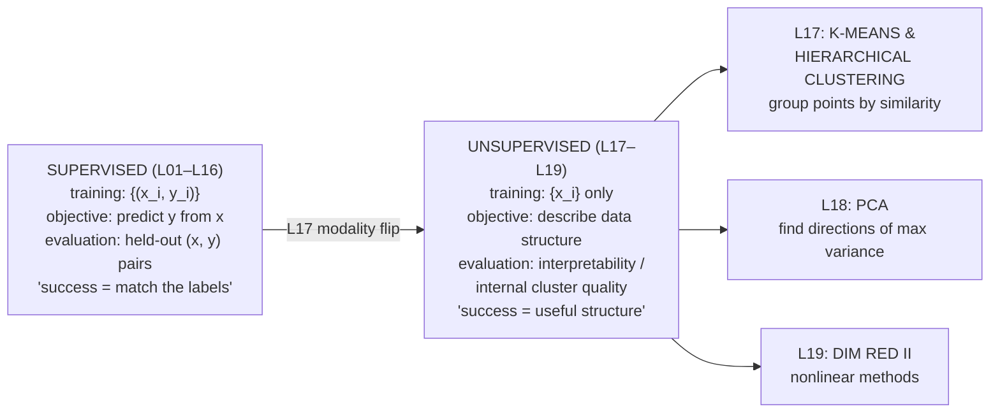
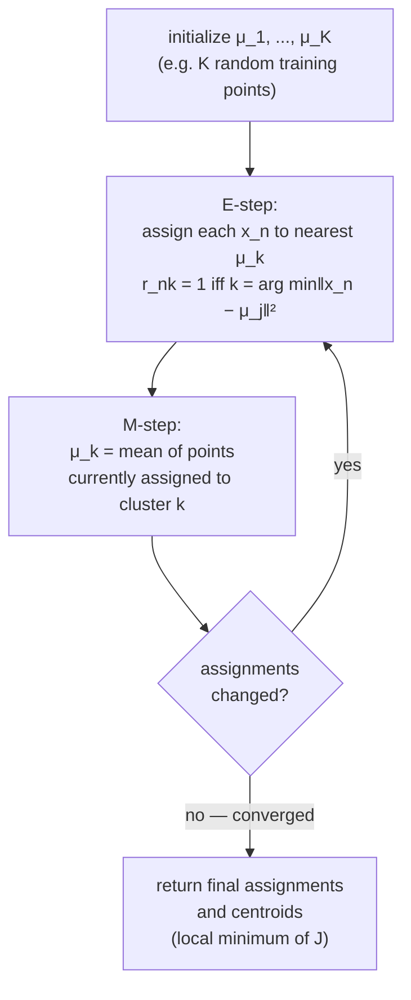
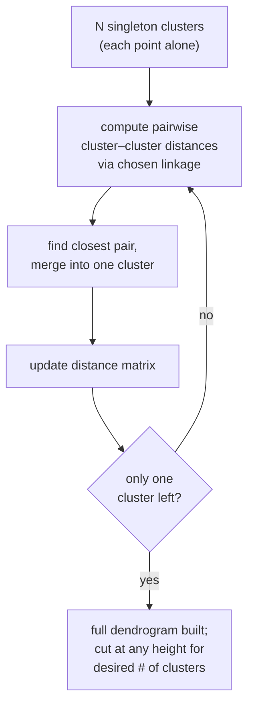
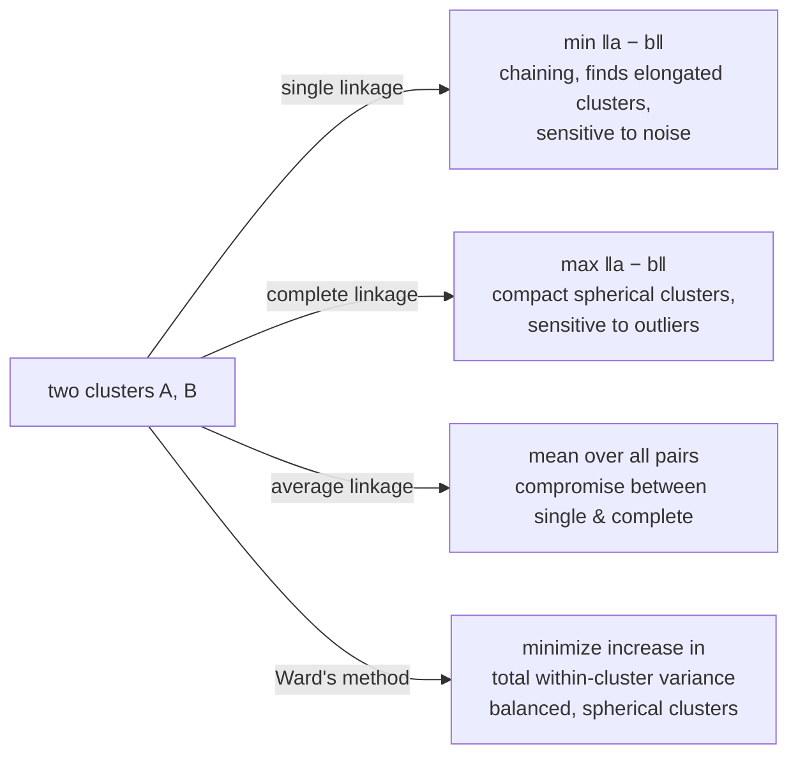

# Lecture 17 — Clustering: k-means and hierarchical

## Overview — the modality flip

**Every previous lecture in this course (L01–L16) was supervised.** The training data came as $\{(x_i, y_i)\}_{i=1}^N$ — features paired with labels. The training objective was always "predict $y_i$ from $x_i$ accurately": minimize a loss that compares the model's prediction $\hat{y}_i$ to the ground truth $y_i$, then evaluate generalization on held-out $(x_{\text{test}}, y_{\text{test}})$ pairs.

**L17 onward, there are no labels.** The training data is just $\{x_i\}_{i=1}^N$ — features with no $y$. The only signal available comes from the data's own structure: which points are close to each other, how the data spreads, whether clusters emerge naturally from pairwise distances. The training objective changes from "predict $y$" to **"describe the data's structure usefully"** — for clustering, that means grouping points so within-group distances are small and between-group distances are large. There's no ground-truth answer to compare against; success is judged by how interpretable, useful, or stable the structure you discover is.

This is **unsupervised learning**. Phases E (kernels) and earlier are supervised; Phase F (L17 k-means, L18 PCA, L19 dim-reduction-II) is unsupervised. The shift in modality is real — model evaluation, hyperparameter selection, and even the notion of "correctness" all change.

L17 covers the two most important clustering paradigms:

1. **K-means** — a hard-assignment, centroid-based, partitional algorithm. Specify $K$ in advance; iterate to a local optimum.
2. **Hierarchical (agglomerative) clustering** — bottom-up, no $K$ required upfront, produces a full dendrogram. Linkage criterion (single, complete, average, Ward) controls the merging behavior.

Both are classical, exam-tested (mock §7), and the foundation for everything in unsupervised learning.

## What clustering is

> *"Group data points into clusters based on similarity. No labels or prior knowledge about groups."*

Common applications:
- **Exploratory data analysis** — discover natural groupings before modelling.
- **Image segmentation** — group pixels by colour / texture.
- **Document classification (unsupervised)** — group articles by topic without pre-defined categories.
- **Customer segmentation** — group users by behaviour for marketing.
- **Anomaly detection** — points that don't fit any cluster well are anomalies.

## K-means

### Setup

- **Data**: $\{x_1, \ldots, x_N\}$ with $x_n \in \mathbb{R}^D$.
- **Goal**: assign each point to one of $K$ clusters. (You choose $K$.)
- **Indicator variables**: $r_{nk} \in \{0, 1\}$ — equals 1 iff point $x_n$ is assigned to cluster $k$. **Hard assignment**: each point belongs to exactly one cluster.
- **Cluster centers**: $\mu_1, \ldots, \mu_K \in \mathbb{R}^D$.

### Objective: distortion / within-cluster variance

$$
J = \sum_{n=1}^N \sum_{k=1}^K r_{nk}\, \|x_n - \mu_k\|^2.
$$

This is the **sum of squared distances from each point to its assigned cluster's center**. Minimize jointly over $\{r_{nk}\}$ and $\{\mu_k\}$.

### The algorithm (Lloyd's algorithm)

> **1.** Initialize centers $\mu_1, \ldots, \mu_K$. (One safe option: pick $K$ random training points as initial centers.)
>
> **Repeat until convergence (no change in assignments):**
>
> **2. E-step (assignment):**
> $$
> r_{nk} = \begin{cases} 1 & k = \arg\min_j \|x_n - \mu_j\|^2 \\ 0 & \text{otherwise} \end{cases}
> $$
> Each point goes to the nearest center.
>
> **3. M-step (update centers):**
> $$
> \mu_k = \frac{\sum_{n=1}^N r_{nk}\, x_n}{\sum_{n=1}^N r_{nk}}.
> $$
> Each new center is the **mean of the points currently assigned to it** ("centroid").

The two steps alternate: assignments fixed → recompute centers; centers fixed → recompute assignments. Each step **monotonically decreases $J$** (or leaves it unchanged), so the algorithm converges in finitely many iterations to a local optimum.

> The "E" / "M" naming is borrowed from the **EM (expectation-maximization)** framework — k-means is a hard-assignment limiting case of EM for a Gaussian mixture model.

### Convergence behavior

- **Monotone decrease in $J$**: each E-step and M-step lowers (or holds) the objective. Since $J \ge 0$, the algorithm must terminate.
- **Local minimum, not global**: the converged solution depends on the **initial centers**. Different initializations can yield different clusterings with different $J$ values.
- **Standard mitigation**: run k-means multiple times with random restarts; keep the run with the lowest final $J$.

### Notes & limitations

| Limitation | Why it bites |
| --- | --- |
| **Sensitive to initialization** | Bad seeds → poor local minimum. Standard fix: $k$-means++ initialization (chooses centers spread out by distance-weighted sampling), or random restarts. |
| **Converges to a local minimum** | Not the globally-best $K$-partition. Restarts help. |
| **$K$ must be specified upfront** | Use the [[#Choosing K|elbow method]] or domain knowledge. |
| **Assumes spherical clusters of similar size** | The squared-Euclidean distance metric implicitly assumes isotropy. Elongated, anisotropic, or wildly different-sized clusters trip k-means. |

### Computational cost

- **E-step** (each iteration): assigning $N$ points to $K$ clusters costs $O(NKd)$ — distance computation per point per cluster.
- **M-step**: computing $K$ centroids costs $O(Nd)$ — sum and divide.
- **Total**: $O(t\,N\,K\,d)$ where $t$ is the number of iterations to convergence.
- Typically $t$ is small. K-means **scales linearly** in $N$ and $d$ — large-data-friendly compared to most clustering algorithms.

### Choosing K

- **Elbow method**: plot $J$ (or the "inertia") versus $K$. Look for the "elbow" where adding another cluster stops dramatically reducing $J$. Pick $K$ at the elbow. Heuristic, not exact.
- **Silhouette coefficient**, **gap statistic**, **BIC** for the EM/Gaussian-mixture connection — all standard alternatives, not in this deck.
- **Domain knowledge**: often you know roughly how many clusters make sense.

## [[hierarchical-clustering|Hierarchical clustering]]

### Why hierarchical?

K-means requires you to **commit to a $K$ upfront**. Sometimes you don't know the right $K$; sometimes you want to see structure at multiple granularities (10 fine clusters? 4 coarse clusters? a single root?). **Hierarchical clustering builds the entire merge sequence** — a tree of nested clusterings — letting you cut at any level.

### Agglomerative algorithm (bottom-up)

> **1.** Start with each point as its own cluster ($N$ singleton clusters).
> **2.** Compute pairwise distances between all clusters.
> **3.** Merge the closest pair into a single cluster.
> **4.** Update the distance matrix to reflect the new cluster.
> **5.** Repeat steps 3–4 until all points are merged into one cluster.

The **dendrogram** is a tree visualizing the merge order: x-axis lists data points; y-axis is the distance at which two clusters were merged. Cutting the tree at a chosen height gives a flat clustering at that granularity.

There's also **divisive** (top-down) hierarchical clustering — start with all points in one cluster, recursively split — but it's far less common; the deck focuses on agglomerative.

### Linkage criteria

The "distance between clusters" (step 2) is defined by the **linkage criterion** — the recipe for collapsing pairwise point distances into a single inter-cluster distance.

| Linkage | Definition | Behavior |
| --- | --- | --- |
| **Single linkage** | $d(A, B) = \min_{a \in A,\, b \in B} \|a - b\|$ | "Chaining": tends to produce long, snake-like clusters. Sensitive to noise. |
| **Complete linkage** | $d(A, B) = \max_{a \in A,\, b \in B} \|a - b\|$ | Compact, spherical clusters. Sensitive to outliers (the max is dragged by the worst point). |
| **Average linkage** | $d(A, B) = \frac{1}{|A||B|}\sum_{a, b} \|a - b\|$ | Compromise between single and complete. |
| **Ward's method** | Merge the two clusters that minimize the **increase in total within-cluster variance** | Tends to produce balanced, similarly-sized, spherical clusters. |

Different linkages can give **dramatically different dendrograms** on the same data. Single linkage finds non-convex shapes (chains, bridges); complete/Ward find compact blobs. Choose by inspection or domain knowledge.

### Mock §7 specifics: single linkage

The mock exam tests **single linkage** specifically: the cluster-cluster distance is the **minimum pairwise distance** between members. Each iteration, find the smallest entry in the upper triangle of the distance matrix, merge those two clusters, update the matrix. Continue until you reach the desired number of clusters (or all points merged).

> **Tie-handling on the exam.** When two pairs of clusters tie on minimum distance, the deck doesn't specify a tie-break rule. Document your choice in the answer ("merging the first such pair encountered").

### Pros and cons

**Pros**
- **No need to pre-specify $K$** — cut the dendrogram at any height.
- **Produces a full hierarchy** — multi-resolution view of structure.
- **Deterministic** (given the linkage and distance metric) — no random initialization, no local-optimum issue.

**Cons**
- **Computationally expensive**: naive implementation is $O(N^3)$ in time, $O(N^2)$ in memory. (Optimized variants for some linkages: $O(N^2 \log N)$.)
- **Sensitive to noise and outliers**, especially single linkage (an outlier can chain a noise point into a real cluster).
- **Greedy**: once two clusters are merged, the algorithm can't undo it. Bad early merges propagate.

## Equations

**K-means objective:**
$$
J = \sum_{n=1}^N \sum_{k=1}^K r_{nk}\, \|x_n - \mu_k\|^2.
$$

**E-step:** $r_{nk} = 1 \iff k = \arg\min_j \|x_n - \mu_j\|^2$ (else 0).

**M-step:** $\mu_k = \frac{\sum_n r_{nk} x_n}{\sum_n r_{nk}}$ (mean of assigned points).

**Single-linkage cluster distance:** $d(A, B) = \min_{a \in A, b \in B} \|a - b\|$.

**Complete linkage:** $d(A, B) = \max_{a, b} \|a - b\|$.

**Average linkage:** $d(A, B) = \frac{1}{|A||B|}\sum_{a, b} \|a - b\|$.

**Computational costs:** k-means $O(t N K d)$; hierarchical naive $O(N^3)$.

## Diagrams

### Supervised → unsupervised — the modality flip

### K-means as alternating E/M steps

### Hierarchical (agglomerative) clustering

### Linkage criteria comparison

### K-means worked-example structure (mock §7 dress rehearsal)

![[30-Sources/Statistical-Learning/slides-png/kmeans_slides/slide-17.png]]
*Figure: Walk through K-means with $K=2$ from a given initial-state plot. For each iteration (left → right, top → bottom), mark the new centroids as 'x' on the next plot. Stop once assignments stabilize. Then evaluate $J$ at the converged clustering (slide 17).*

## Mock-exam connections

- **§7 — K-means + hierarchical (by hand)**. From a given centroid initialization, draw the clusters after the **1st iteration** and at **convergence**. Then redo the analogous problem with **single-linkage hierarchical clustering**. Treat squares vs dots as just-symbols (no label distinction for hierarchical).
- **K-means on the exam**:
   - Compute distances from each point to each centroid → assign to nearest.
   - Recompute centroids as means of assigned points.
   - Iterate until stable. **Most exam problems converge in 2–3 iterations**.
- **Single-linkage on the exam**:
   - Build the initial pairwise distance matrix.
   - Find the smallest entry, merge those two points/clusters.
   - Update the matrix: new cluster's distance to other clusters is the min over its members' distances.
   - Continue until you reach the requested number of clusters (or all merged).
- **No formula sheet** — memorize the E/M update formulas, the distortion $J$, and the linkage definitions.
- See [[exam-blueprint#Topic coverage map]].

## Open questions

- **K-means++ initialization** (D. Arthur & S. Vassilvitskii, 2007) — pick the first center uniformly at random, then each subsequent center with probability proportional to squared distance from the closest already-chosen center. Provably good initialization; standard in scikit-learn.
- **Soft assignment / Gaussian mixtures.** EM for a Gaussian mixture model is k-means's "soft" cousin: each point has a probability of belonging to each cluster, not a hard assignment. Recovers k-means as a limiting case.
- **Choosing $K$ rigorously.** Beyond the elbow method: silhouette score, gap statistic, BIC (for the GMM connection), cross-validated likelihood. Each has strengths and weaknesses.
- **DBSCAN** — density-based clustering. Doesn't require $K$ upfront; finds clusters of arbitrary shape; tags noise points as not belonging to any cluster. Better than k-means for non-spherical data. Not in this deck.
- **Spectral clustering** — uses eigenvectors of a similarity matrix (e.g., Gaussian-kernel similarity). Connects clustering to graph cuts and to kernel methods (L15/L16). Particularly effective for manifold-structured data.
- **Evaluation under no labels.** Without ground truth, how do you tell if the clustering is "good"? Internal metrics (Davies-Bouldin index, silhouette) measure compactness/separation. External metrics (when ground truth happens to exist for evaluation): adjusted Rand index, normalized mutual information.
- **Time-complexity comparison.** K-means $O(tNKd)$ scales linearly; hierarchical $O(N^3)$ doesn't. For $N > 10{,}000$, hierarchical is impractical without optimized variants (e.g., SLINK for single linkage achieves $O(N^2)$).
