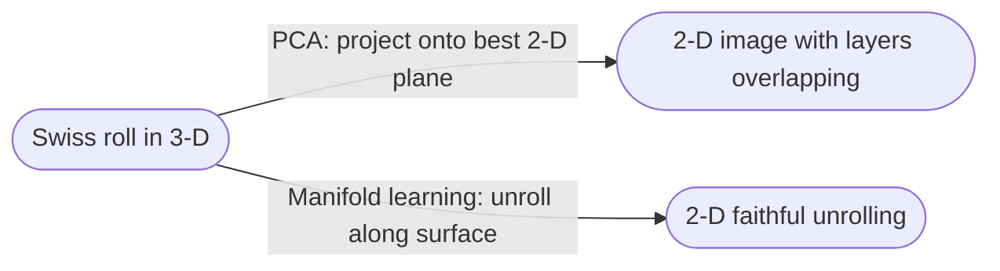

# Lecture 18 — Dimensionality Reduction I: PCA

## Overview — from grouping points to summarizing them

[[lecture-17-clustering-kmeans|L17]] kept the data in its original $d$-dimensional space and asked *which points belong together?* L18 keeps the points and asks the dual question: *which directions in the data carry the most information, so we can throw the rest away?* Both are unsupervised — no labels — but the goal flips from **assignment** to **compression**.

**Principal Component Analysis (PCA)** is the canonical linear answer. Given centered data, find a sequence of orthonormal directions $v_1, v_2, \ldots, v_d$ — the **principal components** — such that the projection of the data onto $v_1$ has the **largest variance** of any unit-vector projection, $v_2$ has the largest variance among directions orthogonal to $v_1$, and so on. Truncating to the top $p \ll d$ components gives a lossy but *optimal-in-MSE* reconstruction.

L18 is the **§4 algorithmic-compute lecture** on the exam blueprint: a 3-point 2-D PCA done by hand. The pipeline you must reproduce from memory is **center → covariance → eigendecompose → project**. Everything below is in service of that.

The lecture also bridges into manifold learning (intrinsic vs. ambient dimension, the Swiss roll, "linear projections destroy the geometry") which [[lecture-19-dim-reduction-ii|L19]] formalizes via kernel PCA and ISOMAP.

## Motivating intuition (slides 1–8)

Consider a cloud of 2-D points scattered along a diagonal — *oblong-shaped*. If you had to describe each point with a single number, would you use $x_1$, $x_2$, or some rotated axis? The $x_2$ axis "looks more like" the cloud than $x_1$, but a *rotated* axis aligned with the diagonal would describe the data even better. PCA is the math that picks that axis automatically.

Two equivalent framings give the same answer:

1. **Minimize reconstruction error.** Find the line (through the origin) such that the sum of squared perpendicular distances from each data point to the line is minimized. This is the "best 1-D summary" of the data.
2. **Maximize projected variance.** Find the direction along which the projected data has the largest variance ("dispersion").

These two objectives are **the same problem** ([[30-Sources/Statistical-Learning/pdf/SLP-PCA.pdf#page=15|slides 15–22]]) — Pythagoras: $\|x_i\|^2 = \|\text{projection}\|^2 + \|\text{residual}\|^2$, so minimizing the sum of squared residuals is equivalent to maximizing the sum of squared projections.

## Setting up the optimization (slides 23–37)

### One point's projection

Treat each data point $x_i \in \mathbb{R}^d$ as a vector. Let $w \in \mathbb{R}^d$ be a **unit vector** ($\|w\| = 1$) representing the candidate direction. Then:

- The signed length of $x_i$'s projection onto $w$ is the dot product $w^\top x_i$.
- The projection vector is $(w^\top x_i)\, w$.
- The residual (perpendicular component) is $d_i = x_i - (w^\top x_i)\, w$, with magnitude $\|d_i\|$.

### The two objectives written out

**Reconstruction-error form** ([[30-Sources/Statistical-Learning/pdf/SLP-PCA.pdf#page=22|slide 22]]):
$$
\min_{\|w\|=1} \sum_{i=1}^n \|x_i - (w^\top x_i)\, w\|^2.
$$

Expanding the square uses $\|x_i\|^2$ (constant in $w$) plus $-2(w^\top x_i)^2 + (w^\top x_i)^2$, leaving a $-(w^\top x_i)^2$ that we want to *minimize* — equivalently, **maximize** $\sum_i (w^\top x_i)^2$.

**Variance-maximization form** ([[30-Sources/Statistical-Learning/pdf/SLP-PCA.pdf#page=30|slides 30–43]]). Stack the data points as rows of $X \in \mathbb{R}^{n \times d}$. Then $Xw$ is the vector of projection lengths $(w^\top x_1, \ldots, w^\top x_n)^\top$. If $X$ is **centered** (column-mean subtracted), the mean projection is also zero, so the variance of the projections is
$$
\text{Var}(Xw) = \frac{1}{n}\|Xw\|^2 = \frac{1}{n} w^\top X^\top X\, w.
$$

**Same objective.** Both framings reduce to: *find a unit vector $w$ that maximizes $w^\top X^\top X w$*.

## Solving via eigendecomposition (slides 44–84)

### The matrix to diagonalize

$X^\top X$ is real and symmetric, hence eigendecomposable with **orthonormal** eigenvectors:
$$
X^\top X = V \Lambda V^\top
$$
where $V = [v_1\ v_2\ \cdots\ v_d]$ has the eigenvectors as columns and $\Lambda = \mathrm{diag}(\lambda_1, \ldots, \lambda_d)$ holds the eigenvalues. Order them by convention $\lambda_1 \ge \lambda_2 \ge \cdots \ge \lambda_d \ge 0$.

The eigendecomposition expresses $X^\top X$ as a **sum of rank-1 matrices**:
$$
X^\top X = \sum_{k=1}^{d} \lambda_k\, v_k v_k^\top.
$$

### The maximizer

Any unit vector $w$ can be written in the eigenbasis as $w = \sum_k c_k v_k$ with $\sum_k c_k^2 = 1$. Plugging in:
$$
\|Xw\|^2 = w^\top X^\top X\, w = \sum_k \lambda_k\, (v_k^\top w)^2 = \sum_k \lambda_k\, c_k^2.
$$

This is a convex combination of the eigenvalues with weights $c_k^2$. The maximum is achieved by putting **all the weight on $\lambda_1$** — i.e., setting $w = v_1$. Then $\|Xv_1\|^2 = \lambda_1$.

> **Punchline.** The first principal component is $v_1$, the eigenvector of $X^\top X$ with the largest eigenvalue. The variance explained by it (after dividing by $n$) is $\lambda_1 / n$. The 2nd PC is $v_2$ (orthogonal to $v_1$), with variance $\lambda_2 / n$, and so on.

## What $X^\top X$ actually is — the covariance matrix (slides 88–98)

If $X$ is centered ($\bar{x} = 0$) and we divide by $n$:

$$
\Sigma := \frac{1}{n} X^\top X
$$

is the **sample covariance matrix** of the features. Its entries:

- **Diagonal** $\Sigma_{ii} = \frac{1}{n}\sum_k (x_i^{(k)})^2 = \mathrm{Var}(\text{feature } i)$.
- **Off-diagonal** $\Sigma_{ij} = \frac{1}{n}\sum_k x_i^{(k)} x_j^{(k)} = \mathrm{Cov}(\text{feature } i,\, \text{feature } j)$.

It is $d \times d$. The covariance matrix tells us *how the features in the data vary together, on average* ([[30-Sources/Statistical-Learning/pdf/SLP-PCA.pdf#page=97|slide 97]]).

Diagonalizing $\Sigma$ rotates into a basis where the features are uncorrelated — its eigenvectors are exactly the PCs, with eigenvalues equal to the variance along each PC.

## The PCA algorithm (slide 99)

> **An algorithm for PCA**
>
> 1. **Center** the data: $\tilde{x}_i = x_i - \bar{x}$ where $\bar{x} = \frac{1}{n}\sum_i x_i$. Stack as $\tilde{X}$.
> 2. **Compute** the covariance matrix $\Sigma = \frac{1}{n}\tilde{X}^\top \tilde{X}$ ($d \times d$).
> 3. **Eigendecompose** $\Sigma$ to get eigenpairs $(\lambda_k, v_k)$, sorted by $\lambda_k$ descending.
> 4. The **$k$-th principal component** is $v_k$; the variance it explains is $\lambda_k$.
> 5. To **project** a (centered) point $\tilde{x}$ onto the top $p$ PCs: form $V_p = [v_1\ \cdots\ v_p]$ ($d \times p$) and compute $V_p^\top \tilde{x} \in \mathbb{R}^p$.

## Worked 3-point 2-D example (memorize this shape for mock §4)

Take three 2-D points:
$$
x_1 = \begin{pmatrix} 0 \\ 0 \end{pmatrix},\quad x_2 = \begin{pmatrix} 2 \\ 2 \end{pmatrix},\quad x_3 = \begin{pmatrix} 4 \\ 4 \end{pmatrix}.
$$

**Step 1 — Center.** Sample mean
$$
\bar{x} = \frac{1}{3}(x_1 + x_2 + x_3) = \begin{pmatrix} 2 \\ 2 \end{pmatrix}.
$$

Centered points:
$$
\tilde{x}_1 = \begin{pmatrix}-2\\-2\end{pmatrix},\ \ \tilde{x}_2 = \begin{pmatrix}0\\0\end{pmatrix},\ \ \tilde{x}_3 = \begin{pmatrix}2\\2\end{pmatrix}.
$$

**Step 2 — Covariance.** Stack centered points as rows: $\tilde{X} \in \mathbb{R}^{3 \times 2}$. Then
$$
\Sigma = \frac{1}{n}\tilde{X}^\top \tilde{X} = \frac{1}{3}\begin{pmatrix} (-2)^2 + 0 + 2^2 & (-2)(-2) + 0 + (2)(2) \\ \cdot & (-2)^2 + 0 + 2^2 \end{pmatrix} = \frac{1}{3}\begin{pmatrix} 8 & 8 \\ 8 & 8 \end{pmatrix} = \begin{pmatrix} 8/3 & 8/3 \\ 8/3 & 8/3 \end{pmatrix}.
$$

Shape is $d \times d = 2 \times 2$ — matches the $d \times d$ rule.

**Step 3 — Eigendecompose.** $\Sigma$ has rank 1 (both rows equal), so one eigenvalue is 0 and the other is the trace:
$$
\lambda_1 = \mathrm{tr}(\Sigma) = 16/3,\quad \lambda_2 = 0.
$$

The eigenvector for $\lambda_1$ satisfies $\Sigma v_1 = \lambda_1 v_1$. By inspection $\Sigma \begin{pmatrix}1\\1\end{pmatrix} = \begin{pmatrix} 16/3 \\ 16/3 \end{pmatrix} = (16/3)\begin{pmatrix}1\\1\end{pmatrix}$, so the (un-normalized) eigenvector is $(1, 1)^\top$. Normalize to unit length:
$$
v_1 = \frac{1}{\sqrt{2}}\begin{pmatrix} 1 \\ 1 \end{pmatrix}.
$$

The orthogonal direction is $v_2 = \frac{1}{\sqrt{2}}\begin{pmatrix} 1 \\ -1 \end{pmatrix}$ with $\lambda_2 = 0$ — no variance perpendicular to the diagonal, exactly because the points are exactly collinear.

**Step 4 — Project (optional).** The 1-D coordinates along $v_1$ are
$$
v_1^\top \tilde{x}_1 = -2\sqrt{2},\quad v_1^\top \tilde{x}_2 = 0,\quad v_1^\top \tilde{x}_3 = 2\sqrt{2}.
$$

A faithful 1-D summary of three points originally in 2-D — the first PC captures the entire variance ($\lambda_2 = 0$), so the reconstruction is **lossless**.

> Sanity-check yourself on the exam: $\bar{x}$ is in the original space; $\Sigma$ is $d \times d$ regardless of $n$; the first PC is a **unit** vector; the variance "explained" is $\lambda_1$ (or $\lambda_1 / n$ depending on whether $n$ is folded into the definition — Dyballa's slides include the $1/n$, so $\lambda_1$ as quoted here is *already* the variance).

## A better algorithm via SVD (slides 138–151)

Computing $\Sigma = \frac{1}{n}X^\top X$ explicitly is **prohibitive** when $d$ is large (genes, pixels — $d$ in the millions makes $\Sigma$ a multi-terabyte matrix). The fix: skip $\Sigma$ and decompose $X$ directly via the **singular value decomposition**:
$$
X = U \Sigma_{\text{SVD}} V^\top
$$
where $U \in \mathbb{R}^{n \times p}$, $\Sigma_{\text{SVD}} \in \mathbb{R}^{p \times p}$ is diagonal of singular values $\sigma_1 \ge \sigma_2 \ge \cdots$, and $V \in \mathbb{R}^{d \times p}$ has the **right singular vectors** as columns ($p = \min(n, d)$). Then:
$$
X^\top X = V \Sigma_{\text{SVD}} U^\top U \Sigma_{\text{SVD}} V^\top = V \Sigma_{\text{SVD}}^2 V^\top.
$$

So **the right singular vectors of $X$ are the eigenvectors of $X^\top X$** (the PCs), and the eigenvalues of $\Sigma$ are $\sigma_i^2 / n$.

> **Better algorithm:** center the data, run SVD on $X$ directly (efficient numerical methods compute one singular vector at a time), read off PCs as columns of $V$ and variances as $\sigma_i^2 / n$.

## Choosing the number of components (slides 156–158)

Ranking PCs by $\lambda_k$ gives a **scree** of variances. Pick a cutoff $p$ such that the discarded components have small $\lambda$:
$$
\text{variance retained} = \frac{\sum_{k=1}^{p} \lambda_k}{\sum_{k=1}^{d} \lambda_k}.
$$

Common heuristics: keep enough PCs to explain ≥ 90% (or 95%, or 99%) of variance; or look for an "elbow" in the scree plot. Some info is lost, but if discarded variance is small, the compressed representation is useful and the reconstruction error small.

## Eigenfaces (slide 160) — applying PCA to images

Treat each grayscale face image (say $h \times w = 4096$ pixels) as a **point in $\mathbb{R}^{4096}$**. Stack a dataset of $n$ faces as $X \in \mathbb{R}^{n \times 4096}$, center by subtracting the **mean face** (the per-pixel average). The top PCs are themselves vectors in $\mathbb{R}^{4096}$, so they reshape back into images — the **eigenfaces**. They are abstract face-patterns; any face in the dataset can be reconstructed (approximately) as $\bar{x} + \sum_{k=1}^{p} c_k\, v_k$ with $c_k = v_k^\top \tilde{x}$.

The eigenfaces are pixel-level visualizations of the principal components — they look like ghostly faces that capture the dominant modes of variation across the dataset (lighting, pose, identity).

![[30-Sources/Statistical-Learning/slides-png/SLP-PCA/slide-160.png]]
*Figure: dataset of faces (left) and the corresponding eigenfaces (slide 160). Faces must be centered and scaled before PCA; the components live in the same space as the inputs.*

## Intrinsic dimension — when PCA isn't enough (slides 168–183)

PCA gives a *linear* compression: it picks the best $p$-dimensional **subspace** through the data. But data can be intrinsically low-dimensional yet **non-linearly embedded** in a high-dimensional ambient space.

| Example | Ambient dim | Intrinsic dim | PCA's verdict |
| --- | --- | --- | --- |
| Points uniformly in a square | 2 | 2 | nothing to compress |
| Points on a tilted line in 3-D | 3 | 1 | succeeds — the line is a linear subspace |
| Points on a 1-D spiral curve in 3-D | 3 | 1 | **fails** — the spiral is non-linear |
| Points on the 2-D Swiss roll surface in 3-D | 3 | 2 | **fails catastrophically** — collapsing onto the best plane crushes the layers together |

The Swiss roll picture: a 2-D surface (a sheet of paper) rolled up in 3-D. The intrinsic dimension is 2 (every point has a position-along-the-roll and a position-across-the-width), but PCA's best 2-D linear projection squashes the roll onto a plane and destroys the relative positions of points that were only "close" along the surface. **Maximum-variance directions may not be the most interesting ones.**

This motivates **non-linear dimensionality reduction** — kernel PCA, ISOMAP, t-SNE, autoencoders — covered in [[lecture-19-dim-reduction-ii|L19]].

![[30-Sources/Statistical-Learning/slides-png/SLP-PCA/slide-180.png]]
*Figure: Swiss roll (left) and what PCA does to it (right) — relative positions of points are destroyed (slide 180).*

## Memorize-cold list (mock §4)

- **Center:** $\tilde{x}_i = x_i - \bar{x}$ where $\bar{x} = \frac{1}{n}\sum_i x_i$.
- **Covariance:** $\Sigma = \frac{1}{n}\sum_i \tilde{x}_i \tilde{x}_i^\top = \frac{1}{n}\tilde{X}^\top \tilde{X}$. Shape **$d \times d$**.
- **First PC:** unit eigenvector $v_1$ of $\Sigma$ with the largest eigenvalue $\lambda_1$.
- **Variance explained by $v_k$:** $\lambda_k$ (already includes $1/n$ in this convention).
- **Projection** of centered $\tilde{x}$ onto $v_k$: scalar $v_k^\top \tilde{x}$.
- **Pipeline:** center → covariance → eigendecompose → pick top eigenvectors → project.

## Open questions

- Mock §4 explicitly asks for "shape of covariance matrix" — answer is $d \times d$ regardless of $n$. This is a *very* common point of confusion under exam pressure (students often write $n \times n$). Burn it in.
- Does the prof expect $\Sigma = \frac{1}{n}X^\top X$ or $\Sigma = \frac{1}{n-1}X^\top X$ (Bessel-corrected sample covariance)? The slides use $1/n$. Use $1/n$ on the exam unless the question states otherwise.

## See also

- [[principal-component-analysis]] — atomic concept note with the algorithm + the worked example pulled out as a standalone reference.
- [[covariance-matrix]] — what $X^\top X / n$ represents and why it's the right object to diagonalize.
- [[eigendecomposition]] — the linear-algebra prerequisite.
- [[singular-value-decomposition]] — the practical algorithm for large $d$.
- [[intrinsic-dimension]] — why PCA can fail (Swiss roll, spirals).
- [[curse-of-dimensionality]] — the L01 problem PCA partially addresses.
- [[lecture-19-dim-reduction-ii]] — non-linear dim reduction (kernel PCA, ISOMAP).
