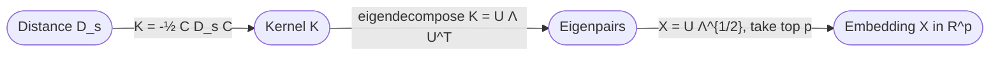
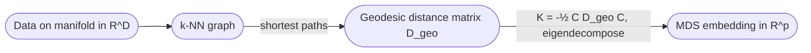

# Lecture 19 — Dimensionality Reduction II: MDS, Kernel PCA, ISOMAP

## Overview — what L18 left on the table

[[lecture-18-pca|L18]] gave us **PCA**, the optimal *linear* compression: it picks the best $p$-dimensional subspace through the data. L18 also showed PCA's failure mode: the **Swiss roll**. Two-dim points lying on a curved surface in 3-D get squashed when projected onto the best 2-D plane — the relative positions of points "close along the surface" are destroyed.

L19 develops the toolkit for non-linear cases. Three algorithms, all related, all built on a single observation: **most dim-reduction methods only need pairwise relationships between points, not the points themselves.**

The deck centers on a unifying picture: any geometric description of a dataset reduces to one of three matrices —

- **Position $X$** — the data matrix, rows = points in $\mathbb{R}^d$.
- **Similarity $K$** — the **Gram matrix**, $K_{ij} = \langle x_i, x_j \rangle$. $n \times n$.
- **Distance $D$** — pairwise squared Euclidean distances, $D_{s,ij} = \|x_i - x_j\|^2$. $n \times n$.

Under Euclidean geometry these three are interconvertible. Pick the one that's most natural for your problem and convert. This is "the Golden Trio" ([[30-Sources/Statistical-Learning/pdf/SLP-DimRed-II(1).pdf#page=2|slide 2]]).

L19 covers three algorithms that exploit this:

1. **Classic MDS** — given a distance matrix $D$, recover an embedding $X$.
2. **Kernel PCA** — replace $K = XX^\top$ with an arbitrary positive-semi-definite kernel matrix; do PCA in implicit feature space.
3. **ISOMAP** — replace Euclidean distance with **geodesic** distance along the data manifold, then run MDS. This is what unrolls the Swiss roll.

L19 was **not directly tested in the past mock exam** but remains fair game (especially under a more-MCQ format).

## The Golden Trio (slides 2–9)

![[30-Sources/Statistical-Learning/slides-png/SLP-DimRed-II(1)/slide-02.png]]
*Figure: Position (X), Distance (D), Similarity (K) — the three matrix views of a dataset, all interconvertible in Euclidean space (slide 2).*

### Position → Similarity ([[30-Sources/Statistical-Learning/pdf/SLP-DimRed-II(1).pdf#page=5|slide 5]])

Stack data rows as $X \in \mathbb{R}^{n \times d}$. The **similarity matrix** (a.k.a. Gram matrix):
$$
K_{ij} = \langle x_i, x_j \rangle \quad\Longleftrightarrow\quad K = X X^\top \in \mathbb{R}^{n \times n}.
$$

For **centered** data, the analogous centered Gram matrix is $K_c = C X X^\top C = C K C$ where $C = I - \tfrac{1}{n}\mathbf{1}\mathbf{1}^\top$ is the **centering matrix**. $K_c$ is the Gram matrix of the centered data.

> $K$ is a kernel matrix for the **linear kernel** $k(x_i, x_j) = \langle x_i, x_j \rangle$.

### Similarity → Distance ([[30-Sources/Statistical-Learning/pdf/SLP-DimRed-II(1).pdf#page=8|slide 8]])

Squared Euclidean distance expands via the inner-product identity:
$$
\|x_i - x_j\|^2 = \langle x_i, x_i\rangle + \langle x_j, x_j\rangle - 2\langle x_i, x_j\rangle = K_{ii} + K_{jj} - 2 K_{ij} = D_{s,ij}.
$$

So $D_s$ is computable from $K$ — easy.

### Distance → Similarity (the "double-centering" trick, [[30-Sources/Statistical-Learning/pdf/SLP-DimRed-II(1).pdf#page=9|slide 9]])

Going *backwards* — recovering $K$ from $D_s$ alone — is the harder direction. Naively setting $K = -\tfrac{1}{2} D_s$ gives a matrix that's not centered. The actual relationship uses the centering matrix $C = I - \tfrac{1}{n} \mathbf{1}\mathbf{1}^\top$:
$$
K = -\tfrac{1}{2} C D_s C.
$$

This **double-centering** subtracts the row mean and column mean of $D_s$ before scaling. The result is a valid (centered) Gram matrix, equivalent to the inner products of the centered data.

### Why the trio matters

If you know **any one** of $X$, $K$, $D$ you can compute the others (up to a global rotation / reflection of $X$ — inner products and distances are rotation-invariant). This means:

- If your raw input is **distances** (e.g., perceptual ratings of how similar two images are, road distances between cities), you can recover an embedding $X$.
- If your raw input is a **similarity** (e.g., a kernel evaluation), same.
- Many algorithms can be re-expressed to use $K$ or $D$ instead of $X$ — the basis of [[kernel-trick|kernel methods]].

## Classic MDS — distances → embedding (slide 10)

**Multidimensional Scaling (MDS)** embeds a (squared) pairwise-distance matrix into Euclidean space. Algorithm:

> 1. Compute the kernel: $K = -\tfrac{1}{2} C D_s C$.
> 2. Eigendecompose: $K = U \Lambda U^\top$.
> 3. Embed: $X = U \Lambda^{1/2}$ (take the top $p$ eigenvalues to embed in $p$-dim).

The reconstructed coordinates $X$ are correct up to a rigid transformation (rotation, reflection, translation), which is the most you can recover from distances alone.

Use case: you have only distances (psychological similarity ratings, edit distances between strings, geographic distances), no coordinates. MDS gives you coordinates back.

## Kernel methods recap (slides 11–13)

A **kernel function** $k(i, j) = \langle \phi(x_i), \phi(x_j) \rangle$ computes inner products in some implicit feature space $\phi(x)$, **without ever materializing $\phi$**. The corresponding kernel matrix $K$ is:

- **$n \times n$**, regardless of how high-dimensional the implicit feature space is.
- **Symmetric** and **positive semi-definite** (Mercer's condition for valid kernels).
- The Gram matrix of the implicit features.

> Many (most) pattern-recognition algorithms can be **kernelized** — rewritten to use $K$ rather than $X$ or $D$. The trick is that any "interesting vector" in the feature space lies in the span of the training examples: $u = \sum_i \alpha_i \phi(x_i) = \Phi^\top \alpha$. So solve for $\alpha \in \mathbb{R}^n$ instead of $u$ in feature space.

The deck restates the canonical kernels (linear, polynomial, RBF) — see [[kernel-trick]] for the full treatment from L15.

## Kernel PCA (slides 14–16)

Recall PCA solves $\arg\max_u \tfrac{1}{n} u^\top X^\top X u$ (subject to $\|u\| = 1$). To kernelize, replace $u$ with the linear-combination form $u = X^\top \alpha$:

$$
\tfrac{1}{n} u^\top X^\top X u = \tfrac{1}{n}(X^\top \alpha)^\top X^\top X (X^\top \alpha) = \tfrac{1}{n} \alpha^\top (X X^\top)(X X^\top) \alpha = \tfrac{1}{n} \alpha^\top K^2 \alpha.
$$

So the kernelized objective is $\arg\max_\alpha \alpha^\top K^2 \alpha$. Solving:

- $K^2$ has the **same eigenvectors** as $K$.
- The eigenvalues of $K^2$ are the squares of the eigenvalues of $K$.
- The PCA eigenvalues (variances) are related to $K$'s eigenvalues by:
$$
\lambda_{\text{PCA}} = \frac{1}{n} \lambda_K^2.
$$

> **Kernel PCA is a kernel embedding with an externally provided kernel matrix $K$.** Plug in any positive-semi-definite $K$ — RBF, polynomial, custom — eigendecompose, and the leading eigenvectors of $K$ give the kernel-PCA coordinates of the data in the implicit feature space.

### Compared to standard PCA

| | Standard PCA | Kernel PCA |
| --- | --- | --- |
| Diagonalize | $X^\top X$ ($d \times d$) | $K$ ($n \times n$) |
| Captures | Linear directions in input space | Non-linear directions via $\phi$ |
| Cost | Cheap when $d \ll n$ | Cheap when $n \ll d$, or when $d$ is infinite (RBF) |
| Recovers Swiss roll? | No | Yes, with the right kernel |

## Non-linear data — Swiss roll (slides 17–22)

> *"This cannot be exploited by the linear subspace methods like PCA — these assume that the subspace is a Euclidean space as well."*

The Swiss roll is the canonical counterexample to linear dim-reduction. Points lie close to a 2-D **manifold** (a curved surface) in 3-D. PCA's best 2-D plane cuts through the roll and squashes layers onto each other — relative positions are destroyed (recall the L18 figure).

What we actually want: **unroll the surface** — preserve the *along-the-surface* distance, not the *through-space* distance.

## Geodesic distance (slides 23–24)

A **geodesic** is the generalization of a "straight line" to curved surfaces (or higher-dimensional manifolds). It is the shortest path *along the surface*, as opposed to Euclidean distance which is measured in the **ambient space**.

Concrete example: the shortest path between two cities is along the surface of the Earth (great-circle distance), not the chord through the planet. The flight path is a geodesic on the sphere; Euclidean distance through the Earth's interior is meaningless.

For the Swiss roll: two points on opposite layers of the roll might be 1 cm apart in 3-D (Euclidean) but 30 cm apart along the surface (geodesic). The **geodesic** captures the data's true geometry.

## ISOMAP — geodesic MDS (slides 25–28)

**ISOMAP** is exactly: *swap Euclidean distances for geodesic distances, then run MDS.*

> 1. Build a **nearest-neighbour graph** on the data: each point connects to its $k$ nearest neighbours (Euclidean).
> 2. Compute pairwise **geodesic distances** as **shortest paths** in this graph (Dijkstra / Floyd-Warshall).
>    - For neighbours: Euclidean ≈ geodesic (locally flat).
>    - For non-neighbours: shortest path through the graph approximates the true geodesic on the manifold.
> 3. With these distances $D$, run **classic MDS** to find a Euclidean embedding.

For the Swiss roll: ISOMAP recovers a clean 2-D unrolling — adjacent points stay adjacent, the spiral becomes a flat strip. PCA cannot do this; ISOMAP can.

![[30-Sources/Statistical-Learning/slides-png/SLP-DimRed-II(1)/slide-28.png]]
*Figure: Isomap output — the 2-D embedding recovered by Isomap, with shortest paths shown (slide 28).*

### Why ISOMAP works

The geodesic distance is **invariant under unrolling** — if you flatten the Swiss roll into a strip, the along-the-surface distance is preserved. MDS then finds the Euclidean embedding consistent with these distances, which is the unrolled strip itself.

### ISOMAP's failure modes (not in the deck, but worth noting)

- The k-NN graph must be **connected** — too small $k$ disconnects the manifold; too large $k$ "short-circuits" across folds and breaks the geodesic.
- Sensitive to noise: outliers create spurious shortcuts in the graph.

## Where this connects in the syllabus

- L15–L16 ([[lecture-15-kernels-i|Kernels I]] / [[lecture-16-kernels-ii|Kernels II]]): the kernel-trick machinery that kernel PCA reuses.
- [[lecture-18-pca|L18]]: linear PCA, whose failure motivates this entire lecture.
- L17 ([[lecture-17-clustering-kmeans]]): the other unsupervised-learning lecture.

## Memorize-cold (in case L19 shows up on the exam)

- **Golden Trio:** $X, K, D$ — all interconvertible in Euclidean space. $K = XX^\top$, $D_{s,ij} = K_{ii} + K_{jj} - 2K_{ij}$, $K = -\tfrac{1}{2} C D_s C$.
- **MDS algorithm:** double-centre $D_s$ to get $K$, eigendecompose, embed $X = U \Lambda^{1/2}$.
- **Kernel PCA:** diagonalize the kernel matrix $K$ ($n \times n$), eigenvectors are the kernel-PCA coordinates, eigenvalues relate to PCA variances by $\lambda_{\text{PCA}} = \tfrac{1}{n} \lambda_K^2$.
- **ISOMAP:** k-NN graph → shortest paths give geodesic distances → MDS. Unrolls non-linear manifolds (Swiss roll).
- **Geodesic distance:** along the manifold's surface, not through the ambient space.

## Open questions

- The deck doesn't cover **t-SNE** or **UMAP** explicitly — these are the modern non-linear methods most often used in practice. If asked under MCQs, the expected ground truth here is ISOMAP-class methods.
- L19 is short (28 slides) and slide-text was extracted incomplete; some derivation steps were inferred from slide images. If the prof tested anything specific in lecture beyond MDS/kPCA/ISOMAP, it will need to be added from class notes.

## See also

- [[multidimensional-scaling]] — MDS as a standalone concept.
- [[kernel-pca]] — non-linear PCA via kernels.
- [[isomap]] — geodesic-MDS for manifold learning.
- [[manifold-learning]] — the broader class of methods.
- [[geodesic-distance]] — what ISOMAP measures along the surface.
- [[position-distance-similarity]] — the Golden Trio.
- [[kernel-trick]] — the L15 machinery kernel PCA reuses.
- [[principal-component-analysis]] — the linear baseline this lecture extends.
- [[intrinsic-dimension]] — why linear PCA can fail.
