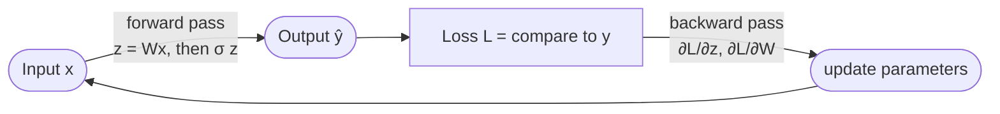

# Backpropagation

The algorithm for computing gradients of a neural network's loss with respect to **all parameters** by recursive application of the chain rule, moving backward from the output through the layers ([[30-Sources/NLP/pdf/Session 16 - Neural Networks-1.pdf#page=11|slide 11]], Rumelhart et al. 1986). It's how feedforward, RNN, and transformer models all get trained.

## Forward + backward = one epoch ([[30-Sources/NLP/pdf/Session 16 - Neural Networks-1.pdf#page=11|slide 11]])

One **epoch** = a complete forward pass over training data + backpropagation of errors + parameter update.

## The objective ([[30-Sources/NLP/pdf/Session 16 - Neural Networks-1.pdf#page=12|slide 12]])

Given training examples $(x_i, y_i)$, the network defines a predictive distribution $P(y_i \mid x_i; \theta)$ depending on parameters $\theta$. For classification, the standard loss is **[[cross-entropy]]**:
$$L(\theta) = -\sum_i \log P(y_i \mid x_i; \theta)$$

Training finds parameters that minimize this loss using gradient-based methods (SGD, Adam, …) — and **backpropagation is what computes the gradients** automatically.

## The gradients ([[30-Sources/NLP/pdf/Session 16 - Neural Networks-1.pdf#page=13|slide 13]])

For a softmax output layer with logits $z = Wh + b$ and cross-entropy loss over $K$ classes:
$$L = -\frac{1}{N} \sum_{i=1}^{N} \sum_{k=1}^{K} y_{ik} \log p_k$$

Taking partial derivatives with respect to the parameters of a single linear layer gives the clean form:
$$\partial_b L = p - y$$
$$\partial_W L = (p - y)\, h^\top$$
where $p$ is the softmax output and $h$ is the previous-layer activation. **The gradient at the output layer is just `prediction − target`** — the convenience that makes the softmax + cross-entropy combo numerically friendly.

For deeper networks, these per-layer gradients chain together via the chain rule — that's what backprop automates.

## The update rule: gradient descent ([[30-Sources/NLP/pdf/Session 16 - Neural Networks-1.pdf#page=14|slide 14]])

Once gradients are computed, parameters are updated via the **Cauchy steepest-descent** idea — the gradient points in the direction of fastest *increase*, so to *minimize*, step in the opposite direction:
$$b_{\text{new}} = b_{\text{old}} - \varepsilon \cdot \partial_b L$$
$$w_{\text{new}} = w_{\text{old}} - \varepsilon \cdot \partial_w L$$

where $\varepsilon$ is the **learning rate** — a key hyperparameter alongside layer size and loss function ([[30-Sources/NLP/pdf/Session 16 - Neural Networks-1.pdf#page=14|slide 14]]):
- **Too small** → training is slow
- **Too large** → loss oscillates or diverges (back-and-forth around the critical point, possibly *increasing*)

## Batch / SGD / mini-batch ([[30-Sources/NLP/pdf/Session 16 - Neural Networks-1.pdf#page=11|slide 11]])

The gradient can be estimated over different subsets of training data:

| Variant | Data per update | Tradeoff |
|---|---|---|
| **Batch** | all training examples | most accurate gradient, slowest, memory-bound |
| **SGD** (stochastic) | one example | noisiest, fastest per step, escape local minima |
| **Mini-batch** | a small batch (e.g. 32–256) | best compromise — the practical default |

## Optimization algorithms built on backprop ([[30-Sources/NLP/pdf/Session 16 - Neural Networks-1.pdf#page=16|slide 16]])

| Optimizer | Update idea | Advantage | When to use |
|---|---|---|---|
| **SGD** | Plain gradient descent | Simple, stable | Large datasets |
| **SGD + momentum** | Adds velocity term | Faster convergence | Deep networks |
| **Adam** | Adaptive learning rate + momentum | Very robust | **Default in NLP** |
| **RMSProp** | Adaptive learning rate | Handles noisy gradients | RNN training |
| **Adagrad** | Per-parameter learning rate | Good for sparse data | Word embeddings |

All of them sit on top of the gradients that backprop computes; they differ only in how those gradients become parameter updates.

## Why activations must be nonlinear

Backprop computes derivatives. If activations were linear, the chain $W_2 W_1 W_0 x$ would collapse to one linear map — no expressive gain from depth ([[30-Sources/NLP/pdf/Session 16 - Neural Networks-1.pdf#page=9|slide 9]]). **Nonlinear activations are what make stacked layers actually expressive**, and their derivatives must be non-zero across most of the input range so that gradients flow backward without vanishing — this is why **ReLU** (which has derivative 1 for $z > 0$) replaced sigmoid as the modern default ([[30-Sources/NLP/pdf/Session 16 - Neural Networks-1.pdf#page=10|slide 10]]).

## Exam framing

| Question | Answer |
|---|---|
| What does backprop compute? | Gradients of the loss with respect to all parameters, via recursive chain rule |
| What's the parameter update rule? | $\theta_{\text{new}} = \theta_{\text{old}} - \varepsilon \cdot \partial_\theta L$ — gradient descent |
| What's an epoch? | One full forward + backward pass over the training data |
| What's the role of the learning rate $\varepsilon$? | Controls step size; too small → slow, too large → oscillation / divergence |
| What's the gradient at the output of softmax + cross-entropy? | $\partial_z L = p - y$ — clean closed form ([[30-Sources/NLP/pdf/Session 16 - Neural Networks-1.pdf#page=13|slide 13]]) |
| Default optimizer in NLP? | **Adam** — adaptive learning rate + momentum |

## SLP L05 derivation: chain rule on a two-neuron network

[[lecture-05-backprop|SLP L05]] derives backprop from the chain rule on a concrete toy network with one hidden neuron and one output neuron, using sigmoid activations. With named intermediates ($z_l, a_l$ for the hidden pre-activation/activation, $z_r, a_r$ for the output), the gradients factor as products of *local* derivatives along the path:

$$
\frac{\partial \mathcal{L}}{\partial w_r} = \frac{\partial \mathcal{L}}{\partial a_r} \cdot \frac{\partial a_r}{\partial z_r} \cdot \frac{\partial z_r}{\partial w_r} = (a_r - y) \cdot a_r(1 - a_r) \cdot a_l \quad \text{(squared-error loss).}
$$

$$
\frac{\partial \mathcal{L}}{\partial w_l} = (a_r - y) \cdot a_r(1 - a_r) \cdot w_r \cdot a_l(1 - a_l) \cdot x.
$$

The **shared prefix** $\partial \mathcal{L}/\partial a_r \cdot \partial a_r/\partial z_r$ between the two gradients is the algorithmic insight: caching it as the backward sweep proceeds turns the per-weight cost from $O(\text{depth})$ into $O(1)$, which is why backprop is fundamentally cheap ([[30-Sources/Statistical-Learning/pdf/Lec-05-backprop(1).pdf#page=70|slides ~65–75]]).

### Local-gradient catalog

| Operation | Local gradient |
| --- | --- |
| Affine $z = w x$ | $\partial z / \partial w = x$, $\partial z / \partial x = w$ |
| Sigmoid $a = \sigma(z)$ | $\partial a / \partial z = a(1 - a)$ |
| Squared error $\tfrac{1}{2}(y - a)^2$ | $\partial \mathcal{L}/\partial a = a - y$ |
| Binary CE, $y=+1$: $-\log a$ | $\partial \mathcal{L}/\partial a = -1/a$ |
| Binary CE, $y=-1$: $-\log(1 - a)$ | $\partial \mathcal{L}/\partial a = 1/(1 - a)$ |
| ReLU $a = \max(0, z)$ | $1$ if $z > 0$, else $0$ |

These are the building blocks plugged into the chain rule.

### Computational-graph reformulation

For arbitrary architectures, backprop is best expressed as a sweep over a [[computational-graph]]: each node receives an upstream gradient $\partial \mathcal{L}/\partial f$, multiplies by its local gradient $\partial f/\partial x_i$, and forwards the result to each input. This is what PyTorch / JAX / TensorFlow autograd engines do; the user never writes the chain rule by hand. Branching nodes (one output feeding multiple consumers) **sum** the upstream gradients arriving from each path ([[30-Sources/Statistical-Learning/pdf/Lec-05-backprop(1).pdf#page=110|slides ~108–115]]).

## Related

- [[multilayer-perceptron|MLP]] — what backprop trains
- [[cross-entropy]] — the loss whose gradient backprop propagates
- [[softmax]] — the output activation paired with cross-entropy
- [[activation-function]] — must be nonlinear for backprop to gain anything from depth
- [[computational-graph]] — the data structure backprop operates on
- [[chain-rule]] — the calculus identity the algorithm rests on
- [[gradient-descent]] / [[stochastic-gradient-descent]] — the consumers of backprop's output
