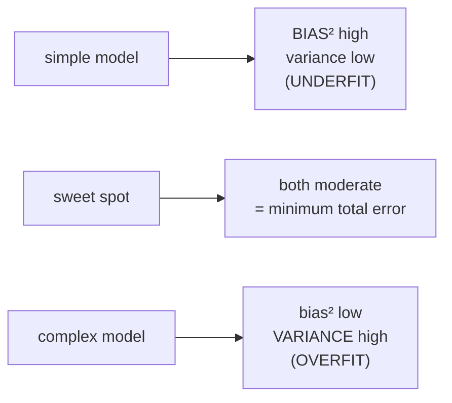

# Bias–variance decomposition

A formal split of a regression learner's expected test error into **three** non-negative terms, each with its own meaning and its own fix:

$$
\underbrace{\mathbb{E}_{x,y,D}\big[(h_D(x) - y)^2\big]}_{\text{Expected test error}} \;=\; \underbrace{\mathbb{E}_{x,D}\big[(h_D(x) - \bar{h}(x))^2\big]}_{\text{Variance}} \;+\; \underbrace{\mathbb{E}_x\big[(\bar{h}(x) - \bar{y}(x))^2\big]}_{\text{Bias}^2} \;+\; \underbrace{\mathbb{E}_{x,y}\big[(\bar{y}(x) - y)^2\big]}_{\text{Noise}}.
$$

Here $D \sim P^n$ is a random training set, $h_D = A(D)$ is the predictor produced by the learning algorithm $A$, $\bar{h}(x) = \mathbb{E}_D[h_D(x)]$ is the [[expected-predictor]], and $\bar{y}(x) = \mathbb{E}[y \mid x]$ is the **expected label** (conditional mean of $y$ given $x$).

## What each term means

| Term | Formal definition | Plain English | Reducible? |
| --- | --- | --- | --- |
| **Variance** | $\mathbb{E}_{x,D}[(h_D(x) - \bar{h}(x))^2]$ | how much the trained predictor wobbles when re-trained on a different dataset $D$ | **yes** — more data, simpler model, ensembles |
| **Bias²** | $\mathbb{E}_x[(\bar{h}(x) - \bar{y}(x))^2]$ | how off-target the *average* predictor is even with infinite data | **yes** — more complex model, richer features, less regularization |
| **Noise** | $\mathbb{E}_{x,y}[(\bar{y}(x) - y)^2]$ | irreducible variation in $y$ given $x$ — same input, different labels | **no** (unless you change features or relabel) |

The decomposition is exact under squared loss. The lecture states it generalizes to other losses (logistic, classification 0/1) but doesn't redo the algebra; analogous decompositions exist with extra subtlety.

## Sketch of the derivation

Start with $\mathbb{E}[(h_D(x) - y)^2]$. Two steps:

1. **Add and subtract $\bar{h}(x)$** inside the bracket and expand:
   $$ (h_D - y)^2 = (h_D - \bar{h})^2 + 2(h_D - \bar{h})(\bar{h} - y) + (\bar{h} - y)^2. $$
   Take expectation over $D$ first. The cross-term vanishes: $\mathbb{E}_D[h_D - \bar{h}] = 0$ by definition of $\bar{h}$, and $(\bar{h} - y)$ doesn't depend on $D$.
2. **Add and subtract $\bar{y}(x)$** inside $(\bar{h} - y)^2$ and expand:
   $$ (\bar{h} - y)^2 = (\bar{h} - \bar{y})^2 + 2(\bar{h} - \bar{y})(\bar{y} - y) + (\bar{y} - y)^2. $$
   Take expectation over $y \mid x$. The cross-term vanishes: $\mathbb{E}_{y \mid x}[\bar{y} - y] = 0$, and $(\bar{h} - \bar{y})$ doesn't depend on $y$.

Combine — the leftover three squares are variance, bias², and noise.

The crux is that $D$ and $(x, y)$ are independent (test point drawn fresh from $P$), so cross-terms factor into products of zero-mean differences with constants.

## How the three terms move with model complexity

Total error is **U-shaped** in complexity — exactly the validation-error U-curve plotted against $\lambda$ in [[lecture-10-loss-functions-regularization|L10]] and against iteration count $M$ in [[early-stopping]]. The dial is named differently in each plot, but mathematically it's the same trade-off.

## How the three terms move with $N$ (training-set size)

- **Variance** decreases as $N$ grows — more data → predictor is less wobbly.
- **Bias** is roughly constant in $N$ — bias is set by the model class, not the data quantity. Even infinite data can't fix a too-simple model.
- **Noise** is constant — irreducible.

So as $N \to \infty$, expected test error converges to **bias² + noise** (the irreducible floor). The "closing gap" between training and test error in [[learning-curve|learning curves]] is the variance closing.

## What targets each term

- **More data** → ↓ variance.
- **More complex model** → ↓ bias, ↑ variance.
- **More regularization** → ↑ bias, ↓ variance (and so the L10 dial is concretely the bias-variance dial).
- **[[bagging]]** (L12) → ↓ variance specifically, leaves bias alone — averaging $m$ bootstrap-trained predictors approximates $\bar{h}$ and shrinks the variance term toward zero.
- **Boosting** (L13–L14) → ↓ bias specifically by combining many weak learners that each have low variance but high bias.
- **Better features / cleaner labels** → ↓ noise.

This is the source of the slogans *"bagging reduces variance, boosting reduces bias."*

## Exam-relevant facts

- Three terms: variance, bias², noise — non-negative, additive, exact under squared loss.
- $\bar{h}(x) = \mathbb{E}_D[h_D(x)]$, $\bar{y}(x) = \mathbb{E}[y \mid x]$.
- Variance is reducible (more data, simpler model, ensembles).
- Bias is reducible (more complexity, more features, less regularization).
- Noise is **irreducible** unless you change features.
- Bagging targets variance; boosting targets bias.

## Related

- [[expected-predictor]] — $\bar{h}$, the algorithm's average behavior.
- [[generalization-error]] — what the decomposition decomposes.
- [[learning-curve]] — diagnostic tool that exposes which term dominates.
- [[overfitting-underfitting]] — qualitative names for high-variance / high-bias regimes.
- [[regularization]] — moves you along the curve.
- [[bagging]] / boosting — algorithms that target single terms.
- [[lecture-11-bias-variance|SLP L11]] — source.
