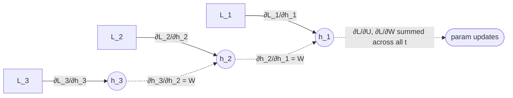

# Backpropagation through time (BPTT)

The training algorithm for [[recurrent-neural-network|RNNs]]. Conceptually, the recurrent network is **unrolled** across the full sequence, exposing it as a deep feedforward network with **shared weights** at every "layer" (= time step). Standard [[backpropagation]] is then applied to this unrolled graph, and gradient contributions for the shared weights are **summed across time steps**.

The blueprint flags BPTT mechanics as **high weight**: Quiz IV Q1, Q2 (and B variants) — the mechanism is the source of the [[vanishing-exploding-gradients|vanishing/exploding gradients problem]].

## How it works ([[30-Sources/NLP/pdf/Session 17 - Recurrent NN.pdf#page=7|slide 7]])

Forward pass: process tokens $x_1, \ldots, x_T$ left-to-right, computing hidden states $h_1, \ldots, h_T$ and outputs $\hat{y}_1, \ldots, \hat{y}_T$. Compute per-step losses $L_t = -\log P(w_{t+1} \mid w_{1\ldots t})$ and total loss $L = \sum_t L_t$.

Backward pass: apply the chain rule through the unrolled graph. Because $h_t$ depends on $h_{t-1}$, which depends on $h_{t-2}$, …, the gradient of $L_t$ with respect to early parameters passes through the **recurrent matrix at every intermediate step**.

*Gradients flow backward through every recurrent connection. The same parameter contributes to the loss at every time step, so its gradient is the **sum** of contributions across $t$.*

## Why it produces vanishing / exploding gradients

The gradient of an early-step parameter passes through the recurrent matrix $W$ at every intermediate step. The product of these Jacobians is dominated by the **largest singular value of $W$**:
- $< 1$ → shrinks exponentially with sequence length → **vanishing**
- $> 1$ → grows exponentially → **exploding**

This is the structural reason simple RNNs are limited to ~5–10 tokens of effective context ([[30-Sources/NLP/pdf/Session 17 - Recurrent NN.pdf#page=14|slide 14]]). See [[vanishing-exploding-gradients]] for the detail.

## Practical considerations

- **Gradient clipping** is the standard remedy for exploding gradients — cap the global gradient norm at a threshold (typically 1–5). [not in source — practical standard]
- **Truncated BPTT** caps backpropagation to a fixed number of steps to bound memory and gradient horizon.
- **Gated cells** ([[lstm|LSTM]], [[gru|GRU]]) provide additive paths through the cell state that resist the multiplicative shrinkage.

## Why parallelization fails

The forward pass cannot be parallelized across time: $h_t$ requires $h_{t-1}$. The backward pass inherits the same chain. This is a structural bottleneck — every step is serial. Training a large RNN on a billion tokens is feasible only because **multiple sequences in a minibatch can be processed in parallel** (across the batch dimension), but each sequence is still serial in time.

This serial bottleneck is exactly what **transformers** (Session 19) eliminate — self-attention computes all positions simultaneously, enabling massive GPU parallelism.

## Exam framing

| Question | Answer |
|---|---|
| What's BPTT? | Backpropagation applied to the **unrolled** RNN graph — same parameters appear at every time step, gradients are summed across time |
| Why does BPTT produce vanishing gradients? | Gradient passes through the recurrent matrix $W$ at every step; if its spectral radius < 1, contributions decay exponentially with sequence length (Quiz IV Q1) |
| Why can't BPTT be parallelized across time? | Each $h_t$ depends on $h_{t-1}$ — strictly sequential dependency |

## Related

- [[recurrent-neural-network]] — the architecture trained with BPTT
- [[vanishing-exploding-gradients]] — the structural failure mode
- [[backpropagation]] — the underlying algorithm, applied to the unrolled graph
