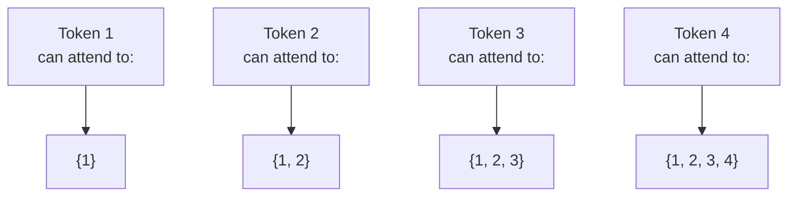

# Causal masking

In a [[transformer]] **decoder**, **causal masking** prevents each position from attending to future tokens during [[self-attention]] — enforcing autoregressive generation **without recurrence** ([[30-Sources/NLP/pdf/Session 19 - Transformers-1.pdf#page=15|slides 15]], 323).

The blueprint flags this as **medium weight**: Quiz IV Q12, Q20 (and B variants) target the why and where of causal masking.

## The mechanic ([[30-Sources/NLP/pdf/Session 19 - Transformers-1.pdf#page=15|slide 15]])

When computing attention scores in the **decoder's masked self-attention**:
$$\mathrm{score}_{ij} = q_i \cdot k_j$$
positions $j > i$ are **forbidden** — typically by setting their score to $-\infty$ before softmax, so $\alpha_{ij} = 0$ for $j > i$.

This means: when computing the representation of position $i$ during training, the decoder can only "see" tokens at positions $\le i$. Future tokens are masked out.

## Why it's needed

Transformers process all positions in parallel. Without masking, the decoder during training would see *all* target tokens at once — including the ones it's supposed to predict — and learn to copy from the future. **Causal masking forces each position to predict its next token using only the past**, exactly mirroring the autoregressive generation procedure used at inference.

> "Decoder masked self-attention: there is a set of query, value, and key vectors. Now self-attention is masked, which means that each position can only attend to **previous target tokens**, which **enforces autoregressive generation without recurrence**." ([[30-Sources/NLP/pdf/Session 19 - Transformers-1.pdf#page=16|slide 16]])

## Encoder vs decoder self-attention

| | Encoder self-attention | Decoder masked self-attention |
|---|---|---|
| Mask | None | Causal (lower-triangular) |
| Each token attends to | All other tokens | Only previous tokens (and itself) |
| Direction | **Bidirectional** | **Unidirectional / autoregressive** |
| Used in | BERT, encoder of BART | GPT, decoder of BART |

This is also why **BERT** (encoder-only, no causal mask) is good at *understanding* but bad at autoregressive generation, while **GPT** (decoder-only with causal mask) is good at *generating* ([[30-Sources/NLP/pdf/Session 19 - Transformers-1.pdf#page=18|slides 18]], 326).

## Visual structure

*Each position $i$ attends only to positions $\{1, \ldots, i\}$. Implemented by setting score to $-\infty$ for positions $j > i$.*

## Exam framing

| Question | Answer |
|---|---|
| What does causal masking do? | Prevents the decoder from attending to **future tokens** during self-attention (Quiz IV Q12) |
| Why is causal masking needed? | Transformers process all positions in parallel; without masking, training would let the decoder see future tokens and learn to copy them. The mask forces autoregressive next-token prediction. |
| Where is causal masking applied? | In the **decoder's self-attention**. Encoder self-attention has no mask (bidirectional). |
| What architecture has causal masking everywhere? | **GPT** — decoder-only transformer. BERT (encoder-only) does not use causal masking. |
| How is the mask implemented in practice? | Set scores for forbidden positions to $-\infty$ before softmax, so their attention weight becomes 0 |

## Related

- [[self-attention]] — what causal masking is applied to
- [[transformer]] — where it lives
- [[cross-attention]] — the other decoder attention layer (no causal mask, attends to encoder)
