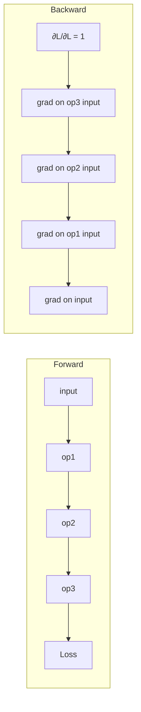

# Computational graph

The DAG (directed acyclic graph) representation of a numerical computation: **nodes are operations**, **edges carry intermediate values**. The data structure that powers automatic differentiation in PyTorch / JAX / TensorFlow — once you have the graph, [[backpropagation]] is a mechanical sweep through it in reverse.

## Why we need it

[[lecture-05-backprop|SLP L05]] motivates the graph view by asking: *"How do we compute gradients for **any** type of neural network?"* ([[30-Sources/Statistical-Learning/pdf/Lec-05-backprop(1).pdf#page=85|slides ~85–100]]).

The hand-derivation works for a fixed two-neuron sigmoid network. For real architectures (Transformers, ResNets, mixed graphs with skip connections) the closed-form per-weight gradient is too tedious to write down — and it would have to be redone every time you change the architecture.

A computational graph **decouples** the architecture from the gradient computation: you describe the forward computation as a graph of small operations, and a generic engine handles the backward sweep.

## Forward and backward sweeps

For each node $f$ with inputs $x_1, \ldots, x_k$ and output $y$:

**Forward pass** (in topological order):
1. Wait for all $x_i$ to be computed.
2. Compute $y = f(x_1, \ldots, x_k)$.
3. Cache $y$ (and possibly the $x_i$) for the backward pass.

**Backward pass** (in *reverse* topological order):
1. Receive the upstream gradient $\partial \mathcal{L}/\partial y$ from downstream consumers.
2. For each input $x_i$, multiply by the local gradient: $\partial \mathcal{L}/\partial x_i = (\partial \mathcal{L}/\partial y) \cdot (\partial f/\partial x_i)$.
3. Send $\partial \mathcal{L}/\partial x_i$ as the upstream gradient to the producer of $x_i$.

The key principle: **each node only needs to know its own local function and gradient.** Slogan: *"local processing leads to global partial derivatives"* ([[30-Sources/Statistical-Learning/pdf/Lec-05-backprop(1).pdf#page=92|slides ~92]]).

## The two passes have opposite orderings



Forward = **topological** order (every input ready before the operation runs). Backward = **reverse topological** order (every output's gradient ready before the operation reports back). PyTorch implements exactly this: it records the forward operations as a tape and replays them in reverse during `loss.backward()`.

## Branching: gradients sum at fan-out

If one node's output feeds *two* downstream consumers, the backward pass receives **two** upstream gradients (one from each consumer). The downstream gradient at the fan-out node is the **sum**:

$$
\frac{\partial \mathcal{L}}{\partial s_0} = \frac{\partial \mathcal{L}}{\partial A} \cdot \frac{\partial A}{\partial s_0} + \frac{\partial \mathcal{L}}{\partial B} \cdot \frac{\partial B}{\partial s_0}.
$$

This follows from total-derivative calculus — every path that depends on $s_0$ contributes. Forgetting to sum at fan-outs is a common bug in hand-rolled autograd ([[30-Sources/Statistical-Learning/pdf/Lec-05-backprop(1).pdf#page=110|slides ~108–115]]).

## Granularity of nodes

A computational graph can have nodes at any level of granularity:

- **Atomic nodes:** add, multiply, exp, log — building blocks. Easy to write local gradients for.
- **Coarser nodes:** sigmoid, softmax, matrix multiply, attention — also fine, as long as the local gradient is implementable.
- **Whole-layer nodes:** an MLP layer or a Transformer block, packaged as one node with combined forward and backward.

[[30-Sources/Statistical-Learning/pdf/Lec-05-backprop(1).pdf#page=105|Slides ~105]] note: *"We can define nodes that perform more complex operations if they have simple local gradients."* The trade-off: bigger nodes are faster (less Python overhead) but less flexible (you can't peer inside).

## Implementation skeleton

A node implementation has two methods:

```python
class Sigmoid:
    def forward(self, z):
        self.a = 1 / (1 + np.exp(-z))
        return self.a

    def backward(self, grad_out):
        # local gradient is a (1 - a)
        return grad_out * self.a * (1 - self.a)
```

The forward pass caches whatever the backward pass needs. The graph engine wires these together by tracking which operations produced which tensors during the forward pass.

## Static vs. dynamic graphs

Two flavors:
- **Static (define-then-run):** build the graph once (TF 1.x, JAX with `jit`), then run it many times. Fast (the engine can optimize), inflexible (can't change shape based on data).
- **Dynamic (define-by-run):** the graph is rebuilt on every forward pass (PyTorch, TF eager, raw JAX). Slower, but supports control flow that depends on the data (variable-length sequences, conditionals).

L05's PyTorch demo is dynamic — every batch produces a fresh graph that gets traversed in reverse.

## Backprop = backward sweep on the graph

Every claim about backprop ([[backpropagation]]) is really a claim about the graph view:

- "$O(\text{forward-pass cost})$" — backward is one DAG traversal, same scale as forward.
- "Architecture-agnostic" — works on any DAG of nodes with local gradients.
- "Each node's job is local" — graph nodes only know about their direct inputs and outputs.

## Related

- [[backpropagation]] — the algorithm that traverses this graph in reverse.
- [[chain-rule]] — the calculus identity that justifies the local-gradient × upstream-gradient rule.
- [[multilayer-perceptron]] — one common architecture expressed as a graph.
- [[gradient-descent]] / [[stochastic-gradient-descent]] — the consumers of the gradients the graph produces.
