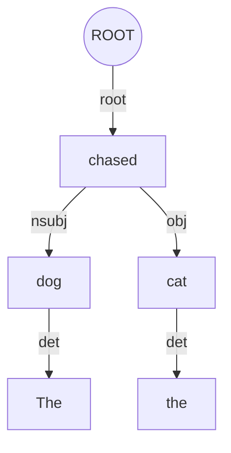
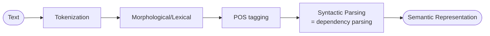

# Dependency parsing

What Session 14 actually says: [[30-Sources/NLP/pdf/Session 14 - POS tagging.pdf#page=6|slide 6]]'s NLP-pipeline diagram includes a "Syntactic Parsing" box between POS tagging and semantic representation. [[30-Sources/NLP/pdf/Session 14 - POS tagging.pdf#page=15|slide 15]] notes that HMM-based POS tagging does **not** capture "long-distance syntactic dependencies." That is the deck's complete coverage — the deck never defines "dependency parsing," names UD relation labels, or shows a parse tree.

The blueprint flags this as **low weight** in the exam: mock Q11 — single MCQ targeting the **output type** of a dependency parser ("a tree of syntactic relations between words").

## What the parser produces [not in source — supplementary, standard textbook content]

**Dependency parsing** produces a **tree of syntactic relations** between the words of a sentence. Where POS labels each word with a category, dependency parsing labels each **pair** of words with a syntactic relation (subject, object, modifier, …) — producing a directed tree rooted at the sentence's main verb.

For "The dog chased the cat":

*Each non-root word has exactly one head; the labels on the edges name the syntactic relation. The result is a directed tree.*

Common relation labels (Universal Dependencies inventory) [not in source]:
- `nsubj` — nominal subject
- `obj` — direct object
- `det` — determiner
- `amod` — adjectival modifier
- `nmod` — nominal modifier (often with a preposition)
- `root` — the sentence's main predicate

## Where it sits in the pipeline ([[30-Sources/NLP/pdf/Session 14 - POS tagging.pdf#page=6|slide 6]])

POS tagging gives each word a category; dependency parsing wires those tagged words into a **tree of grammatical relations** that downstream semantic interpretation can act on.

## Why it complements POS

POS tagging is **flat** — every word gets a category, but how words combine isn't expressed. Dependency parsing adds the **structural** layer:
- "The dog chased the cat" and "The cat chased the dog" have **identical POS** sequences (DET NOUN VERB DET NOUN) but very different dependency trees — different subjects, different objects.
- Long-distance relations (subject–verb agreement across an embedded clause) become explicit in a dependency tree but are invisible to local HMMs ([[30-Sources/NLP/pdf/Session 14 - POS tagging.pdf#page=15|slide 15]]: "long-distance syntactic dependencies" is what the HMM does *not* capture).

## Exam framing

| Question | Answer |
|---|---|
| What does a dependency parser output? | **A tree of syntactic relations between words** (mock Q11) |
| How does it differ from POS tagging? | POS labels each word with a category; dependency parsing labels each pair with a syntactic relation, producing a directed tree |
| Which pipeline stage does it occupy? | **Syntactic Parsing** — between POS tagging and semantic representation ([[30-Sources/NLP/pdf/Session 14 - POS tagging.pdf#page=6|slide 6]]) |

## Related

- [[part-of-speech-tagging]] — the upstream pipeline stage; categories feed the parser
- [[context-free-grammar|CFG]] — the alternative phrase-structure (constituency) framing of syntax
- [[nlp-pipeline]] — broader pipeline context
