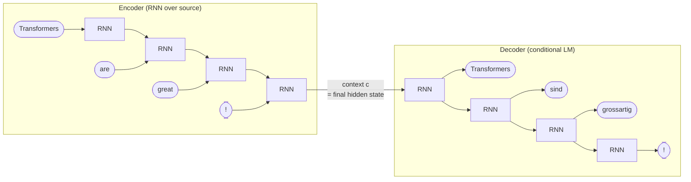

# Encoder–Decoder

A **sequence-to-sequence** architecture composed of two RNNs ([[30-Sources/NLP/pdf/Session 18 - Beyonf RNNs.pdf#page=11|slide 11]]): an **encoder** that compresses a source sequence $x_{1:T}$ into a hidden-state representation, and a **decoder** that generates a target sequence $y_{1:U}$ conditioned on that representation. The original architecture for machine translation, summarization, and (early) question-answering — and the **structural template that motivates attention** (Session 19).

The blueprint flags this as **medium weight**: Quiz IV Q5, Q5.B test the **fixed-context bottleneck** as the motivation for attention; Quiz IV Q12, Q20 (and B variants) cover causal masking and cross-attention which extend the encoder–decoder pattern in transformers.

## The architecture ([[30-Sources/NLP/pdf/Session 18 - Beyonf RNNs.pdf#page=11|slides 11–14]])

**Encoder:** processes the source one token at a time, updating an internal hidden state. The **final hidden state** becomes the **context vector $c$** — a fixed-size representation of the entire source.

**Decoder:** a **conditional language model** that generates the target sequence one token at a time. At each step, predicts $P(y_u \mid y_{<u}, c)$ — conditioned both on previously generated target tokens and on the encoder's context.

## What makes encoder vs decoder different ([[30-Sources/NLP/pdf/Session 18 - Beyonf RNNs.pdf#page=12|slides 12–13]])

| | Encoder | Decoder |
|---|---|---|
| Architecture | Same RNN family (vanilla / LSTM / GRU) | Same RNN family |
| **Trained to do** | Transform input into a task-specific representation | **Conditional language model** — next-token prediction |
| **Direct loss?** | **No** — gradients flow back from the decoder's loss | **Cross-entropy** on target tokens |
| Output | Single hidden state $c$ (or sequence of states) | Sequence of next-token probabilities |

> "The encoder never estimates next-token probabilities, a softmax over a vocabulary, or a loss on source tokens. It acts essentially as a **parametric transformation** of the input sequence trained from the decoder's loss." ([[30-Sources/NLP/pdf/Session 18 - Beyonf RNNs.pdf#page=15|slide 15]])

The two networks are **trained jointly**. The encoder's hidden state has no predefined semantics — it emerges as a **shared communication space** optimized for the decoder's downstream task.

## Training ([[30-Sources/NLP/pdf/Session 18 - Beyonf RNNs.pdf#page=15|slide 15]])

Training data: pairs $\{(x^{(i)}, y^{(i)})\}_{i=1}^N$. For translation: $x^{(i)}$ is a Spanish sentence, $y^{(i)}$ is the English translation.

Per epoch (per training pair / mini-batch):
1. **Forward pass** through encoder → produce context $c$
2. **Forward pass** through decoder conditioned on $c$ → produce next-token distributions
3. **Compute total loss** at the decoder output: $L = -\sum_u \log P(y_u \mid y_{<u}, c)$
4. **Backpropagate** through the decoder *and* the encoder
5. **Update all parameters** in both components

## The fixed-context bottleneck ([[30-Sources/NLP/pdf/Session 18 - Beyonf RNNs.pdf#page=11|slide 11]])

The encoder compresses the **entire source sequence** into a **single fixed-size vector** $c$ — typically the final encoder hidden state. The decoder then has to generate the target conditioned **only on $c$** (and previous target tokens).

This is structurally elegant but has a critical flaw: **everything the source said must fit into one vector, regardless of source length.** For long inputs, information is lost in compression.

> "The encoder's hidden state has to simultaneously store all relevant past information in a fixed-size vector." ([[30-Sources/NLP/pdf/Session 18 - Beyonf RNNs.pdf#page=4|slide 4]])

This bottleneck is **the failure mode that attention solves** (Session 19). Instead of relying on a single $c$, attention lets the decoder **directly attend to all encoder hidden states** at every step, using learned weights to focus on relevant source positions per output token.

## Use cases ([[30-Sources/NLP/pdf/Session 18 - Beyonf RNNs.pdf#page=11|slide 11]])

- **Machine translation** — Spanish → English
- **Text summarization** — long article → short abstract
- **Speech-to-text** — audio sequence → transcript
- **Question answering** — (question + passage) → answer span or free text

These are all **sequence-to-sequence** tasks where input and output have potentially different lengths.

## Encoder–decoder vs language model

A standalone language model (Session 17 RNN) computes $P(w_{t+1} \mid w_{1\ldots t})$ — autoregressive next-token prediction. The encoder–decoder system is a **conditional language model**: $P(y_u \mid y_{<u}, c)$ — generation conditioned on a fixed context derived from a different sequence.

## Exam framing

| Question | Answer |
|---|---|
| What is an encoder-decoder system? | Two RNNs: encoder compresses source to a context vector, decoder generates target conditioned on that context |
| What does the encoder produce? | A **fixed-size internal representation** of the source — typically the final hidden state. **No direct loss**; trained from the decoder's loss ([[30-Sources/NLP/pdf/Session 18 - Beyonf RNNs.pdf#page=15|slide 15]]) |
| What is the decoder? | A **conditional language model**: predicts each next target token given previous target tokens AND the encoder's representation |
| What's the structural problem with the encoder–decoder? | **Fixed-size context vector** must encode the entire source — a bottleneck for long inputs (Quiz IV Q5) |
| What does this bottleneck motivate? | **Attention** — letting the decoder access all encoder positions directly, instead of going through a single $c$ |

## Related

- [[recurrent-neural-network]] / [[lstm]] / [[gru]] — the cells used inside encoder and decoder
- [[attention]] — the mechanism that fixes the fixed-context bottleneck
- [[cross-attention]] — the transformer-era version of decoder-attends-to-encoder
- [[causal-masking]] — keeps the decoder from attending to future tokens
