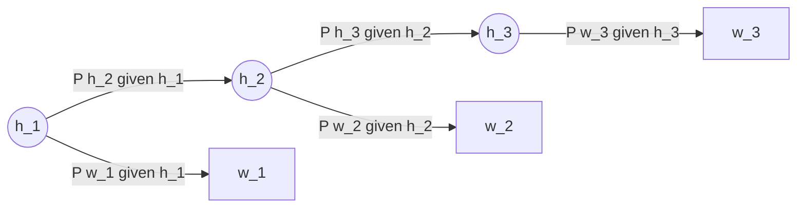

# Hidden Markov Model (HMM)

A **generative probabilistic model** for sequences in which observable outputs are emitted by hidden states that evolve according to a Markov chain ([[30-Sources/NLP/pdf/Session 14 - POS tagging.pdf#page=12|slide 12]]). The classical solution to [[part-of-speech-tagging|POS tagging]]: words are observed; tags are hidden.

The blueprint flags HMM mechanics as **very high weight**: mock Q9, Quiz III Q10–Q12 (and Q10–Q12.B), Quiz III Q19, and **mock Exercise 3 = 2-state Viterbi by hand** (10 points).

## Two key assumptions ([[30-Sources/NLP/pdf/Session 14 - POS tagging.pdf#page=12|slide 12]])

1. **Emission assumption (output independence):** each observation $w_i$ depends only on its hidden state $t_i$:
$$P(w_i \mid t_1, \ldots, t_n, w_1, \ldots, w_{i-1}) = P(w_i \mid t_i)$$
2. **Transition assumption (first-order Markov):** each hidden state $t_i$ depends only on the previous hidden state $t_{i-1}$:
$$P(t_i \mid t_1, \ldots, t_{i-1}) = P(t_i \mid t_{i-1})$$

Together these factor the joint:
$$P(w_{1:n}, t_{1:n}) = \prod_{i=1}^{n} P(w_i \mid t_i) \, P(t_i \mid t_{i-1})$$

> Per-step contribution to the joint = **$P(\text{tag} \mid \text{prev tag}) \cdot P(\text{word} \mid \text{tag})$** — multiply, not sum (Quiz III Q12).

## Graphical structure

*Hidden states $h_i$ form a Markov chain (transitions); observable outputs $w_i$ are emitted from each hidden state (emissions).*

## Estimating the model ([[30-Sources/NLP/pdf/Session 14 - POS tagging.pdf#page=13|slide 13]])

Given a labelled corpus, parameters come from **counts + smoothing** — exactly like [[naive-bayes|Multinomial Naïve Bayes]]:

**Transition probability** (tag → tag):
$$P(t_i \mid t_{i-1}) = \frac{\text{count}(t_{i-1} \to t_i)}{\text{count}(t_{i-1})}$$

**Emission probability** (word given tag):
$$P(w_i \mid t_i) = \frac{\text{count}(w_i \cap t_i)}{\text{count}(t_i)}$$

Both are **smoothed** (e.g. [[laplace-smoothing|Laplace / add-α]]) to avoid zero probabilities for tag transitions or word–tag pairs unseen in training.

## Why "Markov"?

The first-order Markov property — "the future depends only on the present, not the past" — limits the model to **local** sequential structure. For POS, this means the next tag depends only on the current tag, not on tags two or more positions back. This is why HMMs **cannot capture long-distance syntactic dependencies** ([[30-Sources/NLP/pdf/Session 14 - POS tagging.pdf#page=15|slide 15]]).

## Decoding: the Viterbi algorithm

Given a new sentence, the goal is the most probable tag sequence:
$$\hat{t}_{1:n} = \arg\max_{t_{1:n}} P(t_{1:n} \mid w_{1:n}) = \arg\max_{t_{1:n}} P(w_{1:n}, t_{1:n})$$

Brute force enumerates $|T|^n$ paths — infeasible. The [[hmm-viterbi|Viterbi algorithm]] solves this in $O(n \cdot |T|^2)$ by dynamic programming, storing per-state best partial paths and backpointers.

## What HMM captures ([[30-Sources/NLP/pdf/Session 14 - POS tagging.pdf#page=15|slide 15]])

- **Frequent tag transitions** — DET → NOUN, ADJ → NOUN
- **Typical word–category associations** — "the" → DET, "run" → VERB or NOUN
- **Local grammatical regularities** — short-range syntactic patterns

## What HMM misses ([[30-Sources/NLP/pdf/Session 14 - POS tagging.pdf#page=15|slide 15]])

- **Long-distance syntactic dependencies** — Markov sees only one step back
- **Hierarchical structure** — phrase-level grouping (NP, VP) is invisible
- **Semantic interpretation** — POS is grammatical only

This is the gap closed by **discriminative alternatives** (CRFs) and ultimately neural sequence models (RNNs, transformers).

## Exam framing

| Question | Answer |
|---|---|
| What are the two HMM assumptions? | (1) Word depends only on its tag (emission); (2) Tag depends only on previous tag (transition) ([[30-Sources/NLP/pdf/Session 14 - POS tagging.pdf#page=12|slide 12]]) |
| What is a transition probability? | $P(t_i \mid t_{i-1}) = \text{count}(t_{i-1} \to t_i) / \text{count}(t_{i-1})$ — tag-to-tag ([[30-Sources/NLP/pdf/Session 14 - POS tagging.pdf#page=13|slide 13]]) |
| What is an emission probability? | $P(w_i \mid t_i) = \text{count}(w_i \cap t_i) / \text{count}(t_i)$ — word given tag ([[30-Sources/NLP/pdf/Session 14 - POS tagging.pdf#page=13|slide 13]]) |
| Per-step contribution to the joint? | $P(\text{tag} \mid \text{prev tag}) \cdot P(\text{word} \mid \text{tag})$ — **multiply** (Quiz III Q12) |
| What's the decoding algorithm? | [[hmm-viterbi|Viterbi]] — dynamic programming, $O(n \cdot |T|^2)$ |

## Related

- [[part-of-speech-tagging]] — the canonical NLP application of HMMs
- [[hmm-viterbi]] — the decoding algorithm
- [[naive-bayes]] — conceptual ancestor (counts + smoothing)
- [[laplace-smoothing]] — applied to transition / emission counts
