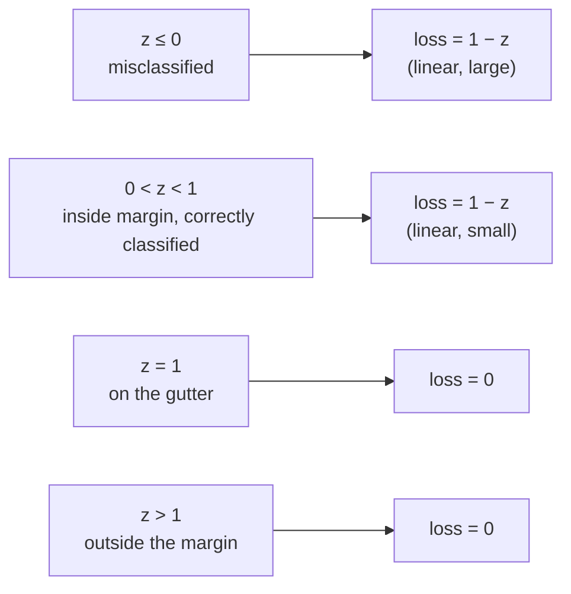

# Hinge loss

The loss function that the soft-margin [[support-vector-machine|SVM]] objective implicitly minimizes:

$$
\ell_{\text{hinge}}(z) = \max(0, 1 - z), \qquad z = y_i(\vec{w}\cdot\vec{x}_i + b).
$$

Zero when the example is correctly classified with margin $\ge 1$; linear in the margin violation otherwise. Equivalent to introducing slack variables $\xi_i = \max(0, 1 - z)$ and penalizing them in the SVM primal.

## The shape

Plot $\ell$ versus the functional margin $z$:

The function has a "hinge" at $z = 1$ — flat to the right (zero penalty for well-classified points) and linear to the left (proportional penalty for margin violators).

## Why "hinge"

The function looks like a hinge: flat for $z > 1$, linear for $z < 1$, kink at $z = 1$. Continuous but **not differentiable at $z = 1$** — subgradients are used in optimization. Outside the kink, the gradient is constant ($-1$ on the violation side), which makes SGD updates very simple.

## Derivation from the slack primal

Soft-margin SVM:

$$
\min_{\vec{w}, b, \xi} \tfrac{1}{2}\|\vec{w}\|^2 + C \sum_i \xi_i \quad \text{s.t.} \quad y_i(\vec{w}\cdot\vec{x}_i + b) \ge 1 - \xi_i, \; \xi_i \ge 0.
$$

For any $(\vec{w}, b)$, the optimal $\xi_i$ is the smallest value satisfying both constraints:

$$
\xi_i^* = \max\!\big(0,\; 1 - y_i(\vec{w}\cdot\vec{x}_i + b)\big) = \ell_{\text{hinge}}(y_i(\vec{w}\cdot\vec{x}_i + b)).
$$

Substituting back:

$$
\min_{\vec{w}, b} \tfrac{1}{2}\|\vec{w}\|^2 + C \sum_i \ell_{\text{hinge}}(y_i(\vec{w}\cdot\vec{x}_i + b)).
$$

This is the **regularized empirical risk minimization** view of SVM: $\tfrac{1}{2}\|\vec{w}\|^2$ is the L2 regularizer; $C$ is its inverse strength; hinge is the data loss.

## Comparison with logistic loss

Both are convex surrogates for the (non-convex) 0-1 loss. The difference is what happens far from the boundary:

| Loss | $z \gg 1$ (correct, far from boundary) | $z = 1$ (on the gutter) | $z \ll 0$ (very wrong) |
| --- | --- | --- | --- |
| **Hinge** | exactly $0$ | exactly $0$ | linear: $1 - z$ |
| **Logistic** | $\to 0$ exponentially | $\log(1 + 1/e) \approx 0.31$ | linear in $-z$ asymptotically |

The flatness of hinge for $z \ge 1$ is what gives SVM its **sparsity** — well-classified points contribute *exactly* zero to the gradient, so they don't influence the boundary at all. Logistic regression, by contrast, has positive (but small) gradient from every training point.

| Property | Hinge loss (SVM) | Logistic loss (LR) |
| --- | --- | --- |
| Convex | yes | yes |
| Differentiable everywhere | **no** (kink at $z=1$) | yes |
| Zero loss for correctly-classified-with-margin | **yes** | no — only asymptotically |
| Probabilistic output | no | yes ($\sigma(z)$) |
| Sparse solution (only SVs matter) | **yes** | no |

## Why hinge gives sparsity

A point with $z_i > 1$ contributes exactly zero to the loss and zero to the gradient — its presence in the training set is invisible to the optimum. Only points with $z_i \le 1$ (gutter-touching, inside-margin, or misclassified) contribute. **These are the support vectors.**

In contrast, logistic regression's gradient at $z_i = 100$ is a small but nonzero value $\sigma(-100) \approx 4 \times 10^{-44}$ — vanishingly small but technically every point still affects the boundary.

## Hinge loss in batch SGD training

Stochastic subgradient descent on hinge loss has a particularly clean per-example update. For a point $(\vec{x}_i, y_i)$:

- If $y_i (\vec{w}\cdot\vec{x}_i + b) \ge 1$: the loss is zero, only the L2 regularizer contributes — update $\vec{w} \leftarrow (1 - \eta\lambda)\vec{w}$ (weight decay).
- Otherwise: the subgradient of $-y_i(\vec{w}\cdot\vec{x}_i + b)$ is $-y_i\vec{x}_i$ — update $\vec{w} \leftarrow (1 - \eta\lambda)\vec{w} + \eta y_i \vec{x}_i$ and $b \leftarrow b + \eta y_i$.

This is exactly the perceptron update with L2 regularization and a *margin* rather than just a sign — historical thread that leads from perceptron → SVM.

## Squared hinge variant ($p = 2$)

[[lecture-10-loss-functions-regularization|SLP L10]]'s loss table notes a generalized form $\max(1 - z, 0)^p$:

- $p = 1$: standard SVM hinge loss (the version above). Differentiable except at the kink $z = 1$.
- $p = 2$: **squared hinge** / Differentiable Squared Hingeless SVM. Differentiable **everywhere** because $(1-z)^2$ smooths out the corner. Penalizes margin violators **quadratically** rather than linearly — more aggressive on big violations, gentler on small ones.

The choice between $p=1$ and $p=2$ is mostly empirical; $p=2$ pairs well with second-order optimizers, $p=1$ with SGD.

## Multi-class hinge loss

Generalization for multi-class classification (sometimes used in modern neural nets as an alternative to softmax + CE):

$$
\ell_{\text{multi-hinge}}(\vec{s}, y) = \sum_{c \ne y} \max(0, s_c - s_y + 1),
$$

where $\vec{s}$ are the scores. Penalizes any wrong-class score that beats the true-class score by less than 1. Gradient is sparse — only wrong classes within margin contribute.

## Exam-relevant facts

- Hinge loss: $\max(0, 1 - y_i(\vec{w}\cdot\vec{x}_i + b))$.
- Equivalent to the soft-margin SVM with optimal slack: $\xi_i^* = \ell_{\text{hinge}}$.
- Zero for points correctly classified with margin $\ge 1$ — gives SVM its sparsity.
- Convex but **not differentiable** at $z = 1$ — uses subgradients.
- Difference from logistic: hinge has a flat region, logistic doesn't.

## Related

- [[support-vector-machine]] — uses hinge as its data loss.
- [[slack-variables]] — equivalent to hinge.
- [[logistic-loss]] — the smoother alternative.
- [[margin]] — what hinge measures the violation of.
- [[lecture-09-linear-svms|SLP L09]] — source.
