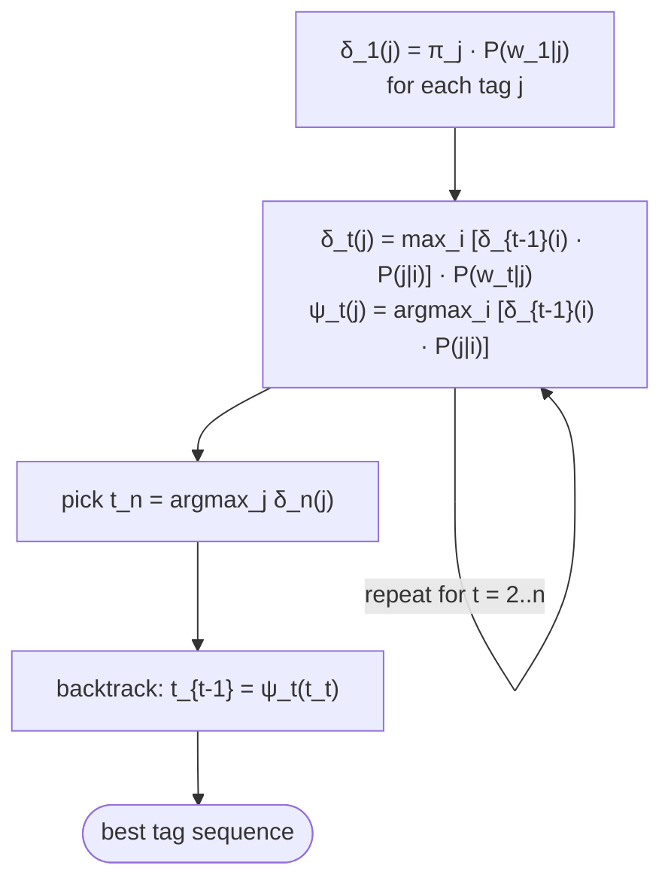

# HMM Viterbi decoding

The **Viterbi algorithm** is a dynamic-programming routine that finds the **most probable tag sequence** given an observation sequence under a [[hidden-markov-model|Hidden Markov Model]] ([[30-Sources/NLP/pdf/Session 14 - POS tagging.pdf#page=14|slide 14]]). It transforms the brute-force $|T|^n$ enumeration into an efficient $O(n \cdot |T|^2)$ pass.

> Given a new sentence, choose the most probable tag sequence — but brute-force enumeration is infeasible. Viterbi keeps track of optimal partial paths. ([[30-Sources/NLP/pdf/Session 14 - POS tagging.pdf#page=14|slide 14]])

The blueprint flags this as **very high weight**: **Mock Exercise 3 (Q28) is a 2-state Viterbi-by-hand** worth 10 points; Quiz III Q10–Q11 (and B) target the mechanics; the formula sheet provides the recursion verbatim.

## The δ-table layout (formula sheet)

Build a table $\delta_t(j) =$ **the probability of the most likely path ending in state $j$ at time $t$**, given observations $w_1, \ldots, w_t$.

**Initialization** ([[30-Sources/NLP/pdf/Session 14 - POS tagging.pdf#page=14|slide 14]], formula sheet):
$$\delta_1(j) = P(t_1 = j) \cdot P(w_1 \mid t_1 = j)$$
i.e. (prior probability of starting in tag $j$) × (probability of emitting $w_1$ from tag $j$).

**Recursion** (the key step):
$$\delta_t(j) = \max_{i} \big[\delta_{t-1}(i) \cdot P(t_t = j \mid t_{t-1} = i)\big] \cdot P(w_t \mid t_t = j)$$

In words: for each candidate tag $j$ at time $t$, find the **best predecessor tag $i$** (the one that maximizes the path ending in $i$ at time $t-1$, multiplied by the transition $i \to j$), then multiply by the emission $P(w_t \mid j)$.

**Backpointers**:
$$\psi_t(j) = \arg\max_{i} \big[\delta_{t-1}(i) \cdot P(t_t = j \mid t_{t-1} = i)\big]$$
Store **which predecessor** produced the max — this is what lets us reconstruct the path at the end.

**Termination + backtracking**:
- $\hat{t}_n = \arg\max_j \delta_n(j)$ — pick the best final state
- For $t = n-1, n-2, \ldots, 1$: $\hat{t}_t = \psi_{t+1}(\hat{t}_{t+1})$ — walk backpointers backward

## The crucial swap: max replaces sum

If you just wanted to compute $P(w_{1:n})$, the **forward algorithm** sums over all possible tag paths — replace `max` with `Σ`. Viterbi differs in **one operator**: it takes the **max** over the previous state instead of summing.

> Viterbi replaces the summation over previous states with **max**, and stores the **argmax** as a backpointer. (blueprint, "What the formula sheet does NOT provide")

That's why backpointers exist — the max operator picks one predecessor, and we need to remember which one.

## Worked example pattern (mock Q28 / "They can fish")

Inputs the prof typically provides for the exercise:
- **Initial / prior probabilities** $P(t_1 = j)$ for each tag $j$
- **Transition table** $P(t_j \mid t_i)$ for each pair $(i, j)$
- **Emission table** $P(w \mid t)$ for each (word, tag)

Procedure:
1. **Init row** of the δ-table: $\delta_1(j) = \pi_j \cdot P(w_1 \mid j)$ for every tag $j$
2. **For each subsequent word $w_t$**: fill in $\delta_t(j)$ for every tag $j$ using the recursion. Record the argmax predecessor in $\psi_t(j)$.
3. **At the end**: pick the tag with the largest $\delta_n(j)$ and walk backpointers back to recover the full path.

For a 2-state HMM (e.g. tags ∈ {N, V}) on a 3-word sentence, the δ-table is 2 rows × 3 columns + a column of backpointers. Manageable by hand.

## Visual summary

*Forward pass fills δ and ψ; backward pass reconstructs the argmax path.*

## Why brute force is infeasible

For $n$ words and $|T|$ tags, there are $|T|^n$ possible tag paths. For a 20-word sentence with 12 tags, that's $\sim 4 \times 10^{21}$ paths. Viterbi reduces this to $20 \times 12^2 = 2880$ operations.

> "This transforms probabilistic reasoning into an optimization problem." ([[30-Sources/NLP/pdf/Session 14 - POS tagging.pdf#page=14|slide 14]])

## Numerical pitfall (small-print)

Multiplying many probabilities (each $\le 1$) underflows quickly for long sequences. In practice, Viterbi is run in **log space**:
$$\log \delta_t(j) = \max_i \big[\log \delta_{t-1}(i) + \log P(j \mid i)\big] + \log P(w_t \mid j)$$
Multiplications become additions, max stays max. The exam exercise uses small enough probabilities that direct multiplication is fine — log-space is mentioned only as practical technology.

## Exam framing

| Question | Answer |
|---|---|
| What problem does Viterbi solve? | Find the **most probable tag sequence** for a given word sequence under an HMM |
| Why dynamic programming? | Brute force is $|T|^n$; Viterbi is $O(n \cdot |T|^2)$ |
| What replaces summation in the recursion? | **`max`** over previous states (Quiz III Q11) |
| Why store backpointers? | The max picks one predecessor — backpointers let us reconstruct the full path at termination |
| What's the first row of the δ-table? | $\delta_1(j) = P(t_1 = j) \cdot P(w_1 \mid t_1 = j)$ — prior × emission |
| What's the recursion for $\delta_t(j)$? | $\delta_t(j) = \max_i [\delta_{t-1}(i) \cdot P(t_t = j \mid t_{t-1} = i)] \cdot P(w_t \mid t_t = j)$ |

## Related

- [[hidden-markov-model]] — the model Viterbi decodes
- [[part-of-speech-tagging]] — the canonical application
