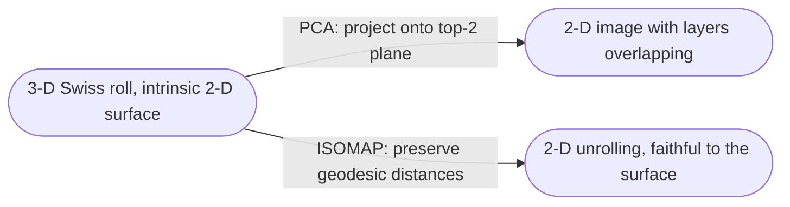

# Intrinsic dimension

The **intrinsic dimension** of a dataset is the minimum number of coordinates needed to describe each point *without loss*, given the geometry the data actually occupies. The **ambient dimension** is the dimension of the space the data is given in (e.g., the number of features). The two can differ wildly.

| Example | Ambient $D$ | Intrinsic $d$ |
| --- | --- | --- |
| Uniform points in a 2-D square | 2 | 2 |
| Points on a tilted line in 3-D | 3 | 1 |
| Points on a 1-D spiral curve in 3-D | 3 | 1 |
| Points on the Swiss roll surface in 3-D | 3 | 2 |
| 64×64 grayscale images of a single object rotating | 4096 | 1 (rotation angle) |

## Why it matters

- If $d \ll D$, an effective dimensionality reduction exists. The question is *which method* recovers it.
- **Linear methods** ([[principal-component-analysis|PCA]], [[singular-value-decomposition|SVD]]) recover the intrinsic dimension only if the data lies on a linear subspace of $\mathbb{R}^D$. The tilted line in 3-D works; the 1-D spiral does not.
- **Non-linear methods** ([[kernel-pca]], [[isomap]], [[manifold-learning]], t-SNE, UMAP, autoencoders) handle curved manifolds.

## Diagnostic: does PCA recover the intrinsic structure?

Plot the **scree** of eigenvalues. If the data is intrinsically $d$-dimensional and *linearly* embedded, the top $d$ eigenvalues dominate and the rest are near zero. If the data is *non-linearly* embedded (Swiss roll), no clean cutoff appears — PCA tries to use linear directions to capture curved structure and fails.

## The Swiss roll

The canonical demonstration that intrinsic dimension ≠ what PCA finds. A 2-D sheet rolled up in 3-D space; the intrinsic dimension is 2, but the best 2-D linear projection (PCA) squashes the rolled layers onto each other and destroys the relative positions of points that were close along the surface. **Maximum-variance directions may not be the most interesting ones.**

## Related

- [[principal-component-analysis]] — works only when intrinsic structure is linear.
- [[manifold-learning]] — methods for non-linearly embedded data.
- [[kernel-pca]], [[isomap]] — specific non-linear algorithms.
- [[lecture-18-pca]], [[lecture-19-dim-reduction-ii]].
