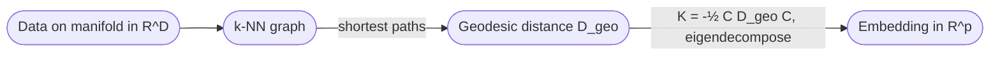

# ISOMAP

A **non-linear dimensionality-reduction algorithm**: take pairwise **geodesic** (along-the-manifold) distances instead of Euclidean distances, then run [[multidimensional-scaling|classic MDS]] on them. The canonical method for "unrolling" the [[lecture-18-pca|Swiss roll]].

## Algorithm

> 1. **Build the k-NN graph.** For each point, connect it to its $k$ nearest neighbours (Euclidean). Edge weights = Euclidean distances.
> 2. **Compute geodesic distances as shortest paths** in the graph (Dijkstra or Floyd-Warshall) between all pairs of points. Result: distance matrix $D_{\text{geo}}$.
>    - For neighbours, Euclidean ≈ geodesic (manifold is locally flat).
>    - For non-neighbours, the shortest path through the graph approximates the true geodesic on the manifold.
> 3. **Run classic MDS** on $D_{\text{geo}}$: double-centre to get a kernel, eigendecompose, embed in $p$ dimensions.

## Why it works

[[geodesic-distance|Geodesic distance]] is **invariant under unrolling**. If you flatten a Swiss roll into a strip, the along-the-surface distances between points are preserved (it's just a reparametrization of the surface). MDS finds the Euclidean embedding consistent with these distances — which, for an unrollable surface, *is* the unrolling.

## When ISOMAP succeeds

- The manifold is **isometrically embedded** — there exists a flat embedding that preserves geodesic distances. Swiss roll, paper sheets, surface developments. Cylinders and tori work; spheres do not (they have intrinsic curvature).
- The k-NN graph is **connected** and large enough to approximate geodesics densely.

## When ISOMAP fails

- **Disconnected k-NN graph** ($k$ too small) — geodesics undefined.
- **Short-circuiting** ($k$ too large) — neighbours bridge across folds; "shortest path" cuts through the manifold instead of going around.
- **Curved manifolds** that are not isometric to a flat space (sphere, hyperbolic surfaces) — no faithful flat embedding exists.
- **Noisy data** — outliers create spurious shortcuts, distorting geodesics.

## Relationship to other methods

- **Standard MDS**: Euclidean distances → embedding. Equivalent to PCA.
- **ISOMAP**: geodesic distances → embedding. Recovers non-linear manifolds.
- **Kernel PCA**: arbitrary PSD kernel → embedding in implicit feature space. Different non-linear flavour.
- **t-SNE / UMAP**: preserve local neighbourhoods at the cost of global geometry. More popular in practice for visualization, not covered in this lecture.

## Related

- [[multidimensional-scaling]] — ISOMAP's final step.
- [[geodesic-distance]] — what ISOMAP measures.
- [[manifold-learning]] — ISOMAP is the foundational manifold-learning algorithm.
- [[principal-component-analysis]] — the linear method ISOMAP extends.
- [[intrinsic-dimension]] — what ISOMAP recovers.
- [[lecture-19-dim-reduction-ii]].
